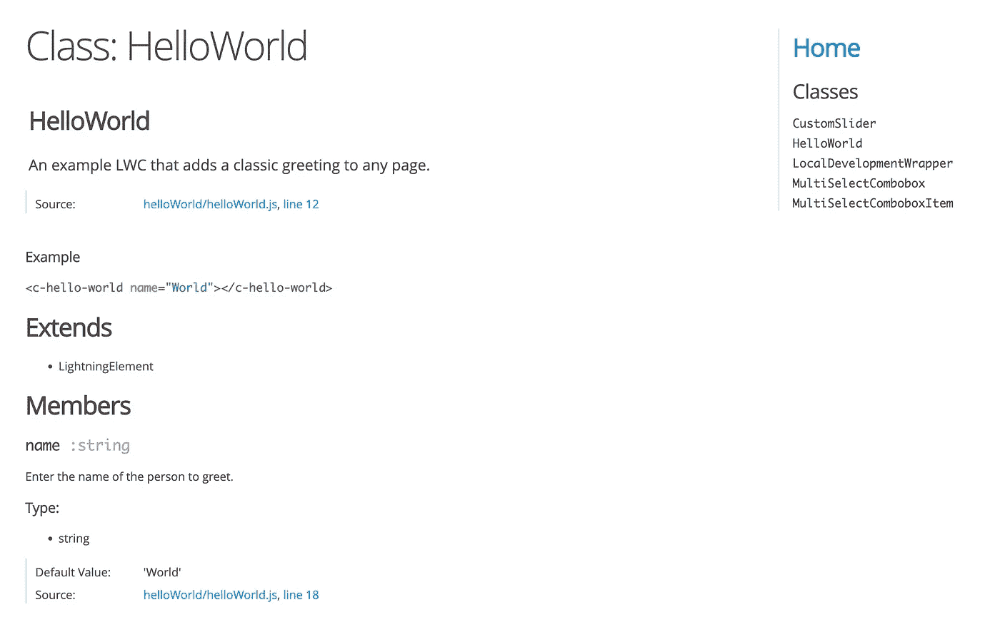
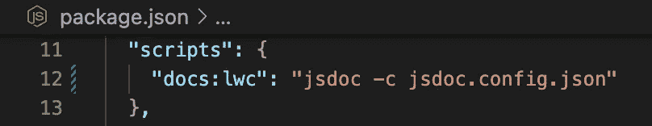

# 使用 JSDoc 编写和生成 Lightning Web 组件代码文档

> 原文：<https://betterprogramming.pub/write-and-generate-lwc-code-documentation-using-jsdoc-414ca16d6dd5>

## 提高 LWC 的文档质量



Hello World LWC 的示例 JSDoc 代码文档

没有一个开发人员真的喜欢编写大量的代码文档，尤其是当它是一个远离实际代码的独立文档时。然而，拥有写得好的文档当然是非常重要的。

让我们以 LWC 库为例，它为其他人提供了可重用的或样本的组件。至关重要的是，应该从中受益的每个人都了解特定组件的工作原理以及如何使用它。

幸运的是，使用 [JSDoc](https://www.npmjs.com/package/jsdoc) ，有一种简单的方法可以从我们代码中合理编写的注释中自动生成各种格式的干净文档。

# 将 JSDoc 与 Lightning Web 组件一起使用

通过用适当的标签对我们的类和公共属性进行适当的注释和标记，我们可以在以后从我们的组件中自动生成一个格式良好的内聚文档。

为了实现上面显示的 Hello World 示例组件的文档，其代码必须注释如下:

带有 JSDoc 注释的 Hello World 示例 LWC

关于正确使用 JSDoc 注释、注解和标签的更多信息，请参考这里的官方文档。

# 安装 JSDoc

首先，我们需要通过 npm 安装最新的 JSDoc 版本。作为当前 SFDX 项目的开发依赖项，我们可以在全局或本地实现这一点。让我们在本地安装它，并通过运行以下命令将其保存在我们项目的`package.json`文件中:

```
npm install --save-dev jsdoc
```

如果您仍然希望在全局范围内安装它，只需运行以下命令:

```
npm install -g jsdoc
```

# 创建 JSDoc 配置

安装之后，我们仍然需要为 JSDoc 创建适当的配置。为此，我们在 SFDX 项目的根目录下创建一个新的`jsdoc.config.json`文件，其内容如下:

用于生成 LWC 文档的 JSDoc 配置

因为我们暂时只想生成 Lightning Web 组件的文档，所以我们定义了相应的源目录。我们还指定我们只想考虑组件的 JavaScript 文件，而忽略 HTML 模板、CSS 样式和类似的东西。

我们还设置了一个新目录`/docs`,作为我们生成的文档的输出目录。通过在末尾添加“readme”选项，我们额外定义了项目根目录中的`README.md`应该用作我们生成的文档的第一页。

总而言之，这是一个示例配置，可以根据需要使用许多其他选项进行定制。

# 生成文档

在用适当的 JSDoc 注释注释了所有组件并完成 JSDoc 设置后，我们最终可以生成我们的文档文件。为了便于使用，我们将以下命令添加到我们的`package.json`文件的“脚本”部分:



用 JSDoc 生成 LWC 代码文档的脚本

最后，我们可以使用以下命令生成文档:

```
npm run docs:lwc
```

生成的代码文档现在可以在我们项目中新生成的`/docs`目录中找到。

# 结论

[JSDoc](https://jsdoc.app/) 可以被视为用 JavaScript 编写和生成代码文档的标准方法。因此，当然，它对于 Lightning Web 组件也非常适用。如本文所示，设置也相对简单，只需要对代码进行适当的注释，就可以生成文档。

此外，我们创建的文档生成脚本也可以在自动化管道中运行，例如，在引入代码更改之后，创建更新的文档，然后自动将其发布到某个地方。

如果你对这个话题还有任何问题，或者想提出改进的建议，请在下面留下你的评论。