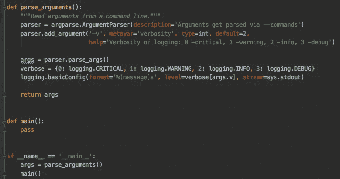

# 编写更好的 Python 脚本

> 原文：<https://betterprogramming.pub/write-better-python-scripts-ce58c1ebf690>

## 使用这三个内置模块以 Pythonic 的方式格式化您的脚本。



作者照片。

在本文中，我将向您展示三种脚本约定和相应的内置模块，以帮助您更好地格式化 Python 脚本。这些模块旨在坚持 DRY(不要重复自己)原则，并提高代码和脚本的质量！

简而言之，我们将讨论以下三个部分:

1.  使用`ifmain`和相应的`main()`功能。
2.  如何用`argparse`解析命令行参数？
3.  如何用`logging()`模块代替`print()`进行调试？

# 始终使用 ifmain

`ifmain`是指你经常看到的一个 Python 脚本中的最后几行代码:`if __name__ == "__main__":`。当 Python 解释器解析 Python 脚本时，会设置一些顶级变量，包括`__name__`变量。

通常，您正在编写一个 Python 脚本，您正在从这样的交互式提示中阅读该脚本:`$ python3 file.py`。当你这样做时，`__name__`变量被设置为`__main__`。

根据 DRY 原则，您应该希望编写可以在其他 Python 脚本中重用的函数。您可以通过使用`import modular_function from file.py`从 Python 脚本导入模块(类或函数)来实现这一点:

这里有一个问题:如果您导入一个函数，变量`__name__`将被设置为函数的名称(在本例中为`modular_function`)。因此，`ifmain`下的代码只有在主程序被执行时才会被执行——例如，从 Python 解释器`$python3 file.py`执行。

这使我们能够编写既可以被其他脚本使用又可以作为主程序运行的`.py`文件。我经常在创建具有不同模块化步骤的机器学习管道时使用这种方法，例如预处理或训练。在测试框架中编写单元测试时，它也很有用，该框架导入模块并在测试数据库上运行特殊的测试功能。无论如何，您仍然可以导入整个文件并运行主要功能:

```
import ifmain
ifmain.main()
```

# 用 argparse 解析命令行参数

位置命令行参数，比如`$ python3 file.py arg1 arg2`，可以用`sys.argv[0]`和`sys.argv[1]`来解析。Python 还附带了内置的`[argparse](https://docs.python.org/3/library/argparse.html)`模块，当用户给程序无效的参数时，该模块会自动生成帮助和使用消息并发出错误。

然后，您可以在您的`main`函数中使用这些参数，方法是通过参数的值调用参数(例如`args.i`):

```
def main():with open(args.i, "r") as inp_file:
        # do something meaningful
```

# 记录错误而不是打印

打印错误可能对调试有用，但是使用 Python 的内置`[logging](https://docs.python.org/3/library/logging.html)`模块使所有 Python 模块都能够参与日志记录，因此您的应用程序日志可以包含您的消息和来自第三方模块的消息。

`logging`模块提供了从最不严重到最严重的几个`LEVELS`:

*   `DEBUG` —详细信息，通常仅在诊断问题时感兴趣。
*   `INFO` —确认事情按预期运行。
*   `WARNING` —表示发生了或即将发生意想不到的事情(如“磁盘空间不足”)。该软件仍按预期工作。
*   `ERROR` —由于更严重的问题，软件无法执行某些功能。
*   `CRITICAL` —严重错误，表示程序本身可能无法继续运行。

`basicConfig`的级别表示包括哪些日志。例如，如果您使用`info()`，但是日志级别设置为`WARNING`，这些日志将不会显示。您也可以使用配置将日志输出到一个`example.log`文件，而不是将我们的日志流式传输到标准输出(相当于打印它们):

```
logging.basicConfig(filename='example.log',level=logging.DEBUG)
```

# 把所有的放在一起

根据我们对`argparse`和`logging`模块的了解，我们现在可以创建一个标准的脚本格式，其中我们可以将脚本的日志记录`LEVEL`设置为命令行参数之一。

这样，您可以从命令行使用`$ python3 format.py -v 2`调用脚本，并使用参数`-v`设置日志记录级别。如果你想或者只是保持输出干净，你现在可以看到调试的错误！

* `add_pargument`带有一个`default`参数，所以即使你调用没有参数`-v`的脚本，它仍然会默认为`2` / `logging.WARNING`(第 16 行)。