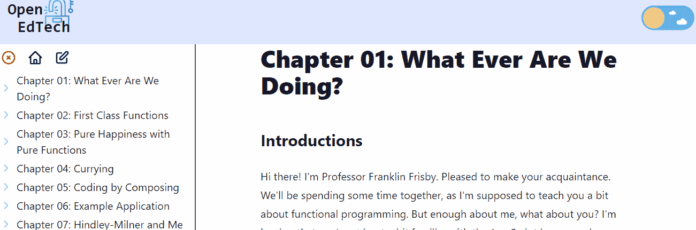
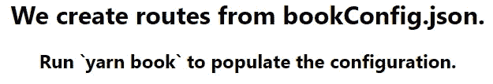
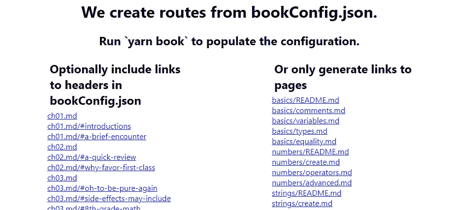
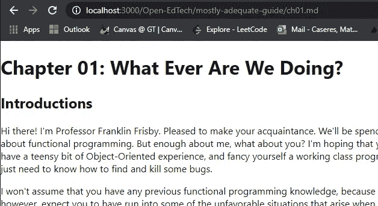

# 用 Next.js 和 MDX 在 React 里写书

> 原文：<https://betterprogramming.pub/write-books-in-react-with-next-js-and-mdx-8deec9fec761>

## 在 React 中建立自己的图书平台

[德鲁·科夫曼](https://unsplash.com/@drewcoffman?utm_source=medium&utm_medium=referral)在 [Unsplash](https://unsplash.com?utm_source=medium&utm_medium=referral) 上的照片。

在阅读这篇文章之前，我想说 Next.js 现在有一个他们链接到这类事情的模板:[https://github.com/shuding/nextra](https://github.com/shuding/nextra)。请随意欣赏我的评论，但上面链接的回购可能是你想要的。

使用本文中的软件，您可以将任何现有的 GitBook(在 GitHub 上写书的流行软件)加载到 Next.js 中，并开始添加您想要的任何自定义元素。比如:

*   多项选择问题
*   实时代码编辑器
*   任何你想要的反应组件！

你可以用 Next.js 和 MDX 轻松构建一本书，但这不仅仅是一本书！这是一个可扩展的教育网站(如果你不怕写一些代码的话)。让我们开始吧！

作者 GIF。

# 什么是 MDX？

JSX 降低了 MDX 的价格。这是一个包含 markdown 和 JSX (React 元素)的文件，扩展名为*。mdx* 。这是我用来写书的语言。我们希望兼容现有的 git book，这些只是 Markdown，所以在现有的 git book 中加载没有问题。

## 使用 next-mdx-remote 将代码和内容分开

一本书的 GitHub 存储库中不应该有任何代码。这给人的印象是你的书是一些需要学习的新代码库，而它应该只是一堆纯文本文件。

为了将我们的内容从代码中分离出来，我们使用了一个名为 next-mdx-remote 的库，并使用一个对`raw.githubusercontent`的请求来获取代码，如下所示:

# URL 树

因为没有任何内容需要保存在我们的存储库中，所以我们需要一个树来表示内容的层次结构和图书资源的位置。下面的文件有一个`rawURL`属性用于获取 Markdown，还有一个`ghURL`属性用于为每个页面提供到 GitHub 页面的链接:

## 从现有的 GitBooks 构建 URL 树

GitBook 有一个很好的格式来指定资源的位置。您只需编写一个目录，在您的存储库中包含链接。以下是 next-mdx-books 文档中使用的 GitBook 兼容配置:

您可以使用 [unifiedjs](https://unifiedjs.com/) Markdown 解析器解析 Markdown。对于 next-mdx-books [文档站点](https://www.openedtech.dev/Open-EdTech/next-mdx-books/about.md)，我希望我的 URL 树包含指向标题的链接，所以当我重新格式化目录时，我会访问引用的文件并抓取标题。这在`next-mdx-books`中是可选的:

要运行转换脚本，只需传入一个指向有效目录的 URL。

# Next.js 中的动态路径

如果你不知道动态路由在 Next.js 中是如何工作的，这一节就很混乱了！试着对正在发生的事情有一个大概的了解…但是代码是给你思考的。

现在我们有了内容的路线和位置列表，我们需要将它输入 Next.js，创建路线，并提供内容。我不会深入研究源代码，但本质上，我们正在对 URL 树进行深度优先搜索，并列出树中所有需要生成路由的节点。我们让我们的对象看起来像这样:

这看起来可能有点滑稽，但是这个对象的意义在于我们可以映射 Next.js 的`getStaticPaths`中的键。这为一个页面生成页面`[...id].js`:

您可以使用`getStaticProps`中提供的路径来检索元数据，如 GitHub URL:

现在一切都连接好了。

# 创作你的第一本书

我们在 GitHub 上有一个最小的例子，项目是这样开始的:

当你运行`yarn book`时，它运行这个脚本:

注意，用户只需要输入 URL。如果他们想删除标题，刷新页面会得到这样的结果:

您现在可以访问列出的页面:

如果你想做一些更复杂的事情，我们建议你叉我们的网站。

# 资源

*   URL 树工具包:[https://github.com/Open-EdTech/next-mdx-books](https://github.com/Open-EdTech/next-mdx-books)
*   我们用 next-mdx-books 建立的网站:[https://www.openedtech.dev/](https://www.openedtech.dev/)