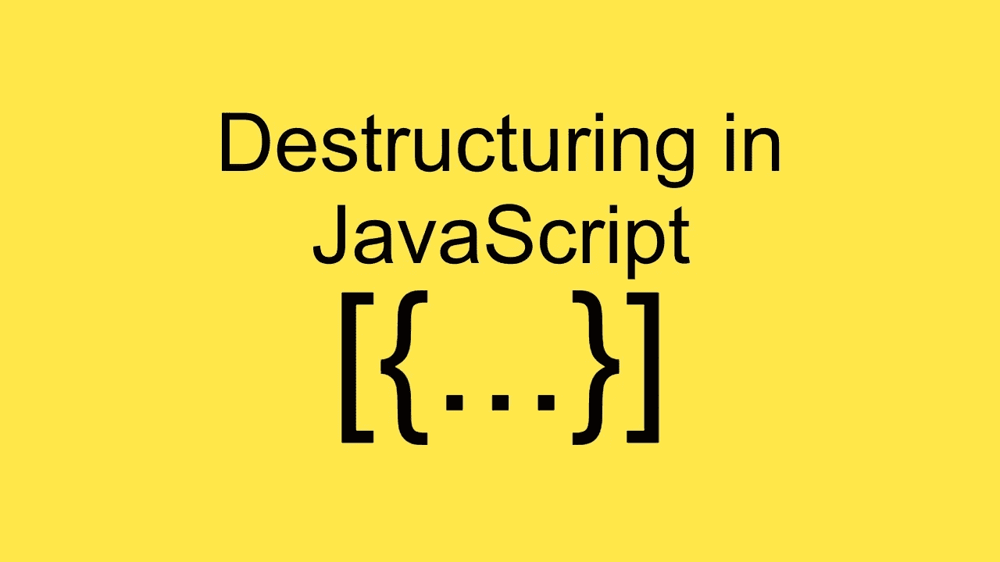

# 使用 JavaScript 析构编写更简洁的代码

> 原文：<https://betterprogramming.pub/write-cleaner-code-by-using-javascript-destructuring-cd6b55c25bac>

## 通过在 JavaScript 中析构对象和数组，增加代码的清晰度并降低代码的复杂性



作者照片。

析构是我最喜欢的 JavaScript 工具之一。简单地说，析构允许你把一个复杂的结构(比如一个数组或者一个对象)分解成更简单的部分，尽管还有更多。

让我们看一个例子:

现在，一些人已经使用这个功能有一段时间了——可能是在构建 React 应用程序的时候——但他们并不太理解它。对于其他人来说，可能是第一次。因此，我将从头到尾指导您完成这个过程，以便在本文结束时我们都有相同的理解水平。

# 解构对象

在上面的例子中，所有的魔法都发生在下面的代码行中:

```
const { title, rating, author: { name } } = article
```

在赋值的左边有这样的括号可能有点奇怪，但是这就是我们告诉 JavaScript 我们正在析构一个对象的方式。

通过析构对象，您可以在任意深度绑定到对象的不同属性。让我们从一个更简单的例子开始:

```
const me = {
  name: "Juan"
}const { name } = me
```

在上面的例子中，我们声明了一个名为`name`的变量，它将从对象`me`中同名的属性初始化，这样当我们评估`name`的值时，我们得到`Juan`。厉害！这同样适用于任何深度。回到我们的例子:

```
const { title, rating, author: { name } } = article
```

对于`title`和`rating`，和我们已经解释过的完全一样。但是在`author`中，事情就有点不一样了。当我们到达一个属性，或者是一个对象，或者是一个数组，我们可以选择是创建一个引用了`article.author`对象的变量`author`，还是进行一个深度的析构并立即访问内部对象的属性。

访问对象属性:

进行深度或嵌套的析构:

等等，什么？如果我析构了`author`，为什么没有定义？其实挺简单的。当我们要求 JavaScript 也析构`author`对象时，绑定本身并没有被创建，相反我们可以访问我们选择的所有`author`属性。所以请永远记住这一点。

传播算子(`…`):

此外，我们可以使用 spread 操作符`...`来创建一个具有所有未被析构的属性的对象。

如果您有兴趣了解更多关于 spread operator 的信息，请查看我的文章。

## 重命名属性

析构的一个很好的特性是能够为变量选择一个不同的名字来作为我们要提取的属性。让我们看看下面的例子:

通过在属性上使用`:`，我们可以为它提供一个新的名称(在我们的例子中是`newName`)。然后我们可以在代码中访问这个变量。需要注意的是，具有原始属性`name`的变量不会被定义。

## 缺少属性

那么，如果我们试图析构一个没有在对象中定义的属性，会发生什么呢？

在这种情况下，用值`undefined`创建变量。

## 默认值

扩展缺失的属性，当属性不存在时，可以分配一个默认值。让我们来看一些例子:

这些是给我们的析构对象赋值默认值的例子。仅当属性为`undefined`时，才会分配默认值。例如，如果属性的值是`null`或`string`，则不会分配默认值，但会分配属性的实际值。

# 析构数组和迭代

我们已经看到了一些析构对象的例子，但是同样的例子也适用于一般的数组或可迭代对象。让我们从一个例子开始:

当我们需要析构一个数组时，我们需要使用`[]`而不是`{}`，我们可以用不同的变量映射数组的每个位置。但是有一些好的技巧。

## 跳过元素

通过使用`,`操作符，我们可以从 iterable 中跳过一些元素，如下所示:

注意在`,`之间留一个空格是如何跳过元素的。这很微妙，但对结果有很大的影响。

你还能做什么？您也可以使用展开运算符`...`，如下所示:

在这种情况下，`z`将获取`b`之后的所有值作为数组。或者你有一个更具体的需求，你想析构数组中的特定位置。没问题。JavaScript 涵盖了:

如果我们把一个数组当作一个对象来析构，我们可以把索引当作属性来使用，从而访问数组中的任何位置。

## 缺少属性

与对象一样，也可以为数组中未定义的元素设置默认值。让我们来看一些例子:

当析构数组时，也可以为`undefined`属性设置默认值。然而，当我们有扩展操作符`...`时，不可能设置默认值。在`undefined`的情况下，它将返回一个空数组。

# 交换变量

这是一个有趣的析构用例。两个变量可以在一个表达式中交换:

# 使用计算的属性进行析构

直到现在，任何时候我们想要析构一个对象的属性或者一个 iterable 的元素，我们都使用静态键。如果我们想要动态键(像存储在变量中的那些)，我们需要使用计算属性。

这里有一个例子:

很棒，对吧？通过在`[]`之间使用一个变量，我们可以在赋值之前评估它的值。因此，可以进行动态析构，尽管必须为这个新变量提供一个名称。

# 析构函数参数

析构变量可以放在我们可以声明变量的任何地方(例如，通过使用`let`、`const`或`var`)，但是也可以析构函数参数。下面是这个概念的一个简单例子:

非常简洁优雅。此外，我们之前讨论的所有规则都适用。

# 结论

析构在开始时可能看起来很笨拙，但是一旦你习惯了，就没有回头路了。它真的可以帮助你的代码更具可读性，这是一个很好的概念。

你知道在导入模块时也可以使用析构吗？看看我关于这个话题的文章。

感谢阅读！我希望你喜欢它。