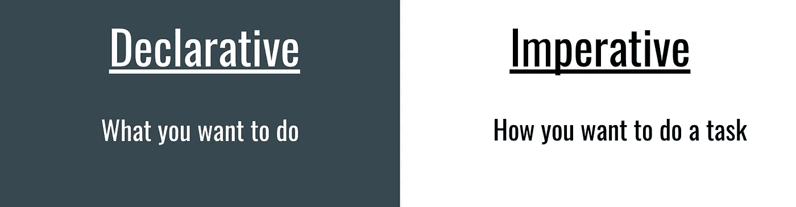
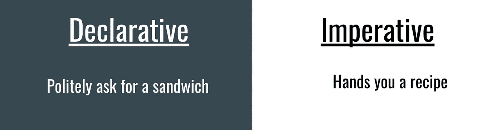
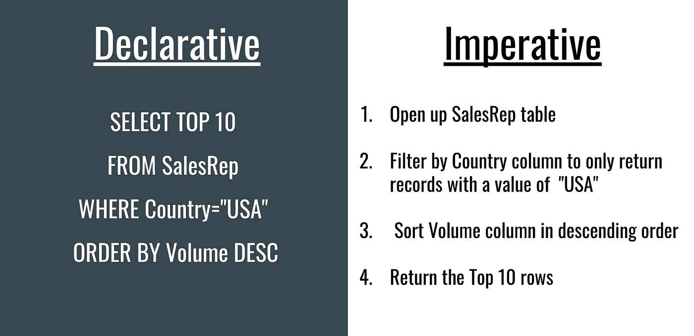

# 编写令人愉快的声明性 JavaScript

> 原文：<https://betterprogramming.pub/write-delightful-declarative-javascript-a83c91111e12>

## 使用函数式编程风格编写可读代码

克里斯蒂娜@ wocintechchat.com 在 [Unsplash](https://unsplash.com?utm_source=medium&utm_medium=referral) 上的照片

在涉足函数式编程几年后，我最近陷入了一个兔子洞。函数式编程有很多优点。这包括功能纯度(即每次都有相同的结果)，这使得您的功能更容易测试。不过，毫无疑问，我最喜欢函数式编程的好处是将小函数组合在一起所获得的可读性。这种风格被称为*声明式编程*。

在本文中，我想广泛地探索声明式编程的概念，以及哪些技术和概念可以让开发人员开始将它引入他们的代码库。虽然本文以一些函数式编程概念和技术为基础，但重点并不在于强制执行函数式编程约定。在我看来，可读代码产生功能代码！

我希望在这篇文章结束时，您应该对什么是声明式编程有所了解，了解一些概念以帮助您现在开始以更具声明性的方式编写，并了解一些关于流行的函数式编程库 [Ramda](https://ramdajs.com/) 的知识。

在开始之前，让我们深入了解什么是声明式编程，以及它与更常见的命令式编程风格有何不同。

# 我声明:声明式与命令式编程

这两种编程风格的区别通常定义如下。

但这在实践中意味着什么呢？让我们看一个快速的真实场景。你正在为你招待的朋友做午餐。他们想要火腿和奶酪三明治。

照片由[彼得拉德](https://unsplash.com/@petradr?utm_source=medium&utm_medium=referral)在 [Unsplash](https://unsplash.com?utm_source=medium&utm_medium=referral) 上拍摄

让我们看看他们如何以命令式和声明式的方式与我们互动。

旁注:命令式的客人是粗鲁的客人

虽然这是一个荒谬的例子，但它表明了两种方法之间的差异。在编程中，您可能熟悉一种本质上是声明性的通用语法 SQL。SQL 让我们定义我们想要检索什么，而不是检索它所需的步骤。

让我们假设一个 SQL 查询，并将其与一个假设的命令式实现进行比较。

SQL 是声明性代码的一个常见示例。

上面的查询确定了美国销量前十的销售代表。如您所见，`SQL`查询的声明性语法以更简洁的方式传达了相同的信息。

对于阅读我们代码的新手来说，他们会很好地理解我们试图用一行代码完成的查询。使用命令式方法，他们必须采取每一步并拼凑一个心智模型来理解代码试图实现的目标。这就是声明式编程的强大之处。

在 JavaScript 中，您可能熟悉像`filter`、`map`和`reduce`这样的数组方法，它们代替了更为必要的`for loop`实现。如果你想看一个例子，这个 60 秒的视频有一个例子。

60 秒讲解命令式和陈述式

在我们继续之前，让我们快速浏览一下 Ramda。

# 那么什么是拉姆达呢？

[Ramda](https://ramdajs.com/docs/#) 是 JavaScript 中最知名的函数式编程库之一。这个库最初是 Lodash T10 的一个分支，它有大量有用的函数，允许我们编写更可读、更优雅的代码。这个库也有一些有用的特性，比如自动套用、不变性和数据持续函数。综上所述，这些给了开发人员在编写代码时极大的灵活性。虽然我们在本教程中探索的许多概念可以在普通 JavaScript 中使用，但 Ramda 可能会为您提供一个更简单的接口来完成这些任务。

值得注意的是，我们将在本教程中查看它的`pipe`和`compose`功能。这是一个函数式编程概念的实现，我们可以用普通的 JavaScript 实现，但我们不会。我们将在示例中使用 Ramda 的实现来学习。我绝对推荐大家花时间看看拉姆达。下面是一个简单的代码示例，您可以通过利用和组合库的许多功能以及我们将触及的一些概念来编写代码。

我们会在这段代码中看到一些概念。

上面的代码执行以下操作:

*   它评估一组 API 响应，查看是否有任何响应返回了错误。
*   如果发现一个错误，我们返回一个定制的错误对象，带有一个预定义的消息“一个或多个 API 调用失败”
*   如果没有发现错误，我们返回 API 响应的原始数组，以便在下一步中使用。

如您所见，Ramda 可以帮助我们编写更清晰、更具描述性的代码。绝对值得探索。

既然我们已经在较高层次上介绍了 Ramda，那么让我们来讨论一些允许我们构建更多声明性代码的概念。

# 声明性代码的构造块

照片由[哈维·卡夫雷拉](https://unsplash.com/@xavi_cabrera?utm_source=medium&utm_medium=referral)在 [Unsplash](https://unsplash.com?utm_source=medium&utm_medium=referral) 拍摄

现在让我们看看一些概念，以帮助我们编写更多的声明性代码。我们可以在普通的 JavaScript 中利用很多这些概念，但是使用 Ramda 可能会给我们带来一些额外的好处。因此，我会注意到 Ramda 可能会给我们一些额外的优势。我们开始吧。

## JavaScript 函数是一等公民

JavaScript 函数是一等公民，这意味着函数与 JavaScript 中的其他类型一样。就像字符串一样，您可以:

*   将函数的定义赋给变量
*   将函数作为参数传递给另一个函数
*   作为函数调用的结果返回函数定义

这使得我们不仅可以编写高阶函数。我们可以利用这一点来灵活地组合和扩展功能。这使我们能够将函数组合在一起，并使用单点编程风格。

## 编写小函数并提取逻辑检查

这是使你的代码可读性更好的简单方法之一。不要使用更大的命令块，而是将每个操作和条件检查提取到单独的命名变量中。这是一个很好的函数合成入门。这里有一个例子。

注意:我们可以通过 ternaries 进一步改进这段代码，但是仅仅通过提取变量的逻辑，我们已经获得了大量的可读性。

将逻辑提取到变量中以提高可读性的示例

## 尽可能避免返回 null 和 undefined！

空异常是软件中非常常见的错误。空类型的发明者甚至为此道歉，估计它可能在过去几年给公司带来了高达十亿美元的损失。避免返回这些值，因为它们会导致代码中出现意外错误，并考虑函数返回哪些其他数据类型更有意义。

我建议返回相同类型的值，比如空数组或空字符串。测试你的函数是否能优雅地处理`null`和`undefined`是一个很好的实践。像 Lodash 和 Ramda 这样的库有很多函数可以帮助你避免在访问变量时意外返回`null`或`undefined`。

## 无点编程

*无点*或*心照不宣*编程风格是在定义或传递函数时省略函数的自变量的风格。这是因为更高级别的抽象总是以标准的方式调用传递的函数。这使得定义参数变得多余。让我们看一个无点定义和其他实现的例子。

实际使用的免点 JavaScript

如您所见，这导致代码可读性更强，对开发人员来说也更容易。我们不必再为命名我们的参数而苦恼，以恰当地传达我们正在操作的数据！在普通的 JavaScript 中，您可以开始在更高级别的抽象中使用这种模式，比如`map`、`filter`、`reduce`、`then`和`catch`。

我们应该注意到，使用像 Ramda 这样的函数库可以让我们在应用程序中引入更多的无点代码，因为它的许多函数都像这些更高的抽象一样工作。再看一下我们上面的 Ramda 例子。

## 固化和局部应用

*curry*是将一个接受许多参数的函数转换成一个只接受一个参数的函数的实践。我们可以通过一次部分应用一个传递的参数并为剩余的参数返回一个函数来实现这一点。这可以用来帮助重用和扩展我们的代码。它还帮助我们构建抽象，使我们的代码更容易阅读和使用。这是一个使用 currying 构建抽象的例子。

Currying 允许我们抽象出应用程序中的逻辑，使得其他开发人员更容易使用。

虽然这看起来像是大量的前期工作，但是您在可读性和可重用性方面获得了巨大的收益。最后，我们只剩下一个声明性函数，它只做一件非常具体的事情，并且只需要一个传递的参数就可以工作。这允许您团队中的其他开发人员通过部分应用新参数来轻松使用您现有的功能或扩展功能。

默认情况下，Ramda 具有自动匹配功能，但是它也允许您按照自己喜欢的顺序传递参数。例如，如果一个函数有三个参数，您可以传递一到三个参数。Ramda 还包含一个 curry 函数，可以将任何普通的 JavaScript 函数转换成 curry 版本。

## 管道和排版

**注:**以下是简单化的解释。有一些数学原理支撑着函数式编程。如果你感兴趣，我推荐你看看这本免费的书。

最基本的，管道和它的兄弟`compose`在函数式编程中被用来将函数首尾相连。一个函数的结果作为参数传递给链中的下一个函数。这些函数是以无点的方式定义的。管道和合成没有内置到 JavaScript 中，尽管目前有一个管道运营商的第一阶段提案。我们可以使用`pipe`或`compose`，要么自己构建，要么使用 Ramda。下面是一个使用 Ramda 变体的`pipe`和`compose`如何工作的例子:

管道和排版大大增加了可读性。

如你所见，`pipe`和`compose`功能相当强大。我个人倾向于`pipe`，因为我发现它更容易理解。使用`pipe`并通过组合更小的函数，我们可以取代很多必要的代码膨胀，比如`if-else`块和数组迭代器。

# 最后的想法

可读代码产生功能代码！

Paul Hanaoka 在 [Unsplash](https://unsplash.com?utm_source=medium&utm_medium=referral) 上拍摄的照片

希望您已经对一些概念有了更好的理解，可以探索这些概念来构建更多的声明性代码。我强烈建议看一看 Ramda 库，并使用我们在本教程中学习过的概念。此外，这可能是通向函数式编程及其诸多好处的大门。

最后，感谢您的阅读。我正在考虑做一个后续研究，探索如何使用 Ramda 有效地编写函数。如果有兴趣，请联系我！