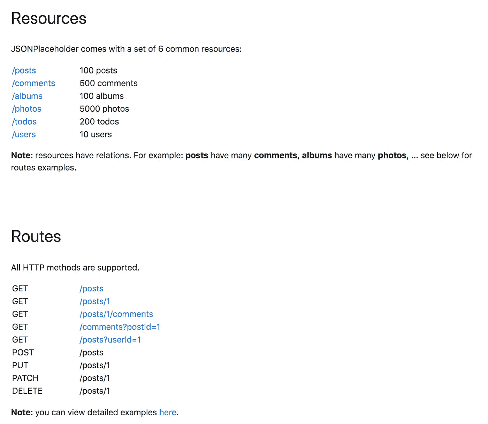
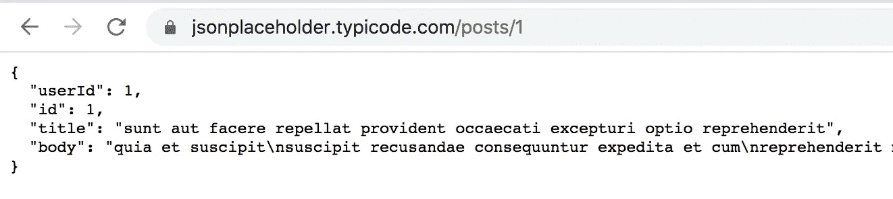
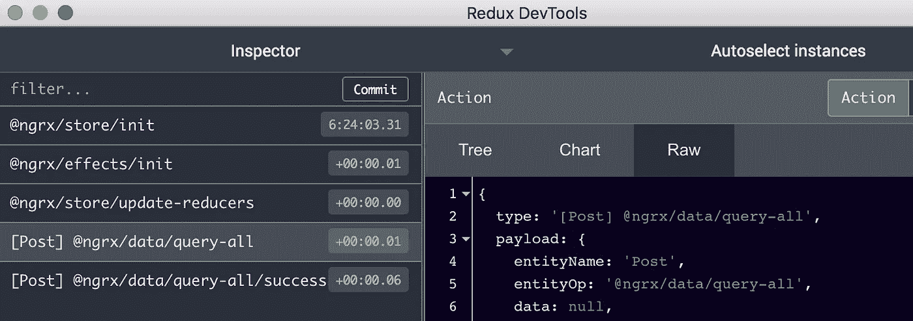
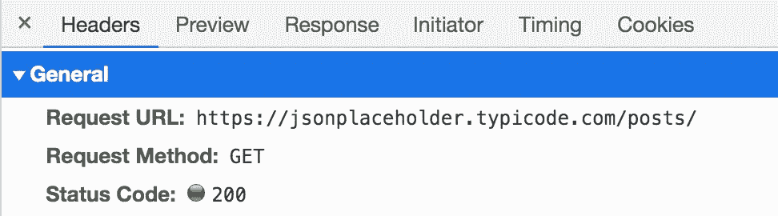
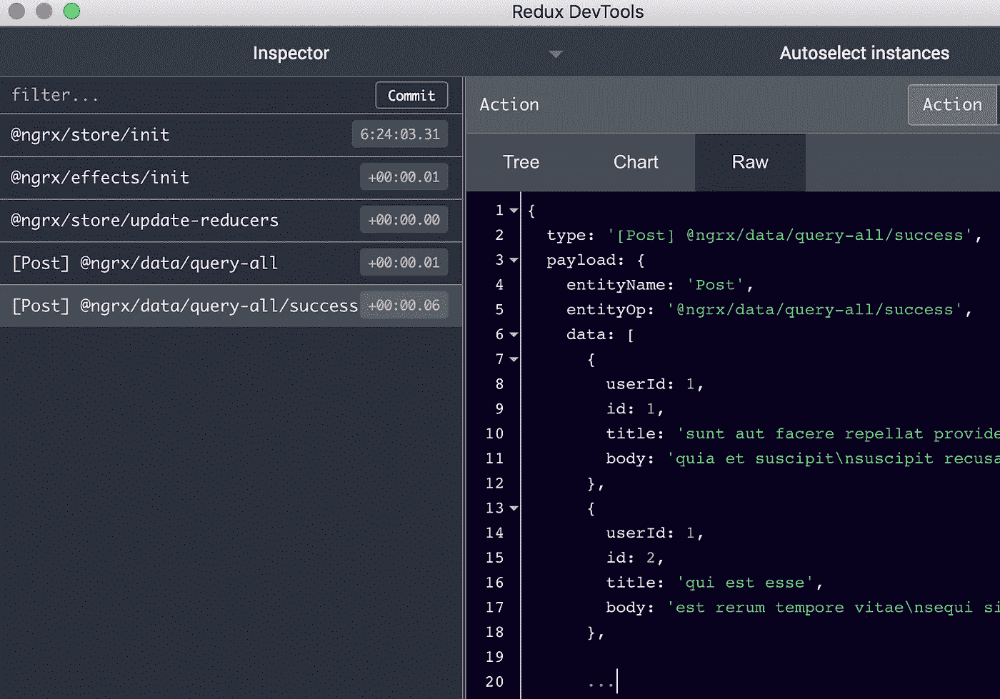
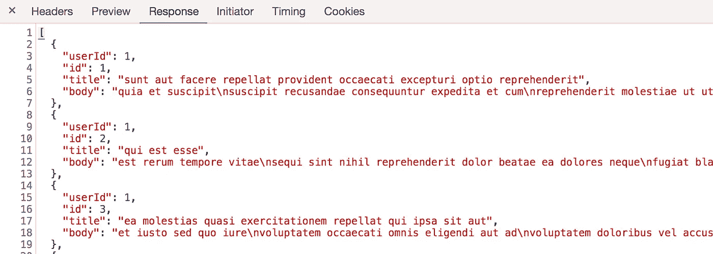
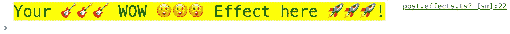

# 如何在 NgRx 数据中编写动作效果

> 原文：<https://betterprogramming.pub/write-effects-for-actions-in-ngrx-data-214c93869758>

## 动态拦截@ngrx/data 请求


从一个框架入手，解决了很多问题；有些从一开始就很难学。然而，我们甚至可以比在`[vanilla](https://en.wikipedia.org/wiki/Vanilla_software)`模式下更快地构建许多东西。事实上，我几乎在使用`[NgRx](https://ngrx.io/)`之前就使用了`[NgRx Data](https://ngrx.io/guide/data)`。

现在，我要告诉你我遇到一个问题的经历——我很长时间都找不到解决方案。

但在此之前，我们还将学习如何:

*   在 NgRx 数据中创建一个虚拟项目，并且
*   自定义 NgRx 数据中的 URL。

最后来看看如何拦截原生 NgRx 数据动作——对点火效果的请求。

# 介绍

Angular 和 NGRX 团队完成了出色的工作；然而，你知道医生有时...

不管怎样，事实是 NgRx 数据使得通过后端的`[CRUD](https://en.wikipedia.org/wiki/Create,_read,_update_and_delete)`通信变得困难。我们节省了大量的时间和精力，但这是有代价的。这是你请求的`[REST](https://medium.com/@stevenpcurtis.sc/rest-vs-crud-ca5522bf3fc3)`动词的规范化，也是到达你后端的 URL 路由的规范化。就是这样；挺简单，挺标准。

我关于 [StackOverFlow](https://stackoverflow.com/questions/61634055/how-do-i-write-effects-for-actions-in-ngrx-data) 的问题:

> “如何在 ngrx/data 中为“本机”动作编写效果？
> 
> 我知道 ngrx/data 的创建是为了尽可能地去除动作、选择器、效果、减少器，因此减少了样板文件。但是，应该有一种方法为 NgRx 数据创建效果。"

让我用另一种方式解释。对于我的项目，我需要监听 NgRx 数据操作，例如，[QUERY _ ALL:' @ NgRx/data/QUERY-ALL '](https://ngrx.io/api/data/EntityOp#QUERY_ALL)或[QUERY _ ALL _ SUCCESS:' @ NgRx/data/QUERY-ALL/SUCCESS '](https://ngrx.io/api/data/EntityOp#QUERY_ALL_SUCCESS)，或其他。

存在类似的东西吗？

```
**fooNgrxDataEffectForQueryLoad**$ = createEffect(() =>
            this.actions$
                .pipe(
                    ofType(('**FooActionDispatchedByNgRxData**')),
```

当然，上面的**代码**会不会**不起作用，**也没人告诉我一个方法来动态捕捉这些自动请求(NgRx Data***Actions***)对编写 ***的影响。我没有通过谷歌或者 StackOverFlow 找到任何东西。***

# 虚拟 NgRx 数据项目

我们需要一个项目，通过一个实际的例子来应用我们的概念，并实现我们脑海中的所有想法。

看看这个网站，它为我们提供了一个简单的假 rest API。是的，我们不需要构建后端！

[](https://jsonplaceholder.typicode.com/) [## JSONPlaceholder

### JSONPlaceholder 是一个免费的在线 REST API，只要你需要一些假数据，就可以使用它。对于教程来说很棒…

jsonplaceholder.typicode.com](https://jsonplaceholder.typicode.com/) 

我们今天的候选人是一个帖子列表，这都是关于 API 和后端的。

## 定义实体

现在，让我们用 NgRx 数据开始聚会…

我们将使用 ***帖子*** *，*，所以我们要做的第一件事就是定义实体…



`interfaces.ts`

```
export default interface **Post** {
userId: number;
id: number;
title: string;
body: string;
}
```

然后，我们对 NgRx 数据说要使用哪些实体:

`entity.component.ts`

```
import { EntityMetadataMap } from '@ngrx/data';const entityMetadata: EntityMetadataMap = {
    **Post**: {}
};export const **entityConfig** = {
    entityMetadata
};
```

## 注册实体存储

只是为了正确加载 NgRx 数据:

`app.module.ts`

```
...@NgModule({
     imports: [
     HttpClientModule,
     StoreModule.forRoot({}),
     EffectsModule.forRoot([]),
     EntityDataModule.forRoot(**entityConfig**)
    ]
})...
```

## 创建实体数据服务

创建一个服务，完成与 API 通信的所有神奇工作:

`post.service.ts`

```
import { Injectable } from '@angular/core';
import {EntityCollectionServiceBase,EntityCollectionServiceElementsFactory} from '@ngrx/data';
import Post from './interfaces';@Injectable({ providedIn: 'root' })
export class **PostService** extends **EntityCollectionServiceBase**<**Post**> {constructor(serviceElementsFactory:  **EntityCollectionServiceElementsFactory**) {
  super('**Post**', serviceElementsFactory);
}
```

## 在组件中使用 NgRx 数据

现在来看智能[和非智能](https://medium.com/@michelestieven/components-stateful-stateless-dumb-and-smart-2847dd4092f2)组件。这是我们的智能组件，包含检索数据的所有逻辑，以及 NgRx 数据:

`post-list.component.ts`

```
...export class PostListComponent {posts$: Observable<Post[]>;constructor(private postService: PostService) {
   **this.posts$ = postService.entities$;**
}ngOnInit() {
   **this.getPosts()**;
}getPosts() {
   **this.postService.getAll()**;
}

...
```

`post-list.component.html`

```
<ng-container ***ngFor**="let post of **posts$** | **async**">
     <**post** **[post]="post"**></**post**>
</ng-container> 
```

我们的哑巴:

`post.component.ts`

```
export class **PostComponent**  {
  **@Input()** post: **Post**;
```

`post.component.html`

```
<p class="title">{{ **post.id** }}: {{ **post.title** }}</p>

<p class="body">{{ **post.body** }}</p>
```

注:我们在与 https://picsum.photos/的帖子中通过他们的 id 随机排列照片，只是为了让它更真实。

# 自定义 URL

我们的 jsonplaceholder 后端 API 在路由方面不符合 [NgRx 数据默认配置](https://ngrx.io/guide/data/entity-dataservice#configure-the-defaultdataservice)，那么定制:

`app.module.ts`

```
const defaultDataServiceConfig: DefaultDataServiceConfig = {
    root: 'https://jsonplaceholder.typicode.com/'
}...@NgModule({imports: [...providers: [{ provide: DefaultDataServiceConfig, 
useValue: defaultDataServiceConfig }]...
```

我们还做了一些其他的小工作来美化我们的帖子列表，让它更完美。

# 拦截动作

## 在 NgRx 数据中是什么样子的？

还记得我们在`post-list.component.ts`做什么吗？

```
**this.posts$ = postService.entities$;**
...**this.postService.getAll()**;
```

这几行代码通过几个动作激活了它们背后的所有魔力:

*   [QUERY _ ALL:' @ ngrx/data/QUERY-ALL '](https://ngrx.io/api/data/EntityOp#QUERY_ALL)
*   [QUERY _ ALL _ SUCCESS:' @ ngrx/data/QUERY-ALL/SUCCESS](https://ngrx.io/api/data/EntityOp#QUERY_ALL_SUCCESS)

第一个动作**【发布】ngrx/data/query-all:**



发送请求:



要检索所有数据，请使用:



他们的回答是:



UI 中的结果是:


## WoW NgRx 效果

最后，我们创建这个项目的原因是:

`post.effects.ts`

```
...@Injectable()
export class **PostEffects** {**ngrxDataEffectForQueryLoad$** = createEffect( () =>this.actions$.pipe(**ofEntityType("Post"),
ofEntityOp([EntityOp.QUERY_ALL_SUCCESS]),**tap(action =>console.log("%c%s","color: green; background: yellow; font-size: 24px;","Your 🎸🎸🎸 WOW 😲😲😲 Effect here 🚀🚀🚀!"))),{ dispatch: false });...
```

不要忘记在应用程序中注册它们:

`app.module.ts`

```
...@NgModule({
imports: [...**EffectsModule.forRoot([PostEffects])**,
],...
```



现在，我们在控制台上看到它。

除了过滤 Post 实体和 QUERY_ALL_SUCCESS 操作之外，并不十分困难——不需要解释太多。请记住，您也可以对所有的[https://ngrx.io/api/data/EntityOp](https://ngrx.io/api/data/EntityOp)操作执行此操作。

这是一个很好的技巧，如果你不读这篇文章或在其他地方看到它，你可能很难发现它。

正如你所看到的，我已经为你留下了 WoW 效果部分，我不想让文章变得更长…现在，你可以从 NgRx 数据动作中发射效果了！

⤣ *回购至此(*[*stack blitz*](https://stackblitz.com/edit/angular-ivy-ngrx-data-effects4actions)*或*[*github*](https://github.com/ackuser/angular-ivy-ngrx-data-effects4actions/tree/develop)*上支开拓)* ⤤


# 结论

我喜欢 NgRx 数据。如果你是这方面的新手，现在你知道如何用 NgRx 数据快速实现一个项目。

另一方面，如果你已经知道 NgRx 数据，但是你从来没有见过如何从 NgRx 数据*动作/请求、*中触发*效果/魔法*，或者你在这方面遇到了困难，我希望这篇文章对你有所帮助。

我总是喜欢推荐别人有帮助的文章:

*   [超快速状态 CRUD——NgRx 数据实用指南](https://medium.com/@felipenoratolacerda/super-fast-stateful-crud-a-practical-guide-to-ngrx-data-9aaf89186348)
*   [@ngrx/data 将改变你的人生](https://medium.com/better-programming/ngrx-data-will-change-your-life-8528736e4fc0)

# 后续步骤

我们想🎸NgRx，所以请继续关注其他特性和定制！

感谢阅读。