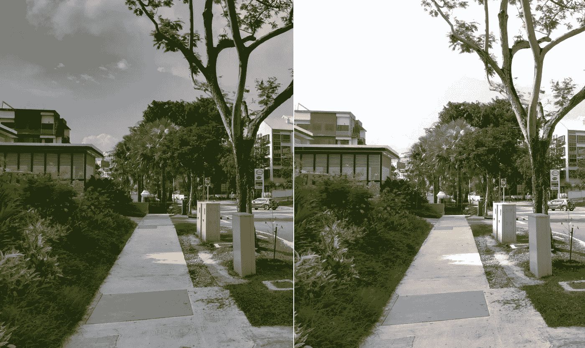
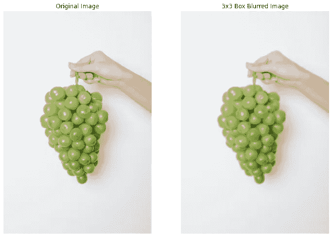

# 用 Halide 编写快速且可维护的代码——试播集

> 原文：<https://betterprogramming.pub/write-fast-and-maintainable-code-with-halide-part-1-6a5c3a519250>

## 编写高性能代码通常以降低可移植性和简洁性为代价——Halide 解决了这一问题，我们在谷歌经常使用它。


图片由马克-奥利维尔·乔多因在 [Unsplash](https://unsplash.com/photos/NqOInJ-ttqM) 上拍摄。

# 介绍

**Halide** 是一种开源编程语言，旨在使**在现代机器上编写和维护**高性能图像处理或数组处理代码变得更加容易。卤化物目前的目标

*   不同的 CPU
*   不同的操作系统
*   不同计算 API，如`CUDA`、`OpenCL`、`OpenGL`等。

Halide 不是一种独立的编程语言，而是嵌入在 C++中。这意味着您编写 C++代码，使用 Halide 的 C++ API 构建 Halide 管道的内存表示。然后，您可以将这个表示编译成一个目标文件，或者 JIT 编译它并在同一个进程中运行它。你可以在 halide-lang.org 了解更多。

Halide 在谷歌中使用非常频繁，例如在著名的 HDR+算法中，该算法为旗舰 Pixel 设备上的相机应用程序提供动力。除此之外，Halide 管道在 Google Photos、Youtube 和其他地方大规模运行。



*HDR 图像(左)&标准图像(右)。在低端 Android 设备上用谷歌相机拍摄。作者捕获的图像。*

我是来自谷歌的[相机中的 TL，在谷歌，我们广泛使用 Halide 语言来实现我们的功能，如](https://developers.google.com/camera) [HDR](https://developers.google.com/camera/features#hdr) 或[夜间模式](https://developers.google.com/camera/features#full-resolution-night-mode)。从标准 C++或 OpenCV 迁移到 Halide 帮助我们显著提高了 ARM 芯片组上一些算法的性能，这些芯片组为大多数 Android 设备提供支持。

这对于在低端设备上实现这些功能并让所有人都能获得好的照片至关重要。

> 重要声明:本文中的任何观点都是我个人的观点，并不反映我所工作的组织的观点或立场。

# 需求:我为什么要关心另一种编程语言呢？

## 规模——让我们先来看看规模

随着时间的推移，现代硬件变得非常强大。但是，我们正在处理的问题陈述的规模也是如此。

让我们以计算摄影算法为例。如今，移动设备拥有相当大的图像传感器。某些 Android 设备现在配备了高达 108 百万像素的摄像头。即使在 1300 万像素这样的较小分辨率下，一幅图像也有`~13,000,000`个像素。如果我们必须运行一个简单的增亮操作，比如

```
f(x) = a * x + b;
```

我们必须对`~13 million`像素运行这个函数。

但是，对我们有利的是，我们处理的 CPU 既不是单核的，也不是标量的。因此，我们通常可以利用现代 CPU 中的多核和[对矢量指令的支持](https://minhazav.medium.com/guide-the-compiler-to-speed-up-your-code-655c1902b262)，将这些算法的运行时延迟提高多个数量级。

## 例如:3x3 模糊



*原图(左)和 3x3 盒核的盒模糊图(右)。由作者生成的比较。源图像由*[](https://www.pexels.com/@any-lane)**上的* [*像素*](https://www.pexels.com/photo/crop-woman-showing-green-grapes-5946087/) *组成。**

*你可以用一个 3x3 的盒式滤镜来模糊图像。对于位置`(x, y)`的每个像素，你用它的近邻中所有像素的平均值来替换它。*

*强力方法是对每个像素都这样做，因此得到的时间复杂度为`O(K^2 * WH)`，因为`K`是内核大小(= 3)，而`W`和`H`分别是图像的宽度和高度。*

*简单框模糊示例*

*对此的一个改进是利用内核的可分离性。我们可以将单个`3x3`内核分解成两个`1x3`和`3x1`内核。通过这种方式，我们将单个步骤分解为行和列的交互，从而将复杂度降低到`O((K + K)WH)`。对于`K=3`来说，光是这一点就应该被`~50%`优化。*

*3x3 框模糊的标准实现*

*根据[【3】](https://dl.acm.org/doi/10.1145/3150211)，作者在`**Intel Core i7-4790**` CPU 上进行了基准测试，发现平均延迟约为`**6.5ms/MP**`。*

*这可能适用于一般的用例。然而，*

> *为了实现卓越的性能并充分利用现代 CPU，我们需要利用矢量化、多线程、切片和融合。*

*这样做帮助作者在同一个`x86` CPU 上实现了**快 20 倍的性能**。*

*面向 x86 处理器的 3×3 盒模糊快速实现*

*这种方法将平均延迟降低到`**0.30ms/MP**` **—** ，比**快了 20 倍**。*

*这是非常显著的性能提升，但也带来了一些问题:*

*   ***可移植性**:并非所有 CPU 类型都支持代码中使用的指令，因此，这些指令不能在不同的芯片组之间移植。为了在不同的 CPU 类型(例如 32 位架构)上实现最佳性能，我们需要编写另一个类似性质的实现。利用该 CPU 类型所支持的一组固有特性。*
*   ***简单性**:这要求团队中的工程师拥有丰富的领域知识——在不同的实现中构建和维护这些算法。实际上，这样的领域知识通常很少。*
*   ***可维护性**:如果团队需要更新算法，他们需要支付一些修改的费用，有时甚至是如何构建循环以实现最佳性能。这将比标准方法花费团队更多的工程时间。*

## *回答“需要”*

*所以需要有一种方法*

> *实现高性能，同时保持代码的可移植性、简单性和可维护性。*

# *Halide lang 提供什么*

> ***卤化物使我们能够编写更简单的高性能代码***

*—通过将图像处理流水线的算法与如何在特定机器上高效运行该算法分离开来。作为程序员，我们仍然需要定义算法应该如何执行——但是定义这些策略更容易编写、测试和维护。*

*这种分离也使得分别维护算法和调度变得更加容易。这使得尝试不同的调度更快，否则需要复杂的循环结构改变。*

*同样的`3x3 box blur`在卤化物中被写成*

*3×3 框模糊的卤化物实现*

*上述代码在目标硬件上的平均延迟似乎为`**0.29ms/MP**`(同上)。*

*上面的时间表告诉编译器生成平铺循环，生成向量指令，并按行顺序并行化循环。做这些通常需要我们用标准 C++编写大型的分解循环。*

*通常，当我们开始利用并行时，内存带宽开始成为瓶颈。如果您决定在垂直计算模糊之前进行完整的水平扫描，存储和内存带宽要求会加倍。这些问题通常通过将 2D 环分解成精心选择尺寸的瓦片，然后将这些环融合来解决。*

*正如你在上面的代码示例中看到的——Halide 代码使这变得更加容易。*

**

*t *iled 执行 for-loop 的演示(来源:*[](https://halide-lang.org/tutorials/tutorial_lesson_05_scheduling_1.html)**，Apache 许可)。***

**从工程的角度来看，这大大减少了为实现高性能而需要编写的样板代码。**

**这应该给了你相当减少工程时间和成本的暗示。**

# **总结—优点和缺点**

**以上三种方法的利弊。**

**因此可以得出这样的结论**

> **TL；DR； **Halide 语言允许我们编写快速且可维护的代码。****

**即使是专家也需要时间来编写快速代码**

> **Halide 使探索不同方法的选择空间变得更加容易。**

**如果你认为这对你或你的团队有用，你可以[从这里开始](https://halide-lang.org/#gettingstarted)。**

# **向开发团队大声喊出来**

**非常感谢乔纳森·拉冈-凯利和他的团队提出了 Halide 并将其开源。本文中的大部分内容来自他们发表的论文— [Halide:从高性能图像处理调度中分离算法](https://dl.acm.org/doi/10.1145/3150211)。**

**我很幸运能与一些作者和相关成员一起工作。**

# **文章系列**

**`Updated: 24th April 2022`**

**这篇文章是这类文章系列的先导。**

**在接下来的几篇文章中，我打算写一下:**

**[](/write-fast-and-maintainable-code-with-halide-the-general-concepts-4d865466bb8c) [## 理解 Halide 编程语言的一般概念

### 编写快速且可维护的代码

better 编程. pub](/write-fast-and-maintainable-code-with-halide-the-general-concepts-4d865466bb8c) 

*   文章 3:使用 Halide 在 Android 上进行快速图像处理。
*   第 4 篇:寻找最佳日程安排——自动日程安排。

您可以在这个列表中找到更多关于高性能编码的文章


米纳兹

## 高性能代码

[View list](https://minhazav.medium.com/list/high-performance-code-7f82f340016e?source=post_page-----6a5c3a519250--------------------------------)7 stories

如果你想了解这个话题的具体内容，请在评论中标注。

# 参考

1.  【halide-lang.org】卤化物
2.  [卤化物教程](https://halide-lang.org/tutorials/tutorial_introduction.html)
3.  [Halide:从高性能图像处理的时间表中分离算法](https://dl.acm.org/doi/10.1145/3150211) —乔纳森·拉冈-凯利等人的开放存取研究文章。艾尔。
4.  [使用 Android 中的原生代码快速处理图像](/processing-images-fast-with-native-code-in-android-db8b21001fa9)
5.  [如何使用 RenderScript 将 YUV_420_888 YUV 图像转换为位图](https://medium.com/computational-photography/fast-image-processing-in-android-with-renderscript-4bc6992ba48e)
6.  [使用多线程技术加快 Android Java 中的图像处理速度](https://blog.minhazav.dev/faster-image-processing-in-android-java-using-multi-threading/)

*原发布于*[*https://blog . minhazav . dev*](https://blog.minhazav.dev/write-fast-and-maintainable-code-with-halide/)**