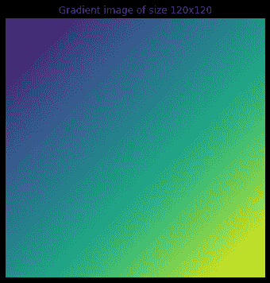

# 理解 Halide 编程语言的一般概念

> 原文：<https://betterprogramming.pub/write-fast-and-maintainable-code-with-halide-the-general-concepts-4d865466bb8c>

## 编写快速且可维护的代码

用 Halide 写的 3x3 框模糊算法截图。来源—【halide-lang.org 

上一次我展示了如何用 Halide 简单且可维护的代码实现高性能。这一次，我将分享卤化物中的一般概念。

# 介绍

Halide 是一种开源编程语言，旨在使在现代机器上编写高性能图像处理或数组处理代码变得更加容易。

在本系列的最后一篇文章[中，我解释道:](/write-fast-and-maintainable-code-with-halide-part-1-6a5c3a519250)

*   什么是卤化物？
*   卤化物的需求是什么？(**重述**:快速代码通常很复杂，难以编写和维护)
*   卤化物如何满足需求。

在本文中，我将深入探讨并分享 Halide 中的一些通用概念——关键数据类型和不同的调度原语。针对不同的调度原语—包括一个生成代码的示例和一个代码执行的演示。

> *本文是 Halide 开发团队分享的* [*文档*](https://halide-lang.org/index.html#gettingstarted) *和* [*教程*](https://halide-lang.org/tutorials/tutorial_introduction.html) *中内容的汇总版。*
> 
> 我试图为读者和我自己将来的参考总结一些主要的概念。在深入讨论某些主题之前，分享这一点似乎至关重要。
> 
> ***重要声明*** *:本文中引用的任何观点都是我个人的观点，并不反映我所工作的组织的观点或立场。*

# 卤化物概念—一般结构

> 我将只是浅尝辄止，想了解更多，请查看[*halide-lang.org/tutorials*](https://halide-lang.org/tutorials/tutorial_introduction.html)*的教程。*

卤化物程序通常具有

*   一些`input(s)`和一个或多个`output(s)`。
*   表示`input(s)`到`output(s)`转换的一些表达式或算法。
*   定义如何在特定计算机上计算这些表达式的计划。我们还可以定义多个计划，每个计划针对不同的硬件子集。

就这些表达式或算法而言

*   `Func`:一个`Func`对象代表一个流水线阶段。这是一个定义每个像素值的纯函数。你可以把它想象成一个计算机图像。
*   `Var` : `Var`对象是在`Func`的定义中用作变量的名字。它们本身没有任何意义。我们一般用`x`和`y`作为定义图像的`x axes`和`y axes`的变量。
*   `Expr` : `Expr`允许我们使用`Var` s 定义复杂的表达式。

这里我将使用教程中分享的渐变例子作为例子

无时间表生成梯度的卤化物代码

> *来源:*[*halide-lang.org>教程>第一课*](https://halide-lang.org/tutorials/tutorial_lesson_01_basics.html)

这应该会生成一个图像，就像这样

*用 matplotlib (cmap=vidris)用 f(x，y) = x + y 生成的渐变图像。图片作者。*

# 时间表

调度是 Halide 定义*“如何在特定机器上高效运行算法”*的方式。

> *以下内容是*[*halide-lang.org>教程>第五课*](https://halide-lang.org/tutorials/tutorial_lesson_05_scheduling_1.html) 较大教程的总结

对于上面的`gradient()`示例，默认情况下，代码将在行主迭代中按顺序执行。生成的代码应该类似于

行主要迭代代码示例

*渐变示例的执行顺序-默认。来源:*[*halide-lang.org*](https://halide-lang.org/tutorials/tutorial_lesson_05_scheduling_1.html)*，阿帕奇执照。*

让我们来看看不同的时间表选项。

## 重新排序

卤化物再订购时间表

这将重新安排迭代的顺序，在这种情况下，循环将以列主方式执行。生成的代码将看起来像这样

列主迭代代码示例

*梯度示例的执行顺序—列主迭代。来源:*[*halide-lang.org*](https://halide-lang.org/tutorials/tutorial_lesson_05_scheduling_1.html)*，阿帕奇执照。*

根据 CPU 利用缓存的方式，这种变化通常会对性能产生很大影响。

## 裂开

分裂的卤化物时间表

这是一个非常强大的原语，允许我们将某个维度的循环拆分为多个部分。这里的最后一个论点叫做“分裂因子”。在这种情况下，生成的代码类似于

x 轴循环拆分的主要行

## 融合

熔丝的卤化物表

这与拆分相反，在这种情况下，我们融合两个变量，并将两个循环合并成一个对范围乘积的 for 循环。生成的代码如下所示

2D for loop 融合成 1D for loop

## 盖瓦

卤化物贴砖计划

有了拆分和重新排序，我们现在可以进行平铺评估。上面的时间表允许我们将`x`和`y`循环分成 4 部分，并对执行顺序进行重新排序。生成的代码现在很复杂，但应该类似于

为 Halide 中的平铺生成的代码

*渐变示例的执行顺序——平铺。来源:*[*halide-lang.org*](https://halide-lang.org/tutorials/figures/lesson_05_tiled.gif)*，阿帕奇牌照。*

## …向量化…

Halide 中矢量化的时间表

我们现在可以指示编译器生成指令，在循环的`x`中对内部循环进行矢量化。这会生成如下代码

Halide 中为矢量化生成的代码

*图:渐变示例的执行顺序—矢量化。来源:*[*halide-lang.org*](https://halide-lang.org/tutorials/figures/lesson_05_vectors.gif)*，阿帕奇执照。*

## 展开循环

在卤化物中展开时间表

通过使用`unroll`原语，我们可以很容易地引导编译器展开循环。

## 融合、平铺和并行化

用于融合、平铺和矢量化的卤化物计划

我们基本上可以根据数据独立性组合所有这些结构，以实现最佳性能。这是瓷砖和融合发光的地方。我们可以跨瓦片并行化。

上面提到的计划生成如下代码:

为融合、平铺和矢量化生成的代码

*渐变示例的执行顺序——融合、平铺和矢量化。来源:【halide-lang.org】**、阿帕奇牌照。***

# *把所有的放在一起*

*进一步组合大图像的所有构造:*

*将所有这些放在卤化物中的时间表*

*这个视频展示了复杂的时间表是如何计算出来的。*

*[https://halide-lang . org/tutorials/figures/lesson _ 05 _ fast . MP4](https://halide-lang.org/tutorials/figures/lesson_05_fast.mp4)*

# *向开发团队大声喊出来*

*非常感谢乔纳森·拉冈-凯利和他的团队提出了 Halide 并将其开源。这篇文章中的大部分内容来自于他们在 halide-lang.org/tutorials 发表的教程。*

# *文章系列*

*本文是这类文章系列的第二篇。如果您错过了第一篇文章，您可以在这里找到它:*

* [## 用 Halide 编写快速且可维护的代码—第 1 部分

### 编写高性能的代码通常是以降低可移植性和简洁性为代价的——Halide 固定了这一点，我使用…

minhazav.medium.com](https://minhazav.medium.com/write-fast-and-maintainable-code-with-halide-part-1-6a5c3a519250) 

在接下来的几篇文章中，我打算写一下

*   文章 3:使用 Halide 在 Android 上进行快速图像处理。
*   第 4 篇文章:寻找最优化的日程安排—自动日程安排。

此列表中有更多关于高性能编码的文章

[米纳兹](https://minhazav.medium.com/?source=post_page-----4d865466bb8c--------------------------------)

## 高性能代码

[View list](https://minhazav.medium.com/list/high-performance-code-7f82f340016e?source=post_page-----4d865466bb8c--------------------------------)7 stories

如果你想了解这个主题的具体内容，请告诉我。

# 参考

1.  [卤化物——halide-lang.org](https://halide-lang.org/)
2.  [卤化物教程](https://halide-lang.org/tutorials/tutorial_introduction.html)
3.  [卤化物:从高性能图像处理的时间表中分离算法](https://dl.acm.org/doi/10.1145/3150211) —乔纳森·拉冈-凯利等人的开放存取研究文章。艾尔。
4.  [使用 Android 中的原生代码快速处理图像](/processing-images-fast-with-native-code-in-android-db8b21001fa9)
5.  [如何使用 RenderScript 将 YUV_420_888 YUV 图像转换为位图](https://medium.com/computational-photography/fast-image-processing-in-android-with-renderscript-4bc6992ba48e)
6.  [使用多线程技术加快 Android Java 中的图像处理速度](https://blog.minhazav.dev/faster-image-processing-in-android-java-using-multi-threading/)

*原载于*[*https://blog . minhazav . dev*](https://blog.minhazav.dev/write-fast-and-maintainable-code-with-halide-part-2/)*