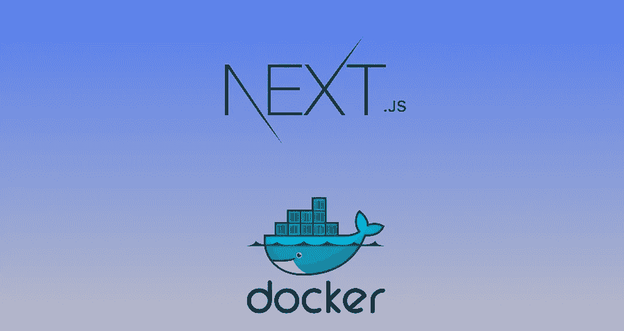
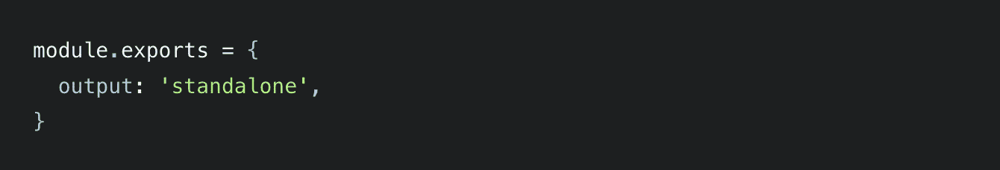
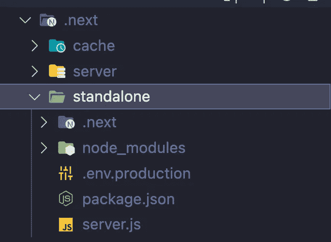
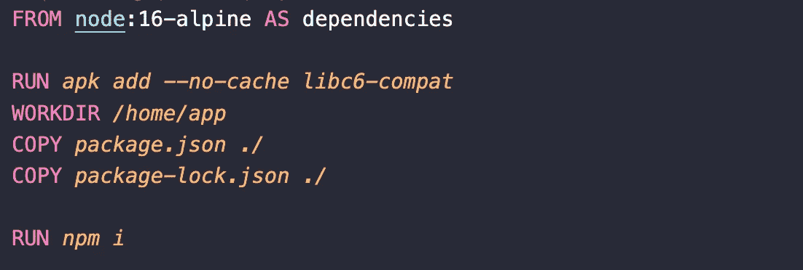
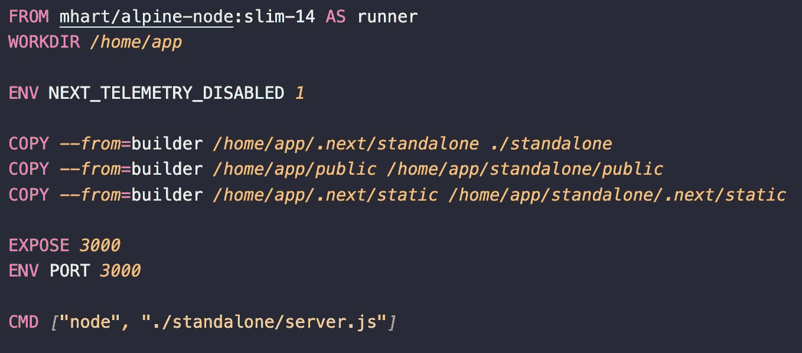
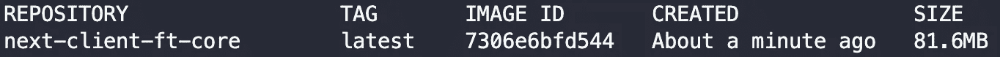

# 如何为 Next.js 编写优化的 Dockerfiles

> 原文：<https://betterprogramming.pub/write-optimised-dockerfiles-for-next-js-d644b628c570>

## 将下一个应用程序的 Docker 图像减少 15 倍以上。



编写 docker 文件有时会很棘手。我们需要小心我们推送的文件和我们给予的权利。

构建图像最具挑战性的事情之一是保持图像尺寸较小。一个写得好的 docker 图像占用的空间越少越好。这可以通过多种方式来确保:

1.  我们可以决定限制推送到图像的文件。这包括过滤掉不需要的文件。
2.  生成图像时使用[多级构建](https://docs.docker.com/build/building/multi-stage/)。
3.  在不需要的文件用尽后删除它们。

# 多阶段构建简介

多阶段构建是一种非常流行的缩小图像大小的方法。要编写一个真正高效的 Dockerfile，您需要使用 shell 技巧和其他逻辑来保持层尽可能小，并确保每一层都有它需要的来自前一层的工件，而没有其他东西。

多阶段构建使用多个可用于不同基础的`FROM`语句，每个语句都开始构建的一个新阶段。您可以有选择地将工件从一个阶段复制到另一个阶段，在最终图像中留下所有不想要的东西。从而确保最终的图像尽可能精确。

# 下一个 JS 中的独立应用程序

在我们继续编写 Dockerfile 文件之前，我们需要理解 Next 框架的一个非常强大的特性。

理想情况下，当我们在 Next 中构建应用程序时，我们继续依赖 node _ moudules，并依次依赖 package.json。这意味着即使在最终映像中，我们也需要导入所有依赖项，以便应用程序成功运行。

这就是 NextJS 中的[输出文件跟踪/独立](https://nextjs.org/docs/advanced-features/output-file-tracing)发挥作用的地方。Next.js 可以自动创建一个*独立的*文件夹，该文件夹只复制生产部署所需的文件，包括 *node_modules* 中的选择文件。

为了利用这种自动复制，您可以在 next.config.js 中启用它:



这将在`.next/standalone`创建一个文件夹，然后可以在不安装`node_modules`的情况下自行部署。

此外，还提供了一个最小的`server.js`文件，可以用来代替`next start`。



独立文件夹结构

默认情况下，这个最小服务器不会复制`public`或`.next/static`文件夹。这些文件夹可以手动复制到`standalone/public`和`standalone/.next/static`文件夹，之后`server.js`文件会自动为这些服务。

# Dockerfile 文件

让我们一步一步地构建 docker 文件:

1.  让我们创建我们的第一层— `dependencies`，在这里我们将解决所有的依赖关系并定义一个基础。您可以从可用的[列表](https://hub.docker.com/_/node)中选择您自己的底座。

```
FROM node:16-alpine AS dependencies
```

2.让我们添加一个原生包，设置工作目录，复制`package.json`和`package-lock.json`来定义依赖关系。

```
RUN *apk* *add --no-cache* *libc6-compat* WORKDIR */home/app* COPY *package.json* *./* COPY *package-lock.json* *./*
```

3.一旦我们设置好自己，我们就可以开始安装依赖项了。

```
RUN *npm* *i*
```

我们已经添加完了所有的依赖项。我们的第一层准备好了。



属国

4.让我们创建我们的第二层— `builder`。这一层的目标是生成静态文件，我们将最终推动到最终的图像。

```
FROM node:16-alpine AS builder
```

5.然后，我们需要将前一层的相关工件复制到`builder` 中，并设置当前的工作目录*。*

```
WORKDIR */home/app* COPY --*from*=dependencies */home/app/node_modules* *./node_modules* COPY *.* *.*
```

6.我们现在想要构建应用程序。

```
RUN *npm* *run* *build*
```

这标志着第二层的结束。在这一阶段，我们有静态文件，我们将推动到我们的最终形象。


建设者

7.让我们创建我们的第三个也是最后一个图层— `runner` **。在这里，我们将推送静态文件，并尽量保持图像较小。**

我们还设置了工作目录，并将`NEXT_TELEMETRY_DISABLED`设置为`true`。这将确保我们在 Next 之前选择退出匿名数据收集。

```
FROM mhart/alpine-node:slim-14 AS runner
WORKDIR */home/app* ENV NEXT_TELEMETRY_DISABLED *1*
```

8.然后我们把相关的人工制品放到图像中。这包括来自`.next/standalone` *的独立文件、*公共文件和*静态文件。*

```
COPY --*from*=builder */home/app/.next/standalone* *./standalone* COPY --*from*=builder */home/app/public* */home/app/standalone/public* COPY --*from*=builder */home/app/.next/static /home/app/standalone/.next/static*
```

9.最后，我们公开所需的端口，并写下启动应用程序的最终命令。

```
EXPOSE *3000* ENV PORT *3000* CMD *[*“node”*,* “./standalone/server.js”*]*
```



跑步者

我们的 docker 文件看起来像这样:

```
FROM node:16-alpine AS dependencies
RUN *apk* *add --no-cache* *libc6-compat* WORKDIR */home/app* COPY *package.json* *./* COPY *package-lock.json* *./* RUN *npm* *i*FROM node:16-alpine AS builder
WORKDIR */home/app* COPY --*from*=dependencies */home/app/node_modules* *./node_modules* COPY *.* *.* ENV NEXT_TELEMETRY_DISABLED *1* ARG NODE_ENV
ENV NODE_ENV=”${NODE_ENV}”
RUN *npm* *run* *build*FROM mhart/alpine-node:slim-14 AS runner
WORKDIR */home/app* ENV NEXT_TELEMETRY_DISABLED *1* COPY --*from*=builder */home/app/.next/standalone* *./standalone* COPY --*from*=builder */home/app/public* */home/app/standalone/public* COPY --*from*=builder */home/app/.next/static* */home/app/standalone/.next/static* EXPOSE *3000* ENV PORT *3000*CMD *[*“node”*,* “./standalone/server.js”*]*
```

# 结论

为 Next 这样的框架编写 docker 文件时，人们最常犯的错误是:

1.  将整个构建文件推送到容器中
2.  安装所有依赖项或将所有依赖项/ `node_modules`复制到最终映像。
3.  将所有工件复制到最终层，包括源文件。

在我们决定把它推送到映像之前，我们需要理解每个构建文件(无论是任何框架)的相关性。

有了`next.config.js`和`Dockerfile`中的这些变化，我能够将 Docker 映像的大小从 1.45 GB 降低到仅仅 81.6 MB。


容器的大小。然后



独立集装箱的尺寸

我希望我能够向你展示，我们如何为像 Next 这样的框架编写一个优化的`Dockerfile`。