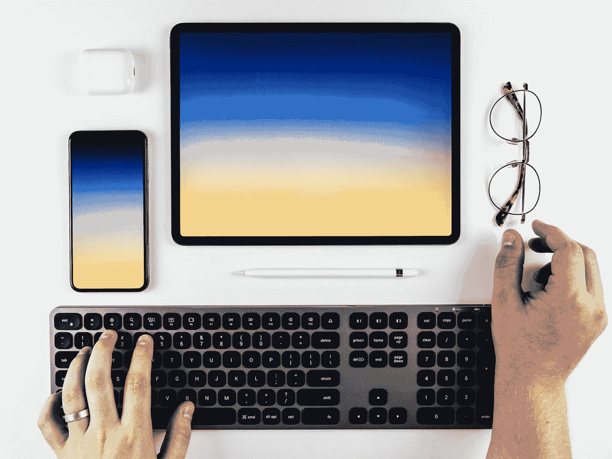
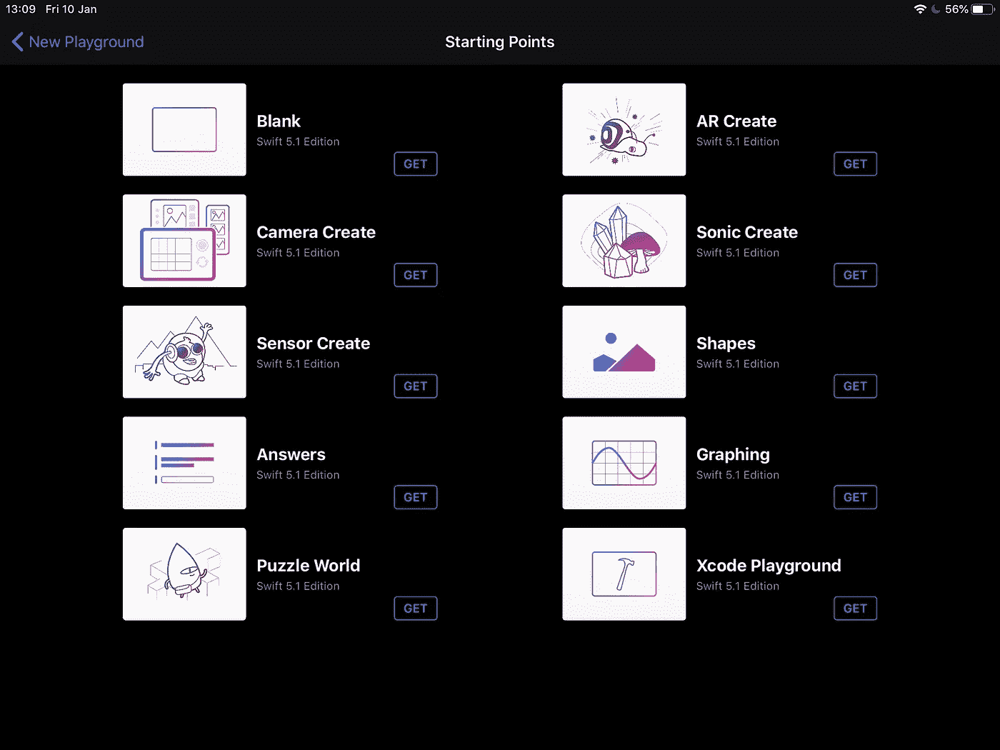
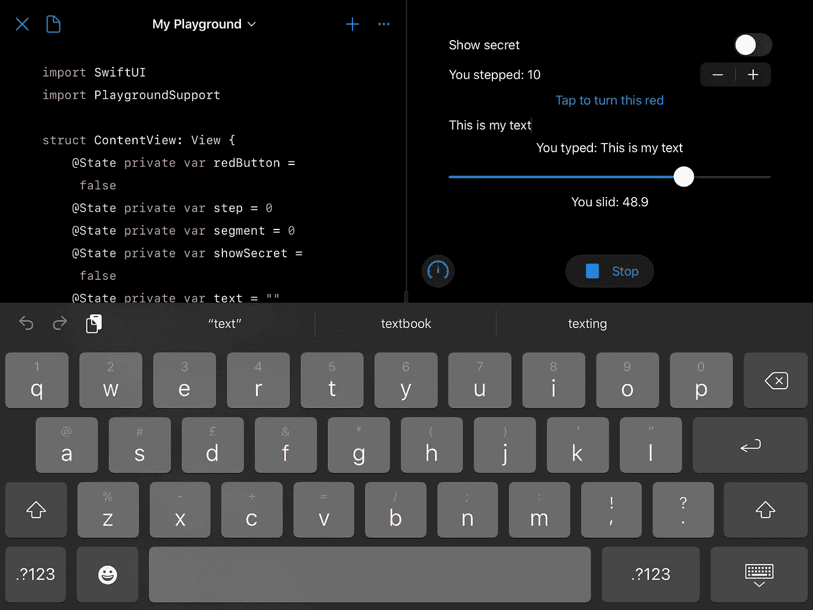

# 使用 Swift Playgrounds 完全在 iPad 上编写 SwiftUI

> 原文：<https://betterprogramming.pub/write-swiftui-entirely-on-an-ipad-using-swift-playgrounds-f48364e50c9a>

## 你不需要打开 Xcode，甚至不需要拥有一台 Mac，就可以开始使用苹果新的声明式设计框架。编写和测试同时进行！

亨利·阿斯克罗夫特在 [Unsplash](https://unsplash.com/s/photos/ipad-with-keyboard?utm_source=unsplash&utm_medium=referral&utm_content=creditCopyText) 上的照片

以下是本教程的基本内容:

当 Swift 在 2014 年首次出现时，它被设计成一种简单的第一编程语言。不需要用分号来结束每一行，条件语句不需要放在括号内，也不需要用分隔符来结束 switch 语句的每一种情况。这使得孩子们更容易编写他们的第一个代码，而不需要经常寻找丢失的标点符号。当苹果在 2016 年发布 [Swift Playgrounds](https://www.apple.com/ca/swift/playgrounds/) iPad 应用程序时，这种语言变得更加容易理解，使得在教室或家里学习基础知识变得更加容易，即使没有电脑也是如此。

直到 2019 年 6 月，为 Swift 应用程序设计用户界面的唯一方法是使用 storyboards，这是一种将数据存储在复杂的 XML 文件中的拖放界面。当苹果宣布 SwiftUI 时，这一切都改变了，swift ui 是一种用于设计可以即时预览的用户界面的声明式语言。Swift Playgrounds iPad 应用程序最近增加了对 SwiftUI 的支持，以及提供新方法来处理异步事件的 Combine 框架。

让我们看看 SwiftUI 现在允许我们在 iPad 上做什么，我们以前从来没有做过。

# 入门指南

如果你的手机上还没有，请[下载免费的 Swift Playgrounds 应用](https://apps.apple.com/gb/app/swift-playgrounds/id908519492)。

当你打开 Swift Playgrounds 时，你会直接进入新的 Playground 页面。如果您以前打开过该应用程序，您将在此处看到您以前的游乐场文件。如果没有，屏幕将大部分是空的。无论哪种方式，在屏幕的底部都有一个标题为“其他游乐场”的面板。点击面板右端的蓝色“查看全部”按钮，面板将会展开，显示苹果提供的 Swift 教程。向下滚动到起点行，点击蓝色的“查看全部”按钮。

现在你应该可以看到苹果提供的所有示例项目，尽管在我写这篇文章的时候还没有 SwiftUI 的例子。

作为本教程的起点，您有两个选择。Blank 将创建一个新的`.playgroundbook`文件，可以在 iPad 上的 Swift Playgrounds 中打开，但不能在 Mac 上通过 Xcode 打开。如果你可以独立使用 iPad，这可能是适合你的格式。如果你可以看到自己转移到 Xcode，这就是所谓的 Xcode Playground 的出发点。这使用 Xcode 使用的相同的`.playground`文件类型，让您能够在两台设备上编辑相同的文件。

默认情况下，Swift Playgrounds 似乎会将其文档存储在 iCloud 中，因此很容易理解如何从任何一台设备上访问相同的文件，而不必每次都通过电子邮件或隔空投送发送给自己。该应用程序的新操场页面左上角有一个蓝色的位置按钮，允许你使用文件应用程序浏览，允许你访问其他云提供商，如 Dropbox、Google Drive 和 Microsoft OneDrive。

同样，如果你只想在 iPad 上的安全沙盒中学习 SwiftUI，这对你来说就没那么重要了。

没有预览窗口也可以在操场上写 SwiftUI。要做到这一点，您只需导入 SwiftUI 并创建一个符合视图协议的结构，并带有返回“some View”的必需主体变量。Playgrounds 有一些代码完成功能，可以通过自动修复常见错误来帮助您纠正 SwiftUI。但是 Xcode 中 SwiftUI 的真正强大之处在于能够看到你正在创建的东西的实时预览，所以我们还需要两行代码才能在 iPad 上实现。

通过导入 PlaygroundSupport 并设置实时视图，开始预览 SwiftUI

导入`PlaygroundSupport`可以让你访问`[PlaygroundPage](https://developer.apple.com/documentation/playgroundsupport/playgroundpage)`，它允许你配置你的 iPad 编码环境。在任何给定时间，只有一个 Playground 页面是活动的，所以这个静态实例可以通过`PlaygroundPage.current`访问。这使我们能够将在 iPad 上持续运行的实时视图设置为我们上面创建的`ContentView`。

现在你应该可以按下“运行我的代码”按钮，看到应用程序变成了一个分割视图。左边是 SwiftUI 代码，右边应该是实时视图，中间用粗体字显示“iPad 上的 SwiftUI”。现在您已经准备好构建您的用户界面，它将利用 SwiftUI 附带的许多控件。

首先，我们需要使用`State`变量，它基本上将数据本地存储在 SwiftUI 结构中，并在它们的值改变时重新绘制`View`。

将这些内容添加到 ContentView 结构括号内，但在声明 body 属性之前

将这些添加到`ContentView`结构括号内，但在声明 body 属性之前。这就是我们存储所有控件状态所需的全部内容。

# 控制器

*   改变是否显示`Text`的`Toggle`
*   一个`Button`,每次点击它都会在红色和蓝色之间交替出现
*   增加显示数字的`Stepper`
*   一个`TextField`，显示你在下面的`Text`中写的内容
*   在下面的`Text`中显示其值的`Slider`

您可以按任何顺序添加它们，但是它们必须在主 VStack 的括号内

您可以按任何顺序添加它们，但是它们必须在主 VStack 的括号内。这是因为 body 属性必须是一个单独的`View`，所以不能只列出一堆控件。VStack 通过允许你在里面安排多达 10 个`Views`来使这个不同，同时仍然满足 body 属性的一个`View`的要求。控件位于您最初编写的`Text`下方是有意义的，因为这是标题，但这不是必需的。

每次添加控件并且没有错误时，实时视图都会成功地自我更新。您应该能够试用它们，并检查它们是否如您所愿。您可能会注意到拆分视图中间有一个手柄。你可以拖动它来改变屏幕的两个部分的大小，就像你在分割视图中同时处理 iPad 上的两个应用程序一样。

当你把实时视图变得足够大时，它会突然变成全屏，这对于预览更复杂的界面可能会很有用。您会在屏幕左侧的中间看到一个箭头，您可以轻按它来返回拆分视图。类似地，向右滑动拆分视图手柄可以全屏显示代码，这可能会使您在用实时视图测试代码之前更容易专注于编写和调试代码。

# 后续步骤

了解更多信息的一个很好的起点是用 Swift 的 [wiftUI by Example](https://www.hackingwithswift.com/quick-start/swiftui) 进行[黑客攻击。这些教程总是最新的，并且容易跟随。你可能偶尔会遇到 iPad 应用程序的错误，因为 SwiftUI 支持只是刚刚添加。根据我的经验，iPad 上的实时视图实际上似乎比 Xcode 的预览画布刷新更快，可能是因为它不能用于检查和配置`Views`。换句话说，iPad 可以显示 SwiftUI，但你不能像在 Xcode 中一样，点击一个元素，然后得到一个可以修改的属性下拉窗口。](https://www.hackingwithswift.com/quick-start/swiftui)