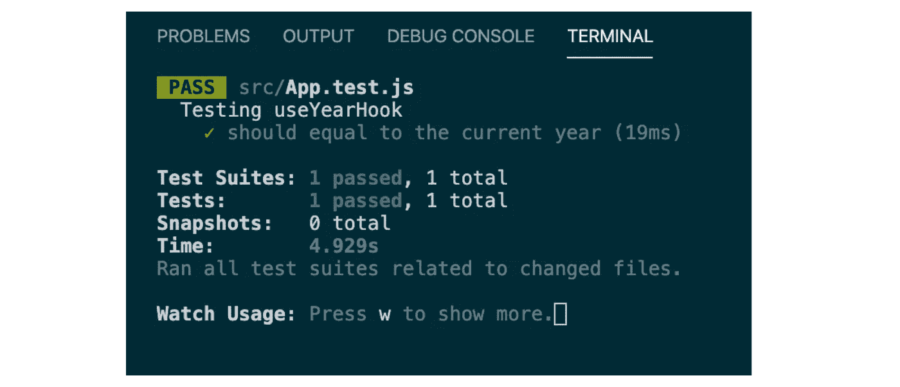
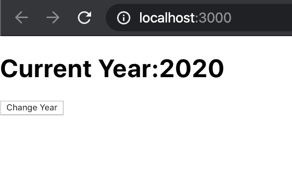
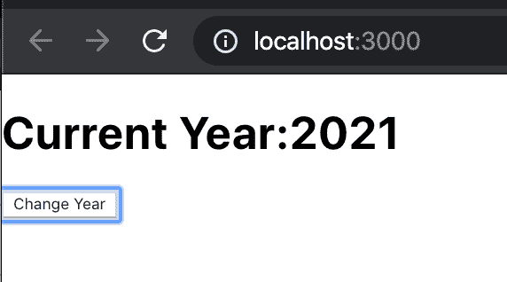
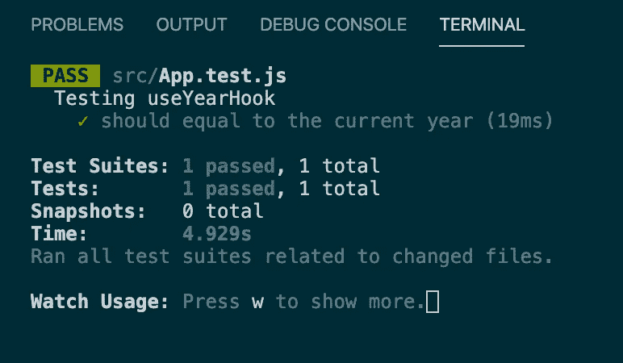
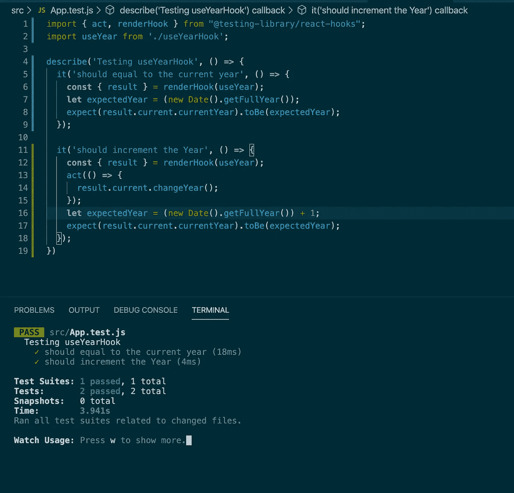

# 如何从头开始编写 React 钩子的测试用例

> 原文：<https://betterprogramming.pub/write-test-cases-especially-for-react-hooks-from-scratch-eab164d8e2e8>

## 经过测试的组件是健康的组件


[菠萝供应公司](https://unsplash.com/@pineapple?utm_source=unsplash&utm_medium=referral&utm_content=creditCopyText)在 [Unsplash](https://unsplash.com/s/photos/healthy?utm_source=unsplash&utm_medium=referral&utm_content=creditCopyText) 拍摄的照片

在本文中，我们为 React 挂钩编写了测试用例，以确保它们能够如预期的那样良好运行。在这里，我们将实现一个定制的钩子，稍后，我们将为这个钩子编写测试用例。



所以，让我们从头开始。

# **第一步。创建一个应用程序“测试-挂钩”**

为此，我们需要使用下面的命令创建一个演示应用程序，让我们运行下面的命令并创建一个演示应用程序:

```
npx create-react-app testing-hooks
```

成功完成上述命令后:

```
cd testing-hooksnpm start
```

# **第二步。在浏览器中打开 localhost:3000**

检查您当前的端口(这里，默认端口是 3000)并确认它正在工作:


本地主机快照:3000

# **第三步。创建自定义挂钩**

让我们创建一个定制挂钩，稍后我们将为其创建测试用例。在这个钩子中，我们将使用一个带有`currentYear`的状态。它保存当前的年份值(目前是 2020 年)，并有一个方法`changeYear()`来更改年份(更新状态)。

让我们在`src`文件夹中创建一个文件`useYearHook.js`，并将下面的代码写入`useYearHook.js`文件中:

我们先来了解一下上面的代码。

我们正在下面的行中导入`useState`:

```
import { useState } from 'react';
```

我们创建了一个名为`useYearHook`的钩子:

```
**function** useYearHook() {
    ...
}
```

使用`useState`钩子创建一个状态`currentYear`，用当前年份的值初始化，并获取一个函数`setYear()`来更新这个状态。`new Date().getFullYear()`将返回当前年份。

```
**const** [currentYear, setYear] = useState(new Date().getFullYear());
```

创建一个函数`changeYear()`来更新状态，它将增加当前年份:

```
**const** changeYear = () **=>** {
   setYear(currentYear + 1)
 }
```

返回`currentYear`和`changeYear`:

```
return { currentYear, changeYear };
```

导出挂钩`useYearHook`,以便我们可以将它导入我们的组件:

```
export default useYearHook;
```

# **步骤四。在我们的组件**中使用钩子“useYearHook”

现在，让我们在我们的`App.js` ( `App`组件)中使用上面的钩子。转到`src/App.js`删除所有代码，并写入以下代码:

我们先来了解一下代码。在文件`App.js`中导入钩子`useYearHook`:

```
import useYearHook from './useYearHook';
```

创建一个功能组件`App`:

```
function App() { }
```

调用钩子`useYearHook`得到`useYear`中的引用:

```
**const** useYear = useYearHook();
```

返回要在 web 浏览器中呈现的 HTML:

导出应用程序:

```
export default App;
```

# **第五步。运行应用程序**

现在打开浏览器，点击`localhost:3000`。您可以在浏览器中看到:



浏览器中 localhost:3000 的快照

你可以在应用程序中看到，我们已经成功地创建了我们的自定义钩子，并在我们的`App`组件中使用它。

点击*后更改年份*:



浏览器中 localhost:3000 的快照

在上面的快照中，您可以看到，在我们单击“更改年份”后，它会更改当前年份并增加年份，这意味着我们更新了状态。

我们已经成功地在我们的 web 应用程序中实现了定制钩子，现在是时候为这个钩子编写测试用例了。

# 第六步。编写测试用例来测试我们的钩子

现在我们要测试钩子(`useState`和自定义钩子)，所以让我们开始编写测试钩子的代码。

我们需要一个 React 库，我正在使用“[@ testing-library/React-hooks](https://github.com/testing-library/react-hooks-testing-library)”，让我们使用下面的命令在我们的应用程序中安装这个依赖项:

```
npm install --save-dev @testing-library/react-hooks
```

现在转到`src`文件夹中的文件`App.test.js`(它已经通过 create-react-app 进入我们的应用程序)并删除所有代码。在这个文件中，我们将编写两个测试用例:

1.  “应等于当前年份”。我们将测试状态，在这里，我们将测试由`useState`在`useYearHook.js` (自定义钩子)文件中创建的`currentYear`。
2.  “应增加年份”。我们将测试钩子的方法，在这里，我们将测试由文件`useYearHook.js`中的`useYearHook`钩子创建的`changeYear()`方法。我们将确保该方法将增加状态，并且增加的值将是正确的。

让我们开始为“应等于当年”写第一个测试用例来测试`useState`。我希望你已经删除了`App.test.js`中的所有代码，现在在`App.test.js`文件中写入下面的代码:

我们先来了解一下代码。

create-react-app 命令默认安装 Jest 测试工具，Jest 有一个名为`describe()`的函数。Describe 用于在块中创建相关的测试套件。

因为我们正在测试`useYearHook`，我们将把`Test useYearHook`作为它的第一个参数。第一个参数是一个字符串，第二个参数是一个包含所有测试套件的函数。它将包含使用`it()`功能的测试列表。

我们将使用`it()`函数定义一个测试用例，`it()`将第一个参数作为描述测试用例的字符串。第二个参数是一个函数，我们将在其中编写测试的逻辑。

下面，该行用于从`@testing-library/react-hooks`导入`act`和`renderHook`:

```
import { act, renderHook } from "@testing-library/react-hooks";
```

导入自定义挂钩进行测试:

```
import useYear from './useYearHook';
```

我们已经从库中取出了`renderHook()`方法，这个函数基本上以一个钩子作为参数，并返回该钩子的渲染结果作为结果:

```
const { result } = renderHook(useYear);
```

计算预期年份以测试状态:

```
let expectedYear=(new Date().getFullYear());
```

确保挂钩逻辑正确的断言行:

```
expect(result.current.currentYear).toBe(expectedYear);
```

让我们使用下面的命令运行测试用例:

```
npm run test
```

看看结果:



npm 运行测试的快照

你可以看到，我们的第一个测试案例已经通过。这意味着在我们的自定义钩子中，状态是好的，它给出了当前的年份。

让我们开始为“应递增年份”写第二个测试用例，来测试自定义钩子的方法`changeYear()` 。在同一文件`App.test.js`中添加以下测试用例:

我们先来了解一下代码。

除了`act()`方法之外，其余代码与上面的测试用例相似。我们从库中取出了`act()`方法，这个`act()`是用来做某种类似钩子的函数调用的行为:

```
act(() **=>** {
        result.current.changeYear();
 });
```

现在使用`npm run test`运行测试用例，并查看结果:



npm 运行测试的快照

在上面的结果中，你可以看到我们所有的测试用例都通过了，但是让我们来谈谈第二个测试用例。

它也通过了，这意味着我们的定制钩子可以在我们的组件中很好地工作。现在，我建议您去修改代码，并测试它以获得更好的理解。

# 结论

阅读完本文后，您一定对使用以下内容测试 React 挂钩有所了解:

*   我们如何实现挂钩(内置的和定制的)？
*   我们如何在 React 应用程序中使用这些钩子？
*   我们如何为钩子编写测试用例？
*   在测试用例中测试时，我们如何执行类似钩子函数调用的任何行为？
*   我们如何运行测试用例？

感谢阅读。