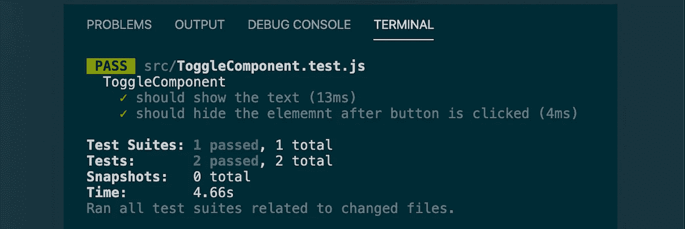
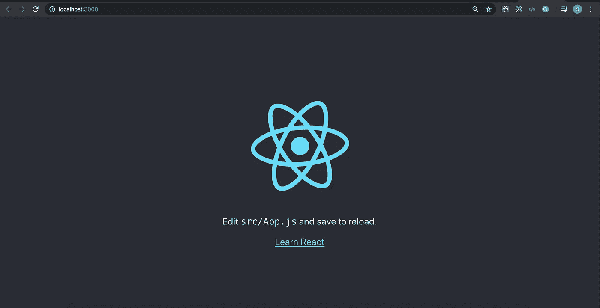
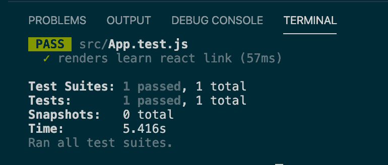
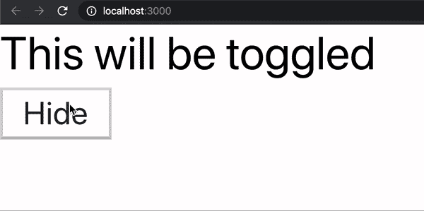
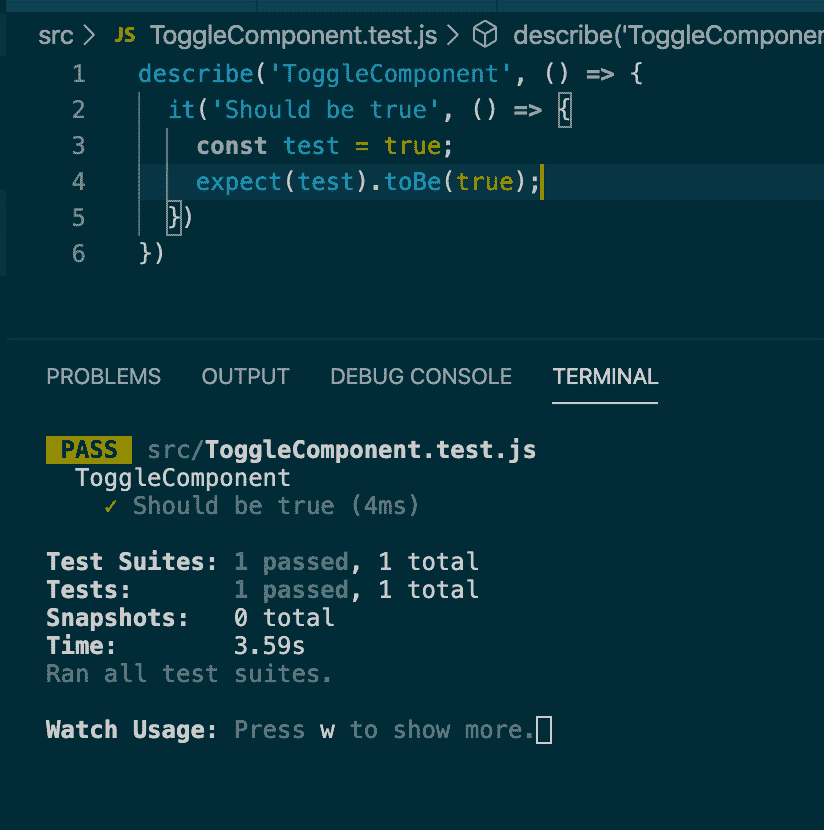
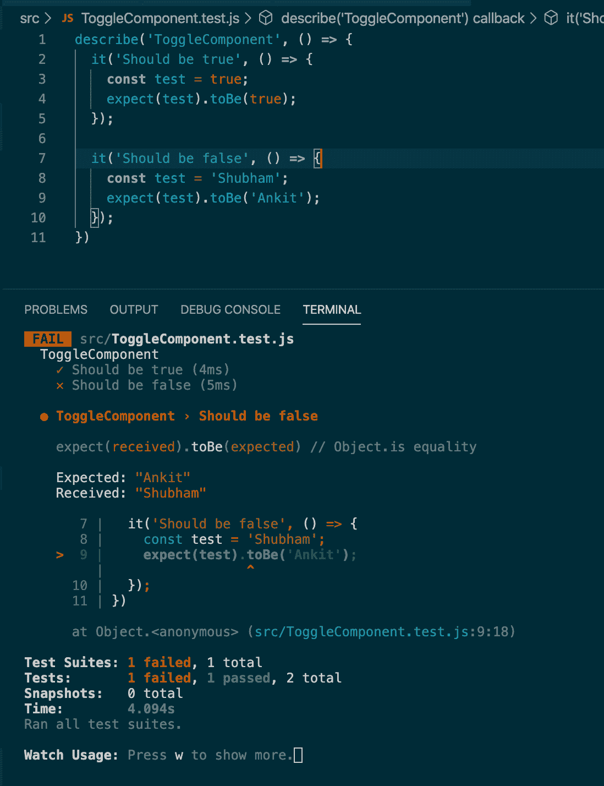
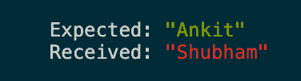
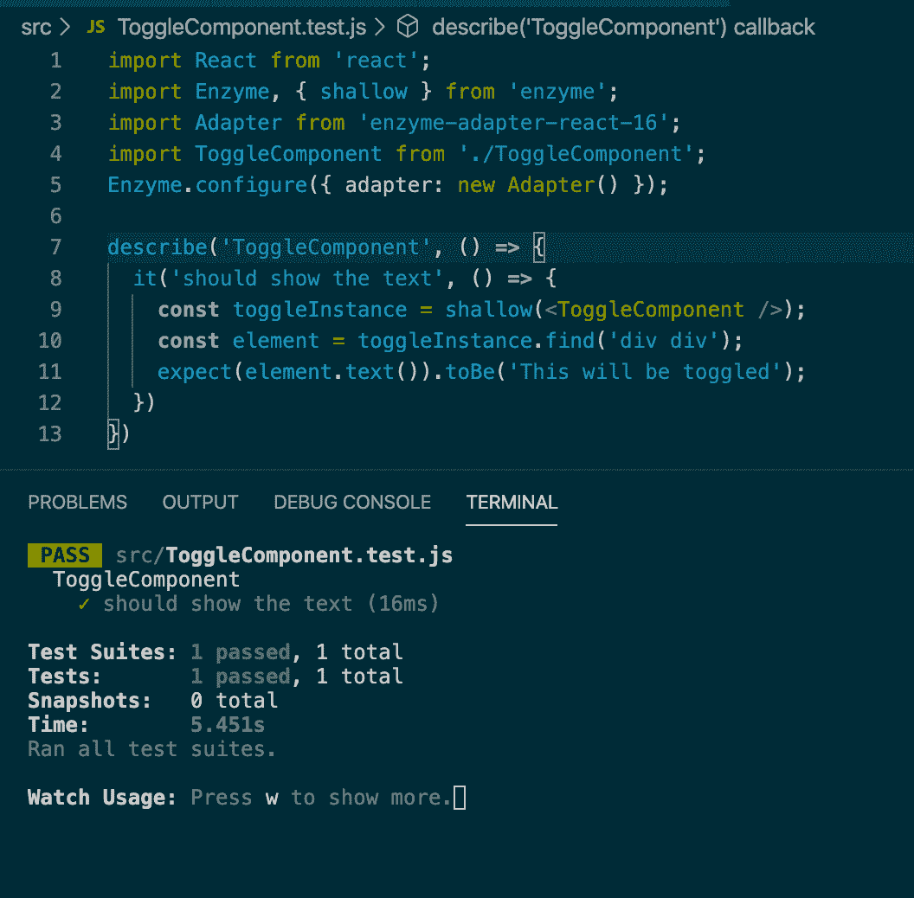
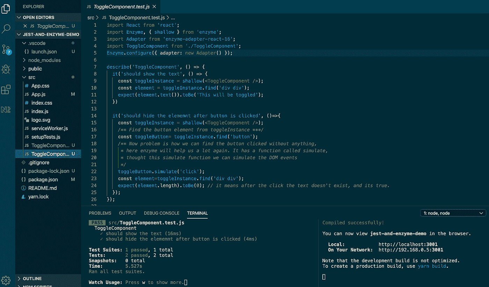
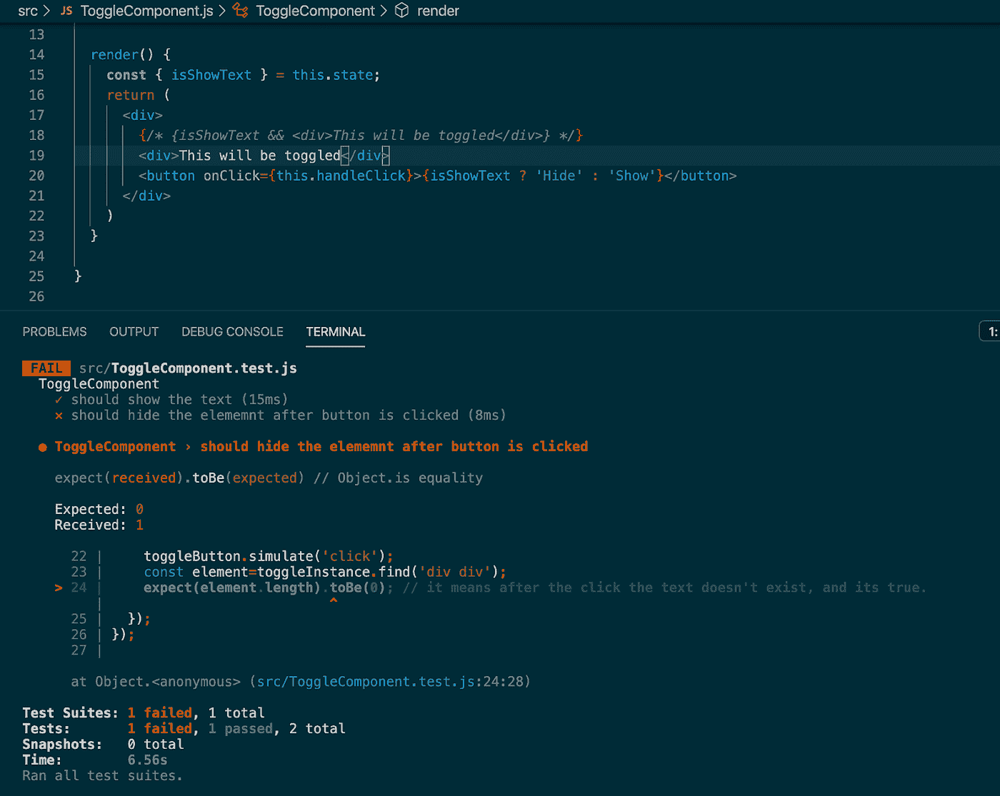

# 如何用 Jest 和 Enzyme 编写 React 组件的测试用例

> 原文：<https://betterprogramming.pub/write-test-cases-for-react-components-using-jest-and-enzyme-de3ac3d600c>

## 让我们构建健康的、经过测试的组件



“npm 运行测试”命令的快照

在本文中，我们将使用 Jest 和 Enzyme 从头开始编写 React 组件的测试用例。此外，我们将了解更多关于 Jest 和酶的知识。开始吧！

# 什么是玩笑？

Jest 是一个为 JavaScript 和 React 代码编写测试用例的单元测试框架。笑话是脸书创造的。

create-react-app 命令安装 Jest 及其依赖项集，因此我们不必担心这一点。

# 酶是什么？

[Enzyme](https://github.com/enzymejs/enzyme) 是一个测试 React 的 JavaScript 实用程序。在 Jest 的帮助下，Enzyme 变得更加强大，并完全控制 React 应用程序，以测试 React 组件的每个方面。酶专门用于测试反应成分。

现在，我们将创建一个带有组件的应用程序。稍后我们将为这个组件编写测试用例。

让我们从头开始。

# 第一步。创建一个应用程序笑话和酶演示

为此，我们需要使用下面的命令创建一个演示应用程序。让我们运行这个命令并创建一个演示应用程序:

```
npx create-react-app jest-and-enzyme-demo
```

成功完成上述命令后:

```
cd jest-and-enzyme-demonpm start
```

# 第二步。在浏览器中打开 localhost:3000

检查您当前的端口(这里的默认端口是 3000)并确认它正在工作，就像这样:



网址快照 [http://localhost:3000](http://localhost:3000/)

如果我们看一下`src`文件夹中新创建的项目(通过 create-react-app ),您会看到已经有一个文件`App.test.js`,它用于使用 Jest 测试 app 组件。

如果我们使用命令`npm run test`运行这个测试用例，它将使用 Jest 运行测试用例。

这个命令运行 Jest 并选择`App.test.js`文件，因为它有特定的扩展名`.test.js`。它将使用 Jest 运行它，您将获得以下结果:



“npm 运行测试”的快照

# **第三步。删除 App.test.js 文件**

现在删除`App.test.js`文件。我们将在不同的文件中使用 Jest 和 Enzyme 编写我们自己的测试用例。我们删除这个文件是为了在命令/终端上获得更好的结果。如果我们不删除它，那么我们就不会得到测试用例的详细结果。相反，我们将在终端(命令提示符)上得到合并的结果。

# 步骤 4:创建一个 React 组件

我们将创建一个组件，它有一个隐藏和显示文本的按钮，如下面的 GIF 所示:



要测试的组件

在`src`文件夹(`src/ToggleComponent.js`)中创建一个文件`ToggleComponent.js`，并编写以下代码:

上面的代码非常简单，是一个基本的 React 组件，我觉得不需要描述了。

让我们继续前进。

# 第五步。使用 App.js 中的“ToggleComponent”组件:

现在让我们在`App.js`中使用这个组件。删除`App.js`中的所有代码，并编写以下代码:

在上面的`App.js`文件中，我们只是简单地使用了`ToggleComponent`。
现在使用命令`npm start`运行应用程序，并在浏览器中查看(URL `localhost:3000`)。你会看到有一个带有“隐藏”或“显示”文字的按钮，点击按钮后，文字会显示或隐藏，正如我们在上面的 GIF 中所述。

# 第六步。如何使用 Jest 和 Enzyme 编写测试用例

现在我们已经创建了一个组件，是时候编写测试用例并验证组件了。

让我们在`src`文件夹(`src/ToggleComponent.test.js`)中创建一个文件`ToggleComponent.test.js`，并编写下面的代码。(首先我将向您展示一个简单的测试用例，然后运行它):

```
describe('ToggleComponent', () **=>** { it('Should be true', () **=>** { **const** test = true; expect(test).toBe(true);
   });});
```

我们来理解一下上面的代码。

Jest 有一个名为`describe()`的函数，用于在块中创建测试套件。我们正在测试`ToggleComponent`，所以我们将传递`ToggleComponent`作为它的第一个参数。第一个参数是一个字符串，第二个参数是一个包含所有其余套件的函数。它将包含一个测试列表。

我们将使用`it()`函数定义一个测试用例。`it()`将第一个参数作为描述测试用例的字符串。第二个参数是一个函数，我们将在其中编写测试的逻辑。

这里我有一个变量`test`，它的值是`true`，现在我们期望测试是`true`，这很好，测试用例将通过。让我们运行测试(可能是自动运行)，看看这个测试用例的结果:



“npm 运行测试”命令的快照

我们可以看到，在上面的结果中，是通过了。让我们创建一个失败的测试用例。让我们在同一个文件中添加下面的测试用例。(写第二个`it()`):

```
it('Should be false', () **=>** { **const** test = 'Shubham'; expect(test).toBe('Ankit');});
```

让我们运行它，看看结果:



“npm 运行测试”命令的快照

您可以在上面的快照中看到，一个通过了，第二个失败了。断言(`expect(test).toBe(‘Ankit’)`)失败是因为:



以上两个案例只是向您展示测试用例是如何工作的。

现在我们开始吧。

# 第七步。使用 Jest 和 Enzyme 为组件编写测试用例

现在我们将编写我们的主测试用例来测试`ToggleComponent.js`。这里我们将测试按钮点击的行为。问题是，我们如何实现这一点？不用担心；酵素会帮助我们。

我们需要安装酶和酶-适配器-反应-16(根据反应版本；我在用 React 16。x)。根据您的 React 版本，在 GitHub 上检查合适的酶。

为此，请运行以下命令:

```
npm install --save-dev enzyme enzyme-adapter-react-16
```

让我们为`ToggleComponent`编写代码来测试行为。这里我们将编写两个测试用例。

# 测试案例 1。

我们的`ToogleComponent`在嵌套的`div`中有文本“这将被切换”。在第一个测试案例中，我们将测试组件是否有文本“This will toggled”

让我们为此编写测试用例。删除`ToggleComponent.test.js`中的所有代码，并编写以下代码:

我们先来了解一下代码。

下面，该行用于将 React 导入到该文件中:

```
import React from ‘react’;
```

在这一行，我们有进口酶及其`shallow`功能:

```
import Enzyme, { shallow } from ‘enzyme’;
```

从 enzyme-adapter-react-16 导入适配器:

```
import Adapter from ‘enzyme-adapter-react-16’;
```

我们想要测试`ToogleComponent`，所以我们将导入这个组件:

```
import ToggleComponent from ‘./ToggleComponent’;
```

我们需要配置酶，所以我们需要这样做:

```
Enzyme.configure({ adapter: new Adapter() });
```

在下面的代码中，我们使用`define()`和`it()`函数来编写我们的测试用例逻辑:

```
describe(‘ToggleComponent’, () **=>** { it(‘should show the text’, () **=>** {
       …… });});
```

下一行用于获取要测试的组件的实例:

```
const toggleInstance = shallow(<ToggleComponent />);
```

## “shallow()”做什么

为了测试 React 组件，我们需要该组件的实例，以便我们可以轻松地检查和编写断言代码。对于这一点，酵素的`shallow()`功能帮助很大。

它将一个节点作为第一个参数。它允许我们在对象中呈现 React 组件，然后在内存中呈现，而不是在 DOM 中。这项技术加快了这个过程。不需要 DOM。它将对象包装在包装器中，包装器允许我们搜索使用 CSS 呈现的元素。它返回呈现输出周围的包装实例。

在下一行中，我们将在一个`div`中搜索一个`div`:

```
**const** element = toggleInstance.find(‘div div’);
```

在下一行中，我们编写了一个断言，期望文本为“This will toggled”，正如我们所希望的:

```
expect(element.text()).toBe(‘This will be toggled’);
```

让我们使用命令`npm run test`运行测试用例(也许它会自动发生):



命令"`npm run test`"的快照

你可以看到我们的第一个测试用例通过了。(确保没有空格，并在代码中写入正确的文本。您还可以尝试修改文本并运行测试用例结果。)

# **测试用例 2。**

我们想要测试导致文本被隐藏的按钮的点击。因此，让我们编写代码来测试这个场景:

让我们使用命令`npm run test`运行测试用例:



“npm 运行测试”命令的快照

您可以在上面的结果中看到，我们的两个测试用例都通过了。这意味着我们的组件是完美的。为了更加清晰，您可以从
`{isShowText && <div>This will be toggled</div>}`中删除条件，将其简化为`<div>This will be toggled</div>`。运行测试并查看结果:



“npm 运行测试”命令的快照

它失败了。这意味着我们的测试用例工作正常。

# **结论**

在这篇文章中，我们学习了以下内容:

*   什么是玩笑
*   什么是酶
*   如何在 React 中创建组件
*   如何编写测试用例
*   如何使用 Jest 和 Enzyme 编写 React 组件
*   如何使用 enzyme-adapter-react-16

感谢您花时间阅读这篇文章。