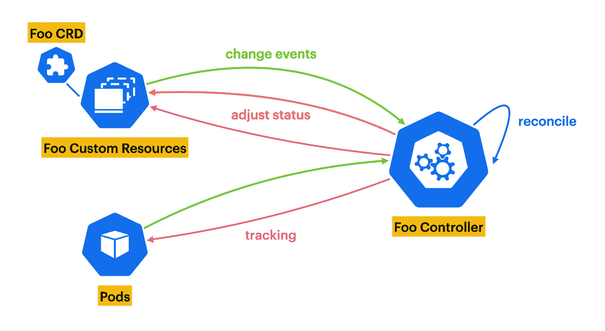

# 如何为您的 Kubernetes 操作员编写测试

> 原文：<https://betterprogramming.pub/write-tests-for-your-kubernetes-operator-d3d6a9530840>

## Kubernetes 运营商 101


图一。[摄影](https://unsplash.com/photos/aYHzEnSEH-w)由盖瑞特·帕克在 Unsplash 上拍摄

在我之前的文章中，我展示了如何在大约十分钟内[构建一个 Kubernetes 操作符。我还描述了操作符、定制资源定义和定制资源、控制器和管理器的功能。如果您想了解更多关于这些概念的知识，我强烈推荐您阅读这篇文章。](https://medium.com/better-programming/build-a-kubernetes-operator-in-10-minutes-11eec1492d30)

但是现在是时候写一些测试来在生产中使用我们的操作符了！这本身就是一个问题，并没有看上去那么复杂。大多数人都不喜欢写测试，但却是必须的。它们有助于提高代码质量，检测错误，并节省时间和金钱。所以，我们来做一些测试吧！

```
Table of ContentsThe Different Types of Tests[Practical work](#b600)
1\. Set Up Your Environment
2\. [Some Context on the Operator](#497e)
3\. [Unit Tests](#9b33)
4\. [Integration Tests](#6cc4)[To go further](http://c3bb)
```

软件开发中有三种主要的测试类型:单元测试、集成测试和端到端测试。它甚至比理论上更复杂，但是它给出了我们将在本文中看到的一个概念。

*   单元测试用于测试小段代码，例如方法或函数。
*   集成测试用于测试应用程序不同部分的集成。例如，一个操作员在 Kubernetes 环境中使用 API 服务器和其他资源的功能。
*   端到端测试旨在模拟用户的逐步体验。它们应该涵盖应用程序的主要功能。

在接下来的实际工作中，我们将看到如何在 Go 中编写单元测试，以及针对 Kubernetes 控制器的集成测试。很有趣，你会看到的！

# 实际工作

## 1.设置您的环境

我选择使用 [Kubebuilder](https://github.com/kubernetes-sigs/kubebuilder) 框架来构建 Kubernetes 操作符。它非常易于使用，文档也很容易阅读，是一款久经考验的产品。它是构建操作符的两个最流行的 Go 框架之一，另外两个是 [OperatorSDK](https://github.com/operator-framework/operator-sdk) 。

我假设你已经有了设计一个操作符的必要工具(go，docker，`kubectl`，`kubebuilder`和一个小型的本地 Kubernetes 集群)。但是如果不是这样，我强烈建议您按照[下面的安装步骤](https://medium.com/better-programming/build-a-kubernetes-operator-in-10-minutes-11eec1492d30#9a3d)来做，这样您就可以在本教程中跟随我了。

为了只关注测试部分，我准备了一个简单的 Kubernetes 操作符，它是用 Kubebuilder 设计的。这项实际工作将是编写测试，以验证运营商的代码符合我们的期望，并确保它不包含任何错误。我将要求你克隆这个项目并转移到`operator-v2`分支，这样我们都从同一个基础开始。

```
$ git clone [git@github.com](mailto:git@github.com):leovct/kubernetes-operator-tutorial.git
$ cd kubernetes-operator-tutorial
$ git checkout operator-v2
$ git pull origin operator-v2
```

如果您尝试运行测试，您将看到覆盖率等于 0%。的确，我们还没有写任何测试！但这将会改变！

```
$ make test
mkdir -p /Users/leovct/Documents/tutorial/bin
GOBIN=/Users/leovct/Documents/tutorial/bin go install sigs.k8s.io/controller-tools/cmd/controller-gen@v0.8.0
/Users/leovct/Documents/tutorial/bin/controller-gen rbac:roleName=manager-role crd webhook paths="./..." output:crd:artifacts:config=config/crd/bases
/Users/leovct/Documents/tutorial/bin/controller-gen object:headerFile="hack/boilerplate.go.txt" paths="./..."
go fmt ./...
go vet ./...
GOBIN=/Users/leovct/Documents/tutorial/bin go install sigs.k8s.io/controller-runtime/tools/setup-envtest@latest
KUBEBUILDER_ASSETS="/Users/leovct/Library/Application Support/io.kubebuilder.envtest/k8s/1.23.5-darwin-amd64" go test ./... -coverprofile cover.out
?       my.domain/tutorial      [no test files]
?       my.domain/tutorial/api/v1       [no test files]
?       my.domain/tutorial/color        [no test files]
ok      my.domain/tutorial/controllers  6.220s  coverage: 0.0% of statements
```

## 2.运算符的一些上下文

您克隆的“Foo”操作符类似于我在我的“[在 10 分钟内构建一个 Kubernetes 操作符](/build-a-kubernetes-operator-in-10-minutes-11eec1492d30)”文章中构建的操作符。除了展示如何使用操作符在 Kubernetes 中执行简单的任务之外，它没有其他真正的用途。

接线员是如何工作的？

因为一个图表比三段文字更好地解释了想法，所以在这里。



图二。操作员功能概述

首先，有 Foo 自定义资源定义或 CRD(见`api/v1/foo_types.go`)。它的规范中有一个`name`字段，引用 Foo 正在寻找的朋友的名字。如果 Foo 找到一个朋友(一个和他的朋友同名的`Pod`，它的`happy`状态将被设置为真。自上一篇教程以来的一个小的增加，Foo 的状态也包含一个`color`字段，根据它的`name`和它演化的`namespace`来确定。

其次是 Foo 控制器(见`controllers/foo_controller.go`)。它获取触发协调请求的 Foo 资源，以获得 Foo 朋友的名字。然后，它列出了所有与 Foo 的朋友同名的 pod。如果找到了至少一个朋友，它将 Foo 的`happy`状态更新为`true`，否则我们将其设置为`false`。它还更新 Foo 的`color`状态。

请注意，控制器也会对 Pod 事件做出反应(参见`mapPodsReqToFooReq`)。事实上，如果创建了一个新的 pod，我们希望 Foo 资源能够相应地更新它的状态。每次发生`Pod`事件(创建、更新或删除)时，都会触发该方法。只有当 Pod 的名称是集群中部署的 Foo 自定义资源之一的“朋友”时，它才会触发 Foo 控制器的协调循环。

现在我们知道了操作符是如何工作的，我们可以继续测试它了。

## 3.单元测试

在这个阶段，我们将测试像方法和函数这样的小段代码。当然，我们不会在这里测试控制器`Reconcile`方法，因为它涉及到用本地 Kubernetes API 服务器、CRD、控制器、管理器等设置一个测试 Kubernetes 环境。我们将在 4 中看到这一点。集成测试部分。

那我们要测试什么？如果你花时间阅读 Foo 控制器的代码，你会注意到我使用了`color`包中的`ConvertStrToColor`函数来更新 Foo 的`color`状态。让我们来编写这个简单方法的单元测试吧！

我们的目标是确保函数返回给定输入参数的预期值。下面是我想编写的测试这个函数的三个测试:

1.  将空字符串转换成色轮的颜色。
2.  将一个短字符串转换成色轮的颜色。
3.  将一个很长的字符串(带有数字和破折号)转换成色轮的颜色。

要在 Go 中编写单元测试，您需要创建一个描述名称、输入参数和预期结果的测试列表。然后运行一个循环，将函数的输出与预期结果进行比较。下面是我的`test`函数，用来检查`ConvertStrToColor`是否正常工作:

现在，如果您尝试第二次运行测试，您将会看到`color`包的代码覆盖率等于 100%！太棒了，我们成功了！该功能按预期工作。

```
$ make test
/Users/leovct/Documents/tutorial/bin/controller-gen rbac:roleName=manager-role crd webhook paths="./..." output:crd:artifacts:config=config/crd/bases
/Users/leovct/Documents/tutorial/bin/controller-gen object:headerFile="hack/boilerplate.go.txt" paths="./..."
go fmt ./...
go vet ./...
KUBEBUILDER_ASSETS="/Users/leovct/Library/Application Support/io.kubebuilder.envtest/k8s/1.23.5-darwin-amd64" go test ./... -coverprofile cover.out
?       my.domain/tutorial      [no test files]
?       my.domain/tutorial/api/v1       [no test files]
ok      my.domain/tutorial/color        0.306s  coverage: 100.0% of statements
ok      my.domain/tutorial/controllers  6.626s  coverage: 0.0% of statements
```

现在，让我们言归正传。我们要测试一下运营商的对账循环是怎样的！相信我，这是文章最有趣的部分！

## 4.集成测试

Kubebuilder 提供了一个测试样板(参见`controllers/suite_test.go`)，它用本地 Kubernetes API 服务器建立了一个测试环境。我们唯一需要做的是首先实例化并运行控制器，然后用[Ginkgo](https://onsi.github.io/ginkgo/)(kube builder 使用的框架)编写测试，以验证我们的操作符在 Kubernetes 环境中演化时表现良好。

当然，这个测试环境非常简单，通常不代表生产集群的环境。这就是为什么在现有集群中运行操作员测试也有可能更接近真实的生产环境。你可以在这里了解更多关于那个[的信息。](https://book.kubebuilder.io/reference/envtest.html)

首先，我们需要实例化并启动`Foo`控制器。为此，我们需要创建另一个客户端。为什么我们需要两个客户？因为当运行测试时，您想要断言 API 服务器的实时状态。如果您在测试中使用管理器中的客户机，那么您最终会断言缓存的内容。第一，这个比较慢。其次，这可能会引入缺陷。这就是为什么我们有两个客户端:k8sclient，我们将在测试中使用的客户端，和`k8sManager.getClient()the manager's client`。

下面是测试环境设置的修改后的源代码。

既然我们的测试环境已经设置好了，我们就可以编写集成测试了！让我们在`controllers`文件夹下创建一个名为`foo_controller_test.go`的新测试文件。在这个文件中，我们将使用银杏框架来定义我们的测试。这里有一个简单的测试例子，它创建了两个`Foo`定制资源，并确保资源已经被创建。

太好了！现在让我们编写一个测试，创建一个与 Foo 自定义资源的朋友同名的 pod。控制器应该更新自定义资源的状态，并将其设置为 true。另一个自定义资源应该仍然将其状态设置为 false。

让我们编写另一个测试，将第二个 Foo 自定义资源的 friend 的名称更新为之前创建的 pod 的名称。控制器应该更新自定义资源的状态，并将其设置为 true。同样，另一个自定义资源应该仍然将其状态设置为 false。

我们今天的最后一个测试是删除我们创建的 pod，并检查控制器是否将所有定制资源的状态更新为 false。

这些是相当简单的测试，但是它们向你展示了可能性。你可以用银杏提供的各种工具做非常复杂的事情。如果您在本教程中有所关注，您应该已经看到了各种各样的说明，如`Expect`、`Eventually`或`Consistently`，这些都是测试 Kubernetes 中运行的操作者和资源的行为的非常有用的方法。

我们已经编写了许多覆盖控制器范围的优秀测试。现在是时候运行它们了，看看操作员是否全部通过。

```
$ make test
/Users/leovct/Documents/tutorial/bin/controller-gen rbac:roleName=manager-role crd webhook paths="./..." output:crd:artifacts:config=config/crd/bases
/Users/leovct/Documents/tutorial/bin/controller-gen object:headerFile="hack/boilerplate.go.txt" paths="./..."
go fmt ./...
go vet ./...
KUBEBUILDER_ASSETS="/Users/leovct/Library/Application Support/io.kubebuilder.envtest/k8s/1.23.5-darwin-amd64" go test ./... -coverprofile cover.out
?    my.domain/tutorial [no test files]
?    my.domain/tutorial/api/v1 [no test files]
ok   my.domain/tutorial/color 0.077s coverage: 100.0% of statements
ok   my.domain/tutorial/controllers 8.434s coverage: 82.4% of statements
```

很好，我们没有错误！此外，我们的覆盖率从 0%提高到了 82%以上！最后的 18%对应于我们无法测试的代码部分。例如，当控制器找不到触发协调循环的自定义资源时，或者当它无法列出集群中的 pod 时。这无关紧要，因为我们知道我们已经测试了所有操作符的作用域。

如果你需要浏览代码，这里有 GitHub 库的链接。`operator-v2`分支包含没有测试的操作符的源代码，而 tests 分支包含所有测试的源代码。

[](https://github.com/leovct/kubernetes-operator-tutorial) [## github-leovct/kubernetes-operator-教程:☸️在 10 分钟内构建一个 kubernetes 操作器

### operator-v1 分支参考我的中篇文章《10 分钟构建一个 Kubernetes 操作器》。你需要一个…

github.com](https://github.com/leovct/kubernetes-operator-tutorial) 

# 走得更远

我们已经看到了如何使用银杏框架为 Kubernetes 控制器编写单元测试和集成测试。这是开发 Kubernetes 操作符的关键步骤，因为它允许验证协调逻辑的正确运行。如果你想了解更多关于 Kubernetes 运营商的信息，我邀请你浏览[我写的关于这个主题的文章列表](https://medium.com/@leovct/list/kubernetes-operators-101-dcfcc4cb52f6)。

此外，这里有一个资源列表，您可以使用它来更深入地研究这个主题。

玩得开心！

[](https://book.kubebuilder.io/cronjob-tutorial/writing-tests.html) [## 编写测试 Kubebuilder 图书

### 我们声援黑人社区。种族主义是不可接受的。这与……的核心价值观相冲突

book.kubebuilder.io](https://book.kubebuilder.io/cronjob-tutorial/writing-tests.html) [](https://book.kubebuilder.io/reference/envtest.html) [## 配置 env test-kube builder 书籍

### controller-runtime/pkg/env test Go 库通过设置和…

book.kubebuilder.io](https://book.kubebuilder.io/reference/envtest.html) 

*   [http://onsi.github.io/ginkgo](http://onsi.github.io/ginkgo)