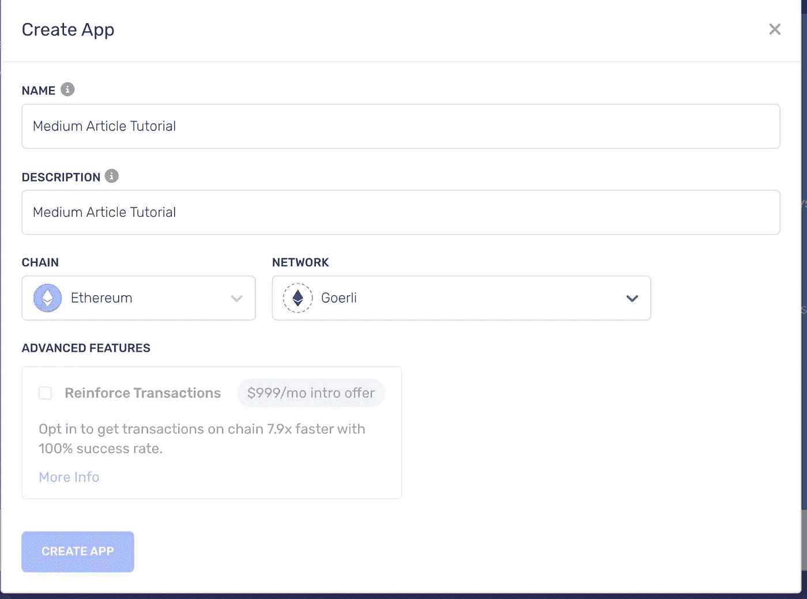

# 在 Solidity 中编写您的第一份智能合同

> 原文：<https://betterprogramming.pub/write-your-first-smart-contract-in-solidity-60563dfb21aa>

## 了解如何在 Solidity 中编写您的第一个智能合同，并逐步将其部署到以太坊 Goerli 测试网。


https://unsplash.com/photos/mJcQSltkdeM

*于****2022 年 11 月 12 日*** *，本文进行了更新，以反映以太坊合并带来的变化。所以这个教程是最新的！*

# 你将建造什么

在本教程中，您将创建一个能够与之交互的智能合约！

您将在 [**Solidity**](https://soliditylang.org/) 中编写智能合约，然后使用 [**Hardhat**](https://hardhat.org/) 编译并部署到使用 [**Alchemy**](https://www.alchemy.com/) 作为节点提供者的[**Goerli**](https://goerli.net/)testnet！

## 本教程将经历的步骤:

1.  使用 NPM 设置项目
2.  安装必要的依赖项
3.  制作项目的文件夹结构
4.  概述您将要撰写的智能合同
5.  撰写智能合同
6.  编写将编译和部署智能合同的 javascript 函数
7.  创建炼金术帐户和 Metamask 钱包
8.  用 alchemy 配置 hardhat.config.js
9.  部署智能合同
10.  结论/总结

## 1.设置项目

首先创建一个目录，并在命令行中使用 npm 初始化项目:

```
mkdir my-first-smart-contract
cd my-first-smart-contract
npm init -y
```

## 2.安装必要的依赖项

现在，当您使用 node 设置好项目后，让我们安装编译和部署智能合约所需的依赖项！

将使用的依赖项有: **hardhat，@nomiclabs/hardhat-ethers。**

**那么让我们来安装这些:**

```
npm i --save-dev hardhat @nomiclabs/hardhat-ethers
```

## 3.制作项目的文件夹结构

开发智能合约最常见的方式是拥有一个用来编写智能合约的合约文件夹，一个用来编写部署智能合约的 javascript 函数的脚本文件夹等等。

此外，我们有一个名为`hardhat.config.js`的文件，智能合约的部署设置将放在这个文件中！

**在命令行上运行:**

```
mkdir contracts && mkdir scripts && touch hardhat.config.js
```

这将创建一个`contracts`文件夹、一个`scripts`文件夹和一个`hardhat.config.js`文件

## **4。**概述您将要撰写的智能合同

现在到了有趣的部分耶！🎉

您将要编写的智能契约将能够接收问候并存储它已经接收了多少问候，以及通过调用契约中的函数返回它已经接收了多少问候。

**把事情再简化一点:**任何人都可以打招呼签约，打招呼的次数会增加一个。而且任何人都可以调用一个函数，返回契约收到的问候次数。

**我们来看看智能合同应该包括哪些内容:**

1.  有一个函数，您可以调用它来问候合同，该函数会将问候次数增加 1。
2.  有一个变量来存储问候的数量。
3.  有一个函数，您可以调用它来获取合同收到的问候次数。

## 5.撰写智能合同

现在让我们将这三项要求付诸行动吧！

首先，在`contracts`文件夹中，创建名为`greet.sol`的文件

`greet.sol`中的智能合约将会用 Solidity 编程语言进行编码，所以让我们逐一添加这三个特性。

1.  **让我们从添加三个特性开始，从存储合同将收到的问候数量的变量开始:**

```
// SPDX-License-Identifier: UNLICENSED

pragma solidity ^0.8.9;
import "hardhat/console.sol";

contract greet {
    uint256 amountOfGreetings;
}
```

正如你所看到的，有一个类型为`uint256`的`amountOfGreetings`变量，这意味着它是一个`256`位`integer`，所以你现在不需要知道。

这个变量将存储智能合约收到的问候次数！

**2。让我们添加问候合同的功能，该功能将使问候次数增加一:**

```
// SPDX-License-Identifier: UNLICENSED

pragma solidity ^0.8.9;
import "hardhat/console.sol";

contract greet {
   uint256 amountOfGreetings;
    function greetings() public {
        amountOfGreetings +=1;
    }
} 
```

如您所见，`greetings`函数在被调用时将`amountOfGreetings`加 1。

当这个函数被调用时，变量`amountOfGreetings`加 1！

**3。让我们添加一个函数，它可以让您了解合同获得了多少问候:**

```
// SPDX-License-Identifier: UNLICENSED

pragma solidity ^0.8.9;
import "hardhat/console.sol";

contract greet {
    uint256 amountOfGreetings;

    function greetings() public {
        amountOfGreetings +=1;
    }

    function getAmountOfGreetings() public view returns (uint256) {
        return amountOfGreetings;
    }
}
```

如您所见，`getAmountOfGreetings`函数返回了`amountOfGreetings.`

调用该函数时，智能合约返回变量`amountOfGreetings`！

**以下是完整的智能合约代码:**

```
// SPDX-License-Identifier: UNLICENSED

pragma solidity ^0.8.9;
import "hardhat/console.sol";

contract greet {
    uint256 amountOfGreetings;

    function greetings() public {
        amountOfGreetings +=1;
    }

    function getAmountOfGreetings() public view returns (uint256) {
        return amountOfGreetings;
    }
}
```

## 6.编写将编译和部署智能合同的 javascript 函数

祝贺您编写了第一份智能合同！

但是，目前没有与智能合约交互的方法。

要与智能合约交互，智能合约的代码必须出现在区块链上。为了做到这一点，我们必须先将其编译成字节码，然后再将其部署到区块链，在本例中是区块链的 Goerli etheruem testnet。

因此，在`scripts`文件夹中，创建一个`deploy.js`文件，在这里您将编写一些 javascript 代码来编译您的智能合约并将其部署到区块链！

在`deploy.js`中添加这段代码:

```
async function main() {
  const greetContractFactory = await ethers.getContractFactory("greet")
  const greetContract = await greetContractFactory.deploy()
  await greetContract.deployed()
  console.log("Contract deployed to:", greetContract.address)
}

main().catch((e) => console.log(e))
```

那么，这里的**到底是什么**呢？：****

**首先，我们调用一个名为`main`的`async`函数。**

**在函数`main`中，我们使用`ethers.getContractFactory`获取智能合约，并将其存储在`greetContractFactory`变量中**

**然后使用`greetContractFactory.deploy()`在一行中编译和部署智能契约**

**最后，在使用`greetContract.deploy()`等待它被部署之后，我们也记录它被部署的地址。**

**只剩下一件事要做了！您还需要一个地方来部署您的智能合同！**

## **7.创建炼金术帐户和元面具钱包**

**由于您可能不想使用实际的以太网来部署和测试您的智能契约，我们将使用一个名为 **Goerli** 的 **testet** ，通过利用 **Alchemy** 作为节点提供者！**

**一个测试网基本上是:**

> **测试网是测试区块链网络，其行为和执行类似于它们所关联的主网络。由于他们在独立于主网的分类帐上操作，测试网上的硬币与主网上的交易和价值没有联系。这允许开发人员在一个正常运行的区块链上自由地部署、测试和执行他们的项目。— [炼金术](https://www.alchemy.com/overviews/what-are-testnets)**

**但是我们如何利用测试网呢？这就是节点提供者的用武之地；我们使用第三方服务，如 Alchemy，来轻松连接到 testnet！**

**为此，你必须先注册一个 [**炼金术**](https://www.alchemy.com/) 账号。**

**创建帐户后，在 Alchemy dashboard 中使用以下详细信息创建一个新应用程序:**

****

**部署智能合约后，您还需要一个帐户来签署交易，这就是 Meta Mask 的用武之地。如果您还没有帐户，请在 Meta Mask 创建一个帐户。**

**然后，发送一些歌利 ETH 到你的 Meta Mask 钱包中的歌利钱包地址，使用:【https://goerlifaucet.com/】T4**

## **8.用 Alchemy 配置 hardhat.config.js**

**在部署合同之前，您需要配置智能合同的部署位置和部署人员。我们在`hardhat.config.js.`中配置这个**

****因此，要对此进行配置，请执行以下操作:****

**通过在命令行中运行`npm i dotenv --save`来安装 **dotenv** 。 **dotenv** 将用于能够安全地存储您的私钥。**

**从您创建新应用程序的 Alchemy dashboard 获取您的 Alchemy API 密钥。**

**从元掩码中获取您的私钥，并参考这些 说明来找出将它导出到哪里。**

**然后，在项目的根目录下创建一个`.env`文件，并包含您的私钥，如下所示:**

```
ALCHEMY_API_URL = "https://eth-goerli.alchemyapi.io/v2/your-api-key"
PRIVATE_KEY = "your-metamask-private-key"
```

**添加密钥后，修改`hardhat.config.js`文件，如下所示:**

```
require('dotenv').config();
require("@nomiclabs/hardhat-ethers")

const { ALCHEMY_API_URL, PRIVATE_KEY } = process.env;

module.exports = {
  solidity: "0.8.9",
  networks: {
    hardhat: {},
    goerli: {
      url: `https://eth-goerli.g.alchemy.com/v2/${ALCHEMY_API_URL}`,
      accounts: [PRIVATE_KEY],
    },
  },
}
```

## **9.部署您的智能合同**

**剩下要做的就是在命令行中键入以下内容:**

```
npx hardhat run scripts/deploy.js --network goerli
```

**然后砰！智能合同刚刚部署到区块链！**

**现在您已经有了命令行输出的契约地址，您可以使用该地址来搜索您在[https://goer Li . ethers can . io](https://goerli.etherscan.io)🥳部署的智能契约的事务**

## **10.结论/总结**

**在本文中，我们在 Solidity 中创建了一个智能契约，使用 Hardhat 编译它，然后使用 Alchemy 将其部署到以太坊测试网！**

**如果您遵循所有说明，您的智能合同应该在 testnet 上处于活动状态！**

**以下是最终回购:[https://github.com/antondevv/your-first-smart-contract](https://github.com/antondevv/your-first-smart-contract)**

**PS:我将写这篇文章的后续文章，向您展示如何使用 ethers 和 alchemy 与智能合约函数进行交互，允许您问候您的智能合约，并了解它收到了多少问候！**