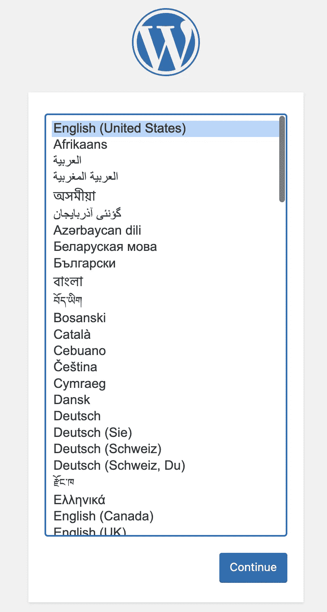

# 将您的 Kubernetes 基础设施编写成 Go 代码——用自定义结构扩展“cdk8s”

> 原文：<https://betterprogramming.pub/write-your-kubernetes-infrastructure-as-go-code-extend-cdk8s-with-custom-constructs-3848659a7eab>

## 将 WordPress 部署构建为 cdk8s 结构


照片由 [Fikret tozak](https://unsplash.com/es/@tozakfikret?utm_source=medium&utm_medium=referral) 在 [Unsplash](https://unsplash.com?utm_source=medium&utm_medium=referral) 上拍摄

**构造**是[cdk8s](https://cdk8s.io/docs/latest/)(Kubernetes 的云开发工具包)——一个开源框架(CNCF 的一部分)，通过它你可以使用常规编程语言(而不是`yaml`)定义你的 Kubernetes 应用。在[cdk8s](/write-your-kubernetes-infrastructure-as-go-code-getting-started-with-cdk8s-989725f8af73)入门中，您看到了如何使用核心`cdk8s`库。

你也可以使用`cdk8s-plus`库([在之前的博客](/kubernetes-infrastructure-as-code-for-go-developers-cdk8s-plus-in-action-ee3eb2203745)中也提到过)来减少你需要编写的样板代码的数量。使用`cdk8s-plus`，创建一个 Kubernetes `Deployment`，指定它的容器(和其他属性)并通过一个`Service`公开它只需要三次函数调用。

例如，要设置和访问`Nginx`，您只需要:

```
//...
deployment := cdk8splus22.NewDeployment(chart, jsii.String("deployment"), &cdk8splus22.DeploymentProps{Metadata: &cdk8s.ApiObjectMetadata{Name: jsii.String("nginx-deployment-cdk8s-plus")}})deployment.AddContainer(&cdk8splus22.ContainerProps{
        Name:  jsii.String("nginx-container"),
        Image: jsii.String("nginx"),
        Port:  jsii.Number(80)})deployment.ExposeViaService(&cdk8splus22.DeploymentExposeViaServiceOptions{
        Name:        jsii.String("nginx-container-service"),
        ServiceType: cdk8splus22.ServiceType_LOAD_BALANCER,
        Ports:       &[]*cdk8splus22.ServicePort{{Port: jsii.Number(9090), TargetPort: jsii.Number(80)}}})
//...
```

**但是事情会变得更好！**

不用一遍又一遍地编写相同的逻辑，您可以将它打包成一个可重用的组件，就像其他内置的`cdk8s`函数一样可以调用(例如 [NewDeployment](https://pkg.go.dev/github.com/cdk8s-team/cdk8s-plus-go/cdk8splus22/v2#NewDeployment) 、`NewService`等)。).尽管对于简单的应用程序来说，这种方法可能听起来不那么有用，但是对于想要扩展工程成果的大型项目、团队或组织来说，这种方法是无价的。事实上，在 [constructs.dev](https://constructs.dev/) 中已经有一个现成的组件池。这些包括由社区、AWS 和其他人跨多种编程语言贡献的构造。

# 为了更好地理解这在实践中可能是什么样子

…让我们看看代码。我将继续使用`Wordpress`作为例子，就像我在之前的博文中所做的那样。下面是一个代码片段，展示了所有内容是如何连接在一起的(下一节将介绍实现):

> *可以参考 Github* 上的 [*完整代码*](https://github.com/abhirockzz/cdk8s-for-go-developers/tree/master/part4-custom-construct)

```
//...func NewMyChart(scope constructs.Construct, id string, props *MyChartProps) cdk8s.Chart {
    //....
    NewWordpressStack(chart, jsii.String("wordpress-stack"), &WordpressProps{//....)
    return chart
}func main() {
    app := cdk8s.NewApp(nil)
    NewMyChart(app, "wordpress-custom-stack", nil)
    app.Synth()
}
```

*   `NewWordpressStack`给了我们一个表示整个`Wordpress`安装的构造(单行代码！)
*   我们只是按照我们的要求配置它(用`WordpressProps`
*   将其作为 [cdk8s 的一部分。图表](https://pkg.go.dev/github.com/cdk8s-team/cdk8s-core-go/cdk8s/v2#Chart)包含在[cdk8 中。应用程序](https://pkg.go.dev/github.com/cdk8s-team/cdk8s-core-go/cdk8s/v2#App)(与任何其他`cdk8s`应用程序一样)

根据您的需求，在如何构建定制构造方面有很大的灵活性。但是，在其核心，基本概念是定义一种方法来创建一个新的[构造。构造](https://pkg.go.dev/github.com/aws/constructs-go/constructs/v10#Construct)。您可能希望提供一种添加元数据的方式来进一步配置/细化您的`Construct`——通常，这是通过 properties ( [cdk8s)来完成的。ChartProps](https://pkg.go.dev/github.com/cdk8s-team/cdk8s-core-go/cdk8s/v2#ChartProps) )。

首先我们定义`WordpressProps`——这封装/外部化了 Wordpress 安装的属性。由于这只是一个例子，我提供了有限的属性，如 MySQL/Wordpress Docker 图像、MySQL 密码和所需的存储。

```
type WordpressProps struct {
    MySQLImage    *string
    MySQLPassword *string
    MySQLStorage  *float64 WordpressImage   *string
    WordpressStorage *float64
}
```

然后我们有一个函数，允许*其他*图表/构造实例化 Wordpress。这是整个实现驻留的地方。

```
func NewWordpressStack(scope constructs.Construct, id *string, props *WordpressProps) constructs.Construct {
    ...
}
```

`props *WordpressProps`参数允许其他结构影响 Wordpress 栈的创建，例如，你可以定义你需要多少存储空间，可能为 Wordpress/MySQL 使用不同的 Docker 镜像。这个函数的实际代码类似于您在这里看到的(需要调整)，所以这里没有必要重复。我将简单地强调重要的部分——特别是那些使用`props`来配置所需组件的部分。

> 这个样本构造使用了`cdk8splus22`库。这种命名约定的原因是因为每个`cdk8s-plus`库都是针对特定的 Kubernetes 版本单独出售的——结尾的`22`表示这个依赖项将与 Kubernetes `1.22`一起工作。您可以使用与您的 Kubernetes 版本相对应的库，更多信息请参考常见问题解答。

我们使用来自`props`的 MySQL 密码，并用它来创建`Secret`。

```
//...
    password := props.MySQLPassword
    mysqlSecret := cdk8splus22.NewSecret(wordpressConstruct, jsii.String("mysql-secret"),
        &cdk8splus22.SecretProps{
            Metadata: &cdk8s.ApiObjectMetadata{Name: jsii.String(secretName)}}) 
    secretKey := "password"
    mysqlSecret.AddStringData(jsii.String(secretKey), password)
    //...
```

MySQL 和 Wordpress 的容器图像通过各自的`Deployment`引用:

```
//...
    containerImage := props.MySQLImage mysqlContainer := dep.AddContainer(&cdk8splus22.ContainerProps{
        Name:  jsii.String("mysql-container"),
        Image: containerImage,
        Port:  jsii.Number(3306),
    })
//... wordpressContainer := wordPressDeployment.AddContainer(&cdk8splus22.ContainerProps{
        Name:  jsii.String("wordpress-container"),
        Image: props.WordpressImage,
        Port:  jsii.Number(80),
    })
```

我们还使用传入的存储——这用于配置`PersistentVolumeClaim`请求。

```
...
    mysqlPVC := cdk8splus22.NewPersistentVolumeClaim(wordpressConstruct, jsii.String("mysql-pvc"), &cdk8splus22.PersistentVolumeClaimProps{
        AccessModes: &[]cdk8splus22.PersistentVolumeAccessMode{cdk8splus22.PersistentVolumeAccessMode_READ_WRITE_ONCE},
        Storage:     cdk8s.Size_Gibibytes(props.MySQLStorage)})
... wordpressPVC := cdk8splus22.NewPersistentVolumeClaim(wordpressConstruct, jsii.String("wordpress-pvc"), &cdk8splus22.PersistentVolumeClaimProps{
        AccessModes: &[]cdk8splus22.PersistentVolumeAccessMode{cdk8splus22.PersistentVolumeAccessMode_READ_WRITE_ONCE},
        Storage:     cdk8s.Size_Gibibytes(props.WordpressStorage)})
```

最后，我们从另一个`cdk8s.Chart`调用`NewWordpressStack`，并传递我们想要配置的属性。

```
func NewMyChart(scope constructs.Construct, id string, props *MyChartProps) cdk8s.Chart {
    var cprops cdk8s.ChartProps
    if props != nil {
        cprops = props.ChartProps
    }
    chart := cdk8s.NewChart(scope, jsii.String(id), &cprops) NewWordpressStack(chart, jsii.String("wordpress-stack"), &WordpressProps{
        MySQLImage:       jsii.String("mysql"),
        MySQLPassword:    jsii.String("Password123"),
        MySQLStorage:     jsii.Number(3),
        WordpressImage:   jsii.String("wordpress:4.8-apache"),
        WordpressStorage: jsii.Number(2)}) return chart
}
```

# 用它来安装 Wordpress

**在本地测试…**

…您可以使用 [minikube](https://minikube.sigs.k8s.io/docs/start/) 、[类](https://kind.sigs.k8s.io/docs/user/quick-start/#installation)等。

```
# make sure cluster is running
minikube startgit clone https://github.com/abhirockzz/cdk8s-for-go-developers
cd part4-custom-construct
```

创建清单并检查所有资源(参见`dist`目录):

```
cdk8s synth
```

要部署它们:

```
kubectl apply -f dist/# output (might differ in your case)secret/mysql-pass created
deployment.apps/mysql-mysql-deployment-cdk8splus-c83762d9 created
persistentvolumeclaim/mysql-mysql-pvc-c8799bba created
service/mysql-service created
deployment.apps/wordpress-wordpress-deployment-cdk8splus-c8252da7 created
service/wordpress-service created
persistentvolumeclaim/wordpress-wordpress-pvc-c8334a29 created
```

检查暴露 wordpress `Deployment`的 Kubernetes `Service`(称为`wordpress-service`)。

```
kubectl get svc wordpress-service
```

如果您正在使用`minikube`，在不同的终端运行(如果尚未运行):

```
minikube tunnel
```

用你的浏览器导航到 [http://localhost:80](http://localhost/) 。你应该会看到熟悉的 WordPress 安装界面。



Kubernetes 上的 Wordpress 已经准备好了

继续，完成安装并登录你的 WordPress 实例。请随意尝试。

# 结论

本身是一个强大的工具，但它也为你提供了在其上扩展和构建其他抽象的能力。您看到了如何在`Go`中编写一个定制的构造，并使用它在 Kubernetes 上部署 WordPress。这可以进一步用作其他可重用组件的基础。

编码快乐！