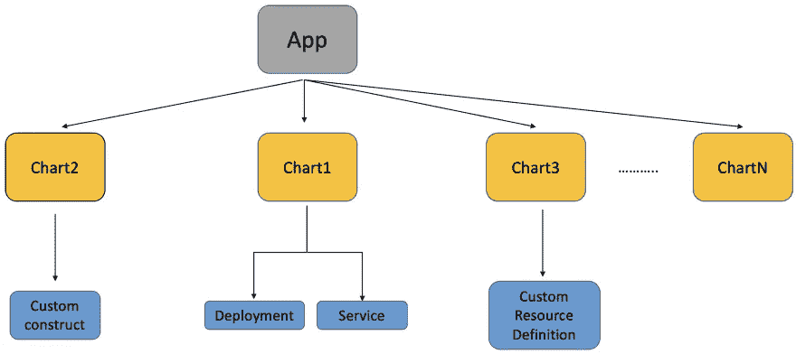
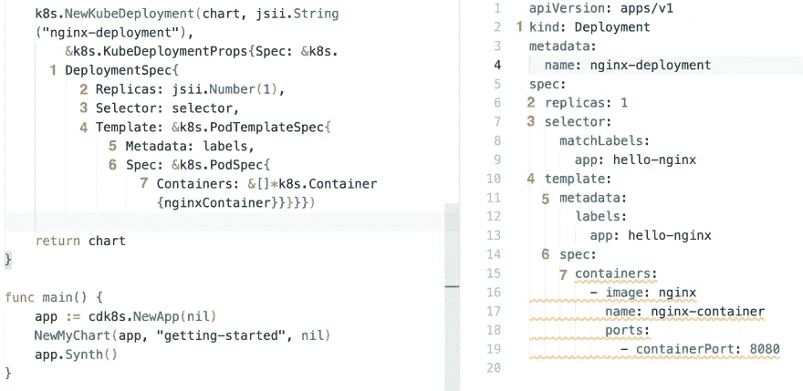

# 将您的 Kubernetes 基础设施编写为 Go 代码 Cdk8s 入门

> 原文：<https://betterprogramming.pub/write-your-kubernetes-infrastructure-as-go-code-getting-started-with-cdk8s-989725f8af73>


cdk8s.io

## 使用 Go 定义您的 Kubernetes 应用程序

基础设施即代码(IaC)是一个成熟的范例，指的是处理基础设施(网络、磁盘、存储、数据库、消息队列等)的标准实践。)以与应用程序代码相同的方式，应用一般的软件工程实践，包括源代码控制版本控制、测试等等。例如， [Terraform](https://www.terraform.io/) 和 [AWS CloudFormation](https://docs.aws.amazon.com/cloudformation/index.html) 是广泛采用的技术，它们使用配置文件/模板来表示基础设施组件。

# 基础设施即代码——这是一种不同的思考方式

假设您有一个应用程序，它由一个 API 网关作为前端的无服务器功能和一个作为后端的 NoSQL 数据库组成。而不是用静态的方式定义它(使用 JSON，YAML 等)。)，可以使用标准的编程语言结构(如类、方法等)来表示这些组件。下面是一个伪代码示例:

```
DBTable table = new DBTable("demo-table");
table.addPrimaryKey("email", Type.String);Function function = new Function("demo-func");
function.addEnvVars("TABLE_NAME", table.Name());APIGateway apigw = new APIGateway();
apigw.addFunctionIntegration(function);
```

注意(假设的)类`DBTable`、`Function`和`APIGateway`以及它们的使用方式。例如，`function`可以引用`table`对象并获得其名称——所有这些都在程序运行时实现，并由底层框架/平台的实现细节负责。

**但是你不必为你的生产基础设施写伪代码！**

…感谢现有的解决方案，如 [cdk8s](https://cdk8s.io/) 、 [AWS CDK](https://docs.aws.amazon.com/cdk/v2/guide/home.html) 、[普鲁米](https://www.pulumi.com/)、 [CDK for Terraform](https://www.terraform.io/cdktf) ( `cdktf`)等。几乎所有这些解决方案都遵循类似的方法——编写代码来定义基础设施，然后将其转换为配置，例如 Kubernetes manifest (YAML)、[AWS cloud formation template](https://docs.aws.amazon.com/AWSCloudFormation/latest/UserGuide/gettingstarted.templatebasics.html#gettingstarted.templatebasics.what)、 [HCL config](https://www.terraform.io/language/syntax/configuration) 等。，然后可以使用标准工具进行应用。

当我们谈到这个话题时，很难不提到 Go 编程语言及其在云服务和基础设施领域无处不在的存在。它结合了编译语言的安全性和解释语言的速度(如`Python`)，有一个[健壮的标准库](https://pkg.go.dev/std)并编译成一个二进制文件。这些以及更多的品质催生了大量的云原生软件(IaC、监控、可观察性等。)用围棋写的，比如[普罗米修斯](https://github.com/prometheus/prometheus)、 [Terraform](https://github.com/hashicorp/terraform) 、[格拉法纳](https://github.com/grafana/grafana)、[耶格](https://github.com/jaegertracing/jaeger)等。

> [*“事实上，云计算基础中超过 75%的项目都是用 Go 编写的。”*](https://go.dev/solutions/cloud)

# 将“基础即代码”的咒语应用于 Kubernetes

在多篇博文中，我将介绍 Go 开发者如何使用[cdk8s](https://cdk8s.io/docs/latest/)(Kubernetes 的云开发工具包)项目来定义 Kubernetes 资源。它是一个开源框架(也是 CNCF 的一部分),提供高级抽象，可以组合成更大的 Kubernetes 应用程序。与采用 YAML 或其他配置/模板驱动的方法不同，`cdk8s`支持多种编程语言，这意味着您可以使用熟悉的概念(如类、方法等)使用 Kubernetes 资源。最终，`cdk8s`会生成 Kubernetes 清单，您可以使用`kubectl`来`apply`-一切照旧！

> *编写时，* `*cdk8s*` *支持 Go、Typescript、Python 和 Java*

这篇博客文章将为`cdk8s`提供一个温和而实用的介绍。学习结束时，您将熟悉关键概念，并理解如何使用`cdk8s`Go API 来定义 Kubernetes 应用程序，部署(使用`kubectl`)并测试它。

# 开始之前…

确保您已经安装了`Go` ( [v1.16](https://go.dev/dl/) 或更高版本)和 [cdk8s CLI](https://github.com/cdk8s-team/cdk8s-cli) 。此外，您需要能够访问 Kubernetes 集群。对于学习和实验，我建议使用本地运行的单节点集群——比如 [minikube](https://minikube.sigs.k8s.io/docs/start/) 、 [kind](https://kind.sigs.k8s.io/docs/user/quick-start/#installation) 等。

> *我一般用* `*minikube*` *，所以建立一个集群就像* `*minikube start*`一样简单

安装 cdk8s CLI。

您可以从以下选项中选择:

```
#homebrew
brew install cdk8s#npm
npm install -g cdk8s-cli#yarn
yarn global add cdk8s-cli
```

# 好吧，让我们开始吧！

> *虽然这篇博文会提供一步一步的说明，但是你可以随时参考 Github* 上完整的 [*代码*](https://github.com/abhirockzz/cdk8s-for-go-developers/tree/master/part1-getting-started)

`cdk8s`让您可以轻松启动和引导您的应用。你不需要猜测和弄清楚如何构建你的项目，设置依赖关系等等。既然`cdk8s init`号命令这样做了！

```
cdk8s init go-app#output
.... Your cdk8s Go project is ready! cat help      Prints this message  
   cdk8s synth   Synthesize k8s manifests to dist/
   cdk8s import  Imports k8s API objects to "imports/k8s" Deploy:
   kubectl apply -f dist/
```

完成后，您将得到如下目录结构:

```
.
├── cdk8s.yaml
├── dist
│   └── test.k8s.yaml
├── go.mod
├── go.sum
├── help
├── imports
│   └── k8s
│       ├── internal
│       │   └── types.go
│       ├── jsii
│       │   ├── jsii.go
│       │   └── k8s-0.0.0.tgz
│       ├── k8s.go
│       ├── k8s.init.go
│       └── version
└── main.go
```

更新 generate `go.mod`文件，并用下面的代码替换它——这是为了让事情更简单。

如果需要，请随意使用最新版本的模块。

```
module getting-started-with-cdk8s-gogo 1.16require (
    github.com/aws/constructs-go/constructs/v10 v10.1.42
    github.com/aws/jsii-runtime-go v1.60.1
    github.com/cdk8s-team/cdk8s-core-go/cdk8s/v2 v2.3.29
)
```

# 您已经准备好编写一些 Go 代码了！

规范的 Kubernetes“hello world”将启动并运行一个`nginx`服务器。最简单的选择是简单地使用`kubectl run`，例如`kubectl run nginx --image=nginx`。但是，由于这是必要的，我们切换到声明性的方式，在这里我们定义我们想要的状态(在一个`yaml`文件中)并让 Kubernetes 把事情弄清楚。

例如，我们可以编写一个`Deployment`清单，并使用`kubectl apply -f <name of the yaml file` >提交给 Kubernetes。

```
apiVersion: apps/v1
kind: Deployment
metadata:
  name: nginx-deployment
spec:
  replicas: 1
  selector:
    matchLabels:
      app: hello-nginx
  template:
    metadata:
      labels:
        app: hello-nginx
    spec:
      containers:
        - image: nginx
          name: nginx-container
          ports:
            - containerPort: 8080
```

# 但我们是来尽量减少噪音的…

因此，打开`main.go`文件并复制下面的 Go 代码。别担心，我会帮你完成的！

```
package mainimport (
    "getting-started-with-cdk8s-go/imports/k8s"
    "github.com/aws/constructs-go/constructs/v10"
    "github.com/aws/jsii-runtime-go"
    "github.com/cdk8s-team/cdk8s-core-go/cdk8s/v2"
)type NginxChartProps struct {
    cdk8s.ChartProps
}func NewNginxChart(scope constructs.Construct, id string, props *NginxChartProps) cdk8s.Chart {
    var cprops cdk8s.ChartProps
    if props != nil {
        cprops = props.ChartProps
    }
    chart := cdk8s.NewChart(scope, jsii.String(id), &cprops) selector := &k8s.LabelSelector{MatchLabels: &map[string]*string{"app": jsii.String("hello-nginx")}} labels := &k8s.ObjectMeta{Labels: &map[string]*string{"app": jsii.String("hello-nginx")}} nginxContainer := &k8s.Container{Name: jsii.String("nginx-container"), Image: jsii.String("nginx"), Ports: &[]*k8s.ContainerPort{{ContainerPort: jsii.Number(80)}}} k8s.NewKubeDeployment(chart, jsii.String("deployment"),
        &k8s.KubeDeploymentProps{
            Spec: &k8s.DeploymentSpec{
                Replicas: jsii.Number(1),
                Selector: selector,
                Template: &k8s.PodTemplateSpec{
                    Metadata: labels,
                    Spec: &k8s.PodSpec{
                        Containers: &[]*k8s.Container{nginxContainer}}}}}) return chart
}func main() {
    app := cdk8s.NewApp(nil)
    NewNginxChart(app, "nginx", nil)
    app.Synth()
}
```

当用任何语言编写基于`cdk8s`的代码时，你都会遇到一组常见的概念/术语——包括`Construct`、`App`和`Chart`。当我们浏览代码时，我会解释这些。

# 稍微绕道(代码走查和概念)

首先从`main`函数开始——我们使用 [cdk8s。NewApp](https://pkg.go.dev/github.com/cdk8s-team/cdk8s-core-go/cdk8s/v2#NewApp) 创建一个[应用](https://pkg.go.dev/github.com/cdk8s-team/cdk8s-core-go/cdk8s/v2#App)。

**嗯，一个** `**App**` **里到底有什么？**它是一个[构造](https://github.com/aws/constructs)，你可以把`construct` s 看作是更高级别的构建块来表示**状态**。需要注意的关键是，这些构造是**可组合的**。这意味着您可以定义这些构造的级别(每个级别提供/公开一个不同的抽象层)并将它们组合起来以创建您想要的最终状态——在这种情况下，它恰好是一个 Kubernetes 清单，带有诸如`Deployment`之类的对象，但是它也可以是其他的东西。

> *例如一个*[*AWS cloud formation 模板*](https://docs.aws.amazon.com/AWSCloudFormation/latest/UserGuide/Welcome.html) *(如果你要使用*[*AWS CDK*](https://docs.aws.amazon.com/cdk/v2/guide/home.html)*，不要与* `*cdk8s*` *)*

回到`App`——`App`也是一个构造。事实上，你可以把它看作是结构树(层次结构)中的根。那树上还有什么？请看主函数中的第二行- `NewNginxChart(app, "getting-started", nil)` -这调用了一个函数`NewNginxChart`，它返回一个 [cdk8s。图表](https://pkg.go.dev/github.com/cdk8s-team/cdk8s-core-go/cdk8s/v2#Chart)层次结构中的下一个组件。AA cdk8s `App`可以包含**多个**图表，并且每个图表都可以被转换(或者用准确的 cdk8s 术语- **合成**)成一个单独的 Kubernetes 清单文件(您很快就会看到这个动作)。

最后，请注意`NewNginxChart`功能。它有一堆东西，但是注意对`k8s.NewKubeDeployment`函数的调用。这是我们在代码中实际定义 Kubernetes `Deployment`的地方(在下一节中，我们还将向图表添加一个`Service`。)

> *您可以在一个图表中定义多个 Kubernetes 组件，如*`*Pod*`*`*Service*`*`*Ingress*`*`*Job*`*等。-在 Kubernetes 上运行您的应用程序所需的一切。****

**总结一下，这是我刚才解释的视觉表现——记住一切都是一个`Construct` ( `App`，`Chart`等等。)**

****

**cdk8s —构造树**

**等等，Kubernetes API 依赖关系怎么样？？**

**如果您已经花时间以编程方式访问 Kubernetes，这是一个显而易见的(而且非常棒！)问题。如果你要用 go 处理 k8s 对象，至少你需要 Kubernetes [client-go](https://github.com/kubernetes/client-go/) ，[API machine](https://github.com/kubernetes/apimachinery)等。猜猜看，`cdk8s`也让你在那里得到了满足！**

**您实际上不需要引入这些依赖项，因为`cdk8s`允许您将这些 Kubernetes API 对象视为`constructs`——记住，一切都是 s 构造！当您运行`cdk8s init`命令时，它们会被*自动导入*到您的项目中，但是您也可以使用 [cdk8s import](https://cdk8s.io/docs/latest/cli/import/) 显式地这样做。产生的 API 作为`imports`文件夹的一部分可用(是的，继续检查一遍！).在`main.go`的顶部，检查导入的包——它指的是`imports`文件夹。**

> ***还有更多的* `*cdk8s import*` *虽然。但是你将不得不等待其他的博客文章来看看实际情况——我们才刚刚开始！***

# **好吧，让我们回到正题…**

**..并继续实践。是时候生成一些 yaml 了——不能消除，但至少不用手写！为此，只需运行:**

```
**cdk8s synth**
```

**一旦完成(应该很快！)，查看`dist`目录，查看`cdk8s`生成了什么。
为了更容易理解，这里有一个一对一映射的图表(*注意标签 1、2、3 等。？*)与 yaml 中相应的`cdk8s`代码对象/属性之间，例如`spec.replicas`、`spec.selector`、`template.spec`等。**

****

**去和 YAML——肩并肩**

**你现在可以使用传统的`kubectl`将它部署到 Kubernetes 上，因为`cdk8s`不会为你这么做，至少现在不会；)**

```
**kubectl apply -f dist/
kubectl get pods -w**
```

**一旦`Deployment`准备就绪，`Pod`应该处于`Running`状态。只需使用`port-forward`在本地访问`nginx`集装箱港口:**

```
**kubectl port-forward <enter nginx pod name> 8080:80**
```

**要访问`nginx`主页，使用浏览器导航至`http://localhost:8080`**

> ***您也可以使用 CLI 工具，例如* `*curl localhost:8080*` *。***

# **还没完呢！**

**让我们通过定义一个`Service`资源来使用标准的 Kubernetes 访问应用程序的方式，而不是端口转发，通常是这样定义的:**

```
**apiVersion: v1
kind: Service
metadata:
  name: nginx-service
spec:
  ports:
    - port: 9090
      targetPort: 8080
  selector:
    app: hello-nginx
  type: LoadBalancer**
```

**但是你知道规矩——不许手写！所以，在`main.go`文件的`NewNginxChart`函数中，将这段代码添加到您定义了`Deployment`的部分之后:**

```
**k8s.NewKubeService(chart, jsii.String("service"), &k8s.KubeServiceProps{
        Spec: &k8s.ServiceSpec{
            Type:     jsii.String("LoadBalancer"),
            Ports:    &[]*k8s.ServicePort{{Port: jsii.Number(9090), TargetPort: k8s.IntOrString_FromNumber(jsii.Number(80))}},
            Selector: &map[string]*string{"app": jsii.String("hello-nginx")}}})**
```

**首先，删除现有的`Deployment` - `kubectl delete -f dist/`。然后，再次运行`cdk8s synth`，在`dist`文件夹中创建新的清单。**

> ***`*Service*`*和* `*Deployment*` *都在同一个文件中——这是因为它们都是*同一个*图表的一部分。****

**如何访问服务将取决于 Kubernetes 集群。如果您使用的是云提供商，它可能会在云上提供本地负载平衡器服务，例如 AWS 中的[应用负载平衡器](https://docs.aws.amazon.com/elasticloadbalancing/latest/application/introduction.html)。请根据您的设置进行调整。**

> ***对于* `*minikube*` *，你可以简单的按照这些指令*[*https://minikube . sigs . k8s . io/docs/handbook/access/# load balancer-access*](https://minikube.sigs.k8s.io/docs/handbook/accessing/#loadbalancer-access)*-*“load balancer 类型的服务可以通过`minikube tunnel`命令公开。”**

**在终端中，运行以下命令(它作为单独的进程运行):**

```
**minikube tunnel**
```

**在另一个终端，*删除*现有的`Deployment`，然后应用新的清单:**

```
**kubectl apply -f dist/
kubectl get pods -w**
```

**检查`Service`:**

```
**kubectl get svc**
```

**要访问`nginx`服务器，导航到外部 IP(根据`Service`)。在 minikube 的情况下，您可以简单地使用`localhost:9090`或`127.0.0.0:9090`**

> ***记住使用端口* `*9090*` *，因为那是我们在代码*的服务配置中指定的外部端口**

# **在总结之前…**

**..我想在`cdk8s`中强调一些其他有用的东西。**

****参考和重用现有的清单和舵图****

**假设您已经在一个`service.yaml`文件中定义了一个`Service`。你可以将作为你可能有的更大的应用程序/图表的一部分包含在你的`cdk8s`中。这里有一个例子:**

```
**cdk8s.NewInclude(chart, jsii.String("existing service"), &cdk8s.IncludeProps{Url: jsii.String("service.yaml")})**
```

**同样，也可以包含`Helm`图表。说你想加`bitnami/nginx`:**

```
**cdk8s.NewHelm(chart, jsii.String("bitnami nginx helm chart"), &cdk8s.HelmProps{
        Chart:  jsii.String("bitnami/nginx"),
        Values: &map[string]interface{}{"service.type": "ClusterIP"}})**
```

> ***嗯，你确实需要在本地安装* `*helm*` *并且先添加回购* `*helm repo add bitnami* [*https://charts.bitnami.com/bitnami*](https://charts.bitnami.com/bitnami)`**

****另一个方便的功能是…****

**…能够声明任意两个`cdk8s`结构之间的依赖关系。例如，在前面的例子中，我们有一个`Deployment`和一个`Service`。您可以创建这样的依赖关系:**

```
**deployment := k8s.NewKubeDeployment(...)
service := k8s.NewKubeService(...)deployment.AddDependency(service)**
```

**由于有了`AddDependency`，产生的清单将是这样的，即`Service`被放置在`Deployment`对象之前。**

> ***依赖是*而不是*局限于图表中的单个结构。如果您的* `*cdk8s*` *应用程序包含多个图表，您也可以在*图表之间建立*依赖关系。***

# *结论*

*太棒了。所以你能够“编码”你的方式通过麻烦和忽视 YAML。希望你喜欢它！为了简单起见，我演示了一个`Deployment`和`Service`，但是您可以从其他 Kubernetes 组件中选择，比如`Ingress`、`Job`等。它们都使用类似的模式曝光，例如`NewKubeJob`、`NewKubeIngress`等的 NewKube。*

*但是在定义 Kubernetes 组件时仍然有很多样板代码。编写 Go 代码听起来比 YAML 工程好得多(至少对我来说)，看起来好像我们正在将现有的 YAML 翻译成 Go 结构(和字段)。在随后的博文中，我们将探讨如何进一步改进这一点。*

*编码快乐！*