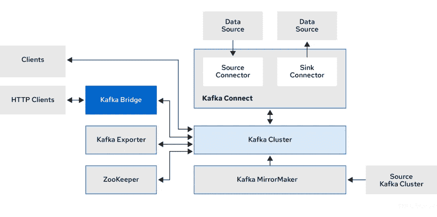

# 将您的 Kubernetes 基础设施编写成 Go 代码——使用 Cdk8s 的自定义资源定义

> 原文：<https://betterprogramming.pub/write-your-kubernetes-infrastructure-as-go-code-using-custom-resource-definitions-with-cdk8s-5d9500693e02>

## 使用 CRDs 作为 API


照片由 [Ihor Dvoretskyi](https://unsplash.com/@ihor_dvoretskyi?utm_source=medium&utm_medium=referral) 在 [Unsplash](https://unsplash.com?utm_source=medium&utm_medium=referral) 上拍摄

[cdk8s](https://cdk8s.io/docs/latest/)(Kubernetes 的云开发工具包)是一个开源框架(CNCF 的一部分)，使用它你可以用常规编程语言(而不是`yaml`)定义你的 Kubernetes 应用。以前关于这个主题的一些博客涵盖了入门经验和使用`cdk8s-plus`库进一步改进核心`cdk8s`库特性。我们将继续推进`cdk8s`更进一步。

这篇博文将展示如何将 [Kubernetes 自定义资源定义](https://kubernetes.io/docs/concepts/extend-kubernetes/api-extension/custom-resources/#customresourcedefinitions)与`cdk8s`结合使用。我们将从一个简单的`Nginx`示例开始，然后您将使用 Strimzi 项目 CRDs 与 Go 和`cdk8s`的组合来定义和部署 Kubernetes 上的 Kafka 集群！

> *我假设你对 Kubernetes 自定义资源定义有所了解，甚至可能使用过一些* [*操作符*](https://kubernetes.io/docs/concepts/extend-kubernetes/operator/) *。如果没有，也没关系！Kubernetes 文档对此做了很好的介绍。您可以随时参考它，回到这里并跟随它！*

`cdk8s`让你可以在代码中直接使用 Kubernetes API 对象，而不必导入单独的 Go 客户端包，这一切都归功于`cdk8s import`。(在*中也提到了“等等，Kubernetes API 依赖项呢？?"*前一篇[博文](/write-your-kubernetes-infrastructure-as-go-code-getting-started-with-cdk8s-989725f8af73)的一段。但是您也可以将它用于自定义资源定义！让我们来看看实际情况。

# 开始之前…

确保您已经安装了`Go` ( [v1.16](https://go.dev/dl/) 或更高版本)和 [cdk8s CLI](https://github.com/cdk8s-team/cdk8s-cli) 。此外，您需要能够访问 Kubernetes 集群。对于学习和实验，我会推荐使用本地运行的单节点集群——比如`[minikube](https://minikube.sigs.k8s.io/docs/start/)`、 [kind](https://kind.sigs.k8s.io/docs/user/quick-start/#installation) 等。

> *我一般用* `*minikube*` *，所以建立一个集群就像* `*minikube start*`一样简单

要安装 cdk8s CLI:

您可以从以下选项中选择:

```
#homebrew
brew install cdk8s#npm
npm install -g cdk8s-cli#yarn
yarn global add cdk8s-cli
```

# 好吧，让我们开始吧…

> *虽然这篇博文会提供一步一步的说明，但是你可以随时参考 Github* 上完整的 [*代码*](https://github.com/abhirockzz/cdk8s-for-go-developers/tree/master/part3-crd)

`cdk8s`让你很容易开始并启动你的应用程序。你不需要猜测和弄清楚如何构建你的项目，设置依赖关系等等。因为`cdk8s init`命令会帮你做到！

```
cdk8s init go-app#output
.... Your cdk8s Go project is ready! cat help      Prints this message  
   cdk8s synth   Synthesize k8s manifests to dist/
   cdk8s import  Imports k8s API objects to "imports/k8s" Deploy:
   kubectl apply -f dist/
```

更新 generate `go.mod`文件，并用下面的内容替换它——这是为了让事情更简单。

> 如果需要，请随意使用最新版本的模块。

```
module cdk8s-crdgo 1.16require (
    github.com/aws/constructs-go/constructs/v10 v10.1.42
    github.com/aws/jsii-runtime-go v1.61.0
    github.com/cdk8s-team/cdk8s-core-go/cdk8s/v2 v2.3.34
)
```

首先，让我们用一个真正的(真的！)简单的自定义资源定义。

我将使用来自 Kubernetes 示例[的 CRD 样本。说实话，它并没有真正做什么。但是，由于我们刚刚开始，这应该足够了！](https://github.com/kubernetes/sample-controller)

首先，安装/注册`CRD`资源本身:

```
kubectl apply -f [https://raw.githubusercontent.com/kubernetes/sample-controller/master/artifacts/examples/crd.yaml](https://raw.githubusercontent.com/kubernetes/sample-controller/master/artifacts/examples/crd.yaml)
```

确认是否安装了`CRD`:

```
kubectl get crd# output
NAME                           CREATED AT
foos.samplecontroller.k8s.io   2022-07-08T09:28:46Zkubectl get foos.samplecontroller.k8s.io#output (as expected)
No resources found in default namespace.
```

所以，我们只是安装了一个名称为`foos.samplecontroller.k8s.io`类型为`Foo`的`CRD`。可以使用`yaml`创建一个这样的实例...但是...

我们是来写 Go 代码的！

为此，首先使用`cdk8s`将`CRD`作为 API 导入——这将自动创建相应的 Go API 表示(`struct`等)。):

```
cdk8s import [https://raw.githubusercontent.com/kubernetes/sample-controller/master/artifacts/examples/crd.yaml](https://raw.githubusercontent.com/kubernetes/sample-controller/master/artifacts/examples/crd.yaml)
```

检查`imports`目录，应该已经创建了一个附加文件夹。

```
imports/
└── samplecontrollerk8sio
    ├── internal
    │   └── types.go
    ├── jsii
    │   ├── jsii.go
    │   └── samplecontrollerk8sio-0.0.0.tgz
    ├── samplecontrollerk8sio.go
    ├── samplecontrollerk8sio.init.go
    └── version
```

我们现在可以像使用任何其他 Kubernetes 资源/API 一样使用`CRD`(比如`Deployment`),并在`cdk8s` Go 代码中导入它。创建一个名为`foo.go`的新文件，并复制以下代码:

```
package mainimport (
    "cdk8s-crd/imports/samplecontrollerk8sio" "github.com/aws/constructs-go/constructs/v10"
    "github.com/aws/jsii-runtime-go"
    "github.com/cdk8s-team/cdk8s-core-go/cdk8s/v2"
)type FooChartProps struct {
    cdk8s.ChartProps
}func NewFooChart(scope constructs.Construct, id string, props *FooChartProps) cdk8s.Chart {
    var cprops cdk8s.ChartProps
    if props != nil {
        cprops = props.ChartProps
    }
    chart := cdk8s.NewChart(scope, jsii.String(id), &cprops) samplecontrollerk8sio.NewFoo(chart, jsii.String("foo1"), &samplecontrollerk8sio.FooProps{Spec: &samplecontrollerk8sio.FooSpec{DeploymentName: jsii.String("foo1-dep"), Replicas: jsii.Number(2)}}) return chart
}
```

看看我们如何创建一个`samplecontrollerk8sio.Foo`的实例:

*   从`cdk8s-crd/imports/samplecontrollerk8sio`包中导入自动生成的 CRD API，
*   使用`NewFoo`函数并通过`FooProps`提供元数据

用以下内容替换`main.go`的内容:

```
package mainimport (
    "github.com/cdk8s-team/cdk8s-core-go/cdk8s/v2"
)type MyChartProps struct {
    cdk8s.ChartProps
}func main() {
    app := cdk8s.NewApp(nil)
    NewFooChart(app, "FooApp", nil)
    app.Synth()
}
```

我们所做的就是将我们刚刚定义的`Chart`(在`foo.go`中)包含在`cdk8s` `App`中。

创建`Foo`资源...

运行`cdk8s synth` -这将在`dist`文件夹中产生一个清单:

```
apiVersion: samplecontroller.k8s.io/v1alpha1
kind: Foo
spec:
  deploymentName: foo1-dep
  replicas: 2
metadata:
  name: fooapp-foo1-c80094ac
```

要在 Kubernetes 创建它:

```
kubectl apply -f dist
```

您可以通过运行以下命令进行确认:

```
kubectl get foo
kubectl get foos.samplecontroller.k8s.io
```

> *为了进一步反省，您可以使用已创建资源的名称，例如* `*kubectl describe foo/fooapp-foo1-c80094ac*`

好了，现在你已经看到了一个简单的例子，我们可以继续学习稍微高级一点的东西。

# 使用 Strimzi、`cdk8s`和 Go 在 Kubernetes 上设置卡夫卡

Strimzi 是一个开源的 CNCF 项目，也是我个人最喜欢的项目之一！如果你不知道 Strimzi，没关系。只需理解它提供了一种在 Kubernetes 上运行 Apache Kafka 的方法，借助于定制的资源定义和相应的操作符，例如 Kafka cluster、Kafka Connect topic、users、Kafka Mirror 等组件。

这里有一个不同 Strimzi 组件如何交互的高层图。由于 Strimzi 深潜超出了范围，我建议您参考它的(优秀！)[文档](https://strimzi.io/docs/)了解详情。



[https://strimzi.io/documentation/](https://strimzi.io/documentation/)

和以前一样，我们需要首先安装 CRD 本身(你也可以参考 [Strimzi 快速入门](https://strimzi.io/quickstarts/)

```
kubectl create namespace kafka
kubectl create -f 'https://strimzi.io/install/latest?namespace=kafka' -n kafka# wait for the Operator Pod to start up (Running)
kubectl get pod -n kafka --watch
```

> *您也可以使用* `*kubectl logs deployment/strimzi-cluster-operator -n kafka -f*`查看操作员日志

每个支持的 Kafka 组件(集群、连接、用户等。)有一个相应的定制资源定义——出于本文的目的，我们将只使用 Kafka 集群和主题 CRD。让我们将它们作为 API 导入:

```
cdk8s import https://raw.githubusercontent.com/strimzi/strimzi-kafka-operator/main/install/cluster-operator/040-Crd-kafka.yamlcdk8s import kafkatopic:=https://raw.githubusercontent.com/strimzi/strimzi-kafka-operator/main/install/cluster-operator/043-Crd-kafkatopic.yaml
```

> *注意，我已经将* `*kafkatopic*` *添加到 Kafka 主题 CRD* 的模块名称前面

检查`imports`文件夹——您应该会看到另外两个名为`kafkastrimziio`和`kafkatopic_kafkastrimziio`的文件夹。

又到了写代码的时候了:

创建一个`kafka_strimzi.go`文件，从 Github repo 中复制代码[:](https://github.com/abhirockzz/cdk8s-for-go-developers/blob/master/part3-crd/kafka_strimzi.go)

> *或者你也可以简单地这样做:* `*curl -o kafka.go* [*https://raw.githubusercontent.com/abhirockzz/cdk8s-for-go-developers/master/part3-crd/kafka_strimzi.go*](https://raw.githubusercontent.com/abhirockzz/cdk8s-for-go-developers/master/part3-crd/kafka_strimzi.go)`

我将在这里向您介绍代码的重要部分。从创建新的`Chart`的`NewKafkaChart`函数开始。

```
func NewKafkaChart(scope constructs.Construct, id string, props *KafkaChartProps) cdk8s.Chart {
    //.... ommitted for brevity
    chart := cdk8s.NewChart(scope, jsii.String(id), &cprops)
```

查看 Kafka 集群是如何使用`kafkastrimziio.KafkaProps` struct 定义的(要深入了解这些组件，您可以参考 [Strimzi 文档](https://strimzi.io/docs/operators/latest/configuring.html#assembly-config-kafka-str))。我们指定 Kafka 版本、节点/副本的数量(我们将坚持使用单个节点副本)以及如何公开集群等。

```
//....
&kafkastrimziio.KafkaProps{
            Spec: &kafkastrimziio.KafkaSpec{
                Kafka: &kafkastrimziio.KafkaSpecKafka{ Version:  jsii.String("3.2.0"),
                    Replicas: jsii.Number(1),
                    Listeners: &[]*kafkastrimziio.KafkaSpecKafkaListeners{
                        {
                            Name: jsii.String("plain"),
                            Port: jsii.Number(9092),
                            Type: kafkastrimziio.KafkaSpecKafkaListenersType_INTERNAL,
                            Tls:  jsii.Bool(false),
                        },
                    },
//....
```

然后，我们添加 Kafka 集群所需的配置(符合我们只有单节点集群的事实)以及存储(临时存储将适用于此示例)。

```
//...
Config: map[string]interface{}{
                        "offsets.topic.replication.factor":         1,
                        "transaction.state.log.replication.factor": 1,
                        "transaction.state.log.min.isr":            1,
                        "default.replication.factor":               1,
                        "min.insync.replicas":                      1,
                        "inter.broker.protocol.version":            "3.2",
                    },
                    Storage: &kafkastrimziio.KafkaSpecKafkaStorage{
                        Type: kafkastrimziio.KafkaSpecKafkaStorageType_EPHEMERAL,
                    },
//...
```

最后，我们配置 Zookeeper 以及处理 Kafka 主题的[实体操作符](https://strimzi.io/docs/operators/latest/configuring.html#assembly-kafka-entity-operator-str)(以及用户，尽管我们在这里没有使用它)

```
//...
Zookeeper: &kafkastrimziio.KafkaSpecZookeeper{
                    Replicas: jsii.Number(1),
                    Storage: &kafkastrimziio.KafkaSpecZookeeperStorage{
                        Type: kafkastrimziio.KafkaSpecZookeeperStorageType_EPHEMERAL,
                    },
                },
                EntityOperator: &kafkastrimziio.KafkaSpecEntityOperator{
                    TopicOperator: &kafkastrimziio.KafkaSpecEntityOperatorTopicOperator{},
                }}})
//...
```

要连接它，请更新`main.go`文件:

```
func main() {
    app := cdk8s.NewApp(nil)
    //NewFooChart(app, "FooApp", nil)
    NewKafkaChart(app, "KafkaApp", nil)
    app.Synth()
}
```

要使用 CRD 创建 Kafka 集群…

遵循通常的工作流程:

```
# generate manifest (check it in dist folder)
cdk8s synth# apply it (note the kafka namespace)
kubectl apply -f dist/ -n kafka
```

等待创建资源:

```
KAFKA_CRD_INSTANCE_NAME=$(kubectl get kafka -n kafka -o=jsonpath='{.items[0].metadata.name}')
kubectl wait kafka/$KAFKA_CRD_INSTANCE_NAME --for=condition=Ready --timeout=300s -n kafka
```

一旦创建了所有 Kafka 集群资源，您应该会看到下面的消息— `kafka.kafka.strimzi.io/<name of your Kafka CRD instance> condition met`。Kafka 集群现在已经准备好了，我们可以使用基于 Kafka CLI 的生产者和消费者(Strimzi quickstart 中的说明)来测试它。

```
BOOSTRAP_SERVER=$(kubectl get kafka -n kafka -o=jsonpath='{.items[0].metadata.name}')-kafka-bootstrapkubectl -n kafka run kafka-producer -ti --image=quay.io/strimzi/kafka:0.29.0-kafka-3.2.0 --rm=true --restart=Never -- bin/kafka-console-producer.sh --bootstrap-server $BOOSTRAP_SERVER:9092 --topic test-topickubectl -n kafka run kafka-consumer -ti --image=quay.io/strimzi/kafka:0.29.0-kafka-3.2.0 --rm=true --restart=Never -- bin/kafka-console-consumer.sh --bootstrap-server $BOOSTRAP_SERVER:9092 --topic test-topic --from-beginning
```

暂时就这样吧！

# 该总结了

您了解了如何将 Kubernetes 自定义资源定义与`cdk8s`结合起来。这真的很强大，意味着您可以继续使用代码(在这种情况下，用 Go 编写)来定义内置的 Kubernetes 资源(如`Deployment`等)。)以及自定义资源！

你喜欢你所尝试的吗？

嗯，可以继续学习！

几个建议:

1.  你可以尝试更新现有代码来添加一个`Deployment`资源，该资源引用一个 Kafka 客户端应用程序(你必须先编写它并将其打包为 Docker 容器)，并且可以访问你创建的 Kafka 集群。探索如何获得连接参数..
2.  我们创建的 Kafka 集群被配置为只允许**内部**访问。探索对外公开它的选项(参考 Strimzi 文档)并更新代码来实现它(应该是一个小的改变)。哪些 Kubernetes 对象会受到它的影响？

编码快乐！