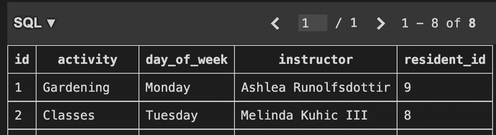
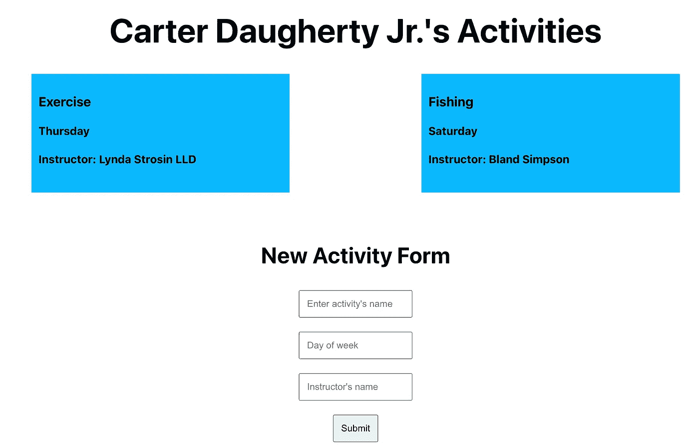
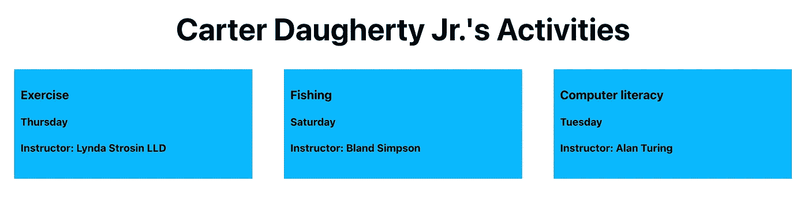

# 用 Ruby 和 Sinatra 编写、访问和修改嵌套 API

> 原文：<https://betterprogramming.pub/writing-accessing-and-modifying-nested-apis-with-ruby-sinatra-21c8f0d765>

## 创建和修改 API 对于 web 开发的每个方面都是必不可少的


亚历克斯·埃克曼在 [Unsplash](https://unsplash.com?utm_source=medium&utm_medium=referral) 上拍摄的照片

在熨斗学校软件工程项目的第三阶段，我创建了一个 API 来支持我的模拟应用程序“无家可归者的克莱尔湖社区”，这是一个为无家可归者设想的社区。这个应用程序是为这个社区的管理者和顾问设计的。

使用`ActiveRecord`，我创建了一个居民表和一个居民活动表，其中居民有许多活动和属于一个居民的活动—一对多关系。由于这种关系的结构，activities 表有一个外键`resident_id`，这是在表之间操作数据的关键。

我需要能够在`residents`的桌子上执行完整的 CRUD，并且能够看到每个居民的活动，为他们创建其他活动，就好像我是一个社区管理员一样。这要求我能够通过 API 中的居民数据访问活动数据。

为了创建 API，我在`application_controller.rb` 文件中编写了必要的端点。下面代码片段中的第一个方法是标准的 GET 请求，而第二个是单个居民的端点，但是请注意，当我“JSONify”居民数据时，我还包含了相关的活动。

```
class ApplicationController < Sinatra::Base
  set :default_content_type, 'application/json'

  get "/residents" do
    residents = Resident.all 
    residents.to_json
  end

  get "/residents/:id" do
    resident = Resident.find(params[:id])
    resident.to_json(include: :activities)
  end
```

由于有了`resident_id` 外键，Sinatra 能够找到并显示与每个居民相关的活动。

下面是 SQL(创建和管理关系数据库的平台，其数据通常由`ActiveRecord`处理)生成的 activities 表。在该表中，园艺活动的 resident_id 为 9，这意味着该活动与居民 9 相关联。



这种数据库关系的神奇之处在于，任何处理数据的人都可以通过访问一个表。因此，我的`/residents/:id`端点能够显示以下内容，其中关于居民的相关活动的信息是嵌套的对象。

```
{
  "id": 5,
  "name": "Carter Daugherty Jr.",
  "date_of_birth": "2001-03-20",
  "phone": "340-239-7307",
  "email": "[penny_wilderman@example.org](mailto:penny_wilderman@example.org)",
  "activities": [
    {
      "id": 5,
      "activity": "Exercise",
      "day_of_week": "Thursday",
      "instructor": "Lynda Strosin LLD",
      "resident_id": 5
    }
  ]
}
```

作为用户，这允许我点击一个居民的名字，并看到他们一周的活动。但是我在创建这个应用程序时的挑战是如何为给定的居民创建一个新的活动，因为起初，我认为我必须将新的活动发布到`/residents/:id`。事实上，我必须向`/activities`发出 POST 请求，并编写我的前端代码，以便新活动与`resident_id`外键相关联。

为了发布到 activities，我使用 Sinatra gem 编写了以下 Ruby 方法。这个端点可以用于为所有居民或单个居民创建新的活动，这取决于我在前端调用它的方式。

```
post "/activities" do 
    activity = Activity.create(activity: params[:activity],    
    day_of_week: params[:day_of_week], instructor: 
    params[:instructor], resident_id: params[:resident_id])
    activity.to_json
end
```

在我的应用程序中，管理员可以在每个居民的页面上看到下面所示的新活动表单。表单本身没有任何用于指定与新活动相关联的居民的字段，但是因为该页面的端点是`/residents/2` ( `/residents/:id`)，所以我可以使用 react-router-dom: `const { id } = useParams()` **中的`useParams`钩子轻松地获取该 id。**

当我将 POST 请求写到`/activities`端点时，我可以使用 id 发送到后端，将活动绑定到驻留。



为了抽象出 React 中的表单数据，我创建了一个名为`actFormData`的状态变量，我将它的字段设置为空字符串。我没有在 POST 请求的主体中只发送`actFormData`,而是创建了一个新的变量，该变量也将发送`resident_id: const activityData = {…actFormData, resident_id: id}`

此外，因为我设置了一个嵌套的 API，所以我不能仅仅使用 spread 操作符和新元素来编写典型的`handleAddSoAndSo`函数。这是我的第一次尝试:

```
function handleAddNewActivity(newActivity) {
   setResident([...resident, newActivity])
}
```

但是看到`setResident`函数中的`newActivity`元素从一开始就很奇怪。相反，我需要将`newActivity`推入常驻对象。只有这样我才能正常。

```
function handleAddNewActivity(newActivity) {
    const residentCopy = {...resident};
    residentCopy.activities.push(newActivity);
    setResident(residentCopy)
}
```

同样非常重要的是，在为居民定义状态时，我必须在`residents`对象中包含一个空的 activities 数组:

```
const [resident, setResident] = useState({activities: []})
```

如果我把它保留为`useState([])`，我将无法迭代`resident.activities`，或者在这种情况下，将一个新的活动推入 activities 数组。

既然所有繁重的工作已经完成，我想演示一下，如果我在同一个居民的页面上添加一个新的活动——Carter Daugherty Jr——它将同时出现在前端和后端。在上图中，Daugherty 先生的页面上只有两个活动。添加第三个之后，他的页面呈现如下内容:



并且它持续存在于 API 中:

```
{
  "id": 5,
  "name": "Carter Daugherty Jr.",
  "date_of_birth": "2001-03-20",
  "phone": "340-239-7307",
  "email": "[penny_wilderman@example.org](mailto:penny_wilderman@example.org)",
  "activities": [
    {
      "id": 5,
      "activity": "Exercise",
      "day_of_week": "Thursday",
      "instructor": "Lynda Strosin LLD",
      "resident_id": 5
    },
    {
      "id": 9,
      "activity": "Fishing",
      "day_of_week": "Saturday",
      "instructor": "Bland Simpson",
      "resident_id": 5
    },
    {
      "id": 10,
      "activity": "Computer literacy",
      "day_of_week": "Tuesday",
      "instructor": "Alan Turing",
      "resident_id": 5
    },
  ]
}
```

既然我们已经了解了如何推断 id 并将其发送到后端，以及如何将新的活动推入到单个居民的数据对象中，那么让我们完整地看一下 POST 请求来回顾一下这个过程。

```
function handleActivitySubmit(e) {
   e.preventDefault();
   const activityData = {...actFormData, resident_id: id}
   fetch("[http://localhost:9292/activities](http://localhost:9292/activities)", {
      method: "POST",
      headers: {
          "Content-Type": "application/json"
      },
           body: JSON.stringify(activityData)
      })
   .then(r => r.json())
   .then((newActivity) => {
       handleAddNewActivity(newActivity);
       setActFormData({
           activity: "",
           day_of_week: "",
           instructor: "",
       })
   })
}
```

总之，外键是允许开发人员关联表以及通过另一个表访问和操作一个表中的数据的关键，正如我们在这篇博客中看到的。为了创建一个新的活动并在其中将它与一个居民相关联，后端代码仍然是一个普通的 POST 方法，而前端代码从单个居民的页面获取 id，并将其与来自受控的 React 表单的数据一起发送到服务器。由于建立了关联，我能够将活动推入附加到居民 API 页面的活动数组中。

注:以上使用的数据是使用 [Faker gem](https://fakerjs.dev/) 生成的。