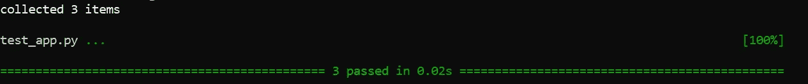
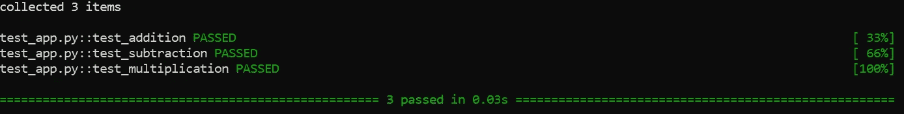
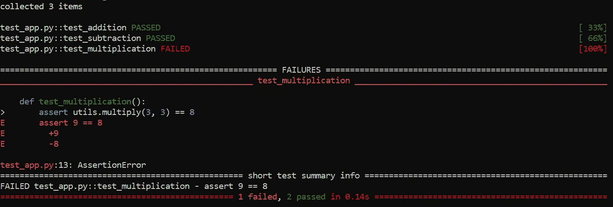
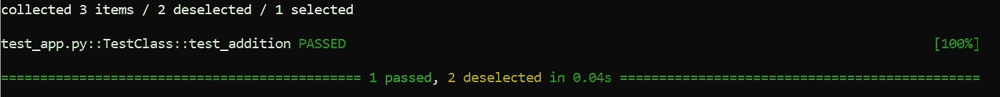
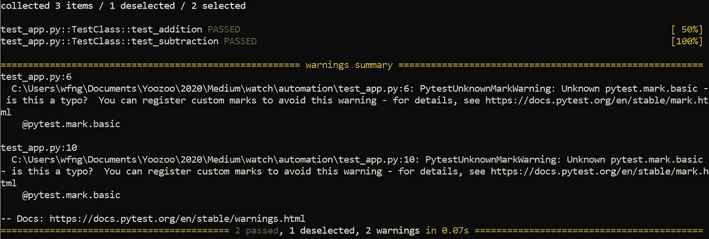
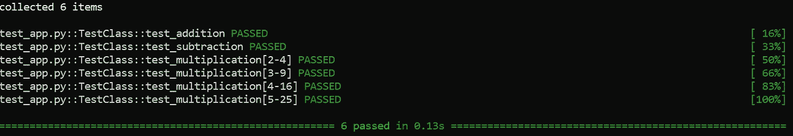

# 用 Python 编写自动化测试脚本

> 原文：<https://betterprogramming.pub/writing-automation-test-scripts-with-python-c00b924e0369>

## 使用 pytest 升级您的测试游戏


[摇滚猴子](https://unsplash.com/@rocknrollmonkey?utm_source=unsplash&utm_medium=referral&utm_content=creditCopyText)在 [Unsplash](https://unsplash.com/s/photos/robot?utm_source=unsplash&utm_medium=referral&utm_content=creditCopyText) 上拍照

测试是软件开发生命周期的一个重要方面。软件 100%手工测试的日子已经一去不复返了。大多数公司利用自动化工具作为测试生命周期的一部分。这些工具有助于在每次提交或更新代码库时控制和自动化测试的执行。

测试自动化是遵循敏捷或 DevOps 方法的成功项目的关键。它极大地提高了产品在每次发布过程中的效率和准确性。

在本教程中，我们将学习一个叫做`pytest`的 Python 测试模块。根据其[官方文件](https://github.com/pytest-dev/pytest/) , `pytest`是:

> “…一个用于编写小型测试的开源框架，可扩展以支持应用程序和库的复杂功能测试。”

让我们继续下一部分，开始安装必要的模块。

# 设置

强烈建议您在继续之前创建一个虚拟环境。激活您的虚拟环境并运行以下命令:

```
pip install pytest
```

您可以通过以下方式确认安装

```
pip show pytest
```

或者

```
pytest -h
```

# 基础知识

在这一部分，我们将学习`pytest`背后的基本概念。

首先，在您的工作目录中创建一个名为`utils.py`的新 Python 文件。该文件充当我们的测试用例的实用函数。在文件中添加以下代码:

```
def add(x, y):
    return x + ydef subtract(x, y):
    return x - ydef multiply(x, y):
    return x * y
```

## 创建测试脚本

之后，创建一个名为`test_app.py`的新 Python 文件。您可以随意命名，但必须遵循以下语法之一:

*   从`test_`开始
*   以`_test`结尾

让我们在`test_app.py`文件中创建几个测试函数。`pytest`自动执行以`test_`开头的功能。您需要做的就是在函数中添加断言。举个例子，

## 运行测试

完成后，在您的终端上运行以下命令:

```
pytest
```

您应该会看到以下输出:



作者图片

您可以为详细输出指定`-v`参数:

```
pytest -v
```

运行上面的命令会产生以下输出:



作者图片

让我们创建一个失败的测试用例来理解`pytest`如何报告错误。在`test_app.py`中，将以下断言从

```
assert utils.multiply(3, 3) == 9
```

收件人:

```
assert utils.multiply(3, 3) == 8
```

再次运行测试，对于一个失败的测试用例，您应该得到如下预期的输出:



作者图片

完成后，将该值改回`9`。

# 将测试用例分组到类中

您可以将一些测试函数分组到一个类中。该类必须以前缀`Test`开头才能生效。

## 使用子字符串表达式

如果您打算只运行测试功能的一个子集，您可以选择通过以下方式来完成:

*   子串表达式，或
*   标记

对于第一个用例，只需指定`-k`参数，后跟所需的字符串。例如，以下命令将只运行包含子字符串`add`的函数:

```
pytest -k add -v
```

注意`pytest`收集了三个函数，并且只运行了其中一个:



作者图片

## 使用标记

此外，您还可以使用标记将您的测试函数分成不同的组。在文件顶部添加以下导入语句:

```
import pytest
```

然后，用下面的装饰器装饰想要的函数。`name`代表标记的自定义名称。你可以给它起任何你喜欢的名字。

```
@pytest.mark.<name>
```

我将使用`basic`作为名称来标记两个函数:

对于标记，您需要调用`-m`参数，如下所示:

```
pytest -m basic -v
```

以下输出将显示在您的终端上。



作者图片

不要对警告感到惊慌，因为它表示您的标记尚未注册。只需在同一个目录中创建一个名为`pytest.ini`的新文件。在其中添加以下配置:

```
[pytest]
markers =
    basic
```

您可以向其添加可选描述，如下所示:

```
[pytest]
markers =
    basic: mark test as basic
```

# 参数化测试用例

`pytest`带有内置的`parametrize`标记，允许您将输入值参数化到函数中。让我们修改`test_multiplication`函数以接受两个输入参数:

*   乘法的输入值
*   预期产出

您应该得到以下代码片段:

```
def test_multiplication(self, value, output):
    assert utils.multiply(value, value) == output
```

然后，按如下方式装饰函数:

```
@pytest.mark.parametrize("value, output", [(2, 4), (3, 9), (4, 16), (5, 25)])
def test_multiplication(self, value, output):
    assert utils.multiply(value, value) == output
```

您必须提供预期输入的字符串表示作为装饰器的第一个参数。

第二个参数表示测试期间传递给函数的输入值。由于我在列表中指定了四个项目，`pytest`将使用相应的值运行`test_multiplication`四次。

运行测试时，您应该会得到以下输出:



作者图片

此外，您可以将测试数据存储在一个变量中，并在其他测试函数中重用它:

```
data = [(2, 4), (3, 9), (4, 16), (5, 25)]
```

我们最终的测试脚本如下:

# 结论

让我们回顾一下今天所学的内容。

我们从简单解释测试的重要性和为什么我们应该自动化测试过程开始。

接下来，我们在虚拟环境中安装了`pytest`模块。

我们继续实现三个基本功能，并创建了相应的测试功能。此外，我们还学习了使用子串表达式或标记对函数进行分组以创建子集测试用例。

最后，我们探索了用参数化修饰器来修饰我们的测试函数。

感谢你阅读这篇文章。希望在下一篇文章中再见到你！

# 参考

1.  [Pytest 的 Github](https://github.com/pytest-dev/pytest/)
2.  [Pytest 的文档](https://docs.pytest.org/en/stable/index.html)
3.  [Pytest 的辅导点](https://www.tutorialspoint.com/pytest/index.htm)
4.  [单元测试简介:Python 中的单元测试框架](https://medium.com/better-programming/introduction-to-unittest-a-unit-testing-framework-in-python-fa0d96fc8262)