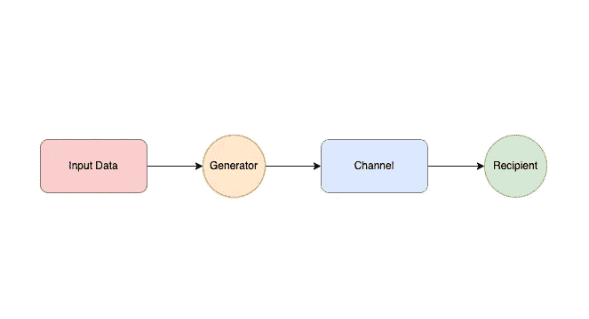
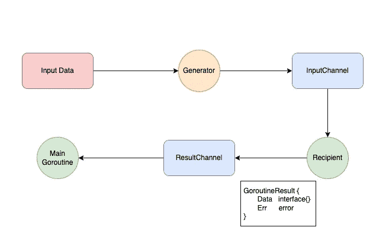
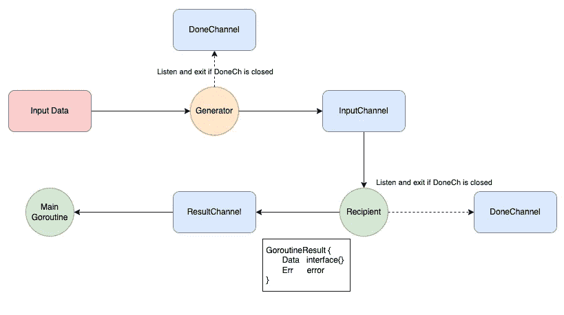
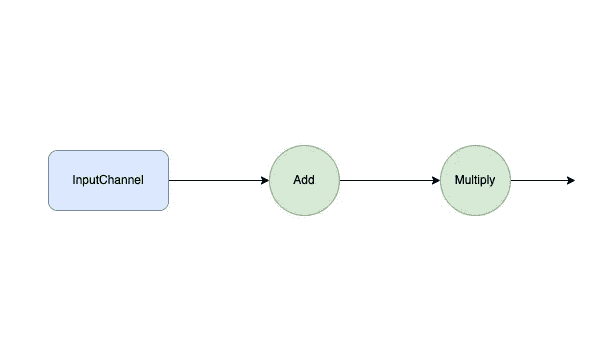
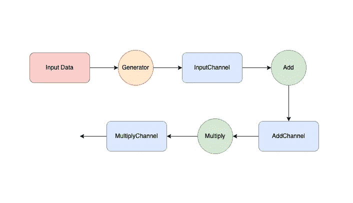
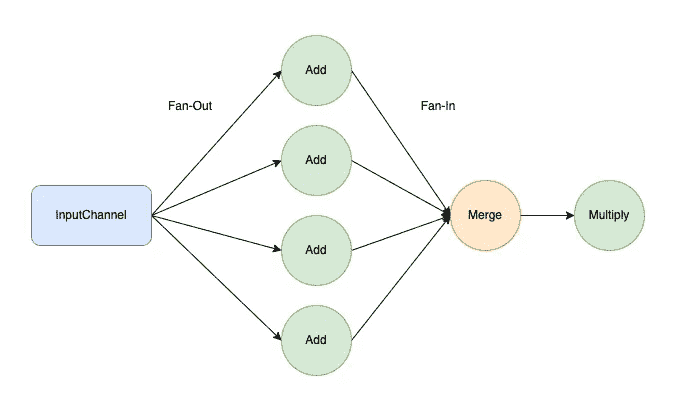
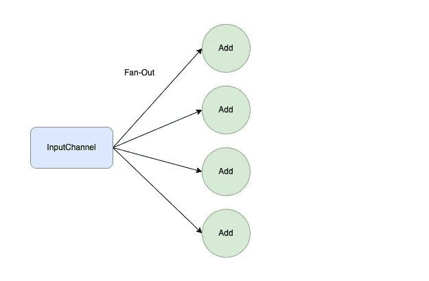
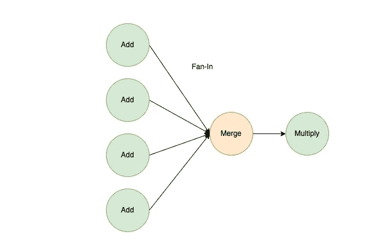
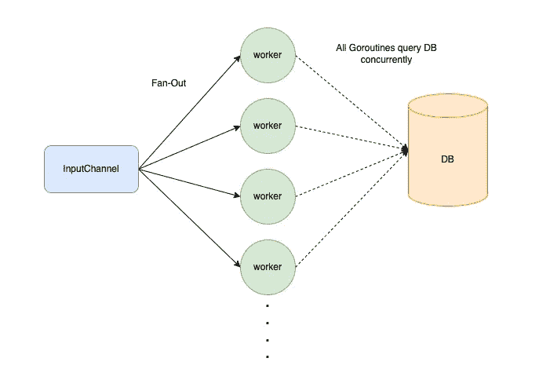

# 用 Go 并发模式编写更好的代码

> 原文：<https://betterprogramming.pub/writing-better-code-with-go-concurrency-patterns-9bc5f9f73519>

## 每个开发人员都应该知道的简单技巧


塞尔吉奥·索萨在[的照片](https://www.pexels.com/photo/gray-concrete-roadway-1828469/)

随着 Goroutines 的出现，编写并发程序变得前所未有的简单。

虽然很方便，但是如果不小心处理，Goroutines 也很容易出现难以追踪的错误。

好消息是，如果您对 Go 并发模式有充分的了解，其中一些是可以预防的。

在接下来的几分钟里，我将向您介绍一些行之有效的实践，让您能够在 Go 中编写更安全、更高效的并发代码。

我们开始吧！

# 什么是 Go 并发模式？


照片由[赫伯特·桑多斯](https://www.pexels.com/@hebertsantos/)在[像素](https://www.pexels.com/photo/man-practicing-martial-arts-with-swords-8461245/)上拍摄

Go 并发模式与常见的 OOP 设计模式没有任何相似之处。

它不是一套教条的、分类良好的模式，指导你如何构建代码。

相反，它是一个实践列表，回答了以下问题，

*   我们如何处理 Goroutines 中的错误？
*   我们如何阻止所有不再需要的 Goroutines？
*   我们应该在哪里关闭一个频道？
*   我们如何安排 Goroutines 来增加程序的吞吐量？

列表从这里开始，不再赘述，让我们深入第一个模式。

# 发送方必须始终关闭通道

必须始终优雅地关闭通道，以防止 [Goroutine 泄漏](/common-goroutine-leaks-that-you-should-avoid-fe12d12d6ee)。

发送到关闭的通道会导致死机

从封闭通道中读取将总是产生两个参数:

*   元素的零类型值
*   指示通道是否打开的布尔参数

但是，发送到封闭的通道会立即引起恐慌。

因此，发送方应该总是代替接收方关闭通道。

这可以防止发送方意外输出到关闭的通道，并确保一致性。

发送方应关闭通道

在上面的例子中，一旦所有的数据都被发送，发送者就关闭通道。当通道关闭时，接收者自动退出循环。

# 生成器模式



当接收者同时消费时，生成器将输入数据输入到通道中

一个典型的 Go 并发程序由一个生产者和一个消费者通过一个通道进行通信组成。

生产者生成数据流，并通过信道将其发送给消费者。

generator 模式在单独的 Goroutine 中生成数据，而不是等待所有数据都被创建后再进行处理。

这使得消费者能够同时处理数据。

数据生成和消费是同时进行的

1.  生成器创建一个通道并立即返回
2.  通过单独的 Goroutine，生成器将输入集输入到通道中
3.  消费者通过信道循环并同时处理数据
4.  请注意，生成器(发送方)是关闭`inputCh`的那个

# 作为一等公民的错误


Andrea Piacquadio 在[像素](https://www.pexels.com/photo/thoughtful-man-using-smartphone-on-street-3800149/)上拍摄的照片

并发 Goroutine 独立于其父进程运行。因此，当错误发生时，可能很难推理出正确的做法。

以下列要点中的消费者为例:

消费者不知道如何处理错误

当错误发生时，它使我们的消费者处于尴尬的境地。将错误记录到控制台并不是一个理想的解决方案。

Goroutine 不应该在没有完整上下文的情况下处理错误，而是应该将错误返回给知道应该做什么的人，在大多数情况下，是我们的主 Goroutine。



以下示例显示了该问题的解决方案:

数据和错误一起被发送回主例程

1.  我们创建了一个新的结构类型`Result`,它耦合了结果和错误
2.  在`consumer`函数中，我们`callDatabase`通过`resultCh`返回`Result`结构中的结果和错误
3.  主函数循环通过`resultCh`并处理结果和错误

Goroutine 中的错误应该与其结果类型相关联，并传递回知道程序完整状态的主 Goroutine。

底线是一个错误应该被认为是一等公民。它应该和我们程序中的所有其他参数一样受到同等的重视。

同样，消费者关闭了`resultCh`，因为它是通道的发送者。

# 突然停止


由[像素](https://www.pexels.com/@pixabay/)在[像素](https://www.pexels.com/photo/red-stop-sign-39080/)上拍摄的照片

发送方在通道上被阻塞，直到接收方准备好在另一端接收数据。

发电机被无限期阻塞

在上面的例子中，生成器[被无限期阻塞](/common-goroutine-leaks-that-you-should-avoid-fe12d12d6ee)，因为一旦处理程序退出，就没有接收者检索数据。

当不再需要时，我们如何安排所有 Goroutines 终止？

答案在于显式取消。

从封闭通道接收将立即进行，并返回元素的零类型值。

通过利用这个属性，我们可以创建一个`Done`通道，通过关闭`Done`通道来终止所有的 Goroutines。

通过 doneCh 显式取消

1.  我们创建一个`doneCh`，它接受一个空的结构(不管它接受什么)
2.  `generator`函数监听`select`语句中的`doneCh`
3.  当处理器退出时，它关闭`doneCh`
4.  `generator`中的`select`语句运行第一种情况并立即返回



所有 goroutines 都监听 DoneChannel，如果该频道关闭，则退出

可以将`doneCh`传递给所有正在运行的 Goroutines，并通过关闭它来通知它们返回。

或者，您可以用[上下文包](/understanding-context-in-golang-7f574d9d94e0)中的`ctx.Done()`函数替换`doneCh`。

# 管道模式



管道模式

管道是一系列接收数据、处理数据并将其传递到另一个阶段的阶段。

下面是一个不使用 Goroutine 的简单管道示例:

钻孔管道

在第一个示例中，我们将`1`添加到输入中，并将结果传递到乘法阶段进行进一步处理。

管道的好处是显而易见的

*   它将管道中每个阶段的关注点分开。每个阶段只负责一件事。
*   阶段是模块化的，允许我们混合和匹配阶段的组合方式。

以上示例中的阶段按顺序运行。每个阶段只能在前一阶段处理完所有数据后开始。

利用 Goroutine 和通道，阶段可以并发地运行和处理数据。



使用 Goroutines 和通道的管道模式

首先，我们转换我们的`add`和`multiply`函数来接收一个`inputCh`并输出一个`resultCh`。代码如下:

将阶段与通道相加和相乘

让我们把主函数中的所有东西结合起来。代码如下:

结合一切

1.  我们使用`generator`函数创建一个数据流
2.  我们创建一个`doneCh`并传递给所有 Goroutines 进行显式取消
3.  然后我们将`add`和`multiply`阶段链接在一起
4.  每当`add`函数处理完一个输入。它会立即将结果传递到乘法阶段进行进一步处理

每个阶段同时处理数据，并在完成后立即将其传递给下一个阶段。

此外，乘法和加法阶段可以混合和匹配，以产生不同的结果。

# 扇出，扇入



扇出、扇入模式

按照流水线模式，如果其中一个流水线阶段计算量更大，需要更长的处理时间，会发生什么情况？

所有上游数据将被搁置，下游阶段将被闲置。

最直观的解决办法是在工作量最大的地方增加工人数量。

这就是扇出、扇入模式发挥作用的地方。



扇出

扇出，简而言之，是指在特定阶段产生更多的 Goroutines 以增加其吞吐量，换句话说，就是解复用。

让我们假设前面的管道示例中的`add`函数计算量很大，我们希望增加`add`工作器的数量。

扇出

1.  `fanOut`函数接收一个`inputCh`并产生十个`add`go routine 来同时处理输入流
2.  由于每个`add` Goroutine 返回它们的`resultCh`，我们将结果通道存储在一个片上，并将它们返回给主函数



扇入

另一方面，扇入将多个结果合并到一个通道中，也称为多路复用。

扇入

1.  `fanIn`函数接收一部分通道(`fanOut`函数产生它们)
2.  对于每个通道，我们生成一个单独的 Goroutine 来从通道获取数据，并将其提供给`finalCh`。
3.  在函数的最后，我们生成一个单独的 Goroutine 来等待所有 go routine 完成并关闭`finalCh`
4.  然后，我们将合并后的通道— `finalCh`返回到主函数
5.  在每次迭代中，`chClosure`作为`ch`的闭包

综合所有内容，我们得到如下结果:

扇出，扇入

1.  我们使用`generator`创建一个数据流`inputCh`
2.  我们使用`fanOut`为我们的`add`函数生成十个工人
3.  我们使用`fanIn`函数合并所有的`channels`
4.  然后，我们将`addResultCh`传递到`multiply`阶段进行进一步处理

使用扇出、扇入模式，我们可以为管道的单个阶段增加工人的数量，从而增加程序的吞吐量。

# 旗语



所有 Goroutines 同时查询共享资源

随着您产生更多的 Goroutines 来并发处理请求，这给我们留下了另一个问题。

如果所有的 Goroutines 都访问相同的共享资源，比如远程缓存，会发生什么？

用无限数量的并发请求轰炸您的缓存肯定会立即降低您的缓存。

这就是信号量派上用场的地方。

与互斥锁不同，互斥锁允许单个线程一次访问一个资源，信号量允许`N`个线程一次访问一个资源。

使用缓冲通道的概念，我们可以很容易地设计信号量。

旗语

1.  `NewSemaphore`通过创建一个容量为`maxReq`的缓冲通道来发起一个`Semaphore`
2.  当一个例程`Acquire`发出信号量时，我们向`semaCh`发送一个空结构
3.  当缓冲通道满时，对`Acquire`的调用将被阻塞
4.  当一个 Goroutine `Release`一个信号量时，一个空的结构将被送出通道，在缓冲通道中为后续的`Acquire`创建空间

让我们来看一个例子:

信号量示例

1.  我们创建一个容量为`2`的信号量
2.  我们生成十个 Goroutines 来处理某些任务
3.  每个 Goroutine 在处理之前都会获取一个信号量
4.  由于有十个任务，并发任务的最大数量是`2`，处理所有任务所需的总时间将是五秒(每个任务花费一秒)

运行上面的代码会产生以下输出，这证实了我们的假设。

```
11:35:09 Running worker 9
11:35:09 Running worker 0
11:35:10 Running worker 6
11:35:10 Running worker 4
11:35:11 Running worker 5
11:35:11 Running worker 7
11:35:12 Running worker 2
11:35:12 Running worker 1
11:35:13 Running worker 3
11:35:13 Running worker 8
```

# 结论


由[坦贝拉·博勒](https://www.pexels.com/@tbphotography/)在[像素上拍摄的照片](https://www.pexels.com/photo/photo-of-man-running-during-daytime-2803160/)

在结束这篇长篇大论的文章之前，让我们回顾一下迄今为止我们所经历的

*   在发送方总是关闭你的通道
*   利用生成器模式同时生成您的输入数据流
*   将您的错误与结果结合起来，并将它们发送回主 Goroutine
*   使用完成通道或上下文包进行显式取消
*   使用管道模式将您的代码分成多个并发阶段
*   通过扇出、扇入模式增加流水线级的吞吐量
*   创建一个信号量来管理代码中的最大并发工作线程数

记住这些简单的模式，我希望你现在可以在 Go 中编写更好更高效的并发代码！

说完了，下次再见！