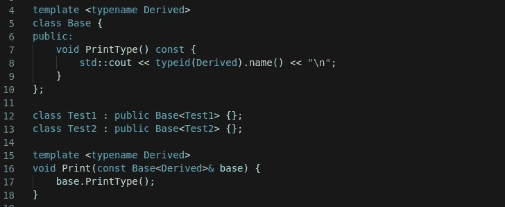
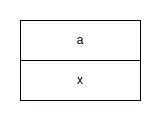
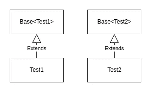

# 用 C++写 CRTP·习语的常用功能

> 原文：<https://betterprogramming.pub/writing-common-functionality-with-crtp-idiom-in-c-c8ccbd2dda2e>

## 奇怪的是，重复出现的模板模式可以帮助我们通过组合模板和继承来编写通用功能



CRTP(作者图片)

# 什么是 CRTP 习语？

CRTP 代表奇怪重复出现的模板模式，这个名字是詹姆斯·o·科普林在他 1995 年的论文中创造的。它是关于使用派生类作为模板参数来专门化基类。它看起来像下面这样:

这是一个很常见的例子，当我们在网上搜索 CRTP 的时候就能找到。然而，仅仅看这个例子并不清楚我们想用这个习语解决什么问题。我将在接下来的章节中介绍细节。

正如你可能猜到的，当我们构造一个名为`derived`的类`Derived`的对象并调用`derived.interface()`时，它打印“实现”。

## 倒置遗传

当一个类从基类派生时，它将继承基类的函数。然后派生类可以调用`public`和`protected`函数，如下例所示:

在 CRTP 的例子中，情况正好相反，基类调用派生类中的函数(参见前面的例子)。

它被称为颠倒继承，因为在正常继承中，我们扩展了基类的功能，而在 CRTP 中，我们基本上是通过继承基类来扩展派生类的功能。希望在后面的章节中会变得更加清晰。

## 为什么叫 CRTP？

我认为这个名字只是被卡住了，因为它可能比“F 有界量化”更容易记住。Jim Coplien 使用这个名字是因为他在各种场合观察到了这种结合模板和继承的模式。

# 它是用来做什么的？

在学习设计、模式或习惯用法时，我们应该知道的最重要的事情是使用它们我们能解决什么问题。让我们更详细地看看 CRTP 能提供什么。

## 向类中添加通用功能

我们都知道应该避免代码中的重复，我们不想在许多不同的类中一遍又一遍地写相同的函数。对于 OOP，首先想到的可能是使用多态性。

让我们看一个例子，假设我们希望我们所有的类都能够使用`typeid`操作符打印出它们类型的名称，我们需要一个名为`PrintType()`的函数。在基类中实现这个函数是行不通的，因为它会打印基类类型。

上面的代码将打印“4Base”两次(带 GCC)。这绝对不是我们想要的。我们可以通过将`PrintType()`虚拟化来解决多态性的问题。

现在它正常工作了，这段代码打印了“5Test1”和“5Test2”两次。注意，我们也可以通过使用`Print()`函数得到相同的结果。

您可能已经知道的一个问题是，通过将我们的函数虚拟化，将会由于使用 vtables 的动态调度而产生运行时成本。这对您的应用程序来说可能不是问题，因为这取决于您如何使用虚函数、您的应用程序在什么环境中运行等等。如果不像在循环中那样频繁地使用虚函数，那么在现代 CPU 上成本可能可以忽略不计。但是，如果使用动态调度的成本对您来说是个问题，您可以使用 CRTP。

以下是 CRTP 的情况:

这段代码打印的结果与前一版本完全相同，而且更加简洁，因为您不必在派生类中编写`PrintType()`的实现。它没有 ***额外的成本*** 用于动态调度，因为我们在这个版本中没有使用虚函数。一切都是在编译时解决的。

您可以看到`Test1`和`Test2`并不像我们熟悉的继承概念中那样必然相关。我们可以将其视为添加功能，我们希望`Test1`和`Test2`打印类型，因此我们通过继承`Base<Derived>`来添加该功能。

## 静态多态呢？

人们谈论静态多态性的 CRTP，这可能会令人困惑，因为我不认为 CRTP 是这样的。正如上面所解释的，CRTP 是为了分解出共同的功能，使我们的代码更加模块化。

事实上，如果我们愿意，我们可以使用 CRTP 来应用静态多态来代替动态多态。在下面的代码中，我们使用众所周知的`Animal`类作为例子。对于使用虚函数的动态多态性，它看起来是这样的:

对于 CRTP，我们可以用以下方式取代这种实施:

如果我们想要的是让我们的代码运行得更快，这可能是一个解决方案。但是如果我们想要的是一个统一的接口，在这个例子中是`MakeSound()`函数，我们可能应该使用如下的编译时鸭类型:

如果我们传递给`MakeSound()`的对象没有实现`::MakeSound()`，编译器将抛出一个错误。

所以，是的，我们可以用 CRTP 实现静态多态性，但是我们必须选择如何明智地实现我们的类，这取决于我们想要实现什么，我们是否想要使用动态多态性，用 CRTP 实现静态多态性，duck typing 编译时，等等。

# 为什么可能？

现在，让我们看看为什么 CRTP 是可能的，当你第一次看到它时，语法可能有点混乱。

## C++中的惰性实例化

让我们再看看上面的例子，为了可读性，这里是相同的代码。

当编译器在第 9 行实例化`Base<Test1>`时，`Test1`被作为模板参数传递，即使`Test1`在那时还不是完整的类型。但是，我们没有编译错误，因为在 C++中，类模板的成员函数只有在被使用/调用时才会生成。或许我们可以称之为惰性实例化。

在这个例子中，成员函数`PrintType()`只在第 14 行生成。在这一点上，`Test1`是一个完整的类型，因此它是有效的。

对于成员变量来说，情况并非如此。下面的代码会给我们编译错误。

唯一不同的是在第 7 行，它会导致下面的错误。

```
error: ‘Base<Derived>::derived’ has incomplete type Derived derived;
```

我想我们可以看出为什么，如果编译器不知道`Derived`是什么，就不知道`Base<Derived>`的内存布局。

## 继承意味着扩展结构

当一个类从基类继承时，除了继承公共和受保护的函数，它还扩展了基类的结构(内存)。如果基类和派生类都有成员变量，如下例所示:

`Derived`类的结构如下所示:



`Derived`内存布局(图片作者提供)

所以在 CRTP 使用`static_cast`进行向下转换(我们正在将`interface()`中的`Base<Derived>`转换为`Derived`是安全的，因为我们确实知道`Derived`是`Base<Derived>`的唯一子元素。

如果你想了解更多关于 C++中内存布局和对象模型的知识，你可以阅读我下面的文章。

[](https://towardsdatascience.com/c-basics-understanding-object-model-b8152c8a4bcf) [## C++基础:理解对象模型

towardsdatascience.com](https://towardsdatascience.com/c-basics-understanding-object-model-b8152c8a4bcf) 

## 模板允许基类知道派生类的类型

CRTP 的另一个要点是，基类必须确切地知道派生类是什么类型，这在我们使用普通继承时是不知道的。由于我们使用模板，我们可以实现这一点。

# 形象化

正如我们上面的例子所述，`Test1`和`Test2`实际上并不相关。他们使用相同的类模板来添加功能。如果我们使用类图来可视化，我们可以看到它们是两个独立的类。



Test1 和 Test2 的类图(图片来自作者)

# 摘要

*   当编写代码时，我们应该通过分解出共同的功能来避免重复
*   我们可以通过许多正确的方法来实现，如动态多态(继承)、CRTP 等。
*   我们应该通过考虑效率和可伸缩性来选择适合我们应用程序需求的解决方案
*   CRTP 提供了一种编写通用功能的方法