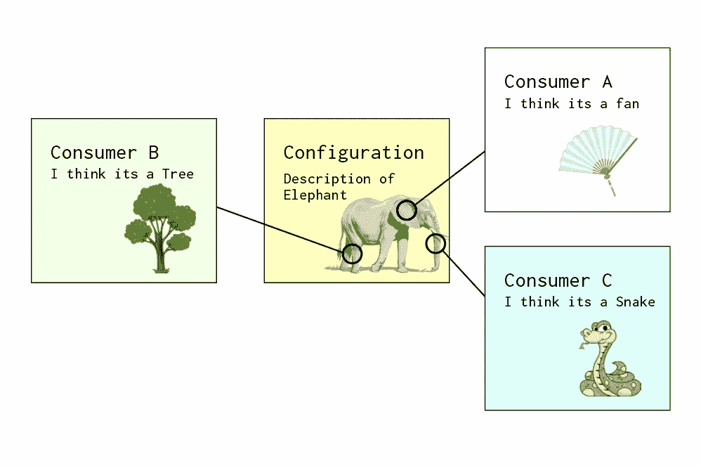
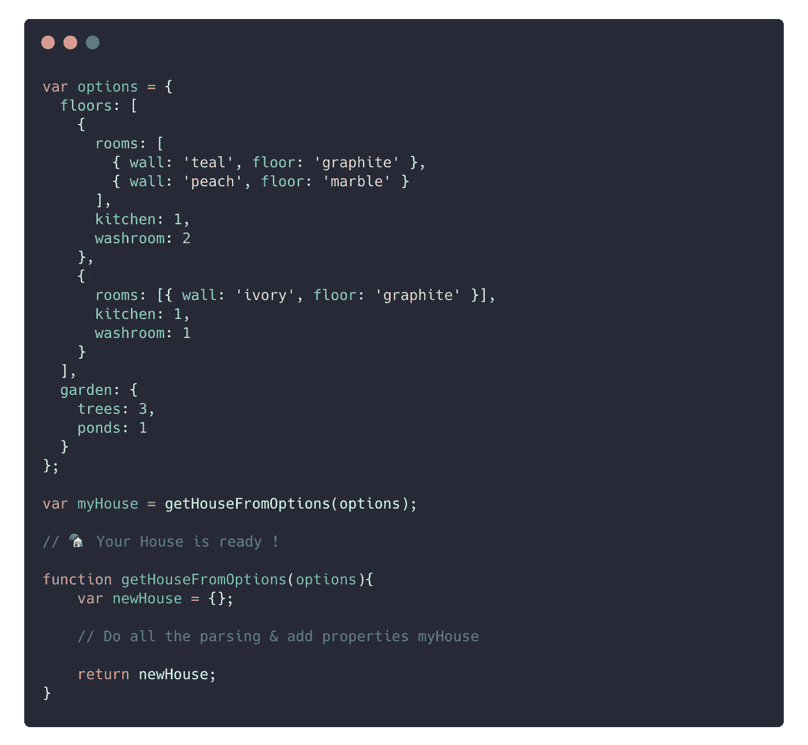
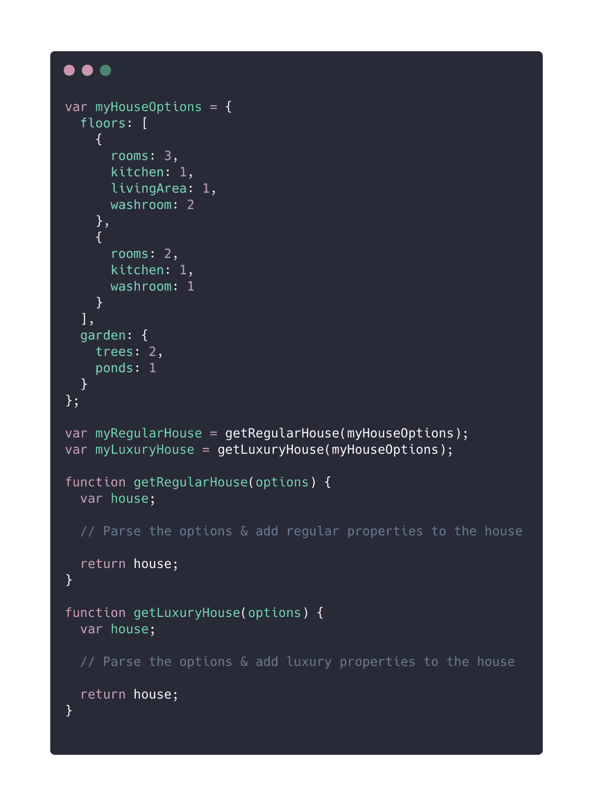

# 使用配置编写更好、更具表现力的代码

> 原文：<https://betterprogramming.pub/writing-expressive-code-9330ca60c8df>

## 传入对象而不是设置单个属性

克里斯·巴巴利斯在 [Unsplash](https://unsplash.com/s/photos/still-life?utm_source=unsplash&utm_medium=referral&utm_content=creditCopyText) 上的照片

这件作品不应该被误认为是设计图案。它是关于在编写函数、设计组件，甚至设计系统时可以采用的良好实践。

主要的主题是关于配置，配置通常在许多编程语言中使用。在本文中，我们将使用 JavaScript 来举例说明。我们稍后将讨论这一点。

现在，让我们探索配置如何改善开发人员的体验和快速开发。

# 什么是配置？

一个配置可以像一个带有一堆键值的 JSON 对象一样简单，也可以像一个由成熟的配置管理系统管理的配置对象一样复杂。定义或存储配置没有对错之分，它只是元数据的一种表示。

# 谁是消费者？任何人

配置消费者可以是任何人。它可以是简单的函数、组件或应用程序。一个配置甚至可以有多个消费者。只不过权力在于消费者而不在于配置。配置不会向消费者说明任何事情，消费者可以决定要推断什么。配置本身只是元数据。

# 配置对消费者意味着什么？

这种配置对消费者来说意味着两件事。

**一个**:可以当作执行上下文。配置可以保存数据，消费者可以使用这些数据来生成基于这些数据的结果。

**两个**:可以当作行为。该配置可用于确定消费者的行为。这两个听起来很相似，不是吗？参数和接口？

传递给函数的参数允许在执行上下文中设置某些内容。它允许调用者将数据传递给消费者。

接口决定了实现者的行为。实现者与接口签订了合同，以实现一组行为(功能)。

一个配置可以明确地传递给一个函数，将数据向下渗透到它的执行数据中。但是它也可以为另一个消费者提供完全不同的目的。

您可能会注意到，灵活性是一个很大的折衷。作者必须承担尊重配置的责任——配置不能独自决定消费者的规则。因此，配置只是描述“是什么”——消费者描述“如何”。到目前为止，您应该已经意识到配置允许您在代码中实践关注点分离。

消费者可以根据配置进行解释

# 举例理解

让我们假设你必须创建一个`house`对象，它包含一些属性，比如`floors`和`garden`。其中`floors`可以包含一个`Room objects`数组，等等。因此，第一种方法是以命令的方式进行，根据需求，通过创建所有必需的子属性并以所需的方式链接这些对象来构造对象。下面的例子相当简单，以命令的方式完成。

现在，有什么问题？

一些明显的推论如下:

*   **缺乏前期信息**。读者必须仔细阅读每一行才能理解正在建造的是什么类型的房子。因此，您需要创建某种思维导图来理解代码。例如，你发现房子的尽头有一个花园。所以当你从上到下阅读代码的时候会有悬念。悬念对读者来说是可怕的——它使他们更加谨慎，因此做决定需要更多的时间。
*   **阅读器上的强制信息**。不是每个人都对“如何”感兴趣。读者可能想知道“是什么”，更进一步，可能想知道“为什么”。这段代码强迫读者一行一行地去读，让读者去解释结果。“是什么”和“如何”之间有一些重叠——这是读者区分的责任。
*   这是对**干**原则的无耻滥用。代码不是有形的，它根本不可重用。如果你想创建一个新的房子，你必须一行一行的重新写一遍。这缺少一个可以产生相同结果的切入点。

显然，有更好的方法。下面是一个使用简单配置的更好版本:

只看代码，我们可以看到它更具表现力。在下面讨论的这个简单的例子中，使用配置还有更好的地方。

# 消费者不可知

配置将消费者的实现细节从预期行为中分离出来。因此，不同的消费者可以共享行为，允许您保留相同的配置，并在此基础上构建多个实现。

假设您已经编写了一个用于创建对象的配置。现在可以有来自不同供应商的多个消费者。例如，对于`house`对象，可以有多个`builder`函数。

这是一个强大的系统。它为您提供了在同一配置上创建多个实现的灵活性。这不应该被误认为是接口。接口仅仅是行为的抽象。你可以说接口是配置，但反之则不然。

接口有更明确的用途，并且与语言本身紧密相关。另一方面，配置是相当开放的——它们可以是同构的:由两个完全不同的系统共享。配置的可序列化特性允许您更进一步，在不能直接相互通信的系统之间使用它。

例如，UI 组件、应用程序状态管理级别和服务级别可以使用相同的配置。

考虑一下机票预订网站中的过滤器。这些过滤器可以由一个配置来管理，因此您不需要编写任何代码。只需添加一个可由 UI 组件使用的配置，以显示新的过滤器并确定点击时要调度的事件的有效负载。应用程序状态管理中间件可以依赖于此来确定对事件采取什么动作。在服务级别，您可以使用它来构造数据库访问的查询。

配置不限于行为。作者可以自行决定是使用配置来定义行为，还是作为配置消费者的简单输入。

# 可预测的行为，关注点的分离

读者可以提前了解作者的意图。焦点从代码的“为什么”转移到“是什么”消费者行为和环境的分离使得代码更加清晰。读者知道在哪里可以找到“什么”和“如何”的代码。

编写配置的实践有助于开发人员发展编码的心智模型，以采用更具声明性的方法。

# 表面积更小，维护重量更轻

配置成为真理的来源。(配置的可信度还是要看消费者)。要进行任何添加或更改，您可以始终依靠配置来进行更新。

该配置公开了用于修改代码的外围应用。您可以改变执行上下文或消费者的行为。同样，你能在多大程度上改变这些代码取决于消费者。仅仅增加配置对消费者没有任何好处。消费者必须支持灵活性。设计一个可配置的消费者本身应该有一个独立的博客，甚至一本书。同样，它可以是一个简单的消费者，如实用功能，也可以是一个可配置的工作流系统。

在 Kubric，我们已经将复杂的配置发展成语言，在我们的 UI 中表达应用程序状态、功能和工作流。将来会分享更多关于这种模式和有用的家庭酿造技术。

祝您愉快！