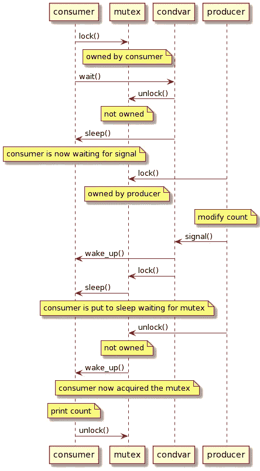

# 用 C++编写线程间消息传递框架

> 原文：<https://betterprogramming.pub/writing-framework-for-inter-thread-message-passing-in-c-256b5308a471>

## 一个在线程间传递消息的框架，而不必担心底层线程代码


照片由 [Christian Wiediger](https://unsplash.com/@christianw?utm_source=medium&utm_medium=referral) 在 [Unsplash](https://unsplash.com?utm_source=medium&utm_medium=referral) 上拍摄

# C++中的线程间消息传递

## 概观

在许多情况下，开发人员在开发应用程序时必须处理多线程。在处理多线程时，我们几乎肯定需要同步它们，而同步方法之一就是消息传递。

在本文中，我将从使用标准库在 C++中实现线程间消息传递开始，然后介绍实现问题，最后展示如何编写一个简单的框架来使我们的代码更加优雅。

## 互斥线程同步

我相信大家都熟悉互斥体，我们使用同步原语来防止共享资源或共享对象被多个线程同时访问，从而导致一种称为[竞争条件](https://en.wikipedia.org/wiki/Race_condition#In_software)的情况。

一个简单的例子是一个应该修改一个`int`的线程，另一个例子是如果值不为零就打印它，然后把它设置为零。在 C++中，我们可以通过使用`std::thread`和`std::mutex`来实现这个简单的例子，如下面的代码所示。

我们有两个线程，`producer`和`consumer`，它们的运行时间由运行这个应用程序的操作系统控制。在访问`count`之前，两个线程都必须获取`count_mutex`。我们不能轻易预测这段代码的结果，因为两个线程的调度都是由操作系统控制的。

您可能会注意到这种锁定机制的一个问题是，两个线程都必须不断地检查共享资源`count`是否准备好被使用，这浪费了本来可以用于其他目的的 CPU 周期。

我们已经解决了防止竞态条件的问题，但是由于上面的原因，这个解决方案不是很有效。为了提高代码的效率，我们可以使用另一个同步原语，条件变量。

## 条件变量

条件变量是一个同步原语，它允许线程在处理共享资源之前等待条件发生。与前面的例子不同，在前面的例子中，线程必须定期检查共享资源是否准备好被使用，通过条件变量，等待线程被置于睡眠状态，直到条件发生。

条件变量必须与互斥体一起使用。这是因为条件变量不能保护资源不被同时访问，而只是为线程提供了一种等待条件和其他线程发出条件信号的机制。因此，为了保护我们的共享资源，我们仍然需要一个互斥体。

在 C++中，我们可以使用`std::condition_variable`，它类似于`std::thread`和`std::mutex`，是 POSIX 实现`pthread_cond_t`的包装器。有一点需要注意的是，`std::condition_variable::wait()`只能和`std::unique_lock`一起使用。现在让我们更新我们的代码，使它更有效。

在程序退出之前，这段代码将打印 0 到 9。现在，我们的代码完全按照我们想要的方式运行。我们不会浪费 CPU 周期不断轮询我们的共享资源是否准备好使用。

但是，我想在这里强调的一点是，当我第一次学习条件变量时，我花了一些时间来理解它，因为它不是很清楚，甚至我可以说非常混乱条件变量如何使用互斥体。

下面是我们的`consumer`线程发生的情况(见评论)。

当我们构造`std::unique_lock`时，它将获得互斥体。在`std::condition_variable::wait()`函数中，互斥体被释放，并且`consumer`线程被置于睡眠状态。当条件发生时，`consumer`线程被唤醒，并立即获取互斥体，仍然在`wait`函数中。所以你可以看到有 ***副作用*** 当我们调用`std::condition_variable::wait()`时，它会在返回前释放并获取互斥体。

在`producer`线程中，会发生以下情况。

它比`consumer`线程更容易理解，因为当我们调用`std::condition_variable::notify_one()`时没有副作用。

另一件不太明显的事情是，互斥体和条件变量都可以让线程休眠。我希望现在更清楚了，我们需要一个互斥体来保护共享资源`count`。

作为一个例子，下面的序列图显示了一个可能发生的场景。



一个可能场景的序列图(图片由作者提供)

现在我们知道了条件变量是如何工作的(它们是如何使用互斥体的)，我们可以继续下一节来实现一个更有用的线程间通信机制，消息传递。

# 线程间消息传递

我们上面的例子不是很有用或实用，因为它只是修改和检查一个`int`。我们通常需要的是一种通信方式，从一个线程向另一个线程发送命令/消息。我们还需要有一个队列，这样发送线程就不用担心给接收线程 CPU 时间。我们可以使用一个受互斥体保护的`std::queue`。

现在我们来看一个例子。假设我们正在实现一个应用程序来控制一个智能灯泡，它具有以下要控制的功能:

*   状态:开/关
*   强度:0–255
*   颜色:红色(0–255)，绿色(0–255)，蓝色(0–255)

我们有两个线程，一个是`controller`，另一个是`handler`。第一步是实现`Message`结构。

接下来，我们创建处理函数。对于这个例子，我们只打印接收到的数据。在实际应用中，这些是我们控制实际硬件的地方。

现在，我们还可以通过创建两个函数来包装发送端和接收端，从而简化上面的条件变量实现。

`GetMessage`函数将阻塞调用线程，直到收到一条消息，并返回所收到消息的副本。`PutMessage`函数确保在推送新消息和通知接收线程之前获取互斥体。

`controller`线程可以如下实现。

并且`handler`线程可以实现如下。

一旦开始，`handler`线程将等待接收消息。当接收到消息时，将检查其 id，并将其参数传递给正确的函数处理程序。最后，我们可以创建一个简单的主函数来测试我们的程序。

这个程序打印如下，它的工作！

```
SetState 1
SetIntensity 255
SetColor 255, 255, 255
SetState 0
```

## 这种方法的问题是

这种方法的一个问题是，每次我们想要添加新消息时，我们都必须执行以下操作:

*   添加一个处理函数
*   修改`Message`类，添加一个新的`id`和一个新的`param`
*   修改`handler`线程，向`switch`语句添加新的`case`

这没什么大不了的，但是如果我们可以简单地注册一个处理程序就好了，这个处理程序可能是下列之一:

*   自由函数
*   兰姆达斯
*   功能对象
*   `std::function`物体

我们想要的是类似如下的东西:

```
Receiver receiver;
receiver.Handle([](const Color& color){});
```

它可以支持不同类型的调用，但是最有用的一个当然是使用 lambda，正如你在上面看到的，因为我们可以在代码中看到处理程序，而不必跳到函数定义中。

# 抽象消息传递

要实现一个更简单的框架，请遵循以下步骤。

## 接收器类别

首先，让我们创建一个名为`Receiver`的类来包装接收线程以及管理处理程序。它应该是这样的:

我们可以调用`Receiver::Run()`来启动线程，`Receiver::Join()`来加入线程。注意，我们对消息使用`std::any`,因为我们希望能够接收任何类型，并将该类型传递给能够处理它的处理程序。

我们需要的下一件事是有一个`std::vector`来存储我们的处理程序，并实现一个名为`Handle()`的函数模板，该模板接收可调用对象并将其存储到我们的`std::vector`中。

要实现它，我们需要两种技术，我们在以前的帖子中讨论过，即:

*   类型擦除:包装任何类型的可调用程序，以便我们可以将它们存储在类似`std::vector`的容器中
*   函数特征:检查函数的 arity 和参数类型

如果你还不熟悉这些技术，可以看看我下面的文章。

[](https://towardsdatascience.com/c-type-erasure-wrapping-any-type-7f8511634849) [## C++类型擦除:包装任何类型

### 了解如何用 C++编写类中任何类型的包装器，以提高代码的抽象层次。

towardsdatascience.com](https://towardsdatascience.com/c-type-erasure-wrapping-any-type-7f8511634849) [](/inspecting-properties-of-callables-with-function-traits-in-c-6bb2d9388fc5) [## C++中用函数特征检验可调用函数的性质

### 理解我们如何检查可调用的属性来提高代码的抽象层次

better 编程. pub](/inspecting-properties-of-callables-with-function-traits-in-c-6bb2d9388fc5) 

## 实现 CallbackWrapper 类

现在我们可以使用这两种技术实现`CallbackWrapper`类。我们希望我们的类为以下各项提供接口:

*   检查它是否可以接受类型作为参数，以及
*   将调用转发到包装的对象，该对象可以是任何类型的可调用对象

所以我们实现了下面的基类/接口。

对于本文，我们限制我们的类只支持一个参数。接下来我们需要实现的是一个类模板，它实现了上面的接口，并使用`function_traits`类模板生成`arg_type`。

我们有两个`operator()`重载，一个接受`std::type_info`，如果类型匹配包装的可调用参数类型，则返回`true`，否则返回`false`。

另一个接受`std::any`并使用`std::any_cast`将其转换为`arg_type`，然后将其转发给包装的可调用函数。如果用错误的类型调用，它将抛出`std::bad_any_cast`。

下面是`CallbackWrapper`类的完整实现。您应该阅读上面链接的关于类型擦除的文章，以完全理解它。

## 实现句柄函数模板

最后，我们的`CallbackWrapper`类已经实现，现在我们可以返回到`Receiver`类并添加`std::vector<CallbackWrapper> callbackWrappers;`私有成员变量来存储我们的处理程序。我们可以添加一个名为`Handle`的函数模板，它接受任何类型的调用，并将它们存储到`callbackWrappers`容器中。

我们添加了一个`static_assert`来让客户端代码知道我们只支持一种参数类型。然后我们实现我们的`Consume()`线程。

如您所见，每次收到消息时，它都会遍历所有处理程序，检查处理程序是否可以接受该类型，如果可以，它将被调用来处理数据。

请注意，对于同一数据类型，我们可以有多个处理程序。`Receiver`类的完整实现如下。

## 我们如何使用这个框架？

这是我们在代码中使用它时的样子。

有了这个框架， ***我们在添加新消息时唯一需要做的事情*** 就是通过调用`Handle`函数模板来注册处理程序。这比我们必须修改更多代码的原始版本要简单得多。

如果我们愿意，我们也可以注册函数对象，自由函数，或者`std::function`对象。例如，我们可以在上面的例子中重用现有的免费函数。它看起来是这样的:

我个人更喜欢 lambda 版本，因为我可以看到处理函数，而不必像自由函数版本那样跳到函数定义。

# 摘要

*   C++通过包装线程、互斥体、条件变量等的 POSIX 实现来支持线程同步机制。
*   我们可以使用互斥锁通过锁定机制来同步多线程共享的资源的使用
*   为了避免在睡眠和轮询中浪费 CPU 周期，我们可以使用条件变量来等待和发送信号
*   使用`std::queue`，我们可以为线程创建一个框架来发送和接收消息
*   为了简化我们的框架，我们可以结合函数特征使用类型擦除技术
*   有了这个简化的框架，我们可以简单地注册我们的处理程序/回调函数，它可以是任何类型的可调用函数，剩下的由框架来处理

我希望你喜欢阅读这篇文章。