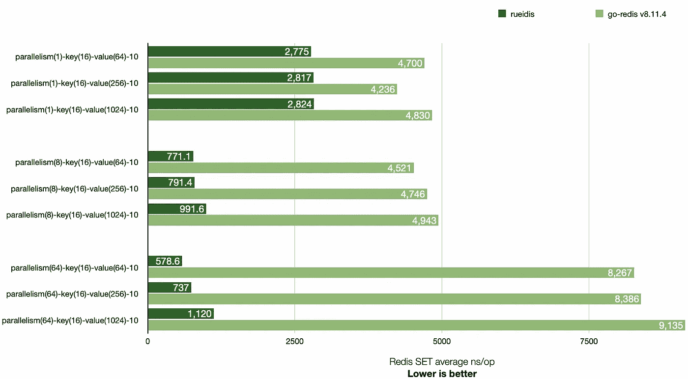

# 编写高性能 Golang 客户端库——流水线批处理

> 原文：<https://betterprogramming.pub/writing-high-performance-golang-client-library-part-1-batching-on-pipeline-97988fe3211>

## 以正确的方式在流水线的写入路径上进行批处理

照片由[马库斯·达尔科尔](https://unsplash.com/@marcusdallcol?utm_source=medium&utm_medium=referral)在 [Unsplash](https://unsplash.com?utm_source=medium&utm_medium=referral) 拍摄

[Rueidis](https://github.com/rueian/rueidis) 是我最近自己构建的一个高性能 Golang Redis 客户端库，目的是使用`server-assisted client side caching`特性，自 Redis 6 发布以来(2020 年)，其他现有 Golang 库尚未很好地支持该特性。

除了客户端缓存，我还从构建库的过程中学到了很多常用的技术，这些技术在日常编程中也很有用。

在这一系列的帖子中，我将分享我在`[rueidis](https://github.com/rueian/rueidis)`中学到并使用的技巧。这些技巧不仅推荐给库作者，也推荐给在日常生活中处理网络或 RPC 的程序员。它们是:

*   第 1 部分——管道配料
*   [第二部分——从频道中再次阅读？](/working-on-high-performance-golang-client-library-reading-again-from-channels-5e98ff3538cf?source=friends_link&sk=a336644446cf70749e1a0f1aa0d4c706)
*   第 3 部分——用`sync.Cond`去除坏的忙循环
*   第 4 部分—优雅地关闭并发作者的通道

# 请求和响应模型

许多客户端和服务器通信都是基于请求和响应模型设计的。

从客户端库的角度来看，以这种方式编程非常容易:

1.  将请求写入套接字。
2.  读取套接字的响应。

写和读操作都会引起系统调用，并且套接字会被占用，直到读操作完成。

为了支持并发操作和减少握手开销，客户端库通常使用连接池技术。然而，系统调用和往返时间的成本仍然巨大。

# 管道铺设

TCP 或 QUIC 提供了可靠流的抽象。依赖于流的高级协议，如 HTTP 1.1、Redis 序列化协议 3 或 PostgreSQL 协议 3.0，通常支持流水线操作。

也就是说，客户端库可以只在传出流上继续写，同时只在传入流上继续读，而无需相互等待。

此外，通过这种方式，可以将每个流上的多个操作批处理到一个系统调用中。

因此，如果客户端被编程为使用流水线，那么它不需要为每个操作支付两个读/写系统调用和一个 RTT 的成本，因此它可以具有更好的性能。

 [## 使用流水线技术加速查询

### Redis 是一个 TCP 服务器，使用客户机-服务器模型和所谓的请求/响应协议。这意味着…

redis.io](https://redis.io/topics/pipelining) 

以上 Redis 文档推荐阅读。它很好地解释了管道上的批处理是如何有益的，以及如何将吞吐量提高 10 倍。

# 戈朗管道配料

在 Golang 中，在这种情况下只需使用`channel`和`bufio.Writer`就可以很容易地实现批处理。

这里有一个代码片段，类似于我在`[rueidis](https://github.com/rueian/rueidis)`中使用的自动批处理管道上的请求。

这段代码片段是如何工作的？`bufio.Writer`已经用它默认的 4k 缓冲区帮助我们减少了套接字写系统调用。当缓冲区满了，它会自动调用 socket write 系统调用。然而，换句话说，在缓冲区满之前，请求只是在客户端缓冲区中保持未发送状态。

作为一个客户端库，我们不能让请求停留在缓冲区中，等待用户发送更多的请求来填充缓冲区。如果没有进一步的请求要发送怎么办？我们需要尽快把他们送出去。

我们在这里使用通道的非阻塞读操作`select case with default`来检测是否没有进一步的请求。如果是，则立即刷新`bufio.Writer`缓冲器。之后，我们仅对通道上的下一次读取使用阻塞操作，以避免循环忙于旋转。

# 结果

因此，使用类似的批处理技术，`[rueidis](https://github.com/rueian/rueidis)`在跨 1、8、64 个并行体的本地并行基准测试中比`go-redis`具有更好的吞吐量:

基准源代码:[https://github.com/rueian/rueidis-benchmark](https://github.com/rueian/rueidis-benchmark)

# 下一步是什么

在 Golang 中，对管道的写路径进行批处理是相当容易的，但是处理读路径要困难得多。

如下文 [PostgreSQL 文档](https://www.postgresql.org/docs/14/libpq-pipeline-mode.html)所述:

> 虽然管道模式提供了显著的性能提升，但是使用管道模式编写客户端更加复杂，因为它涉及到管理挂起查询的队列，以及查找哪个结果对应于队列中的哪个查询。

这可能是大多数库默认不这么做的原因。

在接下来的系列文章中，我将分享`[rueidis](https://github.com/rueian/rueidis)`如何将流水线响应映射回请求和响应模型。

# 附录

 [## GitHub - rueian/rueidis:一个快速的 Golang Redis RESP3 客户端，支持客户端缓存，自动…

### 一个快速的 Golang Redis RESP3 客户端，支持自动流水线操作和客户端缓存。

github.com](https://github.com/rueian/rueidis)  [## 服务器辅助的客户端缓存

### 客户端缓存是一种用于创建高性能服务的技术。它利用了可用的内存…

redis.io](https://redis.io/topics/client-side-caching)  [## 34.5.管道模式

### libpq 管道模式允许应用程序发送查询，而不必读取先前发送的查询的结果…

www.postgresql.org](https://www.postgresql.org/docs/14/libpq-pipeline-mode.html)