# 如何不用 Xcode 写 iOS 应用

> 原文：<https://betterprogramming.pub/writing-ios-apps-without-xcode-89450d0de21a>

## 你知道你有 iOS IDE 选项吗？

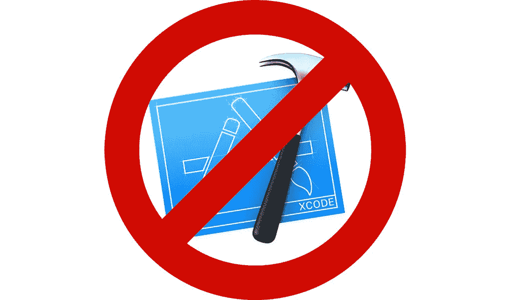

没有 Xcode IDE 的 iOS 开发(图片来源:作者)

[Xcode](https://developer.apple.com/xcode/) 是苹果公司的 IDE(集成开发环境)，历史悠久。它原生于 iOS 开发，支持 [Objective-C](https://developer.apple.com/library/archive/documentation/Cocoa/Conceptual/ProgrammingWithObjectiveC/Introduction/Introduction.html) 和 Swift，包括 XIB 和故事板编辑器、编译器、调试器和开发所需的一切。

为什么会有人想开发没有 Xcode 的 iOS 应用？有几个可能的原因:

*   Xcode 消耗大量内存，在许多 MAC 上运行缓慢。
*   Xcode 有很多 bug。苹果修复了它们，但添加了新功能的新漏洞。
*   Xcode 只能在 macOS 上工作，这让来自其他平台的开发者感到不舒服。

不幸的是，苹果千方百计阻止开发者使用其他平台；iOS simulator 是 Xcode 应用程序包的一部分，没有编辑故事板的替代方案，并且在没有 Xcode 的情况下制作完整的签名版本非常复杂。

所以，要明确的是，有些事情是不可能的，所以不要期望克服这些限制:

*   原生 iOS 应用只能在 Mac 上开发。你甚至可以在 Windows 或 Linux 中编写代码，但是你不能在那里编译和签名。
*   非本机平台，如 Flutter 或 React Native，也不会在没有 Mac 的情况下制作 iOS 版本。
*   故事板只能在 Xcode 中编辑，所以没有 Xcode 的开发就意味着没有故事板的开发。
*   iOS 开发的替代 ide 需要 Xcode。您不需要运行它，但是您应该安装它。
*   可以从命令行(见下文)签名和上传应用到 App Store(或测试飞行)，但你需要安装 Xcode。

我不是说 Xcode 绝对不可用。正好相反；这是制作 iOS 应用最简单的方法。但是，如果你面临上述困难之一，或者只是想尝试一些新的东西，这个故事是给你的。

# 土著还是非土著？

iOS 应用程序可以是原生的，也可以是非原生的。其实不是非黑即白；之间有很多选择。

绝对的原生应用是用 Objective-C 或者 Swift 编写的。其中有些部分可以用 C 或 C++编写。用户界面通常以故事板或 XIB 文件的形式呈现。

绝对非原生的 app，只是包裹在`WKWebView` ( `UIWebView`)里的网站。现在苹果拒绝这类应用，但在过去，它们相当普遍。显然，这样的应用不需要太多与 Xcode 的交互，用一个`WebView`创建一个`UIViewController`几乎不是问题，即使你在网上租了 Mac，并且没有任何 Xcode 的使用经验。

所有其他选项都在中间。它们使用本地组件，但代码通常是用非本地语言编写的。比如 Flutter 用 Dart，React Native — JavaScript，Unity — C#。所有这些框架都使用它们自己的开发环境，但是它们都导出一个 Xcode 项目。您需要使用… Xcode 构建它来发布版本。通常情况下，这不是问题。该文稿包含针对从未见过 Xcode 的人的分步说明。

在 Android Studio 中编写 Flutter 应用程序并不是这个故事的主题。这是一个默认选项，所以我们不会在这上面浪费时间。我们将讨论没有 Xcode 的原生 iOS 应用程序的开发、测试和分发。

# 我们有哪些问题？

我们来看看为什么不用 Xcode 写 iOS 应用不那么容易。

*   **创建项目** — Xcode 将您的工作存储在项目和工作区中。工作区只是一组相互关联的项目。两个都是文件夹，里面都是文本文件。这些文件的格式是专有的，但是它们很大，并且有很多生成的 id，所以它们不应该被人编辑。
*   **用户界面** —故事板是另一种专有格式。你不能在 Xcode 之外编辑它。
*   **构建和测试** —有命令行编译器`swiftc`、`gcc`和`llvm`，但是如何做出一个可运行的 iOS app 呢？

# iOS 项目

任何比“Hello world”更复杂的 app 都不止一个文件。以 iOS 为例，即使是“Hello world”也不止一个文件。

可在 Simulator 中运行的 iOS 应用程序至少包含两个组件:

*   可执行二进制
*   `Info.plist`文件

在真实的 iOS 设备上运行的完整应用程序有更多的组件，但我们将在稍后讨论。

要创建二进制文件，您至少需要两个项目:

*   源代码
*   构建脚本

iOS 应用可以从命令行构建；比如用`make`。我们稍后将研究如何做。

构建 iOS 应用程序的一种更舒适的方式是使用 Xcode 项目。我发现只有一个 app(除了 Xcode)可以创建这样的项目——[app code](https://www.jetbrains.com/objc/)。它是 JetBrain 的应用程序之一，类似于 IDEA 和 Android Studio，但用于苹果特定的开发，macOS 和 iOS。它只在 macOS 上运行，并且是付费的(从 8.90 美元/月或 2020 年 4 月的 89 美元/年开始)。

**警告！AppCode 无法编辑故事板。当你尝试的时候它会打开 Xcode。而且需要安装 Xcode 否则，它不会构建应用程序。**

## **Xcode 项目的结构**

正如我前面提到的，Xcode 项目不应该手动编辑。

`xcodeproj`是一个文件夹，里面包含一个文件和几个文件夹。

文件是`project.pbxproj`。它包含了项目的所有信息，是最重要的文件。

**警告！如果您要编辑现有项目，请制作备份副本。**

`project.pbxproj`是一个类似`plist`的文件。这种格式来自 NeXTSTEP 平台。现代的`plist`是 XML，但是`project.pbxproj`更类似于 JSON(虽然不是 JSON)。

`project.pbxproj`大多是一组物体。每个对象都有一个唯一的标识符(一个 96 位的数字或一串 24 个十六进制字符)。对象可以是源文件、链接框架、构建阶段等。对象可以是包含其他对象的组。对象可以有属性和类型。其中一个对象是根对象。它的类型为 PBXProject。

如果在所有警告之后，您决定编辑`project.pbxproj`文件，您可以使用带有[语法 Xcode 项目数据](https://marketplace.visualstudio.com/items?itemName=mariomatheu.syntax-project-pbxproj)扩展名的 Visual Studio 代码。在这里你可以找到一个[文件格式](http://www.monobjc.net/xcode-project-file-format.html)的详细描述。

除了`project.pbxproj`，Xcode 项目还包含几个文件夹。都是选项。

`project.xcworkspace`是一个只包含一个项目的工作空间。它是在 Xcode 中打开项目文件时自动创建的，包含构建模式、关于断点的信息和其他数据，不属于项目的一部分。

`xcuserdata`是包含不同用户的个人数据的文件夹。如果你是唯一的开发者，里面只有一个文件夹。这个文件夹是可选的，可以从 Git 和其他存储库中排除。

`xcshareddata`是用户之间共享数据的文件夹；比如，方案。

如果你不用 Xcode，你只需要`project.pbxproj`。

## 使用 make 从控制台构建 iOS 应用程序

说实话，我觉得这样做项目太头疼了。与手动完成这么多步骤相比，用 Xcode 解决你的异议更容易(无论如何你需要安装它来签署应用程序)。但是理论上的可能性很有意思，我们再深入挖掘一下。

首先，我们来获取一个 SDK 路径:

```
xcrun --sdk iphonesimulator --show-sdk-path
```

结果将是这样的:

```
/Applications/Xcode.app/Contents/Developer/Platforms/iPhoneSimulator.platform/Developer/SDKs/iPhoneSimulator13.4.sdk
```

在`Makefile`中，您可以粘贴`xcrun`的输出，或者使用该命令作为脚本的一部分:

```
SDKROOT:=$(shell xcrun --sdk iphonesimulator --show-sdk-path)
```

让我们制定一个`app`目标:

```
app: main.m
    clang -isysroot $(SDKROOT) -framework Foundation -framework UIKit -o MakeTest.app/$@ $^
```

`clang`是来自 Xcode 包的标准编译器。

我们添加了两个框架:

*   基础
*   UIKit

输出文件是`MakeTest.app/app`。

`$@`是一个自动变量，其计算结果为目标的名称。在我们这里是`app`。`$^`是另一个自动变量。在本实验中，它评估为依赖项的完整列表— `main.m`。

和`clean`目标:

```
.PHONY: clean
clean:
    rm MakeTest.app/app
```

最后，让我们宣布`app`是一个主要目标:

```
default: app
```

下面是完整的`Makefile`:

如果您从未使用过`make`来构建项目:

*   `make app`建立一个`app`目标。
*   `make clean`清理(删除`app`文件)。

因为我们声明了一个默认目标，所以我们可以使用`make`命令来构建项目。

下一步是创建应用程序文件夹。没错，iOS app 是文件夹。

```
mkdir MakeTest.app
```

在`MakeTest.app`里面应该有两个文件:

*   `app`是一个二进制文件，我们用`make`命令构建它。
*   `Info.plist`(以大写 *I* 开头)是一个项目的属性列表。iOS 设备或模拟器需要知道运行哪个二进制文件、它的版本以及其他数据。

这是我们的`Info.plist`。如果您运行自己的测试，您可以更改一些字段:

最后一个文件是`main.m`。在传统的 iOS 项目中，有三个不同的文件:

*   `main.m`
*   `AppDelegate.h`
*   `AppDelegate.m`

这只是一个组织的问题，而不是一个严格的规则。由于所有组件都非常小，所以让我们将它们放在一起。

这是这款应用的主要功能。它的唯一目的是进入主循环。我们还传递了一个申请代表的名字——`AppDelegate`:

```
int main(int argc, char *argv[]) {
  @autoreleasepool {
    return UIApplicationMain(argc, argv, nil, NSStringFromClass([AppDelegate class]));
  }
}
```

如果用 Xcode 或 AppCode 创建项目，这个函数会自动生成。

不要忘记将`UIKit`包含到项目的所有 Objective-C 文件中:

```
#import <UIKit/UIKit.h>
```

如果您来自 Swift，您可能不知道在 Objective-C(以及 C++)中，每个类都必须声明和定义。

类声明:

```
@interface AppDelegate : UIResponder <UIApplicationDelegate>
@property (strong, nonatomic) UIWindow *window;
@end
```

类别定义:

```
@implementation AppDelegate
- (BOOL)application:(UIApplication *)application didFinishLaunchingWithOptions:(id)options {
  CGRect mainScreenBounds = [[UIScreen mainScreen] bounds];
  self.window = [[UIWindow alloc] initWithFrame:mainScreenBounds];

  UIViewController *viewController = [[UIViewController alloc] init];
  viewController.view.backgroundColor = [UIColor whiteColor];
  viewController.view.frame = mainScreenBounds; UILabel *label = [[UILabel alloc] initWithFrame:mainScreenBounds];
  [label setText:@"Wow! I was built with clang and make!"];
  [viewController.view addSubview: label]; self.window.rootViewController = viewController; [self.window makeKeyAndVisible];

  return YES;
}@end
```

它创建了一个窗口、视图控制器，并在其中心创建了一个标签。我就不赘述了，因为这和 Xcode 之外的编码无关。只是 iOS 编程而已。

应用程序代理、视图控制器和其他组件可以放在单独的文件中。更重要的是，这是值得推荐的做法。从技术上讲，基于`Makefile`的项目可以使用与普通 Xcode 项目相同的结构。

它看起来是这样的:


不用 Xcode 搭建的 iOS 项目，运行在 iPhone 11 模拟器中。

`main.m`的完整源代码:

那么，下一步是什么？

*   授权文件—如果您需要向 iOS 项目添加任何功能，您将需要一个授权文件。这是一个`plist`文件，其中的键值对描述了它使用的 iOS 设备或苹果用户帐户的哪些资源或服务。你可以在[苹果文档](https://developer.apple.com/documentation/bundleresources/entitlements)中找到更多细节。
*   你可以看到我们例子中的应用程序没有全屏。它可以通过添加启动图像或适当的大小，或启动屏幕故事板来修复。
*   制定两个目标:iOS 设备和模拟器。iOS 构建需要签名，这个我们后面会讲到。
*   应用程序图标可以作为资产文件夹`Assets.xcassets`的一部分添加，或者作为一组 PNG 文件添加(参考`Info.plist`)。`Assets.xcassets`是一个包含应用资产的文件夹。我们稍后再来讨论。

如果你有任何以这种方式构建商业 iOS 应用程序的经验，请留下评论。我很乐意根据您的经验提供更多信息。

# 构建用户界面

我发现了四种不用 Xcode 和故事板来构建用户界面的方法:

*   **SwiftUI** —苹果新推出的 UI builder 可以在任何文本编辑器中编辑。比如 Visual Studio Code (VS Code)有一个写 Swift 代码的插件。而且是免费的。缺点是需要 iOS 13 才能用 SwiftUI 运行 app。再过几年，它将不再是一个缺点，但现在放弃对 iOS 12 和更早版本的支持还为时过早。
*   **从代码中创建组件** —任何组件都可以从 Objective-C 或 Swift 代码中创建，无需任何 UI 设计人员。很长很不舒服，但是很普遍。代码可以在任何地方编写，你的应用甚至可以在第一部 iPhone 上运行(如果你能为这样一部老设备开发的话)。
*   **外部工具**——有一些工具允许将设计(例如，在[草图](https://www.sketch.com)中制作)转换成原生 iOS 代码(在 Objective-C 或 Swift 中)。这类工具的一个例子是 [Supernova](https://supernova.io) 。它是付费的，就像其他具有类似功能的工具一样。
*   **外部库** —这些库允许你编写简短的代码来构建本地 UI。它们是免费的，但是你需要学会使用它们。这几乎就像学习一门新的编程语言。例如:LinkedIn 中的 [LayoutKit](https://github.com/linkedin/LayoutKit) 。

没有完美的解决方案。每一种都有优缺点，用什么由你决定。我认为假以时日，SwiftUI 将成为最流行的为 iOS 构建 UI 的方式。但如果你需要更快地发布你的应用，你最好使用另一种方式。无论如何，这是你的选择。

## 斯威夫特伊

SwiftUI 是苹果公司的一个新框架，它将取代 UIKit 和故事板。

优点:

*   是 iOS 原生的。苹果将支持它，推广它，并激励开发者使用它。
*   SwiftUI 代码可以在任何文本编辑器中编写。
*   SwiftUI 可以在同一布局中与 UIKit 混合使用。

缺点:

*   SwiftUI 只能针对 iOS 13 或更高版本。不会在 iOS 12 上运行。
*   布局预览和模拟仅在 Xcode 中有效。没有用于 AppCode、VS Code 或任何其他代码编辑器的插件。

让我们看看 SwiftUI 是如何工作的:

这个例子借用了官方[苹果教程](https://developer.apple.com/tutorials/swiftui/creating-and-combining-views)。

在这里你可以找到另一个[详细的 SwiftUI 教程](https://www.hackingwithswift.com/quick-start/swiftui)。

## 从代码创建 UIKit 组件

这是一种绝对通用的创建布局的方法。你可以创建组件，添加约束，做任何事情。但是每个组件都需要完全初始化。当你看不到自己在做什么的时候，带着约束工作是一场噩梦。只能在 Simulator 或 iOS 设备上预览布局，每次修改都需要重新启动应用程序。

它是这样工作的:

这段代码应该在`UIViewController`子类中。

每个 UI 组件都应该这样创建。它们可以嵌套，就像故事板一样。故事板的所有特性和 UIKit 的所有组件都可以通过代码获得，包括表格、集合等。

## 外部工具

设计师使用 Sketch、Adobe XD、Zeplin 或其他工具进行 iOS 布局。如果你能把它们导出到一个 iOS 应用程序中，那不是很好吗？绝对的。这是可能的，但不是免费的。

我发现了几个允许这样做的工具:

*   [超新星](https://supernova.io)——每月 20 美元起
*   [草图代码生成器插件](https://www.paintcodeapp.com/sketch)—€47/年；加上[草图](https://www.sketch.com)，99 美元
*   [Zeplin](https://zeplin.io) 有 [Swift](https://extensions.zeplin.io/zeplin/swift) 和 [Objective-C](https://extensions.zeplin.io/zeplin/objective-c) 扩展，将样式导出到 iOS 代码。一个项目免费，然后每月 17 美元起

请注意，价格不是固定的，可能随时变化。

这些工具/插件的结果是原生 iOS 代码、Swift 或 Objective-C。

假设我们有一个草图设计。对于这个例子，我下载了文件[废物管理应用草图资源](https://www.sketchappsources.com/free-source/4311-waste-management-app-sketch-freebie-resource.html)。


素描

Sketch app 打开时有警告(版本不匹配)，但不是问题。下一步——超新星。

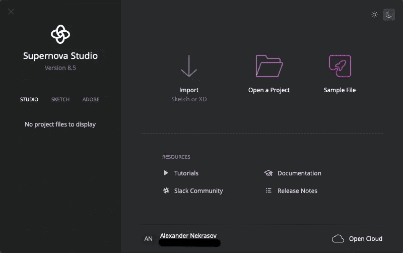

超新星工作室

Supernova Studio 具有导入草图或 Adobe XD 文件的功能。

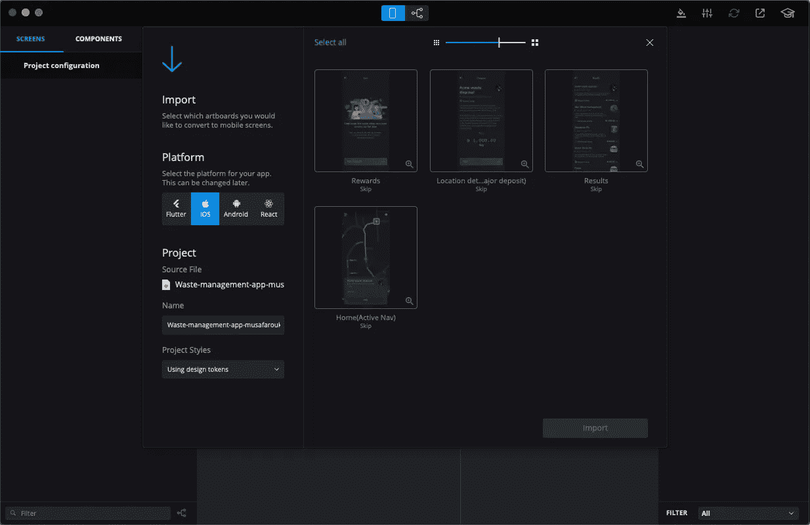

将草图导入 Supernova Studio

导入工作正常，但是有一些小故障。比如后退箭头(见截图)。此外，在预览时，文本与按钮重叠，但应该用约束或`UIScrollView`来解决。

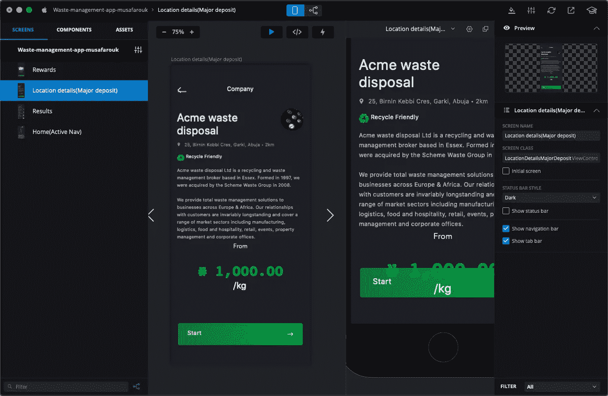

Supernova 中的 iOS 屏幕设计

箭头的问题可以通过使用光栅图片或手动修复。我们来看看它是如何导出到 iOS 代码的。**文件** → **导出到 iOS** 。尝试导出时，我看到了丢失字体的列表。

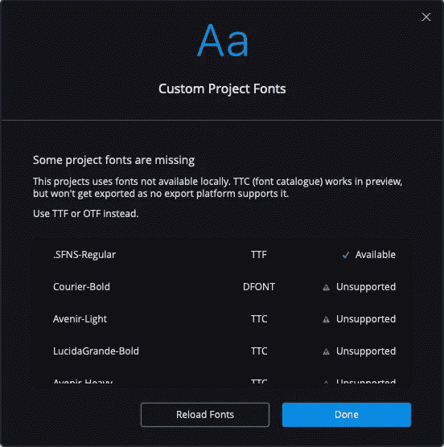

缺少字体

好吧，我们暂时忽略它。系统字体没问题。

我选择了仅适用于 iPhone 且仅适用于纵向的导出，这样就不会深入细节了。

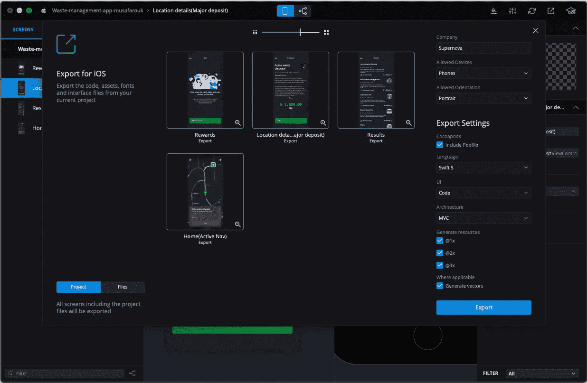

超新星的输出

语言只能是迅捷的。对于我来说，选择最新的是有意义的。目前是 Swift 5。UI 必须是代码。其他选项有故事板和 XIB，但它们只能通过 Xcode 打开，所以对我们来说不是一个选项。

导出过程不到一分钟。它用`Podfile`生成了一个 Xcode 项目。`Podfile`几乎是空的；它只有一个框架，但没有依赖关系。

无论如何，让我们安装 Pods 来生成一个工作区。

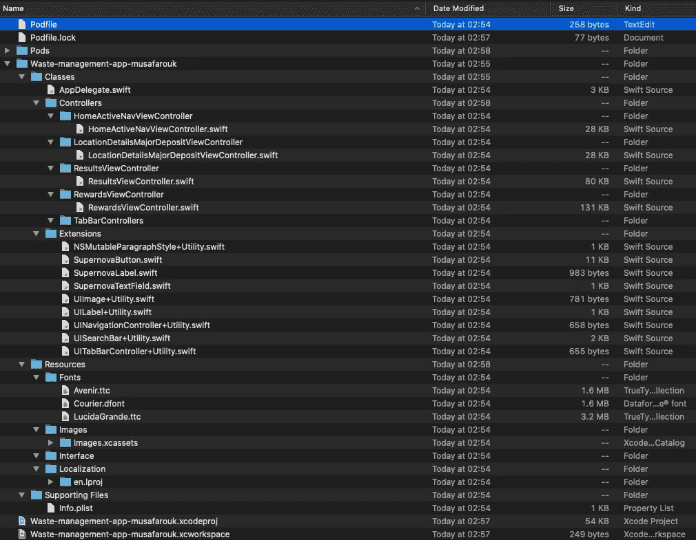

由 Supernova Studio 生成的项目

每个屏幕都是一个单独的类，是`UIViewController`的子类，位于单独的文件夹中。字体、图像和其他资源也会被导出。也没有故事板。意思是我们可以用 AppCode 打开。

这里有一个 Supernova Studio 导出的例子，文件`HomeActivityNavViewController`:

该文件包含“copyright 2018 Supernova”这是一个有趣的细节，因为我在 2020 年 3 月做了这个导出。

项目成功构建并运行。它看起来是这样的:


iPhone 11 模拟器中的应用程序

显然，按钮不起作用，因为我从未在 Supernova Studio 中添加逻辑。但是有可能。按钮没有绿色背景。在我看来，这些问题并不显著，可以在导出后的代码中轻松修复。Supernova Studio 和 IDE 中都可以添加逻辑(Xcode 或 App 代码)。

## 外部库

有不同的布局框架。它们时隐时现，所以如果你选择这种方法，只需找到最近更新(去年内)的框架，它支持 Swift 5 并具有你需要的特性。

让我们回顾一下 LinkedIn 中最流行的 LayoutKit。

这个例子是从官方 [LayoutKit 网站](https://github.com/linkedin/LayoutKit)借来的。

它创建标准 UIKit 组件(像所有框架一样)的方式与我们前面所做的一样，但是它有两个额外的特性:

*   代码更短，更清晰。
*   它增加了自动调整组件大小的简单方法。

我想回顾的另一个框架是 [SnapKit](https://github.com/SnapKit/SnapKit) 。有时，即使在基于故事板的项目中，您也需要用代码创建组件。在保持组件大小最新的同时，在带有约束的布局中添加组件是相当复杂的。

SnapKit 有助于使用代码添加约束。

例子借用官方 [SnapKit 网站](https://github.com/SnapKit/SnapKit)。

## 摘要

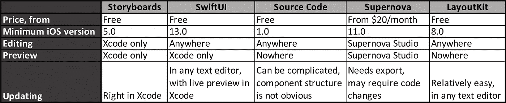

iOS 用户界面创建方法比较

无论你选择什么，请不要忘记你的布局应该符合[苹果人机界面指南](https://developer.apple.com/design/human-interface-guidelines/)。

# 资产

大多数 iOS 应用程序都有一个包含资源的特殊文件夹。通常是一个名为`Assets.xcassets`的文件夹。如果您创建新的 Xcode 项目，此文件夹将会自动创建。

它包含不同类型的资产:图像、颜色、数据、AR 资源、贴纸包等。最受欢迎的资产是图像集。除了图像之外，图像集还有重要的元数据。例如，对于不同的屏幕尺寸、设备类型和分辨率，图像集可以有不同的图像。集合中的图像可以呈现为原始图像或模板。模板图像的颜色可以用`tint`属性改变。

资产文件夹有`json`文件来存储元数据。所有这些文件的名称都是相同的— `Contents.json`。根`Contents.json`通常是这样的:

```
{
  "info" : {
    "version" : 1,
    "author" : "xcode"
  }
}
```

我看不出有什么理由要修改这个文件。内部文件夹中的文件更有趣。这是一个在`AppIcon.appiconset`中的`Contents.json`文件的例子:

```
{
  "images" : [
    {
      "size" : "20x20",
      "idiom" : "iphone",
      "filename" : "Icon-App-20x20@2x.png",
      "scale" : "2x"
    }, ...
    {
      "size" : "1024x1024",
      "idiom" : "ios-marketing",
      "filename" : "ItunesArtwork@2x.png",
      "scale" : "1x"
    }
  ],
  "info" : {
    "version" : 1,
    "author" : "xcode"
  }
}
```

`“info”`部分也是一样。`“images”`包含不同设备和分辨率的图标图像阵列。属性:

*   大小—图标大小，以磅为单位
*   习语—设备类型
*   文件名—文件的名称。文件应该在同一个文件夹中。
*   比例—设备比例(retina 屏幕设备的 2 倍或 3 倍，低分辨率设备的 1 倍)。

图标集的`Contents.json`文件具有类似的结构。例如:

```
{
  "images" : [
    {
      "idiom" : "universal",
      "filename" : "button_back.png",
      "scale" : "1x"
    },
    {
      "idiom" : "universal",
      "filename" : "button_back@2x.png",
      "scale" : "2x"
    },
    {
      "idiom" : "universal",
      "filename" : "button_back@3x.png",
      "scale" : "3x"
    }
  ],
  "info" : {
    "version" : 1,
    "author" : "xcode"
  }
}
```

我将把其他资产类型留在这个范围之外。它们更先进，并不是在所有项目中都使用。

可以在 Xcode 和 AppCode 中编辑资源文件夹。此外，如果您从一些网站下载图像集，例如，[材质图标](https://material.io/resources/icons)，您将获得内含`Contents.json`的`imageset`文件夹。在所有其他情况下，您需要手动创建`json`文件。

# 使用 iOS 模拟器

假设你建了一个 app，你得到了一个二进制(其实是一个文件夹，但是里面有一个二进制)。如何在 iOS 模拟器上运行？

首先，你需要运行它。

AppCode 可以帮你运行；这方面和 Xcode 很像。它支持代码调试，甚至可以在物理设备上运行。

如果你用 iOS 应用程序获得一个文件夹，你需要遵循三个步骤:

1.  手动运行 iOS 模拟器。
2.  将 app 文件夹拖到运行 iOS 模拟器。
3.  在虚拟屏幕上找到它并运行它。

要运行 iOS simulator，请打开终端应用程序并运行以下命令:

```
open -a Simulator.app
```

要选择设备型号和 iOS 版本，请使用菜单**文件** → **打开设备**或**硬件** → **设备**(在旧版本中)。

## 排除故障

iOS 模拟器有一个秘密。其中运行的所有应用实际上都是你 Mac 上运行的 x86_64 应用(在某种沙箱中)。这意味着你可以在本地调试 iOS 应用程序，就像任何 macOS 应用程序一样。

首先，运行`lldb`:

```
lldb
```

其次，附加到一个进程:

```
**(lldb)** process attach --pid 12345
```

或者:

```
**(lldb)** process attach --name MyApp
```

您可以在活动监视器应用程序中找到您的应用程序，该应用程序安装在所有 MAC 上。在那里你可以找到你的应用程序的 pid(进程 id)。

如果你不知道如何使用`lldb`，这里有[文档](https://developer.apple.com/library/archive/documentation/IDEs/Conceptual/gdb_to_lldb_transition_guide/document/lldb-terminal-workflow-tutorial.html)。

# 应用程序签名

您完成了您的应用程序，在模拟器中测试了它，并发现和修复了 bug。现在是时候在真实设备上测试并上线了。

首先，有几件事你需要知道:

*   iOS app，和 macOS app 一样是一个文件夹，使用的扩展名是`app`。
*   要分发一个 iOS 应用，需要创建一个名为`ipa`的归档。这是一个压缩文件，在一个`Payload`文件夹中有一个`app`文件夹。
*   在进行`ipa`存档之前，您需要签署一个 iOS 应用程序。
*   若要签署您的 iOS 应用程序，您需要有一个 Apple 开发人员帐户。你可以在[苹果开发者门户](http://developer.apple.com/account)上创建一个。
*   只有已签名的应用程序才能在物理 iOS 设备上运行，即使那是你自己的 iPhone。
*   您应该有证书和预置描述文件来签名应用程序。Xcode 会自动创建它们，但是如果您手动给应用程序签名，您就必须自己请求它们。
*   您的`plist`文件和您的预置描述文件中关于您的应用程序的信息(捆绑包 id、授权)应该匹配。

这听起来很复杂，实际上也是如此。让我们一步一步地回顾这个过程，因为没有应用程序签名，之前的所有努力都没有多大意义。

对于这个例子，我将使用前面“用`make`从控制台构建 iOS 应用程序”一节中构建的应用程序。它叫做 MakeTest。

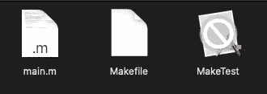

用 make 构建的 iOS 应用程序

你的应用应该看起来像你在上面的图片中看到的。白色标志表示不能在 macOS 中运行。

## 步骤 0。编译应用程序

在我们开始之前，你应该有一个用于`armv7`和`arm64`的应用程序。如果你是从 Xcode 或者其他平台构建的，只要选择一个合适的目标就可以了。如果您使用我们之前构建的示例，在`Makefile`中做一些修改:

1.  替换:

```
SDKROOT:=$(shell xcrun --sdk iphonesimulator --show-sdk-path)
```

使用:

```
SDKROOT:=$(shell xcrun --sdk iphoneos --show-sdk-path)
```

2.将生成命令从:

```
clang -isysroot $(SDKROOT) -framework Foundation -framework UIKit -o MakeTest.app/$@ $^
```

收件人:

```
clang -isysroot $(SDKROOT) -arch armv7 -arch arm64 -framework Foundation -framework UIKit -o MakeTest.app/$@ $^
```

这将生成一个具有两种架构的所谓“胖”二进制文件。这正是我们所需要的。

如果您在此阶段出现任何错误，可能是 Xcode 有问题。安装它，如果你还没有这样做。运行它，Xcode 会在每次更新后安装一个命令行工具。

## 第一步。创建证书

要创建证书，请打开此链接:[https://developer . apple . com/account/resources/certificates/list](https://developer.apple.com/account/resources/certificates/list)。如果您在同一台 Mac 上使用 Xcode 开发了 iOS 应用程序，则可以跳过这一步。如果没有，请点按“+”按钮并添加一个新的“Apple Distribution”证书。这里就不赘述了。这个过程相当容易，你可以找到许多教程和手册。准备好了就下载安装。

在“钥匙串访问”应用程序中检查您的证书。在下一步中，您应该使用完整的证书名称。

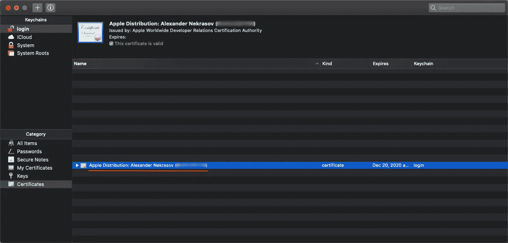

带有苹果分销证书的钥匙扣

## 第二步。合作设计

打开终端 app，将当前目录更改为您的工作文件夹(包含`MakeTest.app`)。

```
cd full_path
```

类型:

```
codesign -s "Apple Distribution: Your Account Name (TEAM_ID)" MakeTest.app
```

几秒钟后，你会看到`MakeTest.app`里面的文件夹 `_CodeSignature`。这是数字签名。这也是不与不信任的人共享证书的原因。这个签名证明你开发了这个应用。如果有人窃取你的证书，并发布一个签名的应用程序做一些非法的事情，你的帐户可能会被阻止。

## 第三步。创建预置描述文件

打开苹果供应门户:[https://developer.apple.com/account/resources/profiles/list](https://developer.apple.com/account/resources/profiles/list)。

单击“+”按钮。您可以生成几种类型的配置文件:

*   iOS 应用程序开发—只能用于您自己的设备
*   临时—可以分发给有限数量的设备，包括在配置文件中
*   App Store —可以上传到 App Store

在本例中，让我们生成一个临时配置文件，并为应用程序安装创建一个链接。

下一步，你需要选择你的应用 ID。可能你的 id 还不在名单上。

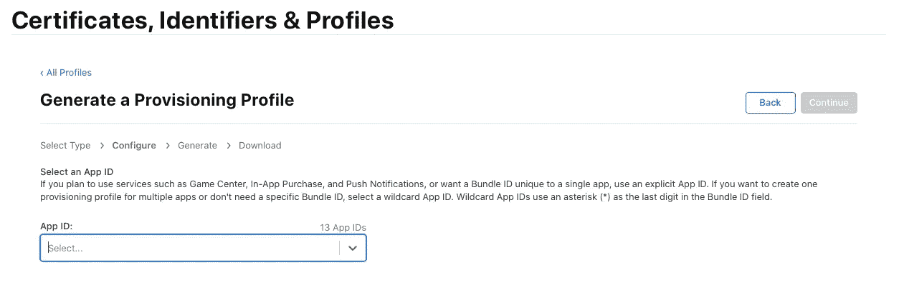

选择应用 ID

如果有，就去标识符列表添加一个新的应用 ID:[https://developer . apple . com/account/resources/identifiers/list](https://developer.apple.com/account/resources/identifiers/list)。请记住，您的应用 ID(捆绑包 ID)应该与您的`Info.plist`中的 ID 相匹配。您可以选择您在应用程序中使用的功能。对于这个测试，你不需要选择任何东西。有些是可以预选的；让它们保持不变。

返回到档案生成并选择您的应用 ID。在下一个屏幕上，您需要选择一个证书。它应该与您在上一步中使用的证书完全相同。如果您有几个日期不同的证书，请检查钥匙串中的证书。对比有效期。应该是一样的或者相差一天。

在下一步中，您需要选择设备。如果您以前使用过 Xcode，您的设备可能已经注册。如果没有，请在此手动注册:

要注册新设备，您需要输入它的 UDID(唯一的设备 ID)。有两种方法可以得到它:

*   你可以用线把你的设备连接到你的 PC/Mac，在 iTunes 里找到 UDID。在 macOS Catalina 中，没有 iTunes，但是您可以在 Finder 中找到您的设备。在设备名称下，您会看到一些附加信息。点按它一次或几次，直到您看到 UDID。请注意序列号和 UDID 是不同的。
*   你可以使用类似 [https://get.udid.io](https://get.udid.io) 或类似的服务。在您的 iOS 设备上打开它，然后按照说明进行操作。

注册设备后，返回描述文件生成，检查一个或多个设备，然后生成描述文件。在最后一步中，您需要输入一个概要文件名。通常，我使用应用程序名称加上“AdHoc”准备好了就下载档案。

## 第四步。准备金提取

要将预置描述文件添加到您的应用程序，只需将其复制到`app`文件夹，并将其重命名为`embedded.mobileprovision`。

然后再签一次:

```
codesign -f -s "Apple Distribution: Your Account Name (TEAM_ID)" MakeTest.app
```

如果之前签过，加`-f`旗(强制)。

## 第五步。权利

首先，让我们生成授权文件:

```
security cms -D -i Payload/MakeTest.app/embedded.mobileprovision
```

这将向控制台输出一个包含权限的大结构。将此结构保存在以`.entitlements`结尾的文件中。遵循以下结构:

```
<?xml version="1.0" encoding="UTF-8"?>
<!DOCTYPE plist PUBLIC "-//Apple//DTD PLIST 1.0//EN" "http://www.apple.com/DTDs/PropertyList-1.0.dtd">
<plist version="1.0">
<dict>
    <key>application-identifier</key>
    <string>TEAM_ID.com.test.make</string> <key>keychain-access-groups</key>
    <array>
        <string>TEAM_ID.*</string>
    </array>

    <key>get-task-allow</key>
    <false/> <key>com.apple.developer.team-identifier</key>
    <string>TEAM_ID</string>
</dict>
</plist>
```

您应该拥有与之前所有步骤相同的应用 ID，以及与您的 Apple 开发者帐户匹配的 TEAM_ID。

您不应该在有效负载中包含授权文件。相反，将其用作`codesign`命令的参数:

```
codesign -f -s "Apple Distribution: Your Account Name (TEAM_ID)" --entitlements 'MakeTest.entitlements' Payload/MakeTest.app
```

## 第六步。创建 ipa

要在物理设备上安装你的应用，你需要创建一个`ipa`档案。让我们来看看怎么做:

```
mkdir Payload
cp -r MakeTest.app Payload
zip -r MakeTest.ipa Payload
```

我们到了！我们有一个档案库。

## 第七步。分配

要分发你的应用，我推荐 [Diawi](https://www.diawi.com) 。Diawi(开发&内部应用程序无线安装)是一项允许你上传你的`ipa`(或安卓系统的`apk`)并获得链接和二维码的服务。您将此链接(和/或 QR 码)发送给设备所有者(iOS 设备的 UDID 应该在您创建的预置描述文件中)，他们只需轻按几下就可以安装它。

问题是以目前的配置，你甚至不能上传，这就导致了第 8 步。

## 第八步。更新 Info.plist 并排除故障

当您在 Xcode 中进行构建时，它会在签名之前向`Info.plist`添加一些字段。

**警告！您应该在任何更改后更新您的应用程序签名，包括** `**Info.plist**` **中的更改。**

这两个字段是上传版本所必需的:

```
<key>CFBundleSupportedPlatforms</key>
<array>
  <string>iPhoneOS</string>
</array>
<key>MinimumOSVersion</key>
<string>10.0</string>
```

版本号可能会有所不同，这取决于您的目标 iOS 版本。

当您添加这些字段时，上传将会成功，但您可能仍然无法安装该应用程序。`Info.plist`的生产版本应包含兼容设备的信息。

我从 Xcode 生成的`ipa`中复制了值。有些不是必须的，但也不会有什么坏处:

```
<key>BuildMachineOSBuild</key>
<string>19D76</string>
<key>DTCompiler</key>
<string>com.apple.compilers.llvm.clang.1_0</string>
<key>DTPlatformBuild</key>
<string>17B102</string>
<key>DTPlatformName</key>
<string>iphoneos</string>
<key>DTPlatformVersion</key>
<string>13.2</string>
<key>DTSDKBuild</key>
<string>17B102</string>
<key>DTSDKName</key>
<string>iphoneos13.2</string>
<key>DTXcode</key>
<string>1130</string>
<key>DTXcodeBuild</key>
<string>11C504</string>
<key>UIDeviceFamily</key>
<array>
    <integer>1</integer>
    <integer>2</integer>
</array>
<key>UIRequiredDeviceCapabilities</key>
<array>
<string>arm64</string>
</array>
<key>UIRequiresFullScreen</key>
<true/>
<key>UIStatusBarHidden</key>
<false/>
```

这是我的`Info.plist`文件的最终版本:

你的应用可能尚未安装在你的设备上。很有可能，你不会看到任何错误。但是，如果您知道，您如何解决这些问题呢？

在 Mac 上打开控制台应用程序。您的 iOS 设备应该已连接。

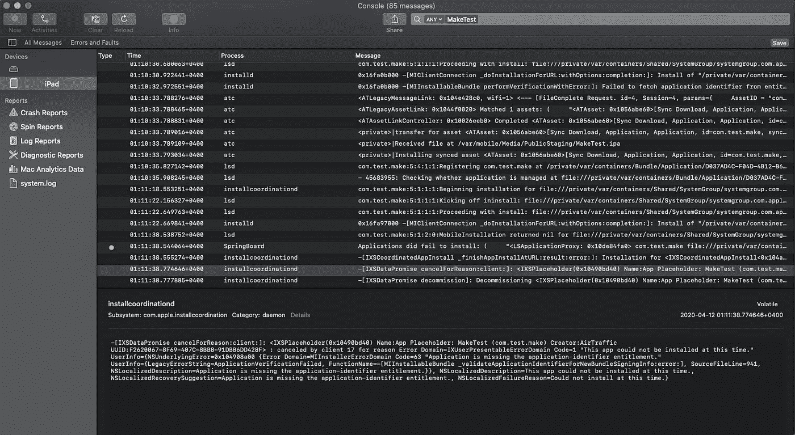

iOS 设备控制台

选取您的 iOS 设备，并在过滤器(右上角)中键入您的应用程序名称。App install 会生成大约 50 条信息，其中大多数信息不多，因此可能需要几个小时才能找到并修复问题。

在上面的屏幕截图中，您可以看到授权文件存在问题。如果你遵循了所有的步骤，你不应该有它，但是如果你的情况更复杂或者你错过了一些步骤，你可以使用控制台应用程序来检查出了什么问题。

## 完成的

如果一切正常，你会看到你的应用程序安装在你的设备上。

如果您仍然有问题:

1.  尝试添加应用程序图标。你不需要它的资产目录。你只需添加必要的 png 文件，并将其添加到你的`Info.plist`中。
2.  添加 PkgInfo 文件。老实说，我不明白它的用途，但所有 Xcode 生成的包都包含它。它只有 8 个字:`APPL????`。

# 结论

不使用 Xcode 也完全可以创建 iOS 应用。如果你真的反对 Xcode，你可能应该使用 AppCode。您可以在那里编写代码、构建和调试。它有许多插件，这将使过程更容易。

布局可以用许多不同的方式来制作，使用代码或替代解决方案，如 Supernova Studio 或 Sketch(带插件)。

仅使用终端和文本编辑器制作 iOS 项目极其复杂，但完全可行。只有在非常必要的时候才应该使用这种方法；例如，对于自动构建。

下次见。编码快乐！