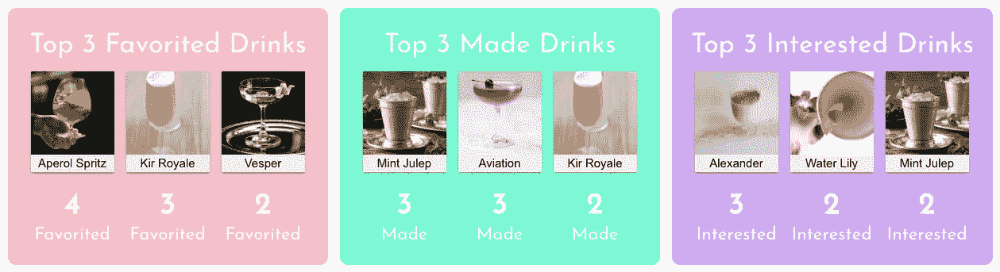

# 在不知道的情况下用 Rails 编写我的第一个算法

> 原文：<https://betterprogramming.pub/writing-my-first-algorithm-in-rails-without-even-knowing-it-b54061b5d17e>

## *使用 Rails 的算法初学者之旅*


由[马库斯·斯皮斯克](https://unsplash.com/@markusspiske?utm_source=medium&utm_medium=referral)在 [Unsplash](https://unsplash.com?utm_source=medium&utm_medium=referral) 上拍摄的照片

算法是一头野兽。每当软件工程的初学者讨论它们时，你可以说，虽然有趣，但一想到要写出来，它们肯定令人生畏。

在某些时候，你必须实际编写一个代码，而不是光想着它。即使你是一个初学者，也不一定要太累！说到底，所有的算法实际上都只是一些函数，在考虑几个条件的情况下做一件特定的事情。

# **为什么不列一个前三名的清单呢？**

我基本上完成了我最近的演示项目 Mixit。这是一个应用程序，用户可以细读数据库，并将饮料标记为喜欢的、已经制作的或有兴趣制作的。当我完成它的时候，我注意到我的欢迎页面并没有什么真正的活力——它大部分是空白的，有点像占位符。

在一个演示应用的欢迎页面上填充一些实质性的东西之前一直是我努力的一个来源，但这次我真的想把突出的东西放在上面。当我绞尽脑汁的时候，我突然想到了一个主意:为什么不列一个前三名的清单呢？

我就是这样开始了我的第一个算法的旅程，而我自己都不知道。[点击这里](https://github.com/TimeSmash/Top-3-Algorithm)在 Github 上查看完整的代码，其中包括一个普通的带注释的版本。如果需要的话，可以用它来跟随。

# 从各个角度考虑


格伦·卡斯滕斯-彼得斯在 [Unsplash](https://unsplash.com?utm_source=medium&utm_medium=referral) 上拍摄的照片

在这个函数组成之前和期间，我知道我需要考虑一些具体的事情:

*   我使用 React 作为这个项目的前端，并希望通过我的 DrinkCard 组件显示前三种饮料。我的 DrinkCard 组件将一个饮料对象作为道具，所以当我发送 JSON 时，我不能只发送饮料的名称，我需要发送整个对象。我还想让用户看到计数，所以我也需要把它发送过来。因为我要发送不止一个，所以我需要把整个东西作为一个数组发送。(如果您不熟悉 React，也不用担心——这里的要点是我需要返回一个对象数组，每个对象有两个键值对。)
*   如果两种或两种以上的饮料有相同的计数(例如，如果杜松子酒和马丁尼酒都有 95 个最爱)，我想说明这一点。我决定，展示在某种程度上有关联的饮料的最公平的方式是将它们放在一个数组中，然后随机排列。这会给每一种饮料一个机会在某个时刻发光。
*   我使用 Rails 作为后端，通过简单的 Google 搜索，我发现了 shuffle 方法，它将一个数组随机化。知道了这个内置方法，我就不必自己创建一个类似的方法了。
*   另一件要考虑的事情是饮料被放置在哪个层级(第一、第二或第三位)以及饮料将如何展示。如果三杯或更多的酒并列第一，那么我希望每一杯都有公平的展示机会。在这种情况下，让第二名的饮料进入前三名是没有意义的，所以我还是会随机选择，甚至懒得去找出第二或第三名是什么饮料。同样的逻辑也适用于第二名的平局(这意味着第一名最多只能喝两杯，第三名不必考虑)。
*   因为我要为前 3 种饮料创建一个新数组，所以我必须考虑向空数组添加饮料的最佳方式。这个问题后来通过利用数组索引和使用计数器得到了解决。
*   饮料被标记为喜爱的、制作的或感兴趣的方式是通过用户模型和饮料模型之间的连接表。这个连接表称为 user_drinks，它具有反映饮料是否被标记为 favorited、made 或 interest 的属性(布尔值:如果标记为 true，否则为 false)。

虽然需要一段时间来确定，从一开始就知道我希望如何显示我的数据，但决定如何构建我的代码要容易得多。

# 建立局部变量

既然我已经考虑了我希望这个算法到达的各种端点，现在是时候写它了。首先，我建立了一些局部变量:

```
most_marked_drinks = []drink_and_count_arr = []
```

第一个变量是我最终在任意给定端点返回的值。这将是一个对象数组，每个对象有两个属性。第一个属性指向从数据库中检索的饮料对象，而第二个属性指向计数(一种饮料被标记为 favorited、made 或 interest 的次数)。

第二个变量是我们将削减哪些内容，以最终返回最有标记的饮料。首先，我们将遍历数据库中的所有饮料来填充它。

```
Drink.all.each do |drink|
 counter = 0
 drink.user_drinks.each do |user_drink|
   if user_drink[quality] === true
     counter += 1
   end
  drink_and_count_arr.push({"drink" => drink, "count" => counter})
 end
end
```

对于每种饮料，我们将计数器设置为零，每当饮料被标记为任何质量时，计数器就增加 1。然后我们用前面描述的属性设置一个对象，并将其推入`drink_and_count_arr`。

```
three_highest_counts = drink_and_count_arr.map do |obj| 
  obj["count"]
end.sort.slice(drink_and_count_arr.length-3,drink_and_count_arr.length-1)
```

接下来我们要做的是从每种饮料中获取前三个计数。从那里，我们对数组进行排序，并获取其中的最后三个数字。这给了我们最高的三个计数，第一个指数是第三位，第二个指数是第二位，第三个指数是第一位。

现在我们已经建立了一些基线，我们可以进入这个算法的搜索和排序部分。

# 排序和搜索

为了获得前三种饮料，我们必须考虑旅途中的几种情况。这将是一个条件句，通常嵌套有条件句。

## 三杯或更多的酒并列第一

首先，让我们来解释一下三杯或三杯以上酒之间的平局。我们可以在下面对此进行测试:

```
if three_highest_counts.uniq.length === 1
 most_marked_drinks = drink_and_count_arr.select do |obj|
  obj["count"] === three_highest_counts.uniq[0]
 end.shuffle().slice(0,3)
else
...
return most_marked_drinks
```

通过检查三个最大的计数是否都相同(通过使用 uniq 并检查得到的长度)，我们可以确定这个平局是否存在。如果是这样，我们可以遍历 drink _ and _ count _ arr，找到所有 count 属性等于该计数的对象。然后，我们将设置 most_marked_drinks 并将其设置到这个数组中。最后，我们洗牌，取它的前三个元素。然后我们会归还它。

这个绝对是最简单的，这也是为什么它是这个条件句中的第一件事。接下来，我们将考虑第一名之间的双向平局。

## **两杯酒并列第一**

在这一点上，我们知道三个最高计数并不完全相同。这意味着两件事中的一件是可能的:

1.  两杯酒并列第一(因为都有最高的计数)
2.  只有一种饮料排在第一位(比如，一种饮料的数量最多)

我们将首先处理两种饮料被并列为最高计数的情况，因为它读起来很清楚，而且需要的代码也较少。

不过，在此之前，我们需要一些方法来检查两种饮料是否并列第一。我们可以通过创建一个新变量来做到这一点:

```
tier_1_ranked_drinks = drink_and_count_arr.select do |obj|
  obj["count"] === three_highest_counts.last
end
```

这个变量过滤 drink_and_count_arr，使每个元素的 count 属性等于最高计数。如果两种饮料并列第一，这个数组的长度将是 2。

```
if tier_1_ranked_drinks.length === 2# 2 drinks tied for first place, set 1st and second place (no need to shuffle)most_marked_drinks[0] = tier_1_ranked_drinks[0]most_marked_drinks[1] = tier_1_ranked_drinks[1] 
```

我不需要打乱一个只有两个元素的数组。客户将能够查看每种饮料的计数，并清楚地看到有一个平局。因此，我将把 most_marked_drinks 的第一个和第二个元素设置为 tier_1_ranked_drinks 的元素。

尽管在大多数标记的饮料中，仍然有一个地方需要填补。这将是它的最后一个元素，第二个位置。

```
#In case 2+ drinks tied for second place, pick random one for index-2 of most_markedsecond_place = drink_and_count_arr.select do |ele|
  ele["count"] === three_highest_counts[0]
end.shuffle().firstmost_marked_drinks[2] = second_place
...
return most_marked_drinks
```

我们仍然需要考虑这一级别的联系。为此，我们再次使用 filter drink_and_count_arr，这次获取的元素的计数是 most_marked_drinks 中的第一个元素(最低计数)。然后，我们洗牌，得到第一个元素。(请注意，如果第二名没有平局，它将只有一个元素长，shuffle 仍然会启动，但不会真正做任何事情，因为你不能随机化一个元素长的东西)。最后，我们稍后返回最有标记的饮料。

## **并列第一**

当 tier_1_ranked_drinks 的长度为 1 时，就会发生这种情况。我们立即获取它的第一个元素，并将其设置为 most_marked_drinks 的第一个元素:

```
if tier_1_ranked_drinks.length === 1 # There is an official first place, only 1 drink has first place
  most_marked_drinks[0] = tier_1_ranked_drinks[0]
```

## **第一名没有平局，但第二名可能会有平局……**

这意味着第一名已经确定。现在，我们需要设置第二个位置。我们仍然想考虑这一级别的联系。这可以通过查看 three_highest_counts 的第一个和第二个元素是否匹配来检查。(记住三个 _ 最高 _ 计数的顺序是升序)。

```
if three_highest_counts[0] === three_highest_counts[1]
```

如果他们这样做了，第二名会有一个平局，我们将会用我们之前处理平局的方式来处理它。

```
# 2+ drinks tied for second place, pick random ones for index-1  
  and index-2 of most_markedsecond_and_third_place = drink_and_count_arr.select do |obj| 
       obj["count"] ===  three_highest_counts[1]
     end.shuffle().slice(0,2)most_marked_drinks[1] = second_and_third_place[0]most_marked_drinks[2] = second_and_third_place[1]
...
return most_marked_drinks
```

首先，我们将再次过滤 drink_and_count_arr(看看这种情况发生了多少次？我们肯定可以在这里创建一个帮助函数，使整个算法更加简洁)来获得其计数等于第二名计数的元素。然后，我们随机化数组并从中取出两个元素，将它们设置为 most_marked_drinks 的第二个和第三个元素。然后我们会归还它。

## **并列第二**

如果没有并列第二名，我们可以这样做:

```
second_place = drink_and_count_arr.select do |obj|
  obj["count"] === three_highest_counts[1]
end.first
```

正如我们之前所做的，我们只需要过滤 drink_and_count_arr 来返回一个基于计数的数组。我本可以在这里使用不同的方法，但是这个工作得很好。

这是一个长度应该只有一个元素的数组，所以我们接受它并将 most_marked_drinks 的第二个元素设置为它。

## **第一名或第二名没有平局意味着我们需要设置第三名**

现在我们已经确定了第一名和第二名，所以剩下的就是第三名了。你可以打赌，我们也将在这一级寻找联系，但这将更容易一些，因为我们只需要返回一个元素来完成大多数 _marked_drinks。

我们将使用现在已经使用了十几次的同一段代码:

```
third_place = drink_and_count_arr.select do |obj| obj["count"] === three_highest_counts[0]end.shuffle().firstmost_marked_drinks[2] = third_place...
return most_marked_drinks
```

我们只是做我们一直在做的同样的过滤和洗牌过程(再次，真的应该为此做一个助手方法！).然后，我们可以将 most_marked_drinks 的最后一个位置设置为该数组的第一个(也许是唯一的)元素，然后返回它。

现在我有了一个算法——同样，只是一个大的、特定的函数——它给出了前三种饮料，说明了每个级别的联系，给了我数据库中的每种饮料一个公平的显示机会。我不会用它的前端部分来烦你(因为到目前为止你已经读得够多了)，但是我会展示我的最终结果:



每个类别的前 3 种饮料。

请注意，在某些情况下，当页面重新加载时，外观可能会发生变化。这正是我想要的，给每一杯有领带的酒一个展示的机会。这也指出了随机化的有效使用。

至此，你应该能够理解制作你的第一个算法需要什么了。虽然我在这里使用的是 Rails，但是同样的逻辑也可以应用到其他语言中，只是编写的内容有所不同(例如，随机化数组不是 JavaScript 中的内置方法)。编写算法是创造性思维和编码知识的一个很好的练习，也是面试的绝佳练习。通过写它们，你强迫自己进行分析性思考，并考虑你可能不习惯使用的方法。也许你和我一样，甚至不知道你建立了一个，直到你和一个同行讨论它。

无论如何，开始练习吧！有大量的想法和实践练习，所以玩得开心，快乐编码！