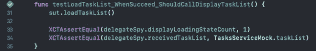
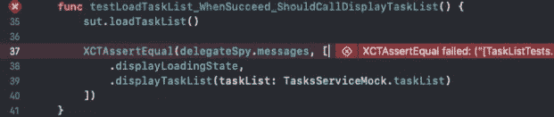
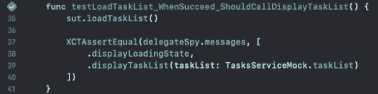

# 使用 Swift 和 XCTest 为 iOS 应用编写可读、健壮和可靠的单元测试

> 原文：<https://betterprogramming.pub/writing-readable-robust-and-reliable-unit-tests-for-ios-applications-with-swift-and-xctest-b4c1cc70d35a>

## 如何像专业人士一样在 Swift 中实现单元测试

照片由 [AltumCode](https://unsplash.com/photos/dsOvZnqGawg) 在 [Unsplash](https://unsplash.com/) 上拍摄

单元测试在软件产品的质量中是至关重要的，因为它们允许我们在功能对用户可用之前识别和修复错误，并且在将来的修改中保护我们的流程。

不幸的是，我们并不总是像投资生产代码的质量一样关心测试代码的质量，这最终会产生不可读或不可靠的测试用例。

我们可以提到的“不受欢迎的测试”包括:

*   **弱测试:**在没有正确测试功能的情况下成功通过的测试用例，产生了一种虚假的安全感，而它们实际上并没有测试任何东西；
*   **使用大量断言的测试:**它们违反了单一责任原则(SRP)，并且由于冗长使得代码难以阅读。

在本文中，我介绍了一种方法，我在我的 iOS 项目中使用这种方法来获得具有更好可读性、健壮性和可靠性的测试，避免弱测试和具有大量断言的测试。

# 被测系统

让我们考虑一个基于 MVVM 模式构建的简单待办事项列表，它的初始代码可以通过检查[初始分支](https://github.com/gabrielmoreira-dev/task-list-ios/tree/initial)从 [GitHub](https://github.com/gabrielmoreira-dev/task-list-ios/) 获得。业务规则在视图模型层，所以这就是我们想要测试的:

基本上，我们有一个`loadTaskList`函数来启用加载状态，加载必要的数据，并通过一个委托将其呈现在屏幕上。代理有三个功能:`displayLoadingState`、`displayTaskList`和`displayError`。

# 以最常见的方式进行测试

假设我们想为加载任务列表的成功案例编写一个测试。最初，我们需要为委托定义一个 Spy，以便观察视图模型发送给这个元素的值:

然后，我们可以编写期望的测试用例:

运行测试，我们可以验证它是否成功通过。

显然没问题。

这是我在许多项目中看到的一种方法，也是我们最初学习创建单元测试的最常见的方法。如果我们在 YouTube 上搜索，我们会发现几个遵循这种方法的测试示例。

但是，如果我们想在开发人员的职业生涯中发展并达到更高的资历水平，我们需要不断改进我们的技术，使我们的代码越来越专业。

考虑到这一点，让我们讨论一下这种方法会降低测试质量的一些问题。

# 这种方法的问题

让我们通过添加对`displayError`函数的调用来尝试修改视图模型的行为:

如果我们再次运行测试，我们将看到它仍然成功通过(！！！).

注意，我们引入了一些不想要的行为，测试无法识别错误，所以这是一个**脆弱测试**。

此时，读者可能会想:*“但是，只要添加新的断言来确保不调用其他函数就能解决问题！”*。

然而，这种配置不能很好地伸缩，因为它违反了单一责任原则，为同一个测试用例引入了多个责任。不难意识到，在更复杂的类中，所需的断言数量达到数十个，这使得测试代码非常难以阅读。

此外，我们不会涵盖所有可能的情况。现在让我们试着以相反的顺序调用正确的函数:

当运行测试时，我们验证它仍然通过。

发生这种情况是因为我们从来不检查函数调用的顺序，这就产生了间隙，从而引入了本例中的意外行为。

但是，如何在不破坏 SRP 的情况下使我们的测试更有弹性呢？

# 解决方案:消息模式

好消息是有一个非常简单的方法适合这种情况:**消息模式**。

它基本上包括在 Spy 类中定义一个消息枚举和一个数组，该数组负责存储 Spy 收到的所有动作的“消息”。因此，我们确切地知道执行了哪些操作及其顺序:

在 Swift 中应用这种模式的好处是，它允许我们存储与案例相关的值，这在有参数的函数中非常有用，比如在`displayTaskList`的案例中。

在重新运行测试时，我们看到它现在失败了，这是预期的行为。

然而，如果我们将函数的行为调整到正确的状态，我们会看到测试现在通过了，因此我们有了一个更加可靠的测试，能够指示意外行为的存在。

# 结论

编写好的单元测试是对代码质量的重视，所以我们需要小心对待它们，避免实现脆弱的测试或难以阅读和理解的测试。

本文介绍了一种为 MVVM 架构中的视图模型层编写测试的模式，但是同样的方法也可以适用于其他更健壮的架构，比如 VIP 和 Clean Swift，只需调整每个架构模式固有的结构。

感谢阅读！如有疑问，欢迎留言回复。

# 资源

[GitHub 库](https://github.com/gabrielmoreira-dev/task-list-ios/)