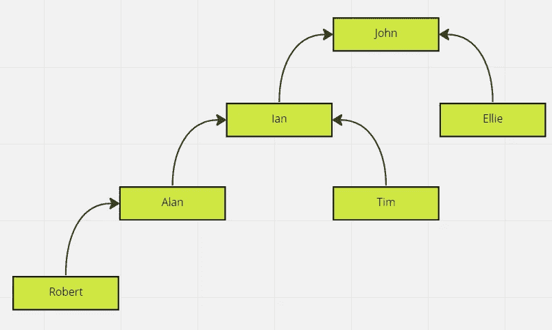
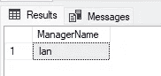
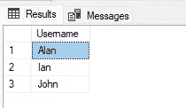
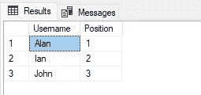
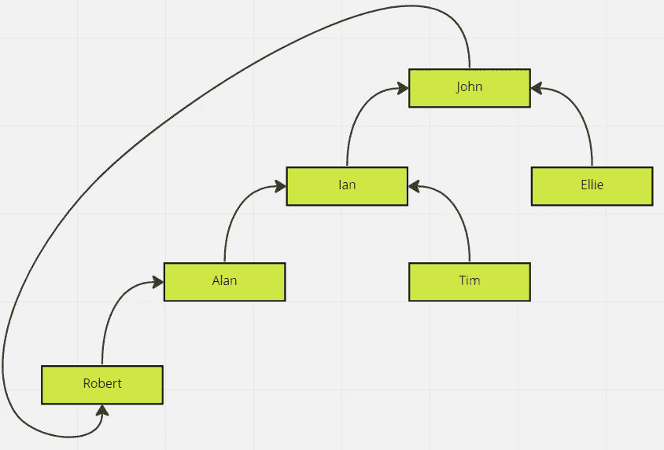
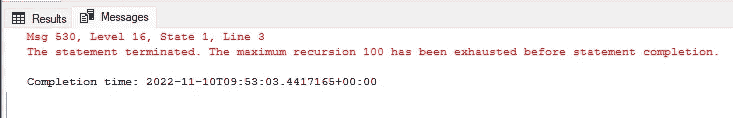
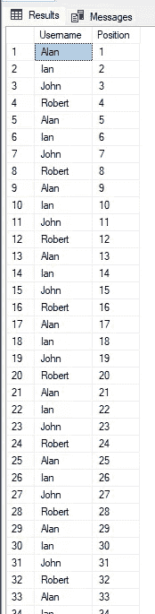
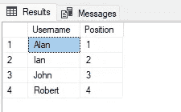
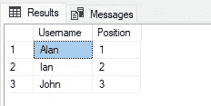

# 在 SQL Server 中编写递归查询

> 原文：<https://betterprogramming.pub/writing-recursive-queries-in-sql-server-a8f4237bea4f>

## 如何有效地获取层次结构中的数据

照片由[迈克尔·泽兹奇](https://unsplash.com/ja/@lazycreekimages?utm_source=unsplash&utm_medium=referral&utm_content=creditCopyText)在 [Unsplash](https://unsplash.com/s/photos/pyramid?utm_source=unsplash&utm_medium=referral&utm_content=creditCopyText) 上拍摄

数据中存在某种层次关系并不罕见。

存储这些数据可能相对容易，但有时要再次取出就有点棘手了，尤其是当数据包含不同层次的时候。

在许多情况下，您可能会遇到这样的数据—它可能是一个嵌套组列表，或者是一个家族树，或者是一个企业中员工和经理的结构。在本文中，我们将以员工/经理为例，但希望您能看到这如何应用于不同的情况。

我们还将使用 SQL Server 2019，但这将适用于从 SQL Server2008 开始的所有版本的 SQL Server。

# 建模分层数据

让我们从数据如何建模开始。

假设我们有几个用户，每个用户可以管理其他用户。我们可以这样想象:

用户管理其他用户的分层结构

在最上面，我们有约翰，他管理着伊恩和艾莉。埃莉不管理任何人，但伊恩管理艾伦和蒂姆。艾伦管理罗伯特。

存储这些数据实际上只需要两个表。

## 存储分层数据

我们将从一个`Users`表开始，其中存储了每个用户:

接下来，我们将存储每个关系，指明谁是经理，谁是员工:

现在，我们将输入一些数据。使用上面的示例，我们将为用户提供以下数据:

管理人员的数据如下所示:

如果我们想要获得所有用户及其直属经理的列表，我们可以使用以下代码相当容易地做到这一点:

这将产生以下数据:

到目前为止，一切顺利。但是，如果我们想让任何给定用户的所有管理人员都在这个层次结构中呢？所以，如果我们看艾伦，我们会得到伊恩和约翰的列表。如果我们看艾莉，我们只会看到约翰。

这就是我们进入递归查询的地方。

## 编写查询以获取单个用户的所有经理

让我们从一个非常简单的查询开始，以获得任何给定用户的直接经理:

这将返回一个值“Ian”:

查询结果

好的，目前为止。

我们现在希望这个结果集包含“John”我们可以选择在查询中添加额外的连接，但是我们会受到我们添加的数量的限制。我们可以让它为两个层次的经理工作，但是如果我们突然有了三个层次呢？还是 30？这就是我们需要递归查询来找到所有可能的经理的地方，而不管级别的数量。

SQL Server 中递归查询的主要元素是公用表表达式(CTE)。CTEs 有一个很好的特性，可以让你轻松地处理递归，所以这就是我们在这里要用的。

让我们更新现有的查询以使用 CTE，这样我们就可以逐步完成所需的更改:

看看我们是如何将查询的一部分移到`WITH`块中的——这就是 CTE。这基本上是和以前一样的查询(它仍然只返回‘Ian’)，但是现在我们有了一个 CTE，更容易添加递归。

递归 CTE 的关键部分是一个 T1。我们编写 CTE 首先选择基本数据(在我们的例子中，查找用户的直接经理)，然后将结果数据返回到 CTE 本身，查找新结果集的经理。

大概是这样的:

看看我们如何在那里得到一个新的`UNION`，它将 CTE(称为`AllManagers`)加入到`dbo.Managers`表中，使用`StaffUserId`列来匹配先前选择的经理。

正如我们所料，我们现在得到了一个“Ian”和“John”的列表:

查询结果

如果我们将参数`UserId`更改为 Id 6 并再次执行，我们现在将获得 Robert 的所有经理:

查询结果

就是这样！我们有一个递归查询，它返回任何给定用户的所有经理。

## 添加层次级别编号

您可能还想为每个返回的经理返回一个索引，以指示谁是直接经理，谁是下一个经理，等等。这很容易做到，并且是对递归 cte 的有益补充。代码如下:

看看我们是如何在 CTE 中添加“位置”栏的。在基本查询中，我们将其设置为 1，这将用于直接经理，然后`UNION`部分每次都加 1 来计算级别。为“罗伯特”运行这个，我们得到这些结果:

查询结果

因此，我们可以看到，直接经理(“Alan”)的职位为 1，而每个后续经理的职位都在增加。

如果您只对特定数量的经理感兴趣(例如，查找用户的前两个经理)，这很有用。

## 避免无限循环

任何递归的一个风险是无限循环，在我们的例子中，编写一个 CTE，一遍又一遍地循环，直到 SQL 最终有足够的循环并终止查询。

让我们在`dbo.Managers`表中增加一行，使“Robert”成为“John”的经理从视觉上看，层次结构如下所示:

更新的经理层次结构

更新后的数据应该是这样的:

如果我们运行最新版本的查询，我们会得到一个错误:

无限循环的误差

但是，如果我们查看返回的内容，我们可以看到前 100 行仍然被返回:

查询结果

这是不对的，解决方案是不增加最大递归限制，除非你需要！

有几种方法可以解决这个问题，但最简单的(虽然不一定是最快的)方法之一是建立一个经理“路径”,并检查您要添加到 CTE 的下一个经理是否已经存在。实际上，您可以为已经处理过的经理 id 构建一个 CSV 值，并对照它进行检查。看起来是这样的:

看看我们如何将`ManagerPath`的初始值设置为经理的 id，在它的前后加一个逗号，在`UNION`中，我们将这个值添加到下一个经理的 id 中。我们检查我们还没有在`WHERE`子句中看到这个经理，检查 id(用逗号包围)在那里不存在。

这将产生正确的列表:

查询结果

但是，让“Robert”的经理列表也包含“Robert”对您来说可能没有意义。如果您想从结果中排除原始用户，您也可以将其添加到`WHERE`子句中。代码如下:

这会产生相同的结果集，只是其中没有原始用户:

查询结果

# 摘要

我们已经看到，我们可以通过使用递归公用表表达式(CTE)在 SQL Server 中查询分层数据，以返回任何给定行的所有父/祖先。我们还看到了如何为每个结果包含一个位置值并避免无限循环。