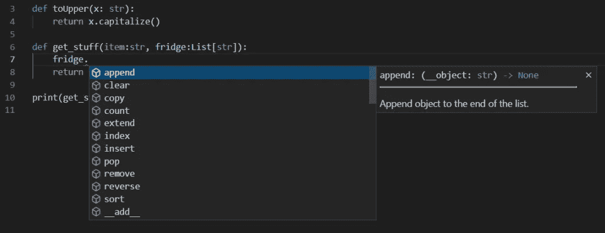
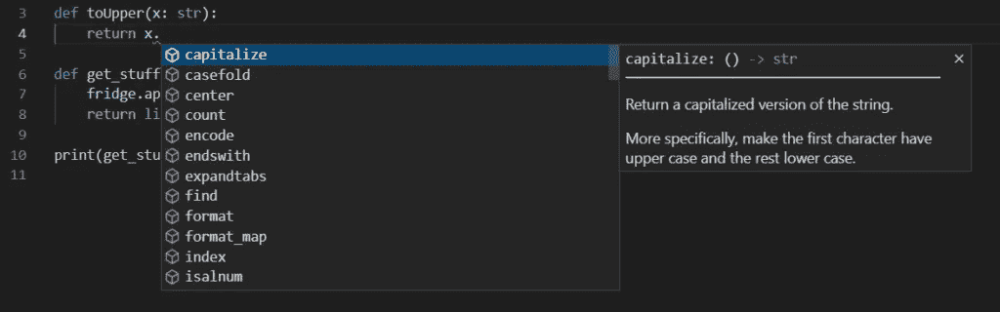
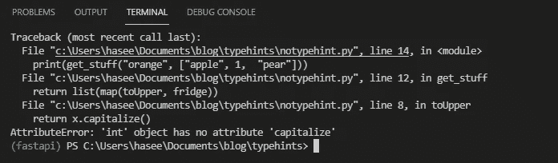

# 使用 Pydantic 编写健壮且无错误的 Python 代码

> 原文：<https://betterprogramming.pub/writing-robust-and-error-free-python-code-using-pydantic-151a135a9ff0>

## 终于！实际工作的 Python 自动完成(像在 C#和 Java 中)和类型提示支持


演员表:作者

Python 是一种动态类型语言，这意味着类型检查是在运行时(执行时)进行的。如果代码中有错误，将在执行时抛出。像 Java、C#和 C 这样的语言是静态类型的，这意味着类型检查是在编译时执行的。在这种情况下，该错误将在程序运行之前抛出。

在静态类型语言中，构造的类型不能改变。编译器需要事先知道类型。例如，在 C 中声明为`int`的变量不能在以后更改为`string`。

然而，我们可以在 Python 中做到这一点:

```
myVar = 1 
myVar = "hello" #this works
```

这种增强的灵活性意味着动态类型语言的执行速度比静态类型语言慢。在运行时必须进行大量的检查，以确定变量和其他结构的类型，这样程序才能被执行。这造成了开销。

现在 Python 是机器学习的首选语言，开发服务于机器学习模型的 API 和 web 应用程序的用例越来越多。用一种语言来创建模型并把它们包装在面向用户的应用程序中要比用多种语言简单得多。

然而，对于这些全栈应用程序，当类型检查在运行时而不是编译时执行时，类型错误的几率会增加。这就是 Python 类型提示的用处。它允许我们直接在代码中声明编程结构的类型。

首先，我们看看类型提示的基础。

# Python 类型提示和代码完成

为了定义函数参数的类型提示，我们可以在变量名后写一个`:`(冒号)，后跟类型。对于非单一类型，如*列表、字典、集合*，我们需要导入`typing`包。

让我们看一些代码:

我们定义了一个函数`get_stuff()`，它将提供的`item`追加到项目列表`fridge`中。
之后，`fridge`中的所有项目都被大写。

代码按预期工作，返回水果列表:

```
['Apple', 'Grape', 'Pear', 'Orange']
```

因为我们将`fridge`定义为字符串和代码的列表(安装了 PyLance 和 Python 扩展),所以提供了即时的代码完成。
如果您键入`fridge.`，请注意建议是如何弹出的:



类型提示代码完成列表

类似地，由于我们已经将`fridge`定义为一个字符串列表，我们可以编写`x.`来查看冰箱中每一个字符串项的所有可能操作:



字符串的类型提示代码完成

正如你所看到的，类型提示节省了大量的时间，因为不需要在在线文档中来回查找方法和属性。

# Pydantic 模型

> *使用 python 类型注释的数据验证和设置管理。在运行时强制执行类型提示，并在数据无效时提供用户友好的错误。*来源: [Pydantic](https://pydantic-docs.helpmanual.io/)

尽管 Python 支持类型提示，但这不是强制的。因此，传递不正确类型的对象仍然是可能的，如果尝试不支持的操作，将会导致错误。例如，尝试对`int`类型进行`str`操作。Pydantic 是一个 Python 库，它实现了这一点，这意味着它规避了这样的错误。

让我们看一个例子来巩固这一点。

假设我们的函数有一些不好的输入，并且`fridge`包含一个`int`和`strings`。
代码的其余部分保持不变，我们用修改后的`fridge`调用`get_stuff()`:

```
print(get_stuff("orange", ["apple", 1, "pear"]))
```

会发生什么？

我们得到以下运行时错误:



运行时错误

即使我们声明`x`是类型`str`的，但是`get_stuff()`函数很乐意接受一个带有一个`int`元素的列表，并且`toUpper()`试图在`int`对象上调用`capitalize()`。

在这一点上，似乎类型提示的好处仅限于自动完成。

我们可以重构代码来使用 Pydantic。我们定义了一个继承自 Pydantic `BaseModel`的数据模型。这是在 Pydantic 中创建数据模型的主要方式。由于这是我们数据应该如何表示的蓝图，我们将其定义为一个类。

继续安装 Pydantic 和:

```
pip3 install pydantic
```

然后定义一个继承自`BaseModel`的`Frdige`类，如下所示:

```
from pydantic import BaseModelclass Fridge(BaseModel):
    items: List[str]
```

我们给`Fridge`类一个名为`items`的属性，这将是一个字符串列表。我们创建了一个`Fridge`的实例，并在调用`get_stuff()`函数时将其作为参数传递。

重构后的代码如下所示:

如果我们现在尝试再次运行它，您会注意到代码没有错误！
将`int`转换成一个`string`对象，并附加到列表中，给出以下返回对象:

```
['1', 'Apple', 'Pear', 'Orange']
```

你还会注意到，当我们创建一个`Fridge`对象的实例时，我们传递了一个 Python `set`而不是一个`list`。这里，Pydantic 再次负责将`set`转换为`list`！

你可能想知道如果我们真的想要一个混合类型的列表，比如一个包含字符串或整数的列表，应该怎么做。为此，我们可以使用类似逻辑 or 的`Union`类型注释。
例如,`Fridge`定义如下:

```
class Fridge(BaseModel):
    items: List[Union[int, str]]
```

将以下列表传递给`Fridge`现在可以工作了:

```
[1, "apple", "orange", "pear"]
```

请注意，Pydantic 优先考虑`Union`中列出的第一种类型。所以如果我们写下:

```
class Fridge(BaseModel):
    items: List[Union[str, int]]
```

那么传递的列表中的`int`将被强制转换为`string`，即使`int`出现在类型注释中。这将给出(这不是我们想要的):

```
["1", "apple", "orange", "pear"]
```

好了，我们已经谈了很多了！但是还有一点要注意。

在对更复杂的数据类型建模时，Pydantic 确实大放异彩。为此，我们需要看看递归模型。

# 递归模型

还可以在 Pydantic 中为更复杂的数据模型定义递归模型。递归模型是包含另一个模型作为其一个属性中的类型定义的模型。因此，我们可以用`List[Cars]`代替`List[str]`，其中`Cars`是我们代码中定义的 Pydantic 模型。

再举一个例子！

假设我们还想存储冰箱中每种水果的数量。为此，我们创建了一个`Fruit`数据模型:

```
class Fruit(BaseModel):
    name:str
    num:int
```

在`Fridge`数据模型中，我们可以将列表定义为`Fruits`列表，而不是`ints`列表:

```
class Fridge(BaseModel):
    items: List[Fruit]
```

完整代码如下:

我们用包含一系列`Fruit`对象的`Fridge`对象来调用`get_most_fruits()`。很简单。

我们希望退回编号最高的水果。在对水果列表进行操作之前，我们使用`jsonable_encoder()`方法将列表转换成 JSON 兼容的类型。如果我们没有这样做，那么列表中的一个元素将是不能被操作的类型`Fruit`。

在编码阶段之后，我们得到一个`dict`对象的列表，这些对象的键、值对对应于`Fruit`类中定义的`name`和`num`字段。

我们现在可以对这个列表进行排序，返回编号最高的水果。

# 结论

在这篇文章中，我们回顾了动态和静态类型语言。我们看了 Python 中的类型提示以及使用 Pydantic 来加强类型提示。

总之，键入提示有助于:

*   通过 IDE 自动完成加速软件开发。
*   通过使代码更易于理解和阅读，有助于提高代码质量。
*   改进编码风格和整体软件设计。
*   通过减少运行时错误，创建更健壮、无错误的软件。尤其是在大型复杂的软件项目中。

希望你在这篇文章中学到了一些有用的东西。

下一次我们将关注 FastAPI，这是一个流行的 Python web 框架，完全支持 Pydantic。

*最初发表于*[*https://haseebkamal.com*](https://haseebkamal.com/2022/01/15/towards-robust-and-error-free-python-code-with-pydantic/)