# 用 Hasura 动作和 Azure 函数编写无服务器业务逻辑

> 原文：<https://betterprogramming.pub/writing-serverless-business-logic-with-hasura-actions-and-azure-functions-505c7c9f743b>

## 如何在 NET 6 和 C#中用 Azure 函数为 Hasura 设置无服务器后端


照片由[西格蒙德](https://unsplash.com/@sigmund?utm_source=medium&utm_medium=referral)在 [Unsplash](https://unsplash.com?utm_source=medium&utm_medium=referral) 上拍摄

使用 [Hasura](https://hasura.io/) 有很多好处。您有一个中央网关，通过它您可以同时连接到许多后端服务，包括 SQL 数据库、GraphQL 端点或 REST 端点，并且一切都可以使用 [GraphQL 语言](https://graphql.org/)进行查询。

使用 Hasura 操作，您可以实现自定义逻辑，这可以由 GraphQL 变异或查询调用。您必须为此设置一个 REST 端点，它需要能够被 Hasura 访问。你可以选择设置一个一直运行的服务器，或者简单地设置一个不浪费资源的无服务器功能。

当然，每种变体都有其优缺点，但这是另一个话题，我将在以后讨论。在这个展示中，我将向你展示如何建立一个 [Azure 函数](https://azure.microsoft.com/en-us/services/functions/)，它可以处理来自 Hasura 的调用，并将作为你的后端逻辑。我就用[。NET 6](https://docs.microsoft.com/en-us/dotnet/core/whats-new/dotnet-6) 和 C#为例，不过，你当然可以自由选择另一种语言。

如果您还没有使用过 Hasura，[这里的](https://medium.com/@tobias.streng/hasura-graphql-and-auto-code-generation-with-angular-2e6321e4d532)是我的另一篇文章，它涵盖了在 Angular 中设置 Hasura 演示和自动为 GraphQL 客户端生成类型脚本代码。

# 概观

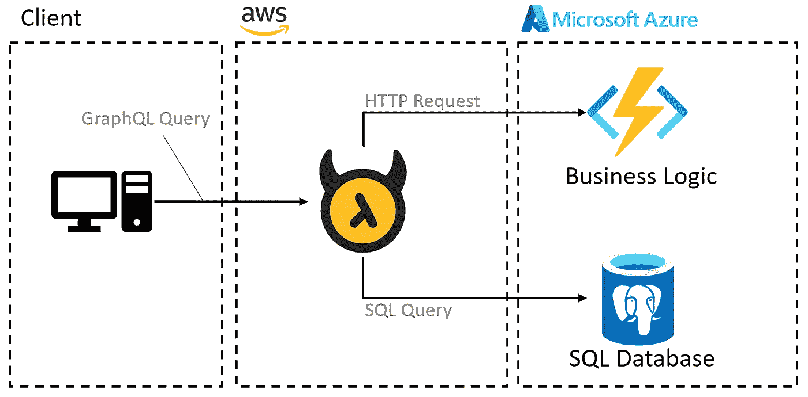

架构概述

上图展示了这个陈列柜的结构。当你建立一个 [Hasura Cloud](https://cloud.hasura.io/) 时，Hasura 托管在[Amazon Web Services](https://aws.amazon.com/)Cloud 上，这是默认环境。PostgreSQL 数据库和我们的无服务器 Azure Functions 应用程序托管在 Microsoft Azure Cloud 上。

这个 showcase 的 Azure Functions 应用程序的代码可以在我的 Github [这里](https://github.com/TobiStr/Demo.Hasura.AzureFunctions)找到。

# Azure 功能的初始设置

设置 Azure 函数非常简单。如果你还没有 Azure 帐户，我建议你注册并自己尝试一些东西。大多数 Azure 云计算环境都可以免费测试。此外，微软为你提供免费课程，通常包括一个沙盒，你可以尝试任何东西，而不用担心账单。

要添加 Azure 功能，请登录您的 Azure 门户，然后点击**创建资源**。在搜索栏中搜索**功能 App** ，点击**创建**。

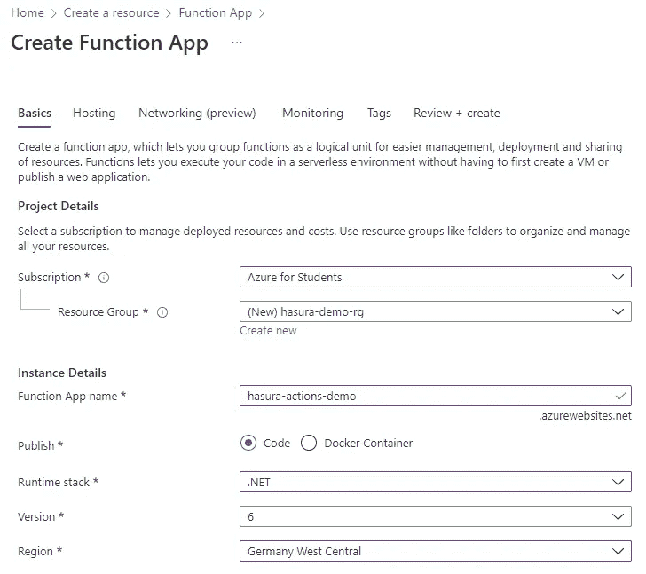

创建功能应用程序

*   在此表单中选择一个资源组，如果还没有资源组，请创建一个。
*   输入一个全球唯一的名称，因为 Azure 将根据该名称为您创建一个公共地址。
*   根据您的首选语言选择一个运行时堆栈，并为运行时选择一个版本。
*   选择您希望托管应用的地区。

点击**下一个:托管**。

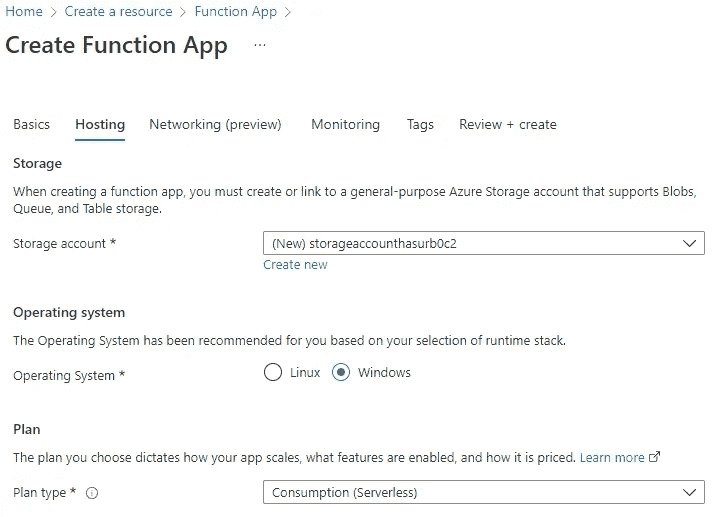

托管设置

*   选择或创建新的存储帐户。
*   选择您的首选操作系统。
*   选择**消费(无服务器)**作为您的计划类型。这只会在使用时汇总成本。

*你还不需要担心成本，因为* [*Azure Functions 消费计划*](https://azure.microsoft.com/en-us/pricing/details/functions/) *非常便宜，而且一开始就有 100 万个免费请求。*

现在你可以点击 **Review + create** 来创建你的第一个 Azure 函数！

# Azure 函数编程

现在，让我们进入编码部分。如果你已经安装了带有 Azure 扩展的 Visual Studio，你可以简单地从你的**创建项目**对话框中选择 Azure Functions 模板。否则，您可以通过 CLI 创建一个新项目[。我推荐使用 Azure 扩展，因为这也将使发布变得更容易。](https://docs.microsoft.com/en-us/azure/azure-functions/create-first-function-cli-csharp)

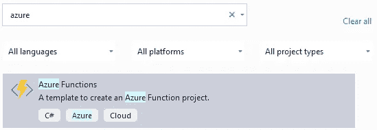

Azure 函数模板

在设置过程中，系统会询问您想要创建什么类型的功能。选择 Http 触发器和授权级别:函数。

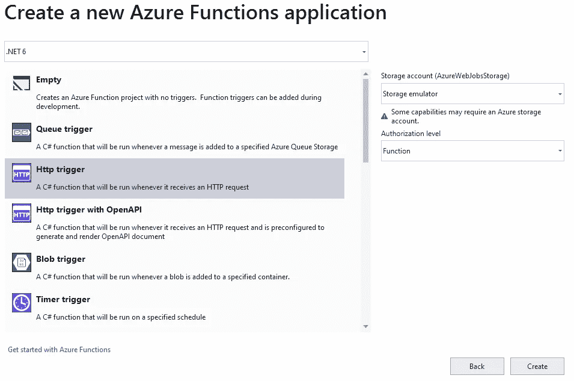

授权级别 **Function** 意味着，你的 Functions App 默认会受到一个秘密的保护。只有知道这个秘密或者具有有效认证头的客户端可以调用该函数。

创建项目后，你将面对一个名为 **Function1** 的演示功能。这是作为静态函数实现的。然而，我总是更喜欢非静态类，因为这允许我使用依赖注入，并在我的项目中使用一些依赖:


函数 **Run** 上面的属性被 Azure 用来生成这个函数的端点 URL，例如`https://hasura-actions-demo.azurewebsites.net/api/hasura-demo-action`。

为了能够使用微软的依赖注入，您首先需要添加以下包:

*   [微软。扩展. DependencyInjection](https://www.nuget.org/packages/Microsoft.Extensions.DependencyInjection/)
*   [微软。Azure.Functions.Extensions](https://www.nuget.org/packages/Microsoft.Azure.Functions.Extensions/)

直接在项目文件夹下创建一个名为 **Startup** 的类，并添加以下代码:

通过该属性，Azure Functions 应用程序主机知道使用什么作为启动逻辑，因此您可以在这里将您的依赖项添加到 IoC 容器。

现在，要开始实现一个可以被 Hasura 调用的函数，我们需要了解来自 Hasura Actions 的调用是什么样子的。对于这个问题，我们看一下[文档](https://hasura.io/docs/latest/graphql/core/actions/action-handlers.html)，发现它是一个 JSON 序列化对象，包含四个对象:

*   动作名称
*   来自 Hasura 的会话变量
*   输入数据
*   和原始请求查询

我选择实现一个泛型类型，我们可以反序列化来自 Hasura 的每个调用:

HasuraActionPayload 类型定义

因为我们不需要原始查询，所以可以放心地忽略它。如果你愿意，你也可以实现一个 Hasura 动作，它没有输入负载，这就是为什么我在这里还添加了一个非泛型类型。

现在我们可以使用这个类型来反序列化 HttpRequest，它将由 Hasura 传递给我们的函数。

# 创建一个 Hasura 操作

要创建新的操作，您必须在您的 Hasura Cloud 仪表盘上点击**操作** → **创建**。

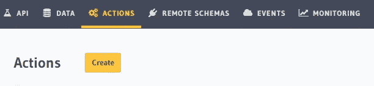

创建行动

将出现一个对话框，您必须在其中输入一个**动作定义**。您可以在这里输入以下内容:

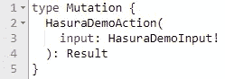

突变定义

*   作为类型，可以输入**查询**或**突变**。
*   下一个字符串是操作的名称
*   在括号中插入参数，这些参数将被传递给你的查询，然后传递给 Azure Functions 应用程序。
*   在“:”之后，您可以输入结果类型

在动作定义的旁边，您必须定义您想要在您的动作中使用的**类型**。

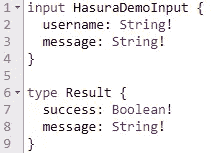

类型定义

我强烈推荐使用单个参数，并且总是为你的输入创建一个自定义类型。通过这种方法，当您更改输入时，您的自动代码生成器将简单地为您生成输入类型，您不必更改太多代码。

对于处理程序，您将需要输入您的函数的 URL，然后是秘密，这将由 Azure 自动创建。在下一步，我们将看到如何上传我们的功能应用到 Azure，并获得网址和秘密。

现在，保存你在 Hasura 上的操作，继续从上面打开 Azure Functions 应用程序项目。

# 在 Azure 上托管一个功能应用

在我们准备将我们的应用程序发布到 Azure 之前，我们首先需要实现我们的业务逻辑。

首先，我们在单独的文件中定义请求和结果类型。正如我正在使用的。NET 6，我可以只使用记录类型:

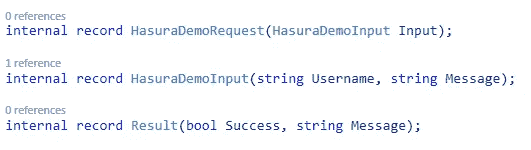

Hasura 请求和结果类型

为了反序列化来自 Hasura 的请求，我们的代码将如下所示:

最终函数定义

有了这些代码，我们就可以将我们的函数应用发布到 Azure 了。为此，您可以右键单击您的项目并选择 **Publish** 。

*   会出现一个对话框，你可以选择 **Azure。**
*   在下一个窗口中，根据您在 Azure 上的功能应用中的设置，选择 **Azure 功能应用(Windows/Linux)** 。
*   现在选择您的订阅，以及我们在上面创建的功能应用程序。

选择**完成**和**发布**。你的应用现在将上传并托管在 Azure 上。

# 和哈苏拉连线

最后一步是填写动作的处理程序 URL，我们在上面的 Hasura 中定义了它。获取 URL 登录到您的 Azure 门户并导航到您的功能应用。

点击**功能** → **功能**，在现在出现的窗口中选择您的 HTTP 触发功能。在此面板上选择**获取功能 Url** ，您将看到 Url，后面是您的**功能授权级别**自动生成的密码。

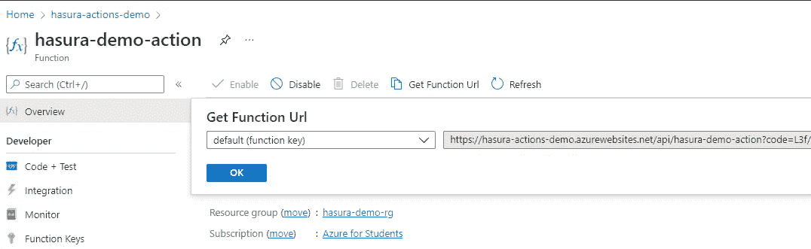

复制这个 URL 并将其粘贴到 Hasura 动作定义中。

瞧，您已经成功地为 Hasura 设置了一个 Azure 函数作为动作处理程序。

使用 Hasura 上 API 窗格下的 GraphiQL Explorer 来测试您新创建的变异:

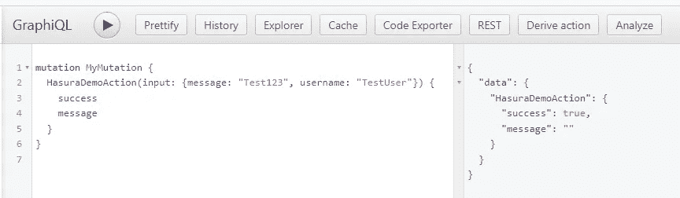

成功执行突变

顺便说一下，如果你想调试你的函数，你可以使用 Visual Studio 或者看看 Azure 上你的函数应用下的**监控** → **日志流**功能。当函数成功执行时，输出应该是这样的:

```
2022-02-01T19:36:50.384 [Information] Executing 'hasura-demo-action' (Reason='This function was programmatically called via the host APIs.', Id=04b3a0c7-4a89-48af-952c-d20528467c20)2022-02-01T19:36:50.385 [Information] Executed 'hasura-demo-action' (Succeeded, Id=04b3a0c7-4a89-48af-952c-d20528467c20, Duration=1ms)
```

# 后续步骤

从现在开始，你有可能在 Azure Functions 应用中实现你的整个业务逻辑。这种设置具有向上扩展的能力，因此您不会受到后端性能不佳的影响。

感谢您花时间阅读这篇文章。我希望，你会觉得它有知识性、教育性和趣味性。非常感谢您的支持和参与。

如果您有兴趣了解干净架构、干净编码和最新技术栈的最新趋势、技巧和诀窍，尤其是在 C#环境中。净和有棱角——如果你考虑跟踪我，我会很感激。

祝你有美好的一天！


如果你还没有每天使用媒体来增长你的知识，现在是开始的最佳时机！借助 Medium，您可以轻松获得更多关于高度专业的主题的知识，发布高质量的内容，并接触到更广泛的受众。要开始，只需使用以下链接创建一个中型帐户:

[*加入中现*](https://medium.com/@tobias.streng/membership)

通过这样做，你将获得一个强大的平台，可以帮助你联系新的作者和读者，每天学习新的东西。