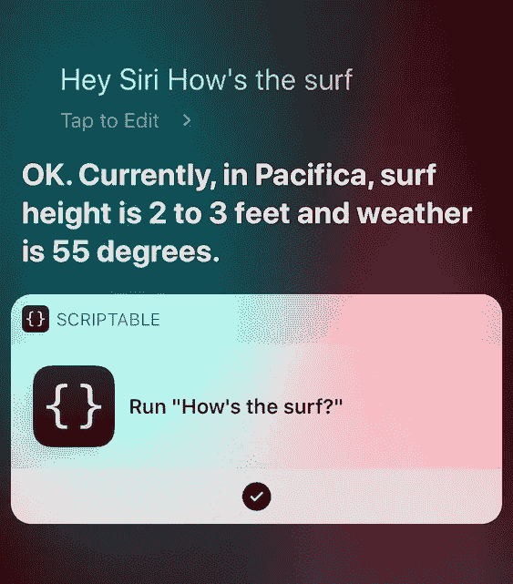
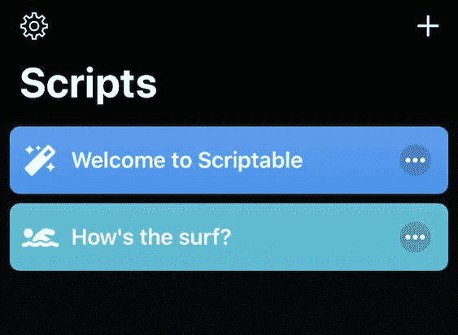
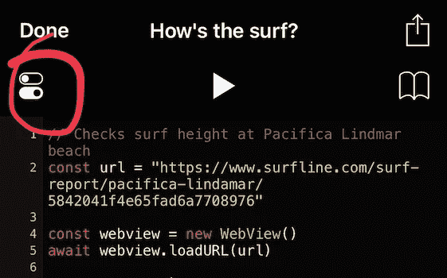
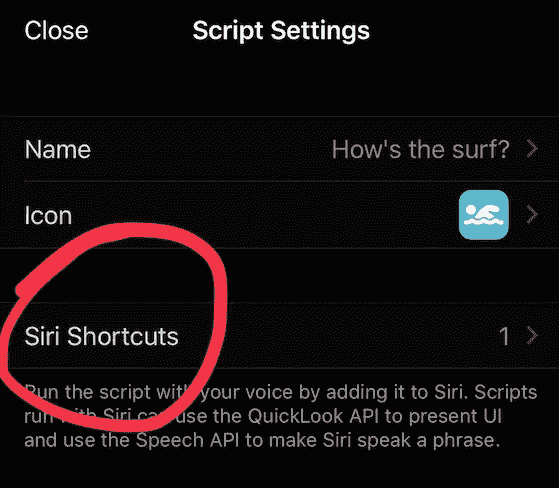

# 用 JavaScript 编写 Siri 快捷方式

> 原文：<https://betterprogramming.pub/writing-siri-shortcuts-in-javascript-scriptable-5169f9aeb29b>

## 使用 Scriptable 和 Siri 获取当前的冲浪条件


照片由[卡斯珀·卡米尔·鲁宾](https://unsplash.com/@casparrubin)在 [Unsplash](https://unsplash.com) 上拍摄

当我遇到 [Scriptable](https://scriptable.app) 时，我很兴奋能够在 iPhone 上用 JavaScript 编写自动化脚本。这些脚本可以在应用程序中运行，也可以导出为 Siri 快捷方式。这使得我们可以通过说出带有快捷方式名称的神奇短语来使用语音执行它们。

## 冲浪怎么样？


信用:[https://www.behance.net/JohnnyChiu](https://www.behance.net/JohnnyChiu)

我创建了一个名为*的快捷方式，冲浪怎么样？*它报告加利福尼亚州 Pacifica 的海流、冲浪高度和天气，Pacifica 是海湾地区一个受欢迎的冲浪地点。



iOS 上的 Siri 屏幕

该快捷方式由 Scriptable 中的 JavaScript 文件提供支持，该文件解析冲浪数据并将响应传递给 Siri。



## 数据和脚本

为了获得冲浪数据，我正在抓取 [Surfline](https://www.surfline.com) 的 Pacifica surf report URL。使用 JavaScript，我将带有`surf height`和`weather`信息的元素作为目标，提取`innerText`并生成一个`response`字符串。然后它作为一个参数传递给 Scriptable 的`Speech`对象的`speak()`方法。这是 Siri 在快捷方式被调用时的回应。

以下是可编写脚本的文件:

HTML 解析

## 创建快捷方式

可以从脚本视图的左上角访问`Settings`菜单。



设置图标

它提供了一些选项，包括更改名称、图标和创建 Siri 快捷方式。



## 问题

*   解析 Surfline 的 HTML 来挑选数据是不可靠的，因为他们可以通过改变他们网站的 URL 或 DOM 结构来破坏我们的脚本
*   由于计算量很大，这个脚本也很慢

## 更好的解决方案

我们可以使用由 [Spitcast](http://www.spitcast.com/api/docs/) 和 [Magicseaweed](https://magicseaweed.com/developer/api) 提供的 API 来获得 JSON 格式的冲浪高度和天气。Surfline 也有一个`services`端点，可以公开访问并提供这些信息。

```
https://services.surfline.com/kbyg/spots/forecasts/{type}?{params}
```

斯特凡·弗罗贝尔的优秀 GitHub [repo](https://github.com/swrobel/meta-surf-forecast) 中有更多关于不同 API 的细节。

我使用 Surfline 的服务 API 更新了我的脚本，看到快捷方式的性能有了显著的提高。**不像以前的解析脚本，Siri 平均需要五秒钟才能响应，新脚本在一秒钟内就完成了！**

Surfline API


稍微改变了一下语言

需要注意一些事情:

*   Surfline 的 API 没有得到官方支持，所以没有文档，API URL 方案将来可能会改变
*   我用最基本的方法来计算冲浪高度和天气数据，这不如 Surfline 的网站准确

## 剧本拿走！

我希望这篇文章能激发其他人利用 JavaScript 的力量来编写 iOS 脚本。希望听到您关于自动化项目的所有信息。