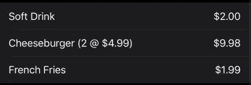

# 在 SwiftUI 中编写可测试视图

> 原文：<https://betterprogramming.pub/writing-testable-views-in-swiftui-ba28baec6a32>

## 视图分解是一件美妙的事情，但是我们需要聪明地知道如何去做


照片由 [Jungwoo Hong](https://unsplash.com/@oowgnuj?utm_source=unsplash&utm_medium=referral&utm_content=creditCopyText) 在 [Unsplash](https://unsplash.com/s/photos/modern-classroom?utm_source=unsplash&utm_medium=referral&utm_content=creditCopyText) 上拍摄

在 SwiftUI 中的[视图组合中，我讨论了 SwiftUI 如何鼓励我们将应用程序分解成小的、容易理解的组件和视图。](https://medium.com/swlh/structural-decomposition-in-swiftui-8892e512b18e)

但是我们可以做得更多。

我们可以——同时，而且只需很少的额外工作——创建易于测试和验证的组件。

## 一个例子

考虑订单接收应用程序中的以下屏幕片段，它显示订购商品的列表:



在 SwiftUI 中，我们可以使用以下代码生成一个列表版本:

```
struct OrderDetailsView: View {
    var order: Order
    var body: some View {
        Form {
            ForEach(order.items) { item in
                 HStack {
                     if item.quantity == 1 {
                         Text(item.name)
                     } else {
                         Text("\(item.name) $(\(item.quantity, specifier: "%.2f") @ $\(item.price, specifier: "%.2f")")
                     }
                     Spacer()
                     Text("$(\(item.total, specifier: "%.2f")")
                 }
            }
        }
    }
}
```

这很好，但是我们在循环中嵌入了相当多的逻辑。我们正在检查数量以控制我们的行如何出现，我们也做了相当多的行内格式化(并且做得不正确，我可能会补充。)

那么，如何才能做得更好呢？我如何确保我的代码是正确的？

## 分解

一种方法是简化`list`代码。

```
Form {
    ForEach(order.items) { item in
        OrderDetailsRowView(item: item)
    }
}
```

现在的`list`简直脑残简单。它遍历`out`项，并将列表中的每一项传递给一个专门处理每一行的视图。

只要`OrderDetailsRowView` 工作正常，这段代码基本不会出错。

> 请记住，当一个视图开始变得过于复杂时，可能是时候考虑分解它了。

# 行视图

现在让我们来看看`OrderDetailsRowView`。我们已经摆脱了形式和循环，因此这些代码更容易理解。毕竟，它只是返回一个包含单行所需文本的`HStack`:

```
struct OrderDetailsRowView: View {
    var item: OrderItem
    var body: some View {
        HStack {
            if item.quantity == 1 {
                Text(item.name)
            } else {
                Text("\(item.name) $(\(item.quantity, specifier: "%.2f") @ $\(item.price, specifier: "%.2f")")
            }
            Spacer()
            Text("$(\(item.total, specifier: "%.2f")")
        }
    }
}
```

但是我们仍然有一个类似的问题。我如何*知道*这个*代码是正确的？似乎我们所做的一切都是在拖延时间。*

这是真的——但是现在我们可以做得更多。

# 导出逻辑

例如，如果我把我的数字格式移出循环会怎样？我们将通过使我们的`OrderItem` *模型*更加智能来做到这一点，因为我们可能会在应用程序的其他地方显示一些相同格式的值:

```
extension OrderItem {
    var formattedQuantity: String {
        NumberFormatter.localizedString(from: NSNumber(value: quantity), number: .decimal)
    }
    var formattedPrice: String {
        NumberFormatter.localizedString(from: NSNumber(value: price), number: .currency)
    }
    var formattedTotal: String {
        NumberFormatter.localizedString(from: NSNumber(value: total), number: .currency)
    }
}
```

留给我们的是:

```
struct OrderDetailsRowView: View {
    var item: OrderItem
    var body: some View {
        HStack {
            if item.quantity == 1 {
                Text(item.name)
            } else {
                Text("\(item.name) (\(item.formattedQuantity) @ \(item.formattedPrice))")
            }
            Spacer()
            Text(item.formattedTotal)
        }
    }
}
```

这让事情变得简单多了。但是在我的循环中仍然有逻辑代码。它*看起来*正确，但我仍然无法*测试*它是否正确。

# 最终重构

让我们完成代码重构，并将我们的自定义描述逻辑移到我们可以看到的地方。

与格式化的总计不同，我们不打算将它添加到`OrderItem`中，因为目前，这似乎是我们将使用该特定格式的唯一地方。

我们还将导出最终的良好度量总请求，这为我们提供了最终的`OrderDetailsRowView`:

```
struct OrderDetailsRowView: View { var item: OrderItem var body: some View {
        HStack {
            Text(itemDescription)
            Spacer()
            Text(itemTotal)
        }
    } var itemDescription: String {
        if item.quantity == 1 {
            return item.name
        } else {
            return "\(item.name) (\(item.formattedQuantity) @ \(item.formattedPrice))"
        }
    } var itemTotal: String {
        item.formattedTotal
    }
}
```

请再次注意，我们的行视图的主体又一次变得非常简单。

```
var body: some View {
    HStack {
      Text(itemDescription)
      Spacer()
      Text(itemTotal)
   }
}
```

我们现在可以非常有把握地说，如果我们的两个输入是正确的，那么我们视图的最终输出*一定也是正确的。*

那么我们如何确定呢？

# 这是重击时间！

唯一确定的方法就是用力踩。(或者从轨道上用核武器攻击这个地方。)

因为我手边没有核武器，所以让我们为我们的详细行视图编写一些测试:

```
func testOrderDetailsRowView() { let view1 = OrderDetailsRowView(item: OrderItem.mock1)
    XCTAssert(view1.itemDescription == "Soft Drink")
    XCTAssert(view1.itemTotal == "$1.99") let view2 = OrderDetailsRowView(item: OrderItem.mock2)
    XCTAssert(view2.itemDescription == "Cheeseburger (2 @ $4.99)")
    XCTAssert(view2.itemTotal == "$9.98")}
```

首先，我们实例化一个数量为 1 的模拟订单项对象，将其传递给视图，并检查视图变量的结果。如果他们给我们`Soft Drink`和`$1.99`，我们就通过了。

然后，我们给它一个数量大于 1 的模拟项，并再次使用我们的可见变量来验证结果。

如果描述与总数为`$9.98`的`Cheeseburger (2 @ $4.99)`相匹配，那么我们已经根据我们的格式要求验证了我们的输出，我们可以开始了。

更重要的是，我们可以以 99.99%的信心说我们的视图表示代码是正确的，并且——只要我们继续运行我们的测试——它将保持正确。

# 斯威夫图伊的 MVVM

实际上，我们刚才所做的就是在 SwiftUI 中创建一个模型-视图-视图模型版本。

在经典的基于 UIKit ViewController 的应用程序中，我们创建`ViewModel`来驱动我们的`ViewController`。我们构建这些视图模型来分解我们的逻辑和功能，因此，我们可以*测试*该逻辑和功能。

给视图模型一个特定的输入，我们可以期望看到一个特定的输出。

如果我们测试我们的视图模型，如果我们看到期望的输出，如果*我们的视图控制器正确地绑定到我们的视图模型，那么我们可以相当有把握地说我们的屏幕——和我们的代码——是正确的。*

为了在 SwiftUI 中获得同样的效果，我们只需将尽可能多的逻辑从视图主体的*中取出*，并将其放入视图外部的*中的变量和函数中。*

因为，套用一句军事格言:如果我们能看到它，我们就能测试它。

# 独立和独特的视图模型

在经典的 MVVM 中，我们通常创建单独的`ViewModel`类，我们也可以在 SwiftUI 中这样做，使我们的视图模型成为一个`ObservableObject`，并将其作为一个`ObservedObject` *附加到我们的视图上。*

但是在很多情况下，这种方法可能有些矫枉过正，尤其是像这样的情况。

我的`OrderDetailsRowView`相对较小，自成一体，易于理解，所有重要的部分都在可以看到和测试的地方。

只有当我们开始扩大我们的视图以及相关的复杂性时，单独的视图模型才开始有意义。

考虑下面的视图，该视图根据相应的`OrderDetailsViewModel`生成的信息显示了我们的订单详情屏幕的更全功能版本:

```
struct OrderDetailsView: View {@ObservedObject var model: OrderDetailsViewModelvar body: some View {
    Form {
        if model.message.hasMessage {
            StatusMessageView(type: model.message)
        } LabelValueRowView(label: "Order", value: model.dateValue) ForEach(model.items) { item in
            OrderDetailsRowView(item: item)
        } if model.hasDiscount {
            LabelValueRowView(label: "Subtotal", value: model.subtotalValue)
            OrderDetailsDiscountView(value: model.discountValue)
        } LabelValueRowView(label: model.totalLabel, value: model.totalValue) Button("Order Again") {
            self.model.reorder()
        }
    }
}}
```

注意，我们视图中的所有东西都是由视图模型驱动的。

所有条件值和计算值都来自视图模型。有几个`if`语句控制某些元素的可见性，但是同样，那些*决策*背后的逻辑是在模型中做出的。视图只是执行它们。

当状态改变时，比如说点击“Order Again”按钮，我的视图再次根据我的视图模型重新生成

如果我的`OrderDetailsViewModel`的输出是正确的，那么，再一次，我的观点可能是正确的。

我只需要测试视图模型来确保。

还要注意，将视图和视图模型分成两个独立的部分有助于确保视图不会“作弊”毕竟，视图只能看到视图模型允许它看到的东西。

# 完成块

正如我之前关于 SwiftUI 中的[视图合成的文章一样，有人可能会说这仅仅是对方法和类重构的又一次长篇大论，我同意这一点。](https://medium.com/swlh/structural-decomposition-in-swiftui-8892e512b18e)

但是这种特定的重构练习是 SwiftUI 中成功的应用程序架构的关键之一——如果不是关键的话。如果做得好，您最终会得到一个干净的、结构良好的 SwiftUI 应用程序。一个可测试的，可以证明是正确的。

下次见！