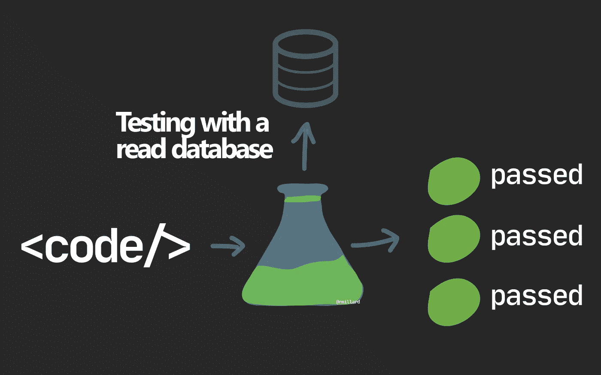

# 使用真实的数据库编写测试(为了更高的可信度)

> 原文：<https://betterprogramming.pub/writing-tests-using-a-real-database-for-higher-confidence-ea509d2c9843>

## 因为没有一个内存数据库提供程序能够很好地模拟真实情况

尼克拉斯·米勒德拍摄的图片

总有一天，单元测试和嘲笑不会解决问题。

给定一些预期的输入，当您想要验证一段代码是否正确运行时，使用模拟数据库编写单元测试可能会非常有用。

下一步自然是使用内存提供程序。但是，尽管内存提供者很有用，但与真正的东西相比，它只是一个空壳。例如，在内存数据库中测试时成功的查询在实际数据库中执行时可能会失败。

内存数据库给你一种虚假的自信感。

您最终需要确信您的数据访问层将在生产环境中运行，指向一个真实的数据库。

许多开发人员专注于编写自动化单元测试，然后通过启动整个应用程序、设置调试点或诸如此类的东西，并看到它成功，来手动执行“集成”测试。

这是一个繁琐的过程。

# 正确优先于速度

通常有两个反对在自动化测试设置中使用真实数据库的理由:

1.  每次供应和使用真实数据库的成本都很高。
2.  很慢。在网络上运行查询会花费更多时间，并减慢反馈循环。

但是我要说的是:用真实的东西进行测试提供了一种信心，这是任何模拟或内存替代方法都无法提供的。

此外，在测试过程中发现问题比让最终用户发现错误要好。在发布之前修复 Bug 是很便宜的。修复已发布版本的错误可能是一场噩梦——尤其是在处理丢失或损坏的数据时。

您可以轻松地在本地安装一个版本的数据库并使用它，使用 Docker 很容易做到。

如果您需要在 CI/CD 管道中运行集成测试，您可以编写资源模板来提供数据库，创建一个集成用户，运行测试，然后再次拆除整个系统。

在如此短的时间内运行一个数据库的成本可以忽略不计，您甚至可以在管道中使用 Docker。

# 你不需要测试所有的东西

这显然取决于您的领域、行业标准和法规遵从性，但是在某些情况下，您通常可以只使用真正的数据库。

我会优先确保我的迁移脚本能够完美工作，并且查询比简单的“选择”和“插入”工作更复杂。

如果您使用存储库模式——只有您的存储库可以直接访问数据——覆盖存储库的公共接口也是有意义的。

# 这是一个简单的三步过程

在提供数据库之后，您需要将三个简单的步骤合并到您的测试设置中:

1.  确保数据库已被删除。
2.  创建数据库。
3.  应用迁移。

本质上，您总是希望从一个干净的数据库开始您的测试。删除现有的集成数据库是正确的做法。很明显，您可以截断所有的表或以某种方式清除数据，但更容易的是放弃所有的东西。

然后创建数据库。我通常选择与主名称相同的名称，但使用一个后缀，如“. integrationtests”

顺便说一下，不要使用您的数据库管理员帐户来创建和运行测试。相反，创建一个专门的集成或测试用户，该用户具有创建数据库的权限，并撤销对主数据库的所有权限。

最后，您可以运行您的迁移。我总是喜欢编写迁移脚本，然后在集成数据库上运行脚本。

# 你的主要收获

使用模拟的或内存中的数据库测试您的数据访问层只能为您提供一定程度的信心。

甚至可能是虚假的自信。

在测试中切换到使用真实的数据库是关于优先考虑正确性而不是速度。刚开始启动并运行它似乎很难，但只需要三个简单的步骤。

# 让我们保持联系！

[点击这里](https://nmillard.medium.com/subscribe)订阅时事通讯，获取类似文章的通知，并查看 YouTube 新频道[*(@尼可拉斯·米勒德)*](https://www.youtube.com/channel/UCaUy83EAkVdXsZjF3xGSvMw)

*连接上* [*LinkedIn*](https://www.linkedin.com/in/nicklasmillard/)

# 好奇者的资源

*   [在微软文档中测试使用 EF 核心](https://docs.microsoft.com/en-us/ef/core/testing/)的代码