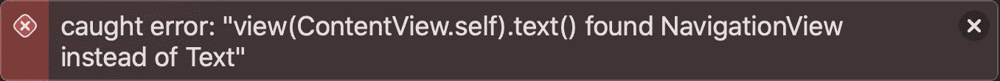

# 为 SwiftUI 视图编写单元测试

> 原文：<https://betterprogramming.pub/writing-unit-tests-for-swiftui-views-11aa5eb48d8e>

## 确保您的应用程序运行良好

照片由[大卫·特拉维斯](https://unsplash.com/@dtravisphd?utm_source=medium&utm_medium=referral)在 [Unsplash](https://unsplash.com?utm_source=medium&utm_medium=referral) 上拍摄

单元测试有助于我们确保我们的应用程序按预期工作，而不必在每次更改后启动应用程序并手动导航。与 UI 测试相比，它们测试的是孤立的单个视图，而不是完整的用户流。他们速度更快，注意力更集中。

为了容易开始，我们使用`ContentView`。它最初是在创建新项目时生成的，并在屏幕中央绘制字符串`“Hello, world!”`。是 SwiftUI 代码。

我们如何测试它是否拉动了绳子`“Hello, world!”`？一种方法是创建一个 UI 测试，就像创建 UIKit 一样。

另一种方法是使用库 [ViewInspector](https://github.com/nalexn/ViewInspector) 。

ViewInspector 是一个用于单元测试 SwiftUI 视图的库。它允许在运行时遍历视图层次结构，提供对底层`View`结构的直接访问。

# 测试静态视图

在测试中，我们首先创建被测对象。在我们的例子中，那就是`ContentView`。我们通过`inspect().text().string()`访问`Text`视图的`text`，并且能够断言它。测试通过。

`ContentView`采用了`Inspectable`协议，使神奇的库能够完成它的工作。

让我们给我们的`ContentView`添加一些额外的元素。除了`“Hello, world!”`之外，还有一个`navigationTitle`表示`“Greetings”`。

如果我们重新运行我们的初始测试，它会失败。

的确`inspect().text()`会失败。**视图层次结构已经改变**。应该是`inspect().navigationView().text(0)`。

`text(0)`表示`Text`视图是我们`NavigationView`中的第一个元素。测试通过。

让我们后退一步。用户仍然可以看到`"Hello, world!"`，但是**测试需要改变，因为视图层次结构已经改变**。测试与视图紧密耦合。当视图改变时，改变测试的行为经常被用作反对测试的论据。

为了缓解这个问题，我们提取了一个`GreetingsView`。

将我们的视图分解成更小的构建块是一个很好的实践——为了可读性、可组合性，以及我们将很快看到的测试目的。

提取的问候视图

我们添加一个测试:

它看起来和我们最初的`ContentView`和`ContentViewTests`非常相似。我们开始在`ContentView`内部使用新的`GreetingsView`。

我们的`Text`视图现在是`GreetingsView`的一部分。是时候为`ContentView`调整测试了。

我们的`GreetingsViewTests`和`ContentViewTests`都通过。但是有一个问题:我们测试同样的东西两次。`ContentViewTests`和`GreetingsViewTests`都测试用户是否与`"Hello, world!”`打招呼，测试`greetsWithHelloWorld`。

这是重复测试。相反，我们可以在`ContentViewTests`中测试`GreetingView`是否出现在`ContentView`中。然后我们可以测试在`GreetingsViewTests`中向用户问候的措辞。我们改变`ContentViewTests`来反映这个变化。

总而言之，我们:

1.  **排列**:创建被测视图
2.  **动作**:浏览视图层次结构以获得我们感兴趣的元素
3.  **断言**:对元素使用断言

# 添加逻辑

到目前为止，我们只测试了静态视图。可能有一种观点认为测试静态视图没有意义。毕竟，我们可以信任 SwiftUI 在使用视图`Text("Hello, world")`时显示文本`"Hello, world!"`。但是，我们仍然可以使用测试作为规范来告诉我们视图做了什么。我们可以读取测试的名称，而不是呈现视图或读取实现。

此外，视图可能不会长时间保持静态。引入了逻辑，视图变成了动态的。

假设我们需要两个问候语，一个是针对登录用户的，另一个是针对客人的。创建`UserState`来存储用户是否为`loggedIn`和`userName`。

我们在`GreetingsView`使用新的`UserState`。让我们从将它传递到构造函数中进行可测试性开始。

我们改变测试以适应新的`UserState`。

如果我们有一个名字为`Peter`的`loggedIn`用户，他会被问候为`Hello, Peter!`。如果该应用程序是由一个未经认证的用户使用，一个客人，我们将显示`Hello, world!`。

# 使用环境对象

如果我们将状态移动到一个`@EnvironmentObject`中，因为我们将在应用程序的多个视图中使用它，会怎么样？

现在`UserState`采用`ObservableObject`。

`EnvironmentObject`是在我们的`@main`中创建的。

然后用在`GreetingsView`里。

我们需要添加`didAppear`功能来允许`ViewInspector`测试视图。同步测试不会起作用。测试如下所示:

不得不使用异步测试语法起初看起来很奇怪，但却是必需的。我们也需要对`@State`和`@Environment`使用异步测试。`@ObservedObject`或`@Binding`不需要，但出于[测试一致性原因](https://github.com/nalexn/ViewInspector/blob/master/guide.md#views-using-observedobject)仍应使用。

有些人可能对在`GreetingsView`中使用额外的可测试性代码有疑问。我个人认为可测试性比视图的实现美学更重要。

也许未来苹果会提供 SwiftUI 视图的原生测试方案？也许我们会有新的工具为我们创建的每个新视图创建一个初始测试？让我们看看！