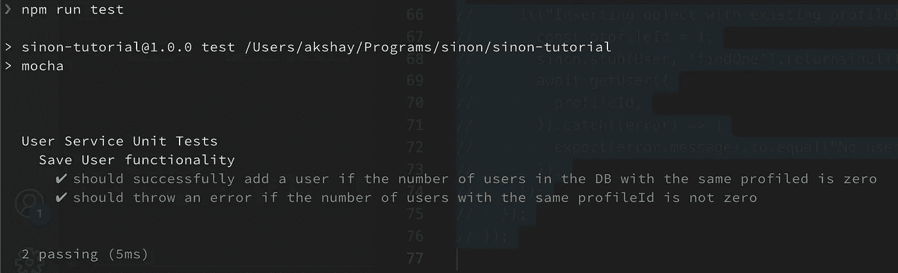
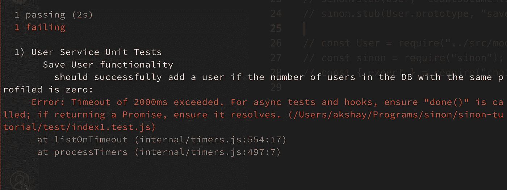
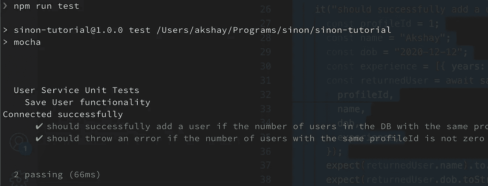
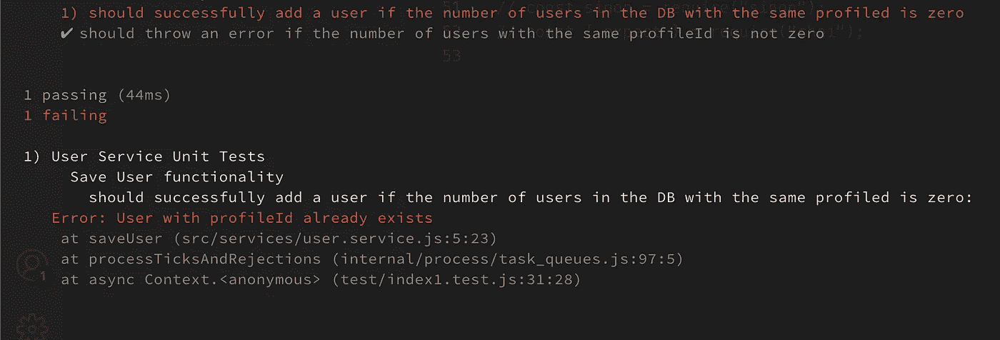
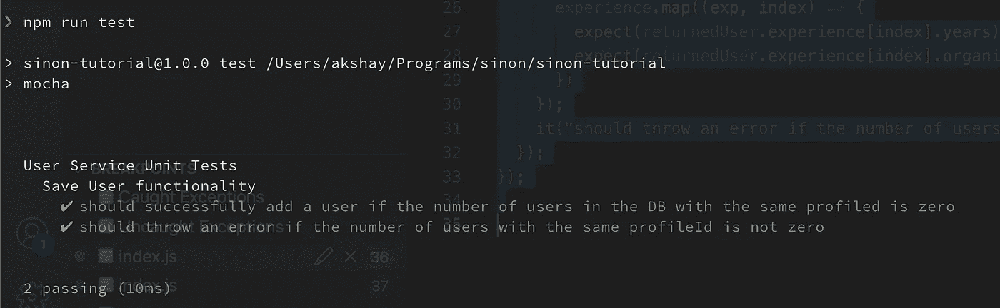
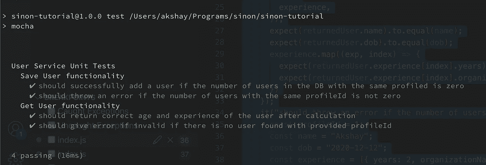

# 为 Node.js API 编写单元测试

> 原文：<https://betterprogramming.pub/writing-unit-tests-for-your-nodejs-api-13257bd0e46b>

## 为在 MongoDB 上执行 CRUD 操作的真实 Node.js API 创建单元测试


在 [Unsplash](https://unsplash.com/?utm_source=medium&utm_medium=referral) 上由[battlecreekcoffeeroasters](https://unsplash.com/@battlecreekcoffeeroasters)拍摄的照片

单元测试是开发人员开发生命周期中不可或缺的一部分。尽管编写单元测试有时看起来像是一个多余的过程，但是这些测试的实际使用是在稍后对代码进行修改的时候出现的。

如果一段代码有写得很好的单元测试，那么如果我们必须对它进行任何更改，我们可以不从头开始对整个特性进行完整的端到端测试。这样，单元测试有助于提高开发人员的生产力。

但是理解单元测试过程的问题是，大多数与之相关的内容不是太简单就是太复杂。要么人们试图解释如何为一个简单的加法函数编写单元测试，要么我们看到他们在非常复杂的项目中编写。

因此，在本文中，我将教您如何为一个实际但简单的 Node.js API 编写单元测试，在 MongoDB 上执行 CRUD 操作。

我们将使用`chai` `mocha`和`sinon`来编写我们的单元测试。整个项目的源代码可以在[这里](https://github.com/AkshayCHD/sinon_tutorial)找到

# 项目设置

我们将从设置 node js 项目开始。所以第一步是创建一个空目录

```
mkdir node-api
```

然后进入回购

```
cd node-api
```

并执行 npm 初始化

```
npm init --y
```

安装以下依赖项

```
npm install chai cors express mocha mongoose sinon
```

现在我们必须在我们的目录中复制下面的项目结构。

```
|-index.js
|-src
  |-models
    |-user.model.js
  |-services
    |-user.service.js
|-test
  index.test.js
```

现在为了简单起见，我们将创建 2 个 API，一个用于将用户添加到我们的 MongoDB 数据库，另一个用于通过唯一的`profileId`获取用户。

所以用户模型`user.model.js`看起来会像这样

接下来，我们创建服务函数来添加用户，并从文件`user.service.js`中的 DB 获取所有用户的列表

这是我们将要为之编写单元测试的一段代码。

然后，我们在`index.js`文件中创建快速路由，以允许通过 HTTP 请求执行我们的服务。

最后，我们必须编写逻辑来建立到 MongoDB 数据库的连接。

这里我假设您有一个本地 MongoDB 设置，如果没有，您也可以通过替换 URI 来使用 MongoDB atlas 实例。

# 编写单元测试

为了编写单元测试，我们将使用`[mocha](https://mochajs.org/)`和`[chai](https://www.chaijs.com/)`。现在我们不会讨论这些包提供的每个特性，因为那超出了本文的范围。这里我们将只讨论编写一些基本单元测试所需的特性。

首先，让我们从`saveUser`服务功能的测试开始。由于该函数的工作是向数据库添加一个用户，这样每个用户都有一个唯一的`profileId`，因此它应该满足两个广泛的场景。

*   如果数据库中具有相同配置文件的用户数为零，则应成功添加用户。
*   如果拥有相同`profileId`的用户数量不为零，应该抛出一个错误

因此，让我们首先使用描述函数为我们的测试用例编写一个框架结构，如下所示

`describe`块为我们的测试提供了结构，而`it`块封装了一个单元测试。

要执行上面的空测试，将上面的逻辑添加到测试目录中的`index.test.js`文件，并在 package.json 文件中添加下面的脚本。

```
"scripts": {
    "test": "mocha"
}
```

现在，当我们运行`npm run test`时，上面的脚本被执行，它依次执行 mocha，mocha 默认查找所有扩展名为`.test.js`的文件并执行它们。

因此，在运行`npm run test`时，我们将看到下面的输出。



由于目前我们的测试中没有逻辑，因此两个测试用例都成功通过。

现在是时候在我们的测试用例中添加实际的测试逻辑了，所以对于第一个测试用例，让我们尝试导入我们的 save user 函数，并尝试使用它将用户保存到 DB 中。

`expect`关键字用于创建断言，这意味着布尔表达式必须为真，除非程序中有 bug。

但是当我们现在运行上面的测试时，我们会看到下面的错误



这里的问题是，当我们执行`saveUser`服务函数时，我们实际上并没有与数据库建立任何连接。

所以像`countDocuments`和`save`这样的 mongoose 模式函数不会给我们任何结果，因为它们不能以任何方式与数据库连接。

因此，让我们尝试在我们的`index.test.ts`文件中建立连接，如下所示

这里再次假设您已经启动并运行了一个本地 MongoDB。

现在，如果我们运行`test`脚本，我们会看到下面的输出。



现在一切看起来都很好，我们感觉我们已经成功地编写了测试，但是请等待，再次尝试运行相同的测试。



问题之所以存在，是因为现在我们的数据库中已经有一个用户，它拥有我们提供的`profileId`，并且由于我们有一个签入位置来验证所提供的`profileId`的存在，该检查失败了，因此我们的整个测试失败了。

除此之外，当我们在实际的数据库上运行测试时，我们还会面临其他问题。

*   我们可能需要在两次连续测试之间清理数据库，因此，如果由于某些人为错误而错误地连接到生产数据库，我们的测试可能会删除生产数据。
*   由于依赖于数据库，我们的测试需要互联网连接才能工作，因此它们不能孤立运行。
*   与实际数据库的交互需要时间，这使得运行测试成为一项耗时的操作，这在理想情况下是不应该的。

为了克服上述问题，我们必须创建所谓的存根。

根据定义，软件开发中的存根是一段代码，用来代替一些其他的编程功能

简而言之，存根可以被视为对某个现有功能的方法的覆盖，这样我们就可以模拟对该功能的调用，这样它总是返回我们想要的输出。

所以在上面的例子中，我们将使用存根来模拟对`user.model`函数的函数调用，比如`save`和`countDocuments`，这样它们总是返回我们想要的输出，而不需要实际连接到数据库。

为了创建存根，我们将使用`[sinon.js](https://sinonjs.org/)`，它为我们创建存根、模拟等提供了一个框架。

我们可以使用`sinon`库来模拟`user.model`的响应，如下所示

```
sinon.stub(User, "countDocuments").returns(0);
sinon.stub(User.prototype, "save").returns(
    { name, dob, experience }
);
```

在添加了`sinon`存根并删除了 DB 连接的逻辑之后，完整的单元测试看起来会像这样

现在，无论 DB 连接如何，我们多次运行上述测试，都会看到下面的响应。



现在剩下的就是为`saveUser`服务功能的剩余场景编写测试，以及为`getUser`服务功能编写测试。

我们可以测试 DB 中已经存在概要文件的场景，如下所示

请注意，`sinon.restore`命令在每次测试后运行，以清除测试期间创建的所有存根，并使它们相互独立。

现在，最后我们为`getUser`服务编写测试场景

*   应该在计算后返回用户的正确年龄和经验
*   如果没有找到提供的`profileId`的用户，则应给出一个无效错误

上述场景可以使用存根以类似的方式实现。

所以整个测试文件看起来会像这样

当我们运行它时，我们会看到下面的输出



这样，我们已经成功地为我们的两个服务功能编写了单元测试。

# 结论

在本文中，我试图提供一个简单而实用的演示，展示我们如何为一个简单的 Node.js API 编写单元测试。但是我们仅仅触及了演示中使用的库所提供的功能的表面。

因此，我希望我已经在本文中帮助你开始了单元测试的概念，这样你会发现将来在这个领域的探索相对容易。