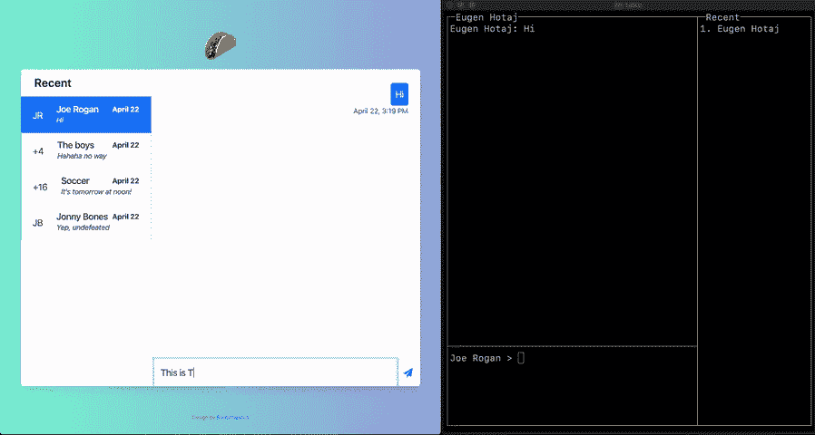
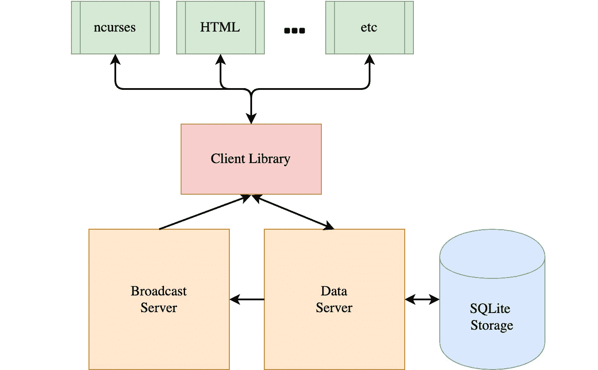
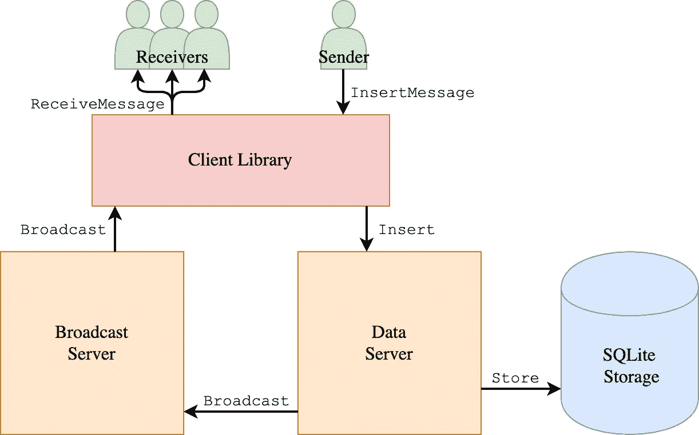
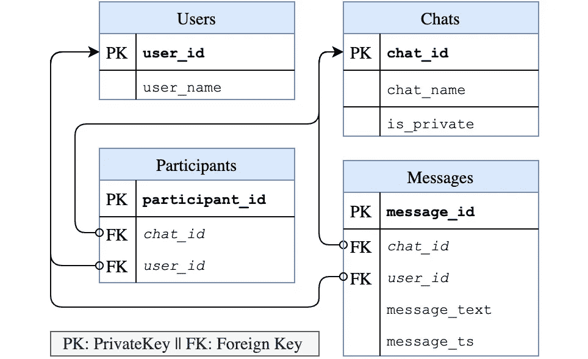
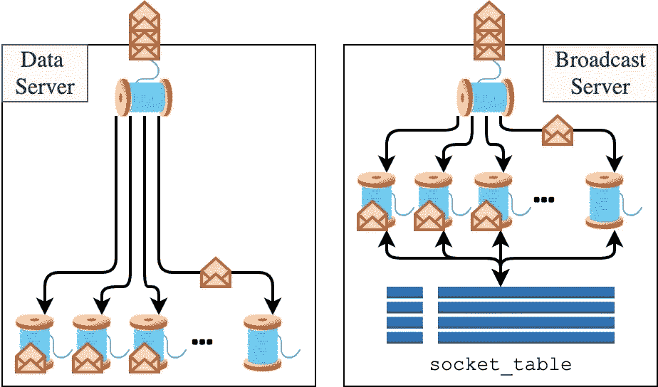
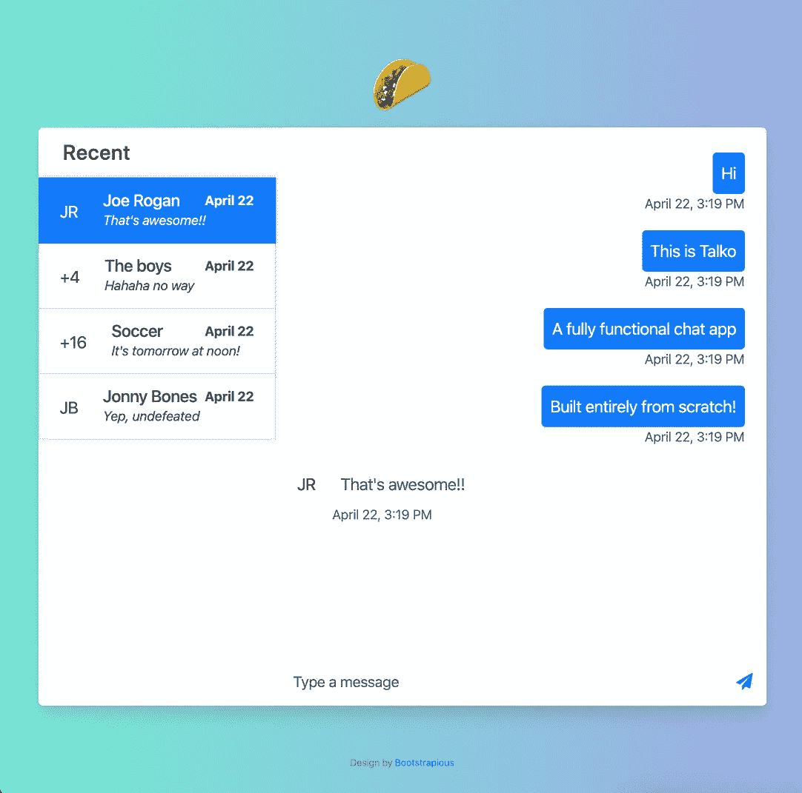
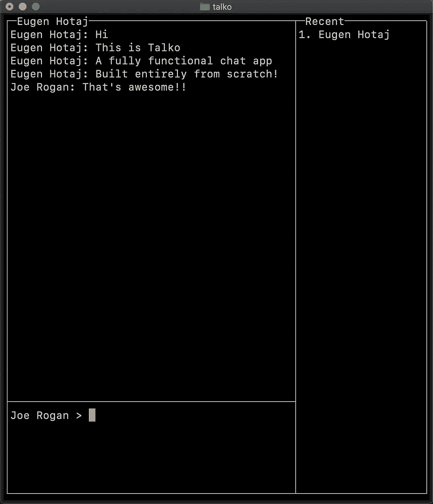

# Talko:一个端到端的聊天应用

> 原文：<https://betterprogramming.pub/writing-web-servers-from-first-principles-92ecce110480>

## 如何根据基本原则(没有库或框架)构建聊天应用程序

Web 开发可能是当今最普遍的编程形式。像 [Flask](https://flask.palletsprojects.com/en/1.1.x/) 和 [Node.js](https://nodejs.org/en/) 这样的框架使得编写 web 应用程序变得非常容易，在像 [Heroku](https://www.heroku.com/home) 这样的网站上托管应用程序也变得轻而易举。虽然这些框架很强大，但许多人把它们当作黑盒，在没有真正理解其内部发生了什么的情况下使用它们。在本文中，我们将打开黑匣子，看看如何构建一个实时聊天应用程序， [Talko](https://www.github.com/EugenHotaj/talko) 🌮，从第一原理。*我们不会使用* *HTTP、* [*请求*](https://requests.readthedocs.io/en/master/) *，或者框架。*

图 1:Talko web 客户端(左)与 Talko 终端客户端(右)通信。

从 TCP 套接字开始，我们将首先实现一个定制的传输协议，以允许我们的服务轻松地在它们之间传输消息。然后，我们将实现两个服务器和一个客户端库，并在传输协议之上使用 [JSON-RPC](https://www.jsonrpc.org/) 在它们之间进行通信。最后，使用客户端库，我们将实现如图 1 所示的两个基本客户端。

*本文附带的所有工作代码都可以在*[*my GitHub*](https://www.github.com/EugenHotaj/talko)*上找到。*

# Talko 传输协议(TTP)

我们的主要目标是从头开始构建尽可能多的应用程序堆栈。这意味着我们将不使用 HTTP，而是使用来自 TCP 套接字的原始字节流来构建一切。使用原始字节流进行通信很快变得难以处理，因此我们将设计 Talko Transfer Protocol (TTP)来形式化我们的服务如何将字节流转换为消息。(关于为什么这么做有意义的更多背景知识，请看一下 *TCP 套接字*附录)。

我们的协议必须解决的主要问题是如何从连续的字节流中分离出不同的消息。一个简单的方法是发送方告诉接收方到底发送了多少字节。这可以通过给消息附加一个`header`来实现，该消息编码了消息`body`的字节数。`header`必须大小不变，否则，同样的问题将会持续，因为服务不知道如何将`header`与`body`分开。TTP 使用 10 位数字`header`，这意味着我们可以发送大约 10gb 的信息，这对大多数事情来说已经足够了。最后，消息在通过网络传输之前被编码成`utf-8`二进制字符串。

图 2:如何使用 Talko 传输协议对消息“hello world”进行编码。十位数的报头使用两个前导数字来编码主体的大小(11 个字节)，后跟八个填充数字。

# Talko 的架构概述

使用 TTP，我们现在可以在我们构建的任何服务之间传输数据。我们将从 Talko 架构的高层次概述开始，然后更详细地探究每个组件。在这个过程中，我们还将讨论以前的实现方法，这些方法由于各种原因没有成功。这些部分被标记为**以前的实现**，因此不感兴趣的读者可以跳过它们，而不会丢失文章的线索。

图 Talko 架构的高级概述。

从上面的图 3 可以看出，Talko 是使用客户机-服务器架构设计的。客户端通过 JSON-RPC [请求/响应协议](https://github.com/EugenHotaj/talko/blob/master/talko/protocol.py)与两个服务器`DataServer`和`BroadcastServer`通信。`DataServer`负责读取和写入聊天数据，并公开你期望从 [CRUD](https://en.wikipedia.org/wiki/Create,_read,_update_and_delete) 应用程序中得到的典型方法。客户端发送`*Requests`到`DataServer`，服务器响应相应的`*Response`，然后关闭连接。要发送后续请求，客户端必须重新打开与服务器的连接。

`BroadcastServer`处理实时聊天消息传递。它只向客户端公开了两个方法，`OpenStreamRequest`和`CloseStreamRequest`。当一个客户端发送一个`OpenStreamRequest`，`BroadcastServer`用一个`OpenStreamResponse`来响应，并且与`DataServer`不同，保持客户端连接打开，这样它就可以在将来向它广播消息。`BroadcastServer`公开的最后一个方法是`BroadcastMessage`。这是一个内部方法，仅由`DataServer`用来通知`BroadcastServer`应该广播一个特定的消息。

除了上面描述的广播握手，客户端只与`DataServer`通信。对于大多数请求，`DataServer`只是简单地读写 SQLite 数据库中的数据。然而，对于`InsertMessageRequests`,`DataServer`也会将新插入的消息转发给`BroadcastServer`，以便将其广播给其接收者。图 4 通过 Talko 后端展示了一个`InsertMessageRequest`的生命周期。

图 Talko 后端如何处理插入新消息并将其广播给接收者。

在高层次上，当用户键入新的聊天消息时，用户的客户端使用客户端库向`DataServer`发送一个`InsertMessageRequest`。`DataServer`接收请求并将用户的消息存储在 SQLite 数据库中。一旦消息被成功存储，`DataServer`向`BroadcastServer`发送一个`BroadcastMessageRequest`，其中包括新消息和接收者列表。最后，`BroadcastServer`查找每个连接的接收者的套接字，并向他们发送消息。

## 以前的实现

在之前的设计中，`BroadcastServer`和`DataServer`的角色被颠倒了。为了插入消息，客户端将使用它们的长期连接向`BroadcastServer`发送`InsertMessageRequests`。这种方法很快就被放弃了，因为它让客户感到困惑。此外，它在`BroadcastServer`中造成了巨大的瓶颈，因为它要求服务器为每个连接的用户分配一个线程，以便持续监听`InsertMessageRequests`。

# 数据库存储

当我第一次开始使用 Talko 时，我没有构建聊天应用程序的经验。为了大致了解其他人是如何完成这项任务的，我在谷歌上搜索了一些资源。我发现的大多数东西让我感到困扰的是，他们只提到了如何将两个 TCP 套接字连接在一起，然后就到此为止。但这几乎不是一个聊天应用！当接收用户不在线时会发生什么？我们如何支持小组对话？如何处理多个连接的客户端？

要回答第一个问题，我们需要将聊天对话存储在一个数据库中，这样即使用户离线，消息也不会丢失。Talko 使用 SQLite，因为它本身受 Python 支持，但任何数据库引擎都可以工作。SQLite 的一个很大的缺点是它不适合生产，但是对于我们的情况来说这不是一个障碍。Talko 将其数据组织在四个表中，`Users`、`Chats`、`Participants`和`Messages`。每个表的[模式](https://github.com/EugenHotaj/talko/blob/master/talko/schema.sql)如下图 5 所示。

图 5:用于存储 Talko 数据的表。外键通过箭头连接到它们的规范私钥。

将参与者分成单独的桌子使得支持私人(即一对一)聊天以及群组聊天变得微不足道。只需在`Participants`表中添加或删除一行，就可以在组中添加或删除参与者。此外，通过在`Participants`表中的外键上创建索引，查询组成员可以变得非常快。

## **以前的实现**

最初，Talko 只支持私人聊天，所以参与者被作为单独的列存储在`Chats`表中。然而，很快就发现这种方法对群体来说是不可行的。首先，我们将不得不强加一个任意的最大组大小，因为在某一点上我们不能继续向`Chats`表添加列。查询组成员资格也将是缓慢而笨拙的，因为每个单独的列都必须单独检查。最后，从一个组中添加和删除参与者同样是缓慢而乏味的。另一种方法是使用数组将参与者存储在一列中。虽然这减轻了最大组大小的限制，但其他问题却恶化了。

# 数据和广播服务器

Talko 的`DataServer`和`BroadcastServer`组成了应用的[主逻辑](https://github.com/EugenHotaj/talko/blob/master/talko/server.py)。除了正确性，一个很大的焦点是使服务器尽可能可伸缩，以便处理成百上千个同时连接的用户。实现这种可伸缩性的一种方法是跨请求进行大量并行处理。谢天谢地，每个请求都是独立的，所以这很容易做到。

两台服务器使用相同的基本设置。主线程接受新的客户端连接，并将连接直接移交给工作线程进行处理。因为只有一个主线程，所以必须尽快完成工作，否则主线程会成为整个服务器的瓶颈。一个技术性问题是，Talko 使用[进程](https://docs.python.org/3.9/library/multiprocessing.html)而不是线程来围绕 [Python 的 GIL](https://wiki.python.org/moin/GlobalInterpreterLock) 工作，并实现最大的并行性。

图 Talko 的服务器概述。每个服务器使用一个主线程来接受新的连接(红包)。连接会立即移交给工作线程进行处理。此外，广播服务器使用内存中的`socket_table`来跨线程共享连接。

虽然`DataServer`是无状态的，但是`BroadcastServer`需要跟踪所有连接的用户，以便在他们之间广播消息。为此，服务器使用内存中的`socket_table`来存储`user_id → socket`。当一个新的客户端连接时，它们的套接字被添加到`socket_table`中以备后用。如果客户端发送一个`CloseStreamRequest`，则套接字仅从`socket_table`中显式移除。然而，更有可能的是，客户端会在没有首先发送`CloseStreamRequest`的情况下关闭连接(例如，通过关闭 web 浏览器中的 Talko 选项卡)。这意味着`BroadcastServer`将通过无限期地保留关闭的套接字来泄漏内存。这可以通过让后台线程定期清除关闭的套接字或者在下次使用它们时懒惰地删除它们来解决。

## 以前的实现

Talko 最初不是用微服务设计的。相反，所有的逻辑都封装在一台服务器中。然而，这使得代码更加混乱，也更难推理。微服务自然是为了使整体逻辑更简单而出现的。也就是说，这种方法有明显的缺点，比如维护多个服务器，以及为每个`BroadcastMessageRequest`消耗额外的(尽管很快)RPC 的成本。

# 客户端库

让所有客户端手动处理与两个服务器的通信是非常乏味的。为了稍微减轻负担，我们抽象了[客户端库](https://github.com/EugenHotaj/talko/blob/master/talko/client.py)背后的大部分细节。该库公开了客户端与 Talko 后端交互所需的必要方法，而不会被具体细节所困扰。

特别是，该库公开了客户端获取实时消息的两种方式— [长轮询](https://en.wikipedia.org/wiki/Push_technology#Long_polling)或连续流。长轮询是通过简单地等待来自后端的消息一段时间来提供的，如果在该时间间隔内没有收到任何消息，则返回一个空响应。对于连续流，库向客户机返回一个(阻塞)生成器，当新消息进来时，该生成器生成新消息。客户端可以通过在单独的线程中迭代生成器来异步接收新消息。

## **以前的实施**

我对发电机方法特别自豪。在之前的尝试中，客户端库从客户端接受了一个`callback`,然后客户端会为每个新消息调用一个单独的线程。这迫使客户端库通过为客户端管理线程来充当伪服务器——这显然不是一个好主意。将线程化的责任推给客户端允许库完全无状态。

# 用户界面

实现了所有必要的组件后，现在就可以使用客户端库编写与后端接口的客户端了。我们不会在这里讨论如何做到这一点的细节，因为这超出了本文的范围。如果你对细节感兴趣，GitHub 上有 [ncurses](https://en.wikipedia.org/wiki/Ncurses) 客户端和 Flask web 客户端的代码[。](https://github.com/EugenHotaj/talko/tree/master/talko/ui)

图 6:(左)使用 Flask 编写的 Talko web 客户端。(右图)一个使用 ncurses 编写的 Talko 终端客户端。

# (令人惊讶的)结论

在本文中，我们从 TCP 套接字开始构建了一个聊天应用程序。尽管我们主要构建了自定义组件，但我们的最终实现与现代 web 服务器和框架的编写方式相当接近。这不是我的目标。

事实上，我试图尽可能地避开许多既定的最佳实践，并希望真正地从基本原则开始构建一切。例如，我最初没有着手编写请求/响应协议，而是选择在服务之间双向传输数据。当这变得过于笨拙时，消息传递显然成为下一个合乎逻辑的步骤。从这个意义上说，许多最佳实践是在实施过程中无意中产生的。这让我有些吃惊。也许这意味着许多最佳实践确实是构建 web 应用程序的最佳方式。或者，放弃先入为主的信念比我们想象的要困难得多。

## 前面的路很长

虽然 Talko 目前是一个功能齐全的应用程序，但要让它投入生产还需要付出巨大的努力。最大的问题是，所有的通信都是以纯文本形式进行的，容易受到[数据嗅探](https://en.wikipedia.org/wiki/Sniffing_attack)、[中间人攻击](https://en.wikipedia.org/wiki/Man-in-the-middle_attack)等的影响。使用 TLS 和端到端加密消息是保护我们免受这些威胁的必要条件。Talko 也没有任何真正的错误处理，比如格式错误的请求、丢失的数据、重复的条目等等。最后，数据库必须升级，SQL 查询需要调优，整个应用程序必须更加健壮。

如果你喜欢这篇文章，请关注我，以便在我发布新内容时得到通知。所有的代码都可以在[我的 GitHub](https://www.github.com/EugenHotaj/talko) 上找到。

Eugen Hotaj，
2020 年 4 月 23 日

# 附录— TCP 套接字

如果你正在阅读这篇文章，你可能已经熟悉了大多数服务是如何通过互联网进行通信的。一个服务(客户端)从另一个服务(服务器)请求一些数据，然后服务器用请求的数据进行响应。事实证明，这种请求/响应模式是由通信协议(在本例中是 HTTP)任意强加的，并且幕后发生的事情有些不同。

为了传输数据，两个服务首先在它们之间建立连接，通常使用 [TCP 套接字](https://en.wikipedia.org/wiki/Network_socket)。这就创建了一个双向通道，任一服务都可以用它来发送和接收对方的数据。除了确保数据按照发送的顺序到达之外，TCP 并没有强加任何规则。数据实际上可以是任何东西:字节、字符串、PI 的随机数字、损坏的图像等等。交流也没有限制。一个服务可以选择完全忽略来自另一个服务的数据，只读取第三个字节，等等。

有了这么大的自由，服务之间几乎不可能以双方都能理解的方式进行通信。这就是 HTTP 的用武之地。它建立了一个公共协议，服务可以使用该协议以统一的方式发送和接收数据。该协议对可以发送什么数据(例如 HTTP 请求)以及如何进行通信(每个请求得到一个响应)施加了限制。HTTP 使开放互联网上的不同服务能够容易地相互通信。