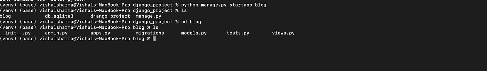
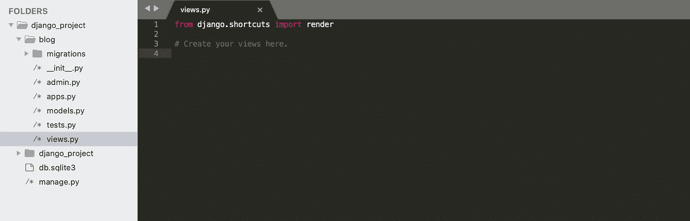
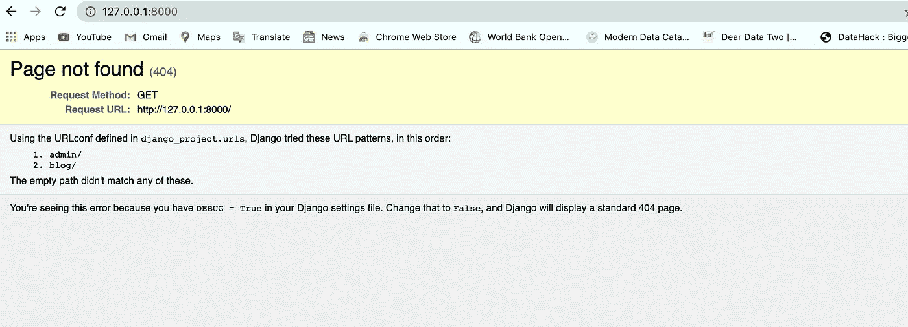
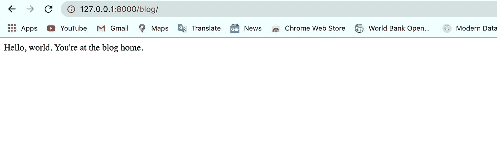
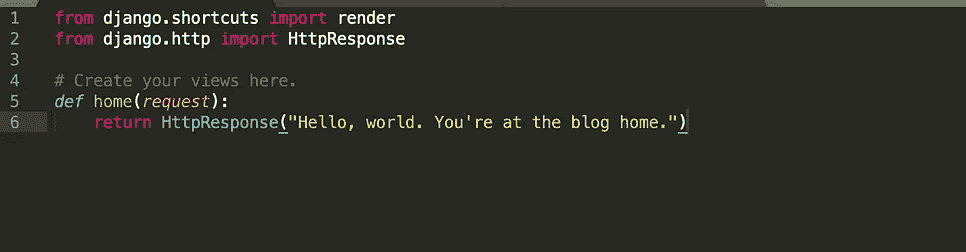
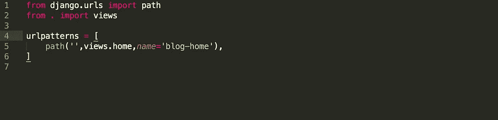
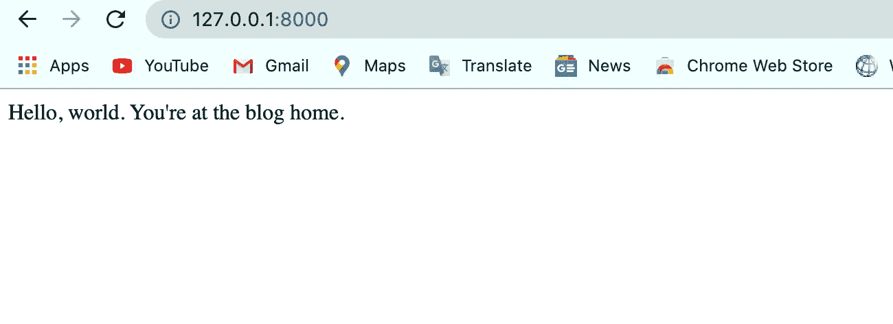

# 编写我们的第一个 Django 应用

> 原文：<https://betterprogramming.pub/writing-your-first-django-app-e81f76c9b0e1>

## 让我们从最简单的初学者应用程序开始吧


照片由[沙哈达特·拉赫曼](https://unsplash.com/@hishahadat?utm_source=medium&utm_medium=referral)在 [Unsplash](https://unsplash.com?utm_source=medium&utm_medium=referral) 上拍摄

几天前，我开始了一个 Django 系列，在这个系列中，我将撰写一系列文章来帮助你踏上 Django 之旅。

在这一系列文章中，我已经谈到了 Django、它的应用程序以及我们如何安装和启动它。现在是时候编写我们的第一个应用程序了。我们不会做太专业的事情。相反，我们将打磨我们的基础，创造一些初学者友好的东西。

目前，我相信你们都知道 Django 是什么，以及如何安装它。如果你不知道，我在下面附上了以前文章的链接。

现在让我们开始构建我们的第一个实际应用程序！

# 创建应用程序

要创建一个新的应用程序，只需进入 Django 项目，编写下面这段代码。

```
python manage.py startapp "application name"
```

因此，一旦运行了这个程序，就会在您的项目中创建一个`blog`文件夹。



```
blog/
    __init__.py
    admin.py
    apps.py
    migrations/
        __init__.py
    models.py
    tests.py
    views.py
```

像这样的结构将被创建在你的应用文件夹下。这个目录将存放您的应用程序。在我的例子中，我的博客应用程序将驻留在这个目录中。

# 编写我们的第一个视图

*视图*是一个 Python 函数，接受 web 请求并返回响应。它可以是任何内容—从内容、图像和视频到 404 错误。我们将视图写在项目或应用程序目录中的`views.py`文件中。

在我的例子中，我的 app `blog`目录中有`views.py`。我将不得不在那上面工作。`views.py`文件将为空，但已经从`django.shortcuts`导入了`render`。



views.py

我们将导入`from django.http import HttpResponse`。这基本上会返回一个 HTTP 响应。它是一个包含生成的响应的对象。

```
from django.shortcuts import render
from django.http import HttpResponse# Create your views here.
def home(request):
    return HttpResponse(“Hello, world. You’re at the blog home.”)
```

这是最简单的 Django 观点。这是视图功能。每个视图函数接受一个`HttpRequest`对象，它通常被命名为`request`，并且它返回一个`HttpResponse`对象，该对象将在网页上显示`“Hello, world. You’re at the blog home.”`。

但是我们还不能运行它。为了调用视图，我们需要将它映射到一个 URL。为此，我们需要一个`URLconf`。我们要创建一个`urls.py` 文件，在 app 目录下创建一个`URLconf`。

# **将 URL 映射到视图**

在`blog/urls.py`中，您可以简单地编写以下代码:

```
from django.urls import path
from . import viewsurlpatterns = [
    path('', views.home,name='blog-home'),
]
```

`urlpatterns`列表将 URL 路由到视图。您可以从您的应用程序向`urlpatterns`添加新的 URL。为了添加一个新的 URL，我们导入我们的`views.py`文件来使用`home`函数进行映射。

现在在`urlpatterns`中增加了一个新的空路径，将运行`views.py`的`home`功能。表示运行 app 时，`views.py` 的`home`功能会运行。我把这个路径命名为`blog-home`。

因此，我们将博客主页的 URL 路径映射到 views.py 文件中的`home`函数。它不会工作，因为我们的项目目录中仍然有一个`urls.py`文件。它会告诉我们整个网站哪些网址应该把我们发送到我们的博客主页。这一切听起来可能令人困惑！

## **如果你对应用和项目感到困惑**

一个*应用*是一个做一些事情的网络应用——例如，一个网络日志系统。一个*项目*是一个特定网站的配置和应用程序的集合。一个项目可以包含多个应用程序。一个应用程序可以在多个项目中。

最后，我们必须配置项目的`urls.py`文件，以便它可以调用我们的应用程序。

```
from django.contrib import admin
from django.urls import path,includeurlpatterns = [
    path('admin/', admin.site.urls),
    path('blog/', include('blog.urls')),
]
```

在这个文件中，我已经导入了`include`模块，它可以调用我们的应用程序并包含它的文件。你可以看到我已经创建了另一个路径路由`blog`、**、**，它正在调用博客的`url.py`文件中的`urlpatterns`。

# 运行服务器

映射完成后，您就可以运行服务器了——但是您会得到一个令人惊讶的结果。



现在我们已经引入了一些新的 URL 模式，它不会向我们显示默认主页！

但是如果你去`/blog`，你会看到你的`views.py`函数运行并给出正确的 HTTP 响应。



那么这是怎么发生的呢？当我们导航到`blog` 页面时，它会转到项目的`urls.py`文件，并在`urlpatterns`中查找博客。它查看我们是否有与博客匹配的模式。现在模式匹配了，它就想着模式匹配了就把人送到哪里去。



Django 然后遇到`include()`并砍掉 URL 中与该点匹配的部分，并将剩余的字符串发送给 included `URLconf`进行进一步处理。在我们的例子中，`blog`部分被匹配，一个空字符串被发送到我们应用程序的`urls.py`文件。


在那里，它匹配 URL 模式并调用`views.home`。在`view.py`文件中，`home`函数最终返回一个 HTTP 响应。

我们已经成功运行了第一个应用程序。但是如果我想让博客页面成为我们的家呢？如果服务器运行并且`127.0.0.1:8000`被踢，我们得到`“Hello, world. You’re at the blog home.”`。我们只是想把我们的博客页面改成我们的主页。就是这样！

为此，转到项目的`urls.py`文件，将博客 URL 路径留空。

```
from django.contrib import admin
from django.urls import path,includeurlpatterns = [
    path('admin/', admin.site.urls),
    path('', include('blog.urls')),
]
```

现在，当你运行服务器时，你将登陆博客主页。



就是这样！您已经完成了构建 web 应用程序的第一步。它也是一个网络应用程序。最简单的一个！

## 摘要

在这篇文章中，我谈到了以下主题:

*   创建应用程序
*   创建视图
*   用视图映射 URL

## 参考

*   [“编写你的第一个 Django 应用，第 1 部分”](https://docs.djangoproject.com/en/3.0/intro/tutorial01/)(Django 官方网站)
*   [“Django 入门！”](https://medium.com/swlh/getting-started-with-django-b73f7343447b)
*   [安装后启动我们的 Django 站点！”](https://medium.com/swlh/launching-our-django-site-after-installation-9adecd6b65b2)