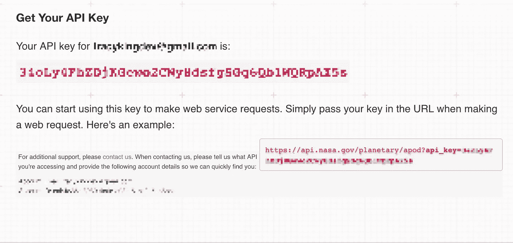
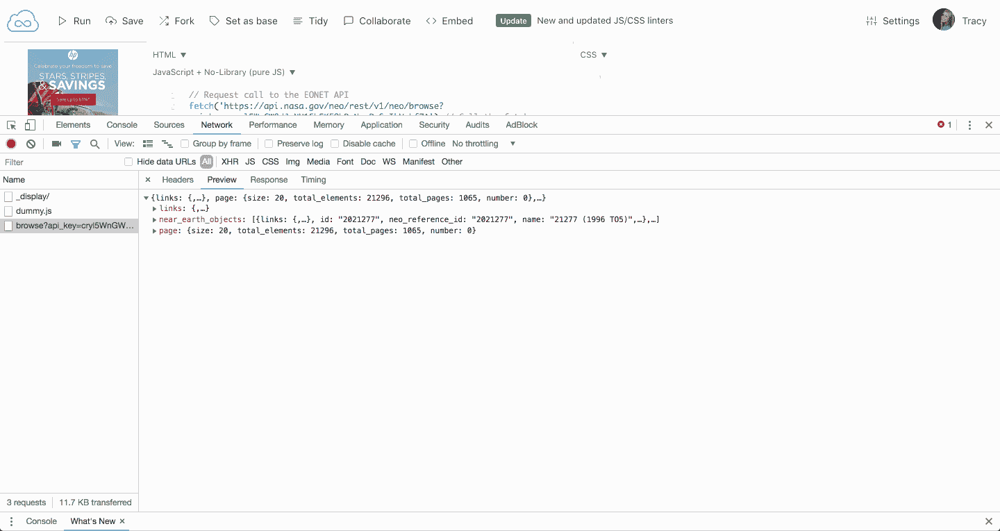

# 如何给 NASA 写第一个 HTTP 请求

> 原文：<https://betterprogramming.pub/writing-your-first-http-request-to-nasa-ffbefef2093b>


我很高兴向您介绍 HTTP 请求，并为您提供启动和运行的工具和资源。

学习如何使用 API 是提升前端开发人员水平的好方法。这也是了解如何检索数据以及哪些数据可供您使用的一种有趣方式。

你需要做的第一件事是通过填写这张[表格向 NASA 申请 API 密匙](https://api.nasa.gov/index.html#apply-for-an-api-key)。

你可以在[这段视频](https://www.youtube.com/watch?v=1yFggyk--Zo)中了解更多关于 API key 的信息。

API 密匙会给你与 NASA API 通信的能力。注册后，您将立即被定向到一个带有新 API 密钥的页面。

它应该是这样的:



敏感信息被模糊化以保护用户的身份和个人 API 密钥

您可以使用新的 NASA API 密钥提出许多不同的请求。

我个人最喜欢的包括:

*   [**小行星——近地小行星**](https://api.nasa.gov/api.html#NeoWS) :根据它们最接近地球的日期识别小行星。
*   [**火星车照片**](https://api.nasa.gov/api.html#MarsPhotos) :传回美国宇航局的好奇号、机遇号和勇气号火星车收集的照片
*   [**EONET**](https://api.nasa.gov/api.html#EONET) :允许用户每天浏览整个地球，寻找正在发生的自然事件。风暴经常出现在热带地区，沙漠上的沙尘暴，夏天的森林火灾。

请参见 [NASA API 文档](https://api.nasa.gov/index.html)获取完整的功能列表。

# 代码

我将使用 JavaScript 的[获取 API](https://developer.mozilla.org/en-US/docs/Web/API/Fetch_API) ，并一步一步地向你展示如何让一切运行起来。

## 第一步

设置 Fetch 以使用您选择的 NASA API 发出请求。

您将需要您试图从中请求数据的 API 的 URL。我选择使用我的第一个例子——小行星新闻的 URL:

`[https://api.nasa.gov/neo/rest/v1/neo/browse?api_key=DEMO_KEY](https://api.nasa.gov/neo/rest/v1/neo/browse?api_key=DEMO_KEY)`

## 第二步

您会注意到 URL 末尾的`DEMO_KEY`。这是您将使用自己的个人 API 密钥替换的内容。

一旦添加了 API 密钥，URL 看起来应该与此非常相似:

```
https://api.nasa.gov/neo/rest/v1/neo/browse?api_key=34oLy4FhODjKGewo2VIy8dsfgSGq6Qb1TQEpAX5s
```

唯一的区别是您的 API 密匙是唯一的，与上面的不同。

Fetch 方法将上面列出的 URL 作为字符串形式的强制参数，如下所示:

```
fetch("https://api.nasa.gov/neo/rest/v1/neo/browse?api_key=34oLy4FhODjKGewo2VIy8dsfgSGq6Qb1TQEpAX5s")
```

## 第三步

现在我们需要使用`then`向`fetch`请求添加一个承诺，该请求将被返回并解析为该请求的响应。

你会注意到我们构建了两个案例，一个`then`和一个`catch`——分别代表成功和失败:

这里有一个使用 [JSFiddle](https://jsfiddle.net/) 和 [Chrome DevTools](https://developers.google.com/web/tools/chrome-devtools/) 执行代码的演示。

当我运行代码时，来自 API 的响应将显示在开发控制台的 network 选项卡中:



如果您在控制台打开的情况下，在 jsdild 中使用您唯一的 API 键运行这段代码，您要么会看到响应对象，要么会看到一个警告框。

**请注意，上述代码不会运行，因为 API 密钥无效。**

# 结论和资源

如果您对代码有任何疑问，请随时联系我。如果你把你遇到的问题发过来，对我们双方来说都是最容易的。

如果你对 NASA 不感兴趣，还有很多其他的 API 供你使用，使用相似的代码。

这里有一个简短的列表供您查看:

[**Twitter**](https://developer.twitter.com/en/docs/api-reference-index) :为开发者提供了很多不同的机会，包括收集某些地区的热门词汇和话题的数据。

[**FEC**](https://apilist.fun/api/fec) :为开发者提供收集美国联邦选举竞选捐款信息的工具。

感谢[凯瑟琳·霍奇](https://medium.com/u/df76b57e5595?source=post_page-----ffbefef2093b--------------------------------)关于我上面提到的 API 密匙的视频。我还要感谢韦恩·范·德万特、克洛伊·鲍威尔、曼弗雷德·施泰尔和克里斯蒂安·霍华德的反馈和支持。