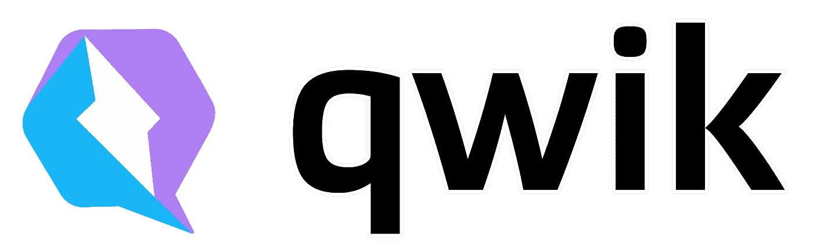
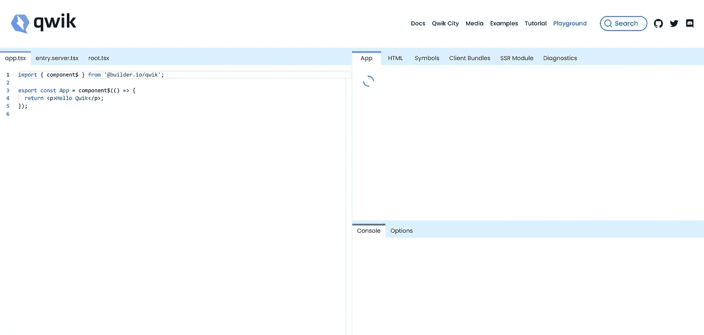
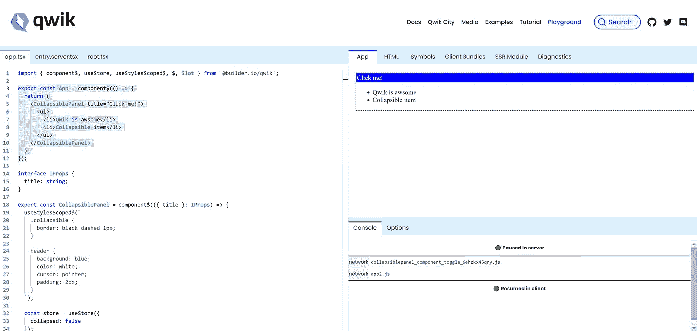

# 编写您的第一个 Qwik 组件

> 原文：<https://betterprogramming.pub/writing-your-first-qwik-component-18a0c50f2687>

## 探索这个奇妙的框架



【qwik 的图像标志

在过去的几周里，我正在深入研究 [Qwik](https://qwik.builder.io/) 框架，为我将在 [TechRadarCon 2022](https://techradarcon.com/schedule/index.html#session-4400) 上发表的一次演讲做准备。我还用 Qwik 和 QwikCity 实现了一个[完整演示应用](https://github.com/gilf/the-agency-qwik)，以熟悉框架开发者体验。

在本文中，我将向您展示如何开发一个简单的 Qwik 组件，并向您展示一些在开发组件时需要知道的事情。

# Qwik 游乐场



Qwik 游乐场

你可以在 Qwik 网站上找到的一个很好的功能是 Qwik 游乐场。在操场上，您可以使用 Qwik 语法编写组件。在右窗格中，您可以获得有关组件渲染、错误、符号的信息，甚至可以使用底部的选项选项卡来配置如何渲染。

您可以使用 playground 作为环境来构建我将在本文中实现的组件，或者您可以使用 Qwik CLI 创建一个新项目并添加该组件。

# 构建组件

在本文中，我们将构建一个简单的可折叠面板组件。该组件将有一个可点击的标题，这将折叠其内容。内容将从外部注入。

所以，就这么办吧:)。

下面的代码是一个完整的例子，我们将在后面解释:

## 我们来分解一下

Qwik 包含了 TypeScript，所以我们将首先为组件将接收的 props 创建一个接口。下面是接口实现:

```
interface IProps {
  title: string;
}
```

现在我们有了接口，让我们使用它，并使用 Qwik 语法声明组件:

```
export const CollapsiblePanel = component$(({ title }: IProps) => {
   ...
});
```

如您所见，您使用了`component$`函数来创建一个 Qwik 组件。`$`符号用于指示 [Qwik 优化器](https://qwik.builder.io/docs/advanced/optimizer/)以特定的方式处理该函数(在本例中，作为 Qwik 组件)。

*注意:我不打算讨论优化器，我鼓励你在这里* *阅读关于它的* [*。*](https://qwik.builder.io/docs/advanced/optimizer/)

既然我们已经声明了组件，让我们来实现它。Qwik 使用 JSX 编码组件的渲染方式。在组件的最后，我们将返回下面的 JSX:

```
return (
    <div className="collapsible">
        <header **onClick$**={toggle}>
          {title}
        </header>
        <section hidden={collapsed.value}>
          **<Slot />**
        </section>
     </div>
);
```

可以看到，我们返回了一个带有一些实现的 div。我在代码中标记了两个你应该知道的重要的东西。`onClick$`是在 Qwik 中将事件与结尾的`$`符号连接起来的方法。同样，`$`符号是为 Qwik 优化器准备的。`Slot`组件是一个特殊的 Qwik 组件，支持将内容注入到组件中。我们稍后将讨论商店。

现在，让我们添加一些风格。如果你想在你的组件和外部之间创建一个风格屏障，你可以使用`useStylesScoped$`钩子。`useStylesScoped$`钩子接收您想要封装到组件中的样式，并将其施加到组件上。

```
useStylesScoped$(`
    .collapsible {
      border: black dashed 1px;
    }header {
      background: blue;
      color: white;
      cursor: pointer;
      padding: 2px;
    }
`);
```

在上面的例子中，我们向容器 div 和 header 元素添加了样式。呈现时，Qwik 将确保样式只特定于组件；所以，风格不会从中泄露。

为了拥有 Qwik 可以序列化的内部组件状态，您需要使用`useSignal`钩子。钩子产生一个反馈信号，其内容可以被 Qwik 跟踪并序列化。在可折叠面板示例中，信号存储组件`collapsed`状态:

```
const collapsed = useSignal(false);
```

最后但同样重要的是，我们实现了`toggle`函数，它将用于切换内容:

```
const toggle = $(() => {
    collapsed.value = !collapsed.value;
});
```

由于 toggle 函数没有内嵌在组件的 JSX 中，您需要使用`$(async () => { … })`语法来确保 Qwik 优化器理解这将是一个在 JSX 中使用的 Qwik 组件函数。

就是这样。现在你可以玩这个组件了。

以下代码是运行可折叠面板的消费组件:

```
export default component$(() => {
  return (
    <CollapsiblePanel title="Click me!">
      <ul>
        <li>Qwik is awsome</li>
        <li>Collapsible item</li>
      </ul>
    </CollapsiblePanel>
  );
});
```



Qwik Playground 中的可折叠面板组件

# 摘要

在本文中，我们实现了一个 Qwik 可折叠面板组件。这是一个简单的组件，但是它展示了一些您在编写 Qwik 组件时需要熟悉的概念。

一如既往，如果你有任何反馈，让我知道。