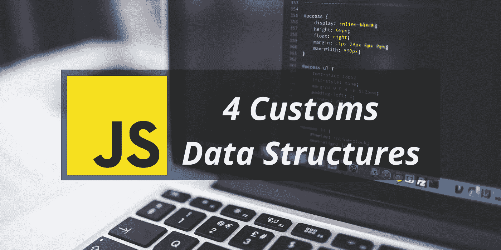
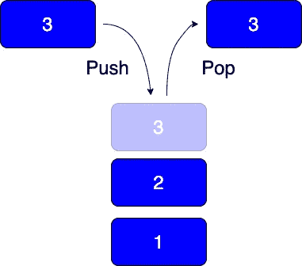
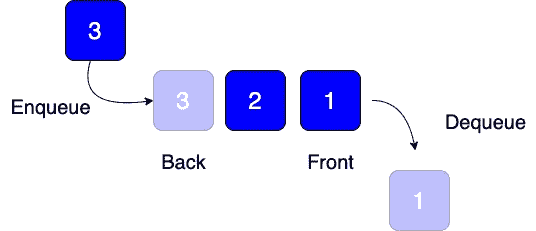
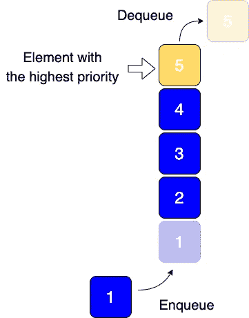
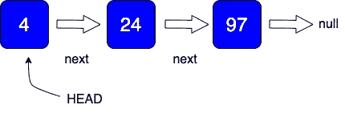
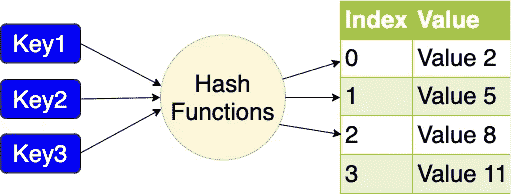

# 编写自己的 JavaScript 数据结构

> 原文：<https://betterprogramming.pub/writing-your-own-javascript-data-structures-a63eca08c1ee>

## 4 JavaScript 中数据结构的实现

编码面试，解题技巧，算法题都和**数据结构有关。**

数据结构组织、管理和存储数据，从而实现高效的访问和修改。JavaScript 提供了四种本地数据结构:数组、集合、映射和对象。然而，在这篇文章中，我们不涉及这些。

希望这篇文章能帮助大多数正在阅读的人。

# 1.堆

Stack 是一种抽象数据类型，遵循 LIFO(后进先出)或 FILO(先入后出)规则。

**现实世界的例子:**你要从第一个洗到最后一个的一叠盘子。

堆栈必须至少支持以下操作:

1.  `push` —将一个元素推到堆栈的顶部
2.  `pop` —从堆栈顶部移除元素，并返回移除的元素。
3.  `peek` —返回顶部元素

实施:

# 2.长队

队列和堆栈的唯一区别是队列遵循 FIFO(先进先出)规则。

**现实世界的例子:**烤面包机通知什么先进，什么先走。

队列必须至少支持以下操作:

1.  `enqueue` —在队列的开头插入一个元素
2.  `dequeue` —从队列末尾删除一个元素，并返回删除的元素。
3.  `front` —从队列中返回前面的元素
4.  `back` —从队列中返回返回元素

实施:

## 优先队列

优先级队列是队列的增强版本；它会根据提供的优先级进行相应的排序。如果有两个元素具有相同的优先级，则该元素将被插入到第一个元素的后面。

实施:

# 3.单向链表

单向链表是一种单向的链表。一旦我们从**头开始遍历，**我们只能移动到下一个节点，直到列表的末尾( *null* )

**真实案例:**顺畅简单的物流流程:打包- >取货/卸货- >送至分拣中心- >发货

链表必须至少支持以下操作:

1.  `add` —将节点添加到列表的末尾
2.  `addAt` —将节点添加到列表中的特定索引
3.  `removeFrom` —从列表中的特定索引中删除节点，并返回该元素
4.  `indexOf` —检查列表中节点的索引

实施:

# 4.哈希表

哈希表是一种可以将键映射到值的数据结构。哈希表相对于其他数据结构的主要优势是速度。访问一个元素的平均时间复杂度是 O(1)。面临哈希冲突是很常见的，这意味着当哈希函数为多个键生成相同的索引时，就会有冲突。

**现实世界的例子:**在一个传统的(没有现代技术支持的)诊所里，接待处有一个鸽笼状的柜子，上面有从 A 到 z 标记的 26 个条目，接待员只需要寻找病人姓氏的第一个字母，她就可以得到病人的病历。*参考自*[*stack overflow*](https://stackoverflow.com/a/9082597/6820538)

哈希表必须至少支持以下操作:

1.  `add` —将键值对添加到哈希表中
2.  `remove` —通过键从哈希表中删除一个值并返回该值
3.  `search` —通过关键字搜索值

实施:

感谢阅读！