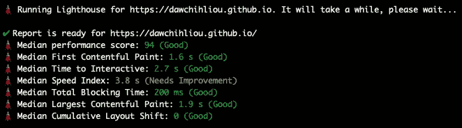

# 编写您自己的类型脚本 CLI

> 原文：<https://betterprogramming.pub/writing-your-own-typescript-cli-6f9c5688ad34>

## 写 CLI 感觉像是超能力


作者图片

# TL；速度三角形定位法(dead reckoning)

*   🍳您可以轻松编写 CLI。比你想象的要简单:)
*   🗼我们将一起编写一个 CLI 来生成 Lighthouse 性能报告。
*   🔦您将看到如何配置 TypeScript、ESLint 和更漂亮的。
*   📚您将看到如何使用一些很棒的库，如`[chalk](https://github.com/chalk/chalk)`和`[commander](https://github.com/tj/commander.js)`。
*   🧑‍🔬您将看到如何生成多个进程。
*   🚀您将看到如何在 GitHub 操作中使用您的 CLI。

# 真实世界的用例

[Lighthouse](https://developers.google.com/web/tools/lighthouse/) 是最流行的开发工具之一，可以洞察网页性能。它提供了一个 CLI 和节点模块，因此我们可以通过编程来运行它。然而，您会注意到，如果您在同一网页上多次运行 Lighthouse，得分会有所不同。这是因为存在已知的[可变性](https://developers.google.com/web/tools/lighthouse/variability)。有许多因素会影响灯塔的可变性。处理方差的一个推荐策略是多次运行 Lighthouse。

在本文中，我们将使用 CLI 来实现这一策略。实施将包括:

*   运行多个灯塔分析
*   汇总数据并计算中值分数

我希望你很兴奋！

# 使项目的文件结构达到顶峰

这是配置工具后文件结构的样子。

```
my-script
├── .eslintrc.js
├── .prettierrc.json
├── package.json
├── tsconfig.json
├── bin
└── src
    ├── utils.ts
    └── index.ts
```

源文件位于`/src`目录中。我们将编译它们并在`/bin`目录下输出`.js`文件。

当您的用户使用 CLI 时，`/bin`目录将是该命令的入口点。稍后您将了解如何配置它。

# 配置工具

我们将使用[纱](https://yarnpkg.com/)作为我们这个项目的包装经理。如果你愿意，可以随意使用 [npm](https://www.npmjs.com/) 。

让我们启动这个项目。我们将创建一个名为`my-script`的目录:

```
$ mkdir my-script && cd my-script
```

在项目根，让我们用 Yarn 创建一个`package.json`:

```
$ yarn init
```

## 配置 TypeScript

要安装 [TypeScript](https://www.typescriptlang.org/) 和 [NodeJS](https://nodejs.org/en/) 的类型，运行:

```
$ yarn add --dev typescript @types/node
```

现在我们准备在项目中配置 TypeScript。我们可以用`tsc`启动`tsconfig.json`:

```
$ npx tsc --init
```

为了编译 TypeScript 代码并将结果输出到`/bin`目录，我们需要在`tsconfig.json`的`compilerOptions`中指定。

```
// tsconfig.json{
  "compilerOptions": {
+    "outDir": "./bin"
    /* rest of the default options */
  }
}
```

就是这样！我们来测试一下。

在项目根目录下，运行下面的命令在`/src`中创建一个`index.ts`文件。

```
$ mkdir src && touch src/index.ts
```

在`index.ts`中，我们将放置一个简单的`console.log`并运行 TypeScript 编译器来查看编译后的文件是否在`/bin`目录中。

```
// src/index.tsconsole.log('Hello from my-script👋')
```

添加一个脚本，用`tsc`编译 TypeScript。

```
// package.json+ "scripts": {
+   "tsc": "tsc"
+ },
```

然后运行:

```
# compile `/src`
$ yarn tsc
```

您应该会在`/bin`目录中看到一个`index.js`文件。

让我们从项目根目录执行`/bin`目录，

```
$ node bin# Hello from my-script 👋
```

## 配置 ESLint

现在我们准备好去 T21 了。我们可以继续安装它:

```
$ yarn add --dev eslint
```

ESLint 是一种非常强大的棉绒。它没有类型脚本支持，所以我们将安装一个[类型脚本解析器](https://github.com/typescript-eslint/typescript-eslint/tree/6e159ee7cf8ef2028792cb8ee636cf6143fa967f/packages/parser):

```
$ yarn add --dev @typescript-eslint/parser @typescript-eslint/eslint-plugin
```

我们还安装了`[@typescript-eslint/eslint-plugin](https://github.com/typescript-eslint/typescript-eslint/tree/6e159ee7cf8ef2028792cb8ee636cf6143fa967f/packages/eslint-plugin)`。这是因为我们需要它来为特定于 TypeScript 的特性扩展 ESLint 规则。

让我们在项目中配置 eslint。我们将在项目根目录下创建一个`.eslintrc.js`:

```
touch .eslintrc.js
```

在`.eslintrc.js`中，我们可以如下配置 eslint:

```
// .eslintrc.jsmodule.exports = {
  parser: '@typescript-eslint/parser',
  plugins: ['@typescript-eslint'],
  extends: ['plugin:@typescript-eslint/recommended'],
}
```

为了更好地理解配置，我们首先使用`@typescript-eslint/parser`来启用 ESLint 理解 TypeScript 语法的能力。然后我们应用`@typescript-eslint/eslint-plugin`插件来扩展规则。最后，我们启用了所有推荐的规则表单`@typescript-eslint/eslint-plugin`。

如果你有兴趣了解更多关于配置的信息，你可以查看[官方文档](https://github.com/typescript-eslint/typescript-eslint/tree/main/packages/eslint-plugin#usage)了解更多细节。

我们现在可以给`package.json`添加一个林挺脚本:

```
// package.json{
  "scripts": {
+    "lint": "eslint '**/*.{js,ts}' --fix",
  }
}
```

要运行脚本:

```
$ yarn lint
```

## 配置更漂亮

漂亮的是一个非常强大的格式化程序。它附带了一套规则来格式化我们的代码。有时这些规则会与 ESLint 规则冲突，所以我将向您展示如何配置它们。

首先安装 Prettier 并在项目根目录下创建一个`.prettierrc.json`文件来保存配置，

```
$ yarn add --dev --exact prettier && touch .prettierrc.json
```

您可以编辑`.prettierrc.json`并添加您的自定义规则。你可以在官方文件中找到[选项。](https://prettier.io/docs/en/options.html)

这里有一个例子:

```
// .prettierrc.json{
  "trailingComma": "all",
  "singleQuote": true
}
```

Prettier 提供了与 ESLint 的便捷集成。我们将遵循官方文档中的[推荐配置](https://github.com/prettier/eslint-plugin-prettier#recommended-configuration)。

```
$ yarn add --dev eslint-config-prettier eslint-plugin-prettier
```

我们将在`extensions`数组的最后一个位置添加插件。

```
// .eslintrc.jsmodule.exports = {
  extends: [
    'plugin:@typescript-eslint/recommended',
+    'plugin:prettier/recommended',
  ],
}
```

很重要的一点，漂亮是最后一个分机。通过应用 last，它禁用了所有与格式相关的 ESLint 规则，因此冲突将退回到更漂亮。

我们现在可以给`package.json`添加一个`prettier`脚本:

```
// package.json{
  "scripts": {
+    "prettier": "prettier --write ."
  }
}
```

要运行脚本:

```
$ yarn prettier
```

# 配置`package.json`

我们几乎准备好了我们的配置。唯一缺少的是像执行命令一样执行项目的方法。我们希望能够直接调用命令，而不是用`node`执行`/bin`:

```
# instead of "node bin", we want to call the command by its name like this:
$ my-script
```

我们如何做到这一点？首先，我们需要在我们的`src/index.ts`顶部添加一个 [Shebang](https://en.wikipedia.org/wiki/Shebang_(Unix)) 。

```
+ #!/usr/bin/env nodeconsole.log('Hello from my-script👋')
```

Shebang 通知类 Unix 操作系统这是 NodeJS 可执行文件。所以我们可以不指定`node`直接调用脚本。

我们重新编译一下，

```
$ yarn tsc
```

在一切正常之前我们还需要一样东西。我们需要将可执行权限分配给`bin/index.js`:

```
$ chmod u+x ./bin/index.js
```

让我们试一试:

```
# execute directly
$ ./bin/index.js# Hello from my-script👋
```

很好，我们快到了。最后一件事是在命令和可执行文件之间创建一个符号链接。首先，我们需要在`package.json`中指定`bin`属性，并将命令指向`bin/index.js`。

```
// package.json{
+  "bin": {
+    "my-script": "./bin/index.js"
+  }
}
```

其次，在项目根创建一个带有 Yarn 的符号链接:

```
$ yarn link# You can always unlink: "yarn unlink my-script"
```

让我们看看它是否有效。

```
$ my-script# Hello from my-script👋
```

它工作了🎉

为了使开发更容易，我们将在`package.json`中添加几个脚本:

```
// package.json{
  "scripts": {
+    "build": "yarn tsc && yarn chmod",
+    "chmod": "chmod u+x ./bin/index.js",
  }
}
```

现在我们可以运行`yarn build`来编译并自动分配入口文件的可执行权限。

# 编写 CLI 来运行 Lighthouse

是时候实现我们的核心逻辑了。我们将探索几个方便的 npm 包来帮助我们编写 CLI，并深入了解 Lighthouse 的魔力。

## 用`chalk`给`console.log`着色

```
$ yarn add chalk@4.1.2
```

确保您正在安装`chalk 4`。`[chalk 5](https://github.com/chalk/chalk/releases/tag/v5.0.0)` [是纯 ESM](https://github.com/chalk/chalk/releases/tag/v5.0.0) 在 TypeScript 4.6 发布之前我们不能用 TypeScript [来使用它。](https://github.com/microsoft/TypeScript/issues/46452)

`[chalk](https://github.com/chalk/chalk)`给你的`console.log`赋予色彩。例如:

```
// src/index.tsimport chalk from 'chalk'console.log(chalk.green('Hello from my-script👋'))
```

现在在项目根目录下运行`yarn build && my-script`并查看日志。

让我们用更有意义的方式来使用`chalk`。 [Lighthouse 表演分数用颜色编码](https://web.dev/performance-scoring/#color-coding)。我们可以编写一个效用函数，用基于性能分数的颜色来显示显示值。

在`src/index.ts`中使用它，并尝试用`draw()`记录一些东西以查看结果。

```
// src/index.tsimport { draw } from './utils'console.log(`Perf score is ${draw(0.64, 64)}`)
```

## 使用`commander`设计命令

为了使我们的 CLI 具有交互性，我们需要能够读取用户输入并解析它们。`[commander](https://github.com/tj/commander.js)`是定义接口的描述性方式。我们可以用一种非常简洁和文档化的方式实现我们的接口。

我们希望用户如何与 CLI 交互是简单地传递一个运行 Lighthouse 的 URL。我们还想传入一个选项来指定 Lighthouse 应该在 URL 上运行多少次。像这样:

```
# without an option
$ my-script https://dawchihliou.github.io/# with an option
$ my-script https://dawchihliou.github.io/ --iteration=3
```

让我们看看用`commander`实现我们的设计有多快。

```
$ yarn add commander
```

让我们清除`src/index.ts`并重新开始:

`src/index.ts`

我们首先实例化了一个`Command`，并使用实例`program`来定义:

*   我们给它起了一个名字`url`和一个描述
*   一个`[option](https://github.com/tj/commander.js#options)`:我们给了它一个短标志、一个长标志、一个描述和一个默认值

为了使用参数和选项，我们首先解析命令并记录变量。

现在我们可以运行命令并观察日志。

```
$ yarn build# without an option
$ my-script https://dawchihliou.github.io/# url: https://dawchihliou.github.io/, iteration: 5# with an option
$ my-script https://dawchihliou.github.io/ --iteration=3
# or
$ my-script https://dawchihliou.github.io/ -i 3# url: https://dawchihliou.github.io/, iteration: 3
```

很酷吧？！另一个很酷的功能是`commander`自动生成一个`[help](https://github.com/tj/commander.js#automated-help)`来打印帮助信息。

```
$ my-script --help
```

## 在单独的操作系统进程中运行多个 Lighthouse 分析

在前一节中，我们学习了如何解析用户输入。是时候深入 CLI 的核心了。

运行多个 Lighthouse 的建议是在[单独的进程](https://github.com/GoogleChrome/lighthouse/issues/7187)中运行它们，以消除干扰的风险。`[cross-spawn](https://github.com/moxystudio/node-cross-spawn)`是一个针对产卵过程的跨平台解决方案。我们将使用它同步生成新的进程来运行 Lighthouse。

要安装`cross-spawn`:

```
$ yarn add cross-spawn
$ yarn add --dev @types/cross-spawn# Let's install lighthouse too✨
$ yarn add lighthouse
```

我们来编辑一下`src/index.ts`:

在代码中，我们基于用户输入多次生成新流程。在每个过程中，我们使用 headless Chrome 运行 Lighthouse 性能分析，并收集 JSON 数据。`result`变量将在一个字符串中保存一组独立的性能数据。下一步是汇总数据并计算最可靠的性能得分。

如果你执行上面的代码，你会看到一个关于`require`的林挺错误。`require.resolve`解析模块的路径，而不是模块本身。在本文中，我们将允许编译`.eslintrc.js`中的`@typescript-eslint/no-var-requires`规则。

```
// .eslintrc.jsmodule.exports = {
+  rules: {
+    // allow require
+    '@typescript-eslint/no-var-requires': 0,
+  },
}
```

## 计算可靠的灯塔分数

一种策略是通过计算中位数来汇总报告。Lighthouse 提供内部功能`[computeMedianRun](https://github.com/GoogleChrome/lighthouse/blob/master/lighthouse-core/lib/median-run.js)`。让我们使用它。

`src/index.ts`

在引擎盖下，`computeMedianRun`返回最接近第一个内容丰富的绘画的中值和交互时间的中值的分数。这是因为它们代表了页面初始化生命周期中最早和最晚的时刻。这是一种比简单的方法更可靠的确定中位数的方法，即从单个测量值中找出中位数。

现在再次尝试该命令，看看结果！

```
$ yarn build && my-script https://dawchihliou.github.io --iteration=3
```



瓦拉🎉

# 在 GitHub 操作中使用 CLI

我们的实现已经完成。让我们在自动化工作流中使用 CLI，这样我们就可以在 CD/CI 管道中进行性能基准测试。

首先，让我们在 npm 上发布这个包(假设)。

我发布了一个 npm 包`[**dx-scripts**](https://github.com/DawChihLiou/dx-scripts/)`，其中包含了`my-script`的生产就绪版本。我们将使用`dx-scripts`编写 GitHub Actions 工作流来演示我们的 CLI 的应用。

# 在国家预防机制上发布(一个例子)

我们将在`package.json`中添加一个`files`属性来发布`/bin`目录。

```
// package.json{
+  "files": ["bin"],
}
```

然后简单地运行:

```
$ yarn publish
```

现在包在 npm 上(假设)！

# 编写工作流

我们来讨论一下工作流程。我们希望工作流程能够:

*   当有更新时，根据拉请求运行
*   根据功能分支预览 URL 运行 Lighthouse 性能分析
*   用分析报告通知拉取请求

因此，在工作流程成功完成后，您将看到 GitHub Action Bot 的评论，其中包含您的 Lighthouse 分数。

为了关注我们的 CLI 的应用，我将在工作流中硬编码特性分支预览 URL。

在您的应用程序存储库中，安装`dx-scripts`:

```
$ yarn add --dev dx-scripts
```

将`lighthouse-dev-ci.yaml`添加到您的 GitHub 工作流目录:

在“Run Lighthouse”步骤中，我们运行了`dx-script lighthouse` CLI，替换了特殊字符以便打印多行输出，并且我们在变量`lighthouse_report`中设置了输出。在“Notify PR”步骤中，我们用“Run Lighthouse”步骤的输出编写了一个注释，并使用`[wow-actions/auto-comment](https://github.com/marketplace/actions/auto-comment)` [](https://github.com/marketplace/actions/auto-comment)动作来发布注释。


就是这样！多好的旅程啊。令人惊讶的是你一路跟随。

# 综上

写个 CLI 也不算太差吧？让我们来看看我们已经讨论过的所有内容:

*   配置 TypeScript
*   配置 ESLint
*   配置更漂亮
*   在本地执行您的命令
*   用`chalk`给原木着色
*   用`commander`定义您的命令
*   产卵过程
*   执行灯塔 CLI
*   使用 Lighthouse 的内部库来计算中值性能分数
*   将您的命令发布为 npm 包
*   将您的命令应用到 GitHub 动作工作流程

现在超能力也是你的了

# 资源

*   [灯塔官网](https://developers.google.com/web/tools/lighthouse)
*   [灯塔绩效评分](https://web.dev/performance-scoring/#color-coding)
*   [灯塔可变性](https://developers.google.com/web/tools/lighthouse/variability)
*   `[commander](https://github.com/tj/commander.js)` [GitHub 资源库](https://github.com/tj/commander.js)
*   `[chalk](https://github.com/chalk/chalk)` [GitHub 资源库](https://github.com/chalk/chalk)
*   `[cross-spawn](https://github.com/moxystudio/node-cross-spawn)` [GitHub 资源库](https://github.com/moxystudio/node-cross-spawn)
*   `[@typescript-eslint/parser](https://github.com/typescript-eslint/typescript-eslint/tree/main/packages/parser)` GitHub 资源库
*   `[@typescript-eslint/eslint-plugin](https://github.com/typescript-eslint/typescript-eslint/tree/main/packages/eslint-plugin#usage)` GitHub 仓库
*   `[dx-scripts](https://github.com/DawChihLiou/dx-scripts/)` [GitHub 资源库](https://github.com/DawChihLiou/dx-scripts/)
*   [更漂亮& ESLint 在 GitHub 上推荐的配置](https://github.com/prettier/eslint-plugin-prettier#recommended-configuration)
*   `[lighthouse/lighthouse-core/lib/median-run.js](https://github.com/GoogleChrome/lighthouse/blob/master/lighthouse-core/lib/median-run.js)`GitHub 上
*   `[wow-actions/auto-comment](https://github.com/marketplace/actions/auto-comment)` [GitHub 行动市场](https://github.com/marketplace/actions/auto-comment)

这篇文章最初发布在[道智的网站](https://dawchihliou.github.io/articles/writing-your-own-typescript-cli)。