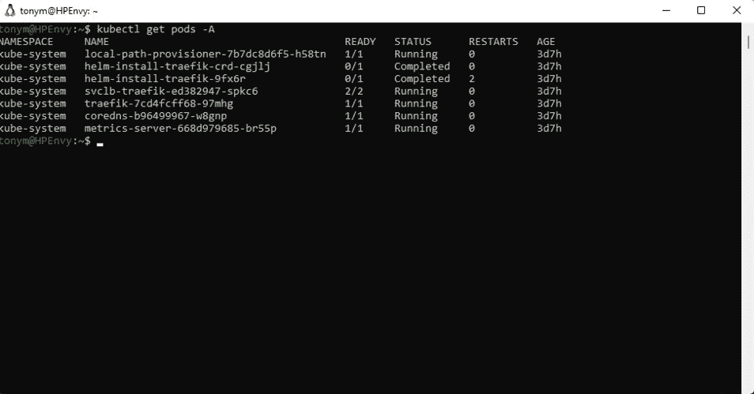
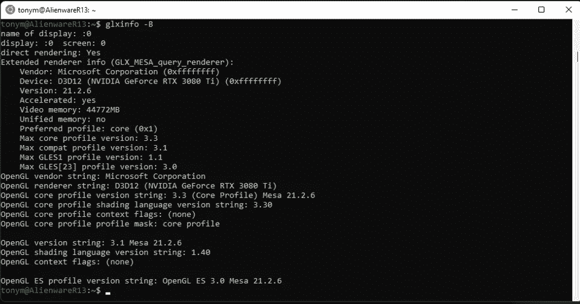
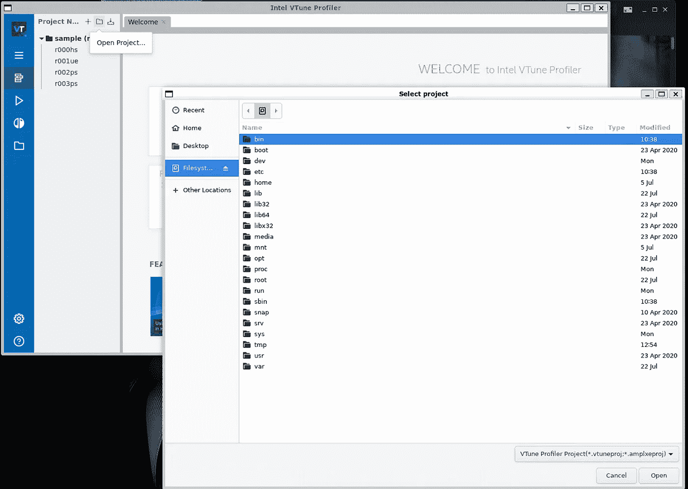

# WSL 极端用法

> 原文：<https://betterprogramming.pub/wsl-extreme-usages-bdbb9ec218e7>

## 使用图形用户界面、USB 连接和 Kubernetes


加布里埃尔·海因策在 [Unsplash](https://unsplash.com?utm_source=medium&utm_medium=referral) 上的照片

# 介绍

正如你可能从我以前的帖子中知道的，我倾向于使用很多开发环境，并且尝试了相当多的不同技术。我在 Linux、Windows 和 Mac 上用各种语言编写代码，主要是 C/C++与 SYCL、Golang、Python、JavaScript 和 Java。我也使用像 [Kubernetes](https://kubernetes.io/) 这样的技术，并涉猎像 [TensorFlow](https://www.tensorflow.org/) 、 [PyTorch](https://pytorch.org/) 和 [Intel 发行的 OpenVINO](https://www.intel.com/content/www/us/en/developer/tools/openvino-toolkit/overview.html) 这样的人工智能技术。

我总是对简化跨平台开发感兴趣，因为我们永远都不会满足的一件事就是时间。在这篇文章中，我将概述一些我对 Linux 的 Windows 子系统(WSL)的快速体验。简而言之，它通常工作得很好，有时我们可以使用变通方法使它工作得相当好，有时我们可能需要引导到 Linux。

在我们走得太远之前，我建议如果您在 Windows 上使用 WSL，请从 Microsoft Store 获得最新版本，因为它确实为我修复了一些与 CMake 用法和其他一些奇怪行为有关的问题。只需搜索 WSL 并安装下面的 Linux 预览版 Windows 子系统。

我觉得很奇怪，它不在顶部，但如果你向下滚动一点，你会找到它。快速提示，我必须重新创建我的 WSL 环境，以使更改对我有效。


假设在此之后您还没有设置 WSL 环境，您可以遵循任何 WSL 设置教程(下面的一些链接)。作为参考，我在这篇文章中使用的系统是:

*   惠普 Envy 16 笔记本电脑，采用英特尔 Alder Lake 酷睿 i7-12700H、32GB DDR4、英特尔 Arc a370m GPU 和 Windows 11 Pro
*   外星人 R13 采用英特尔 Alder Lake Core i9–12900 KF，64GB DD5，NVIDIA GeForce 3080Ti GPU，Windows 11 Pro

# 什么才管用？

## 基础知识

如果您只是编写命令行代码、脚本或使用类似 Jupyter 笔记本的东西，它会工作得很好。我的 C++、Python 和 Golang 代码可以像在 Linux 上一样编译和运行。Conda，Tensorflow，PyTorch 都可以安装和工作。

如果你想使用一些简单的工具，这里有一些链接可能会帮助你开始:

[设置 WSL、VSCode 和英特尔 oneAPI 基础工具包](/docker-wsl-and-oneapi-a-quick-how-to-guide-d7db3363b303)

[设置码头](https://medium.com/@ferarias/docker-in-windows-11-using-wsl2-8e30faddc32c)

[设置 Jupyter 笔记本](https://towardsdatascience.com/configuring-jupyter-notebook-in-windows-subsystem-linux-wsl2-c757893e9d69)

[英特尔 Arc GPU 上的 GPGPU 编程](/intel-arc-gpus-and-oneapi-do-they-sycl-9b3ba7c888b8)

## Kubernetes(用于小型系统)

我过去用过 K3s 和 MicroK8s，但我不确定开箱后是否能正常工作。我非常高兴在使用 20.04 Ubuntu 的 WSL 上安装 K3s 就像在 Linux 上一样简单。

1.  确保在 WSL 中配置了 systemd
2.  从[https://k3s.io/](https://k3s.io/)安装 K3s 并运行`sudo k3s server`
3.  使用`sudo apt get kubectl`安装 kubectl
4.  确保 kubeconfig `/etc/rancher/k3s/k3s.yaml`可以被 kubectl 使用



不到 10 分钟即可完成 K3s

这是开发人员需要的一小部分，我不可能涵盖所有有效的东西，但是对于大多数事情来说，WSL 非常容易使用。

# 什么在帮助下起作用？

## GUI

WSL2 是原始 WSL 的一大进步，因为它增加了对 GUI 的支持。对于我测试的一些东西，它只是开箱即用。例如，创建一个简单的 OpenGL 窗口并渲染一个简单的场景就很好。我遇到的唯一问题是 WSL DirectX 层支持的最高 OpenGL 版本是 3.3。



WSL 支持的 OpenGL 版本

我的第二个测试是看看我们的英特尔图形用户界面工具能否工作。当我尝试运行英特尔 VTune 分析器 GUI 时，遇到了这个问题:

```
tonym@HPEnvy:~$ vtune-gui
vtune-gui: error while loading shared libraries: libnss3.so: cannot open shared object file: No such file or directory
```

在安装了一些库之后，我意识到问题的原因是应用程序期望 GTK+安装在系统上。以下命令允许我在 WSL 中运行英特尔 VTune 分析器 GUI:

```
> sudo apt install libnss3-dev
> sudo apt install libatk1.0–0
> sudo apt install libatk-bridge2.0–0
> sudo apt-get install libgtk-3-dev
```



英特尔 VTune 分析器 GUI 正在运行！

通过 WSL 做这件事的好处是，现在我可以使用 GUI 在我的 WSL 文件系统上定位我的 Linux 应用程序，并运行我的工作负载。

公平地说，这最后一个问题不是 WSL 的限制。不幸的是，这是一个非常常见的问题，Linux GUI 开发人员假设他们的应用程序有特定的平台库。

# USB 设备连接

当我使用 USB 设备进行一些测试时，将我的设备连接到机器的简单工作流程最初并不工作。当然，这很有意义，因为这需要通过虚拟机层映射连接。

幸运的是，有一种方法可以使用 USB/IP 开源项目来启用 USB 连接的设备。微软已经记录了[的需求以及如何为 WSL](https://docs.microsoft.com/en-us/windows/wsl/connect-usb) 建立这个库，它允许我与设备进行交互。对常见问题有简单的解决方案真好！

# 虚拟专用网络

如果您的工作需要一个公司 VPN，那么在使用 VPN 时将 WSL 实例连接到互联网可能会非常棘手。有几个变通办法，但官方的，非官方的变通办法可以在这里找到。

[](https://randombytes.substack.com/p/bridged-networking-under-wsl) [## WSL 下的桥接网络

### 但仍未得到官方批准。我的意思是，它是来自实际的 WSL 团队本身的一个特性，对于 WSL…

randombytes.substack.com](https://randombytes.substack.com/p/bridged-networking-under-wsl) 

# 什么没用？

## 带 GPU 支持的 K3s

对我来说幸运的是，我只尝试了一件事没有成功，可能我只是不知道如何正确地设置它。罪魁祸首是在 GPU 支持下运行 Kubernetes。我确实找到了一些[资源](https://dev.to/mweibel/add-nvidia-gpu-support-to-k3s-with-containerd-4j17)，暗示你也许能让它运行起来，但是我没能让它运行起来。

WSL 和 Docker(或其他容器运行时)开箱即用。我对此唯一的使用案例是真正的利基；如果你想运行一个支持 GPU 的容器工作流，但想通过 K3s 而不是另一个容器运行时来完成。除非您正在进行一些 Kubernetes 开发或者试图利用一些 Kubernetes 部署，否则这可能没有意义。

据我所知，WSL 使用其 DirectX Linux 驱动程序与底层 GPU 进行接口，这可能会暴露给 Kubernetes。我没有找到一种简单的方法来做这件事。不幸的是，我的用例甚至更窄；我正在实现一个特定的 Kubernetes 设备插件。

在一天结束的时候，当我需要这样做的时候，我只是在系统上启动 Linux。

# 结论

WSL 对于我所做的 95%的工作都非常有效，尽管我在所有的系统上都安装了 Linux，但我很少需要引导到原生 Linux。这为我在进行跨平台开发时节省了大量时间，这很好，这样我就不用浪费半天时间盯着我的 BIOS 启动屏幕了。

它还有一些额外的好处，比如让我在我喜欢的操作系统上运行一些跨平台的工具，比如 Python。这似乎是一件小事，但出于某种原因，我喜欢键入`ls`而不是`dir`。总而言之，我认为 WSL 对我的生产力来说是一个巨大的胜利，我猜如果你正在阅读这篇文章，你可能会同意(或者你想达到你同意的程度😊).

```
**Want to Connect?**If you want to see what random tech news I’m reading, you can [visit me on Twitter](https://twitter.com/tonymongkolsmai).
```