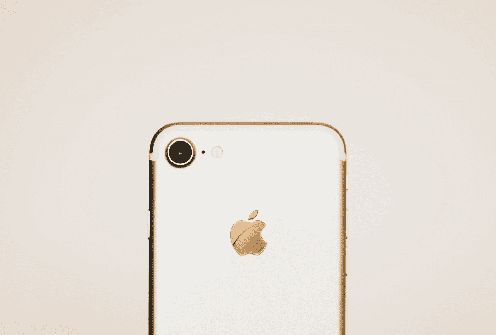

# WWDC 2020:主题演讲要点

> 原文：<https://betterprogramming.pub/wwdc-2020-keynote-highlights-fa333b944f12>

## iOS 14、iPadOS 14、watchOS 7、macOS Big Sur 等等

亚历山大·弗拉德在 [Unsplash](https://unsplash.com?utm_source=medium&utm_medium=referral) 上的照片

苹果备受关注的年度开发者大会——2020 年 WWDC 大会，以大量新软件更新和 macOS 的大翻新拉开帷幕。这是第一次只有数字的 WWDC 活动，而且是预先录制的。

我们来看看 iOS 14 和 iPadOS 14、watchOS 7、macOS 11 有什么新功能。

# iOS 14 为主屏幕、应用程序剪辑、画中画等带来了自定义功能

随着 iOS 13 的巨大更新，人们预计 iOS 14 将是一个更加平静的版本，专注于稳定性，但令我们惊讶的是，有几个惊喜的产品。

*   主屏幕有了很大的重新设计。现在，它为我们提供了在主屏幕上显示/隐藏页面的能力，从而使我们能够保持页面的简短和简洁。苹果现在为我们提供了将第三方应用设置为默认电子邮件和网络浏览器的能力。
*   应用程序库是一项新功能，有助于按类别组织应用程序。它利用设备上的智能对应用程序进行分组，同时允许您滚动浏览该组中新的垂直应用程序列表。
*   小部件现在可以放在主屏幕上今天视图之外的任何地方，通过使用智能堆叠，我们可以快速替换和移动小部件。
*   画中画早就应该出现了，现在终于可以在 iOS 14 系统中使用了。它将有助于多任务处理，也适用于视频和 FaceTime 通话。
*   App Clips 是 App Store 的一项新功能，可以让你快速安装你急需的一小部分应用程序(很像 Android 的即时应用程序)。通过使用摄像头进行视觉提示或 NFC，它可以快速识别应用程序，并可以访问 Apple Pay 和使用类似苹果的功能进行登录。它就像一个字节大小的应用程序，可以内置在 Xcode 12 中。
*   在 iOS 13 中引入了设备上的语音识别之后，苹果现在在 iOS 14 中引入了一个新的系统范围的翻译应用程序，可以处理文本和语音。
*   新的紧凑型 Siri 对许多用户来说将是一个巨大的喘息机会，因为它目前的全屏视图可能会分散注意力。同样，从现在开始，呼叫屏幕也将显示一个紧凑的通知。
*   随着自行车方向的加入，地图应用程序得到了小小的推动，它可以告诉你海拔、坡度以及繁忙和安静的道路。虽然它只在六个国家推出，但包括纽约、旧金山、北京和上海等主要城市。
*   iOS 14 中的 CarPlay 现在带来了新的壁纸定制，更重要的是，你可以使用 iPhone 作为解锁的数字密钥，同时还可以通过 iMessage 安全地共享密钥。这是一个很大的变化，也将在 iOS 13 中得到支持，目前计划为宝马 5 系提供支持。
*   新的 iMessage 应用程序现在提供了一种更简单的方法来锁定最喜欢的对话(顶部有气泡状的动画)，并引入了应用程序内的回复和分组提及，以及一系列创建表情符号的新方法。
*   位置隐私以近似位置的形式得到了很好的补充，同时，用户现在可以在从应用商店下载的同时查看完整的应用隐私信息。

# iPad OS 14 获得了机器学习支持的铅笔功能、macOS 外观和类似 iOS 14 的重新设计

iPad OS 去年被命名为一个独立的实体，它只是通过更新来增强用户在大屏幕上的体验。突出的特点包括:

*   重新设计的小工具、地图、iMessage、简洁的 Siri 和通话屏幕功能——所有这些功能都与 iOS 14 的功能非常相似
*   侧边栏是一个新的设计组件，很像我们在 macOS 左侧看到的。它目前出现在苹果的股票应用程序中，如照片、笔记、文件和音乐应用程序，旨在提供更好的导航和用户控制。
*   苹果为 iPadOS 14 彻底重新设计并从头开始重建了搜索功能。通过这样做，现在可以在应用程序内或屏幕上的任何地方进行通用搜索，新设计看起来很像 macOS 的 Spotlight。
*   苹果的铅笔形成了用户如何与 iPad 交互的症结，现在它由机器学习提供动力。新的 Scribble 功能允许您在文本字段上书写(在 web 搜索中)，手写文本将被自动转换。此外，苹果现在提供了将画布上的手写文本复制并粘贴到笔记中的功能。

# watchOS 7 带来了定制的面部、睡眠和洗手跟踪——以及舞蹈锻炼

Apple Watch 一直是人们谈论的话题，这一次，这家位于库比蒂诺的科技巨头打算更进一步，推出一些今天非常相关的功能:

*   睡眠追踪是最近最受欢迎的功能之一，苹果以一种相当精致的方式提供了这一功能。它通过调暗显示屏和提供一个听睡眠故事的选项来更加强调就寝时间。此外，iOS 14 上的健康应用程序增加了睡眠模式指标。
*   定制的面孔一直是用户的最爱，苹果公司已经推出了几个完全内置于原生 SwiftUI 的新面孔(一个大的提升肯定是在卡上)。此外，苹果现在提供了一个新的面部分享功能，让你在社交网络和消息上分享定制的面部——以提高 watchOS 应用的参与度。
*   除了在地图应用程序中包含骑行方向之外，健身应用程序现在还提供了舞蹈锻炼跟踪——这是一个伟大的创举，因为我们都发现自己在适当的地方受到保护。
*   鉴于我们面临的全球疫情，洗手追踪机制显得尤为突出。watchOS 使用设备上的机器学习来进行运动跟踪和声音检测，以确保用户在规定的时间内洗手。

# macOS Big Sur 引入了苹果自己的 ARM 芯片，带来了巨大的重新设计，对 Safari 进行了重大更新，等等

在 preWWDC 期间，苹果对 macOS 的更新守口如瓶——这是正确的。从名字 *Big Sur* 本身到苹果从英特尔芯片的转变，macOS 在 WWDC 2020 期间的苹果主题演讲中放弃了最大的更新。以下是其中一些例子:

*   苹果硅公司推出了基于 ARM 的芯片组，以提高 macOS 的性能，带来了定制设计的神经引擎，以加速机器学习，并进一步统一其生态系统。
*   在设计方面，macOS 得到了近年来最大的复兴——半透明的菜单、改进的图标和节省空间的布局，展示了为增强我们最喜爱的开发机器的用户体验所做的努力。此外，macOS Big Sur 现在在菜单栏中有一个控制中心，一个小工具和通知中心，很像我们在 iOS 14 中会有的。
*   像 iMessage 这样的内置 mac 应用程序现在有了更强大的搜索功能和紧凑的网格视图，就像照片选择器一样。
*   去年推出的旨在将 iPad 应用移植到 macOS 的 Project Catalyst，这次得到了键盘、日期选择器和菜单 API 的支持。更重要的是，开发者现在可以直接在 macOS 上运行原生 iOS 和 iPadOS 应用。
*   尽管从英特尔芯片转移，苹果基于硅的 MAC 电脑不会在今年年底推出。更重要的是，从英特尔到 ARM 的过渡大约需要两年时间。因此，苹果公司推出了 Universal 2，允许开发者为苹果公司新推出的基于硅芯片的 Mac 电脑和基于英特尔芯片的 Mac 电脑开发应用程序。此外，Rosetta 2 深度集成到 macOS Big Sur 中，允许旧的基于英特尔的 Mac 应用程序自动过渡到基于硅的应用程序。

## 旅行队

*   据苹果公司称，Safari 现在的页面加载时间更短，对于经常加载的网站，速度提高了 50%。
*   为了推动 Safari 扩展，苹果现在提供了一个 Web API，允许你从其他浏览器引入扩展。此外，扩展现在提供了灵活性，用户可以一天、一周或永远访问。
*   启动页面现在提供了关于壁纸和最近标签的定制，同时，Safari 标签也重新设计了一个图标。
*   Safari 工具栏现在提供了一个智能跟踪按钮，让用户可以查看网站的隐私信息。

# 结束语

虽然这涵盖了 WWDC 2020 主题演讲的主要公告，但 tvOS 也获得了游戏和自适应控制器急需的多用户支持。

此外，HomeKit 还带来了自适应照明以及识别人脸和检测摄像头运动的能力。

最后，AirPods 引入了苹果设备和空间音频之间的自动切换——这可能在未来几年苹果的增强现实雄心中发挥关键作用。

这一次到此为止。感谢阅读。