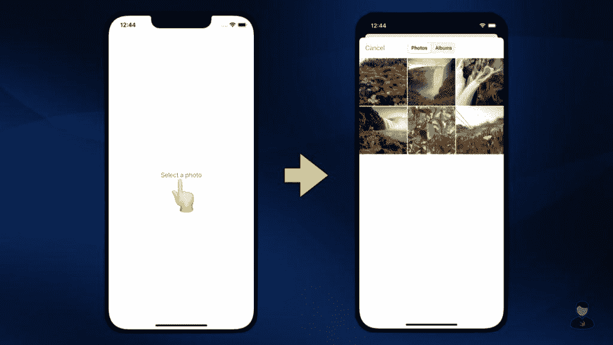
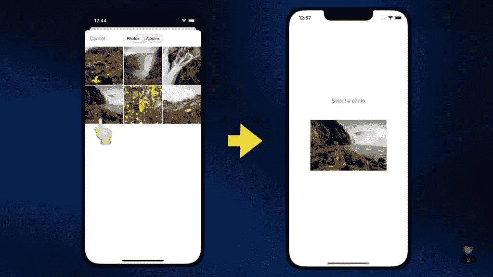
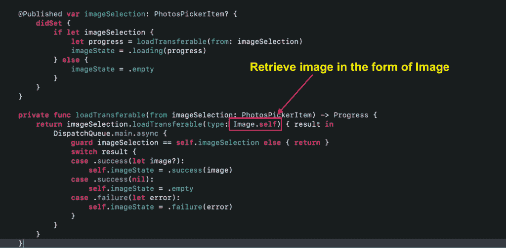

# WWDC 22:如何使用 swift ui picker

> 原文：<https://betterprogramming.pub/wwdc-22-how-to-use-the-swiftui-photospicker-db00077de75d>

## 不再使用 UIViewControllerRepresentable 和 PHPickerViewController


在今年的 WWDC 上，苹果带来了对 SwiftUI 的大量改进，其中一个特别引起我注意的是`PhotosPicker`视图。是的，你是对的！SwiftUI 终于在 iOS 16 中获得了自己的原生照片拾取器视图。

`PhotosPicker`视图支持`PHPickerViewController`拥有的所有常见功能。单选和多选、资产类型过滤和相册切换等功能都包括在内。

使用`PhotosPicker`视图的方式实际上非常简单。让我告诉你怎么做。

# 使用照片拾取器视图

首先，让我们先导入`SwiftUI`和`PhotosUI`模块。之后，定义一个名为`selectedItem`的状态，类型为`PhotosPickerItem`。

为了更好的存储效率，用户选择的资产将以`PhotosPickerItem`的形式交给我们。稍后我们将使用它来检索底层资产。

记住这一点，我们可以将`PhotosPicker`视图添加到内容视图的主体中，如下所示:

为了简单起见，我已经配置了`PhotosPicker`视图来显示一个只显示图像的单选照片选择器。请随意查阅[官方文档](https://developer.apple.com/documentation/photokit/photospicker)了解更多配置选项。

根据我的个人经验，我注意到在初始化`PhotosPicker`视图时，必须将`photoLibrary`设置为`.shared()`。如果省略的话，`$selectedItem`的绑定就不起作用了。我不确定为什么会这样，也许这是测试版中的一个错误，将在不久的将来修复。如果有人知道背后的原因，请在推特上给我打电话。

现在，如果您继续运行示例代码，您将在屏幕中央看到标签为“*选择一张照片*”的`PhotosPicker`视图。点击它会弹出 iOS 原生照片选择器。



# 处理资产选择

我们将以`Data`的形式检索用户选择的资产。因此，让我们继续为其定义状态:

```
@State private var selectedImageData: Data? = nil
```

处理资产选择的方法非常简单。这个概念是使用`PhotosPicker`视图的`onChange()`修改器来检测`selectedItem`的变化。之后，我们将使用`selectedItem`的`loadTransferable()`方法获得基础资产。

最后，让我们在`PhotosPicker`视图的正下方显示选中的图像。

这就是处理资产选择的方法。再次运行示例代码，查看运行中的一切。



下面是完整的示例代码:

# 警告

如果您已经观看了关于 `[PhotosPicker](https://developer.apple.com/videos/play/wwdc2022/10023/?time=469)` [视图](https://developer.apple.com/videos/play/wwdc2022/10023/?time=469)的 [WWDC 会议，您会注意到我们检索所选图像的方式与我们在视频中看到的略有不同。我们不是以`Image`的形式加载，而是以`Data`的形式加载。](https://developer.apple.com/videos/play/wwdc2022/10023/?time=469)



如本[论坛帖子](https://developer.apple.com/forums/thread/709764?answerId=719540022#719540022)所述，`Image`类型仅支持`public.png`作为其内容类型。如果照片拾取器包含除`png`之外类型的资产，例如`jpeg`或`heic`，我们将无法检索它。在 Apple 为`Image`添加更多内容类型支持之前，从照片拾取器中检索图像时仍然建议使用`Data`。

# 包扎

在整篇文章中，我一直在 iOS 上运行示例代码，但实际上，示例代码在 macOS、iPadOS 和 watchOS 上完全可以运行。

据苹果公司称，照片选择器将根据平台和可用的屏幕空间自动选择最佳布局。对于那些需要支持多个平台的人来说，这肯定会非常方便。

如果你喜欢读这篇文章，请随意查看我的其他 iOS 开发相关的[文章](https://swiftsenpai.com/tag/ios/)。也可以在[推特](https://twitter.com/Lee_Kah_Seng)关注我。

感谢阅读。