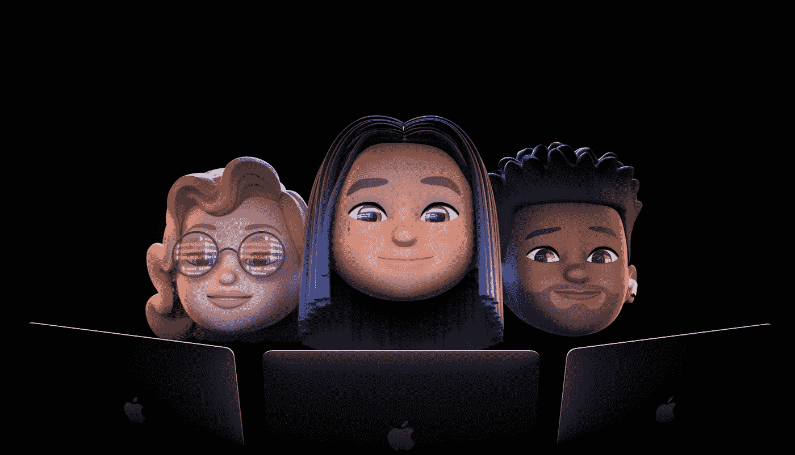

# iOS 开发者对 WWDC 2021 的愿望清单

> 原文：<https://betterprogramming.pub/wwdc2021-wishlist-swiftui-ios15-predictions-dde2d8d45587>

## 以下是我预测苹果公司在不久的将来会推出的产品

[信号源](https://developer.apple.com/wwdc21/)

距离 WWDC 2021 还有不到一周的时间，又到了一年中的这个时候。

和往常一样，活动开始前充满了愿望清单和预测——无论是来自开发人员社区还是权衡他们最喜欢的 iOS、iPadOS 和 macOS 功能的技术专家。

虽然会议主要集中在开发上，但这次有传言说 Macbook Pro 也在会谈中。

无论如何，作为一名 iOS 开发者，我对未来几周我们将收到的开发者工具的增强和新的框架更新感到兴奋。

因此，继续一年一度的传统，我写下了一份愿望清单，希望并期待在 6 月 7 日开始的在线 WWDC21 活动期间看到这些东西。

# 组合:公开所有 UI 控件发布者

在 WWDC 2019 期间，苹果的第一方声明式反应编程框架 Combine 与 SwiftUI 一起首次亮相。然而令我们沮丧的是，接下来的一年几乎没有提到它。

目前，该框架只为一些 API 公开了它的发布者——比如 Foundation 的`URLSession`、`Timer`和`NotificationCenter`。但是`UIButton`触摸事件和其他此类控件的发布者仍然缺失。

在安静的 WWDC 2020 联合收割机之后，我预计今年会有很多渐进的变化。对于大多数(如果不是全部的话)`UIControl`事件来说，拥有内置的发布者将会很棒。

我很乐意看到像 Core Location、Core Bluetooth、MapKit 和 PencilKit 这样的框架组合发布者。

鉴于 Swift 5.5 中即将推出的 async/await 功能，看看苹果会对其 Combine 框架做些什么会很有趣。考虑到 Combine 框架在 SwiftUI 中的作用，如果苹果公司反对 Combine 框架，那将是令人震惊的。我估计他们会找到将 async/await 与他们的反应式框架集成的方法。

# PencilKit:让画布更加个性化

苹果的绘图框架 PencilKit 也在 WWDC 2019 发布。与 Combine 不同，它有一些不错的更新。首先，框架暴露了笔画点，使得绘制路径更容易。

今年，我希望框架能展示更多的功能，比如允许保存，以及将画布的一部分编辑成图像。在 UIImage 上保存标记现在是可行的，但是需要大量的样板文件。我希望苹果能把过程抽象一点。

# **核心 ML，创建 ML，和愿景:加速无代码革命，给我们更多的助手功能**

Create ML 是苹果公司使用内置分类器训练机器学习模型的拖放界面。去年，我们引入了新类型的分类器，如动作分类和风格转移。

这一次，我希望 Create ML 至少能够提供时间序列预测模型训练功能。这将是一个很高兴看到甘模型培训支持。

另一方面，Core ML 去年没有功能更新。新的`init`方法、加密、通过 CloudKit 的模型部署和一些新的层添加是宣布的主要变化。我希望这个框架今年也能得到细微的改进。也许如果苹果公开他们自己的核心 ML 助手函数，它会变得很棒。

Vision framework 为我们带来了大量新功能:轮廓检测、手和身体姿势估计、光流、轨迹检测等等。

鉴于计算机视觉的无限可能性，很难预测苹果今年会为我们准备什么。最低限度，我会期待更多的实用功能，如显示边界框容易。也许引入一个内置的图像分割视觉请求并不是一个坏主意。

我希望 RealityKit 得到一个不错的升级。回放 API 可能会引入在预先录制的视图中添加虚拟对象的功能——就像今年的 Android 12 一样。

# **SwiftUI:更多视图、更好的性能和生产就绪**

SwiftUI 将在 WWDC 2021 进入第三次迭代。去年，我们获得了一系列新的更新——从懒惰堆栈到新的网格视图、地图工具包、链接、用苹果按钮登录等等。

## WidgetKit:更多的可定制性

最突出的是 WidgetKit，这是一个仅在 SwiftUI 中创建主屏幕窗口小部件的框架。

我认为 WidgetKit 框架应该给开发人员更多的可定制性——可能是多选交互性、一些动画和新的属性包装器。

## 带上丢失的控件

通常，一个 iOS 应用程序支持两到三个以前的 SDK。鉴于这将是 SwiftUI 3.0，我希望更多的功能与 UIKit 对等。

从一开始就缺少拉至刷新。尽管尽了最大努力，这些变通办法还是让我们想要更多。希望苹果包括一个内置的刷新控件。

同样，我期待 SwiftUI 的第一个搜索栏。这对于增加 SwiftUI 列表的可定制性至关重要。

对于`WKWebView`、共享表和图像拾取器的 SwiftUI 实现也是非常需要的。

我也希望在当前的 SwiftUI 视图中看到更多的灵活性。例如，将徽章带到`TabViews`，在`Lists`上滑动动作，以及一个工作中的多页修改器。

最重要的是，我们已经了解了 UIKit 收藏视图中的组合布局。因此，SwiftUI 的一个成熟的集合视图应该是有希望的。

## 解决致命弱点

由于 SwiftUI 还在早期，bug 是意料之中的。无论如何，`NavigationLink`可能是 SwiftUI 中最弱的组件。

一开始，当目的视图在创建过程中被加载时，我们会感到困惑。虽然我们有懒惰的观点来拯救我们，但当推动或弹出观点时，仍然不会使我们的生活变得容易。`NavigationLink`同样[与`ContextMenu`或`Toolbar`的](/3-crucial-things-to-know-about-navigationlink-in-swiftui-cb15d791a55)也不像人们所期望的那样——留下了太多有待改进的地方。

我不介意苹果公司今年重新推出整个路由概念，扔掉`NavigationLink`变得更好。

同样，SwiftUI 的`Map`视图也落后于其 UIKit 版本数英里。例如，在地图上添加注释的`onTapGesture`修改器[不工作](https://developer.apple.com/forums/thread/659748)。

如果苹果也能修复 SwiftUI `Form`，我会很高兴。目前，当一个`TextEditor`被包围时，它不起作用。

成为第一响应者的 SwiftUI `TextField`，就像 UIKit 一样，会受到很多人的喜爱。

## **提高视图的可重用性**

目前，将 SwiftUI 视图添加到 UIKit 视图并不容易。在`UICollectionViewCell`中设置 SwiftUI 视图时，你可能会使用`UIViewRepresentable`，如这里的[所示](https://stackoverflow.com/questions/57394518/how-to-set-a-swiftui-view-as-a-cell-to-a-collectionview)。希望苹果收紧互操作性。

对 iOS 和 macOS 的单一 SwiftUI 代码库的期望也不会太高。Swift 5.5 引入了[后缀成员表达式](https://github.com/apple/swift-evolution/blob/main/proposals/0308-postfix-if-config-expressions.md)，让我们可以编写操作系统条件修饰符，同时允许重用。

# 一些可能会让我们吃惊的公告

苹果因领先开发者社区一步而闻名。他们总有一些锦囊妙计。

如果他们把窗帘拉上`UITableView`，我不会感到惊讶——自从他们去年在`UICollectionView`中演示了如何配置`TableView`后，我就更加惊讶了。然而，对于许多开发人员来说，这可能是一个突破性的变化。

隐私在 WWDC 总是备受关注，今年我们可能会看到一键撤销所有应用的许可——比如 Android 12。

在增强现实方面，苹果眼镜将于明年上市。面向开发人员的混合现实耳机工具包可能有助于获得对 RealityKit 开发的兴趣，并增加采用率。

最后但同样重要的是:一个用于 iPadOS 的 Xcode！这可能不再是一个遥不可及的梦想，因为最新的 iPad Pro 使用了与 Mac 系列相同的 M1 芯片。虽然实际上，我期待 Xcode Lite 在今年晚些时候推出。如果是真的，这无疑将是 2021 年 WWDC 奥运会的最佳成果。

暂时就这样了。感谢阅读。