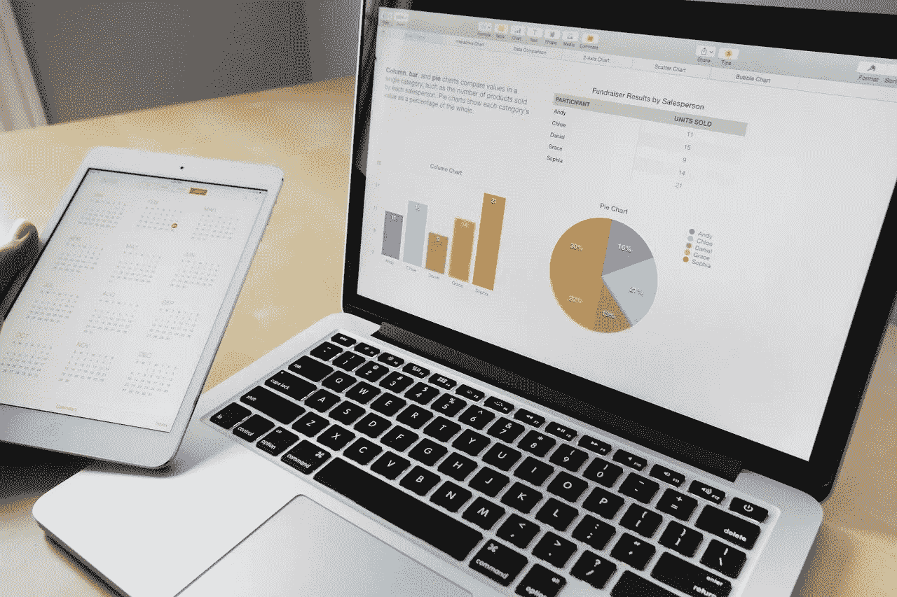

# WWDC22:使用用于更改数据的表单创建 SwiftUI 图表

> 原文：<https://betterprogramming.pub/wwdc22-create-a-swiftui-chart-with-a-form-for-changing-data-9d6a16db9a10>

## 苹果在 iOS 16 中已经很容易将图表创建为 SwiftUI 视图

图片由 [StockSnap](https://pixabay.com/users/stocksnap-894430/?utm_source=link-attribution&utm_medium=referral&utm_campaign=image&utm_content=925900) 从 [Pixabay](https://pixabay.com/?utm_source=link-attribution&utm_medium=referral&utm_campaign=image&utm_content=925900) 获取

昨天，在苹果 WWDC 的第一天，图表在平台联盟中被介绍。这应该是一种有趣的可视化数据的方式，尤其是在 widgets 和 Apple Watch 上。本教程将介绍使用条形图和折线图的基础知识，但许多其他图表的工作方式类似。

我要创建的第一个视图是`ValueOptionsView`。这是一个相当简单的视图，将显示用于更改单个数据点的控件。它允许更改值的标题，也允许更改值本身。这是由一个`Stepper`的`Label`完成的，它包含一个用于修改标题的`TextField`，以及一个简单的用于显示当前值的`Text`。

数据在`ContentView`中可用，但并不存储。

一个名为`data`的计算属性提供了三个`ChartData`实例，所有这些实例都从可以更改的`@State`属性中获取值。换句话说，每次视图被重画时，一个新版本的数组被创建，并带有由图表下面的每个`Stepper`和`TextField`提供的最新值。

所有条形图的前景样式都设置为红色。

输入到每个`TextField`中的标题应该出现在条形图的底部，而使用`Stepper`应该允许您修改条形图的高度。如果您使用的是设备而不是模拟器，键盘可以用 Cmd + K 切换，键盘上的 return 键应该会将其从视图中删除。

需要注意的重要一点是，图表数据必须是`Identifiable`。

该代码基于苹果文档中的一个例子，该例子没有使用符合`Identifiable`的结构，因此当前不能编译。

用同样的方法创建折线图也很容易，只需像以前一样传递相同的数据:

甚至可以在同一个图表上同时显示条形图和折线图。当我尝试的时候，我把线条和线条标记放在什么顺序似乎并不重要。我似乎总是以栏杆在顶上而告终。你也许能算出来，但我意识到标记可以被赋予不透明度，所以可以把线条做成半透明的，这样你就能看到下面的线条:

可以用`.chartLegend(.hidden)`隐藏图表图例，也可以将其设置为`.automatic`或`.visible`。您可以分别使用`.chartXAxis()`和`.chartYAxis()`来切换 X 轴和 Y 轴的可见性。

图表区域的背景可以用一个可以访问图表代理的闭包来定制:

正如你在`.onAppear`修改器中看到的，`ChartProxy`对象附带了几个有用的函数和属性，可以帮助你为图表制作更复杂的背景。

试试其他图表类型，看看你能做些什么！