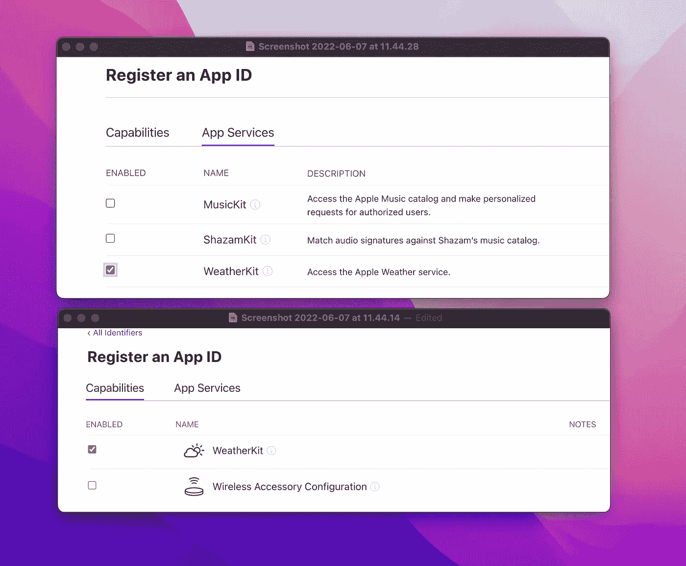
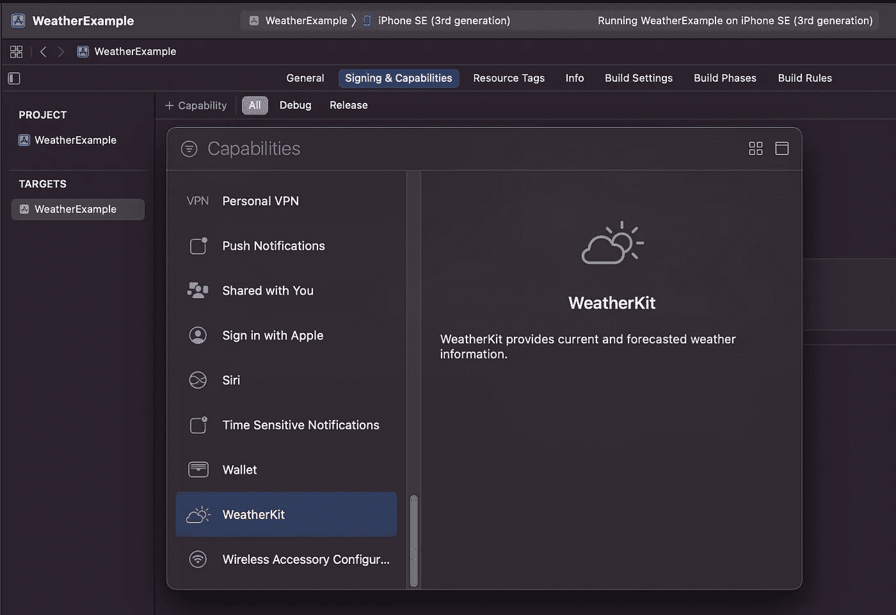

# With WeatherKit 入门

> 原文：<https://betterprogramming.pub/wwdc22-get-started-with-weatherkit-202794853c01>

## 苹果新的免费 API 可以让你每月免费调用 50 万次 API

来自[像素库](https://pixabay.com/?utm_source=link-attribution&utm_medium=referral&utm_campaign=image&utm_content=1867550)的[像素](https://pixabay.com/users/pexels-2286921/?utm_source=link-attribution&utm_medium=referral&utm_campaign=image&utm_content=1867550)的图像

启动和运行 WeatherKit 的许多复杂性在于获得适当的功能。前往[在苹果开发者网站上创建一个应用 ID](https://developer.apple.com/account/resources/identifiers/add/bundleId) 。

您需要在名为“功能”和“应用服务”的两个选项卡上启用 WeatherKit。您的捆绑包标识符需要明确，并且您需要在创建应用 ID 后等待至少 30 分钟，然后才能尝试使用 WeatherKit。

作者截图

现在在 Xcode 14 beta 中创建新的 app 项目，确保在项目文件的*签名和功能*选项卡上添加 WeatherKit 功能，如下所示。

作者截图

因此，希望您已经使用正确的功能和应用服务创建了您的应用 ID，并等待了半个小时，然后您已经使用与您的应用 ID 相同的捆绑包 ID 创建了一个应用项目，最后您已经将该功能添加到您的项目文件中。

现在我们实际上可以开始有趣的部分了，那就是制作一个显示天气数据的 SwiftUI 界面。

为了简单起见，我制作了一个只显示库比蒂诺当前温度的应用程序:

使用[latlong.net](https://latlong.net)计算 Cuptertino 的纬度和经度，并保存为静态`CLLocation`对象。为了让屏幕上的温度变大，选择了一个巨大的字体大小和最小的比例因子。这就是我们如何访问 UIKit 中的“自动收缩”功能。使用行限制是为了避免单元被放到第二行，如果字符串太长就会出现这种情况。

当`weather`对象为零时，有一个`ProgressView`形式的旋转器，当旋转器第一次出现时，使用`.task`修改器来获取天气。这个`ProgressView`和显示温度的`Text`都在一个组内，所以它们可以有相同的导航标题。这显示在屏幕的顶部，让我们知道我们显示的温度的位置。

`WeatherService`有一个`shared` singleton，这就是我们访问 WeatherKit API 的方式。不需要添加任何类型的身份验证，因为这是通过 App ID 的功能完成的。经过`WeatherService`一个位置给了我们一个物体一堆有用的数据，但是我们现在只关心当前的天气。

目前的天气结束了类似[这种 JSON](https://gist.github.com/sturdysturge/78091a0c7dcd09bd2840bcbd58ef389d) 的结构。

如果你在创建你的应用程序 ID 后没有等待半个小时，你可能会得到一个`fatalError`，说你得到了一个无效的 JWT 响应和一个 401 错误代码。如果你在等待半小时后仍然收到这个错误，你的应用 ID 可能没有正确配置(或者苹果的服务器太慢)。

我也遇到过抱怨天气对象的某些部分丢失的错误。

你也许可以通过将`fatalError`改为打印错误来阻止应用程序崩溃，因为它们不一定是致命的错误。

暂时就这样吧！