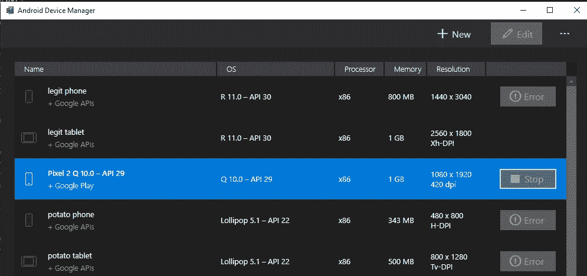
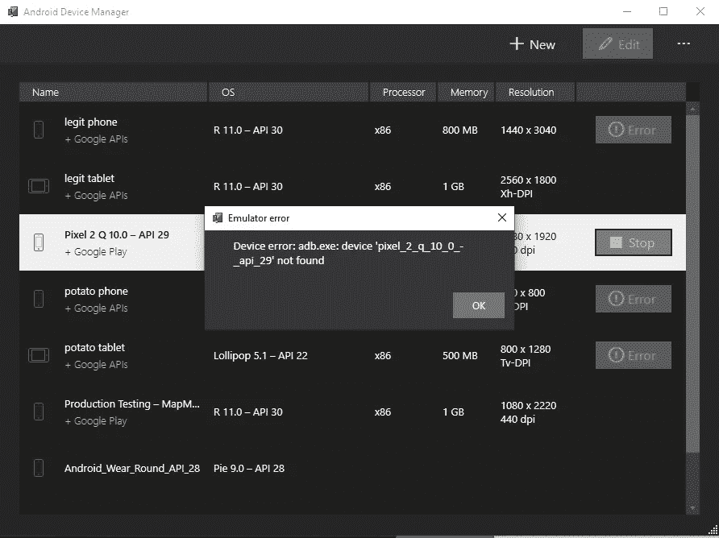

# Xamarin Forms 正在消亡——毛伊岛可能不是未来

> 原文：<https://betterprogramming.pub/xamarin-forms-is-dying-and-maui-may-not-be-future-f0395575ac5d>

## 多平台应用开发体验的下一件大事是什么？

照片由[西格蒙德](https://unsplash.com/@sigmund?utm_source=medium&utm_medium=referral)在 [Unsplash](https://unsplash.com?utm_source=medium&utm_medium=referral) 上拍摄

我想告诉你一个惊人的命题。想象一下，你懂两种语言。一种是基于标准的标记语言，比如 HTML，让你描述你的应用应该是什么样子。第二种是一种功能丰富的编程语言，被全世界数百万开发人员使用和喜爱。如果你把这两件事结合起来，你怎么可能弄错呢？不幸的是，这正是 Xamarin Forms 设法做到的。

而且，像大多数被普遍接受的事物一样，它是[即将消失的](https://github.com/xamarin/Xamarin.Forms/wiki/Feature-Roadmap)。我的意思是，即使是微软，*字面意思是拥有 Xamarin 的人，*在他们的任何大型产品中使用它，比如 Teams，Outlook，还有很多。相反，他们寻求自然发展或电子。所以我们可以在里面打个蝴蝶结，为另一个跨平台软件开发框架寿终正寝默哀一分钟。

不幸的是，这种沉默将被一个事实打破，即 Xamarin Forms 并没有完全被搁置，而是形成了所谓的多平台应用程序 UI (MAUI)的基础。它应该和……同时着陆。NET 6.0 登陆，但后来被推出 [Q2 2022](https://devblogs.microsoft.com/dotnet/update-on-dotnet-maui/) 。当这种情况发生时，毛伊岛将取代 Xamarin Forms 成为微软在移动领域的产品。很自然地，你可能会认为更多的移动框架使得开发更容易，而且只会是一件好事，对吗？

我不太确定。你看，大约两年前，我离开了 Xamarin Forms，我可以自信地说这是我在编程生涯中做出的最好的决定。Xamarin Forms 是一个非常令人沮丧的框架，现在 MAUI 正在它的基础上构建。这有点像把旋转餐厅栓在比萨斜塔的一侧。类比是显而易见的，但如果从一开始基础就乏善可陈，餐厅就注定要失败。

你可能会使用并喜欢 Xamarin 表单，如果你这样做了，那就太好了。我不是来改变你的想法的。但是我花了大约一年半的时间开发我用 Xamarin 格式写的应用程序，最后，我把它们都扔掉，用不同的语言重写。几个月来，我坚持下来了，但我在核心框架、插件、总体外观和感觉以及整体质量方面有太多问题，我认为为 iOS 和 Android 编写两个独立的应用程序会花费*更少的*精力。

因为 MAUI 是在 Xamarin 表单上发展的，所以这是一个很好的时机来回顾我这些年来在这个框架上经历了哪些棘手的问题。

# 开发者的经历是痛苦的

我们大多数开发人员在制作应用程序时，大部分时间都盯着的不是应用程序本身，而是我们编写应用程序的 IDE。我的情况就是 Visual Studio 2019。每当我试图在 Visual Studio 2019 中使用 Xamarin Forms 应用程序时，都是一种糟糕的体验。

这很奇怪，因为 Visual Studio 本身就是一个完美的 IDE。当我将它用于我的其他应用程序时，它运行得相当好。然而，由于某种原因，每当我使用 Xamarin Forms 应用程序时，Visual Studio 就会变慢。崩溃也并不罕见，或者奇怪的警告框中只有 HRESULT，或者短语“灾难性失败”。这并没有激发信心。

与 Android 开发相关的其他领域缺乏润色，并且经常无法正常工作。例如，Visual Studio 提供的 Android 模拟器在我使用的整个过程中都有问题。这是我现在的样子:

Android 模拟器

因为 Android Studio 而存在的所有仿真器都处于“错误”状态，这是错误的，因为它们在 Android Studio 之外工作得很好。当前正在运行的一个模拟器(突出显示的像素 2)不尊重我点击“停止”当我试图停止它时，它抛出这个错误。

还是那句话，这是在我现在刚设置的一个全新的模拟器里，马上开箱，Visual Studio 里的 Android 设备管理器就管不了了。我发现这类问题是 Visual Studio 整体支持 Xamarin 表单开发的方式所特有的。有趣的是，在 Android Studio 中创建的模拟器工作得很好，运行起来没有问题。然而，Visual Studio 生成的每个模拟器图像都与 Android Studio 不兼容。

这只是一个简单的缺陷 Visual Studio 模拟器管理器应该能够运行和管理用 Android Studio 创建的模拟器。毕竟，它们都运行了 QEMU，并且使用了相同的模拟器。另一个波兰的问题是，处于“错误”状态的模拟器不会告诉你为什么会这样，或者你可以做什么来“修复”它们。这些问题在 Xamarin 集成到 Visual Studio 的过程中普遍存在。

约翰·施诺布里奇在 [Unsplash](https://unsplash.com?utm_source=medium&utm_medium=referral) 上的照片

## 跨平台开发做错了

你有苹果电脑和个人电脑吗？如果是这样的话，你会陷入一种特殊的痛苦之中。在 Windows 上，你将使用 Visual Studio 2019，它主要是功能性的，当你切换到 Mac 时，你将无法控制地哭泣，而使用 Visual Studio for Mac，那里没有任何意义，地板就是天花板。

是的，Visual Studio for Mac 不好。它一直都是这样，令人沮丧的是，无论微软投入多少时间，它一直都是这样。我敢肯定，这些年来许多开发人员在 IDE 上投入了大量的时间，放下它让我感觉很不好，但每次我使用它都是一次糟糕的体验。我只能用感觉“不精确”来描述 VS for Mac 的体验——事情不会按照你期望的方式工作，它与 Visual Studio for Windows 完全不同。

当然，微软没有义务创建一个跨平台看起来一样的 Visual Studio 版本。Visual Studio 代码看起来与 Visual Studio 2019 有很大不同，这没关系。一个是文本编辑器，另一个是针对大量工作负载的强大开发工具。这有点道理——为 Windows 开发人员提供复杂的 IDE，为跨平台的其他人提供简化的文本编辑器。

没有意义的是，Visual Studio for Mac 和它的 Windows 对应物同名，但它做不到 Visual Studio 2019 能做的一半。因为它与 Visual Studio 2019 for Windows 同名，所以它毫无意义地、令人困惑地割裂了这一领域的开发者体验。一切看起来和感觉都不一样，热键不一样，程序输出窗口完全不一样，使用起来很痛苦。它不仅仅是一个文本编辑器，因为 VS 代码占据了市场的那个角落。不，如果你有一台 mac，这是你应该使用的 IDE。

为了演示我的意思，这是 Visual Studio 2019 在 Windows 上的样子，带有一个新的控制台应用程序:

这是它在 macOS 上的样子:

同样，这两款产品都有相同的名称，“Visual Studio 2019”。然而，在 Windows 和 Mac 上，它们看起来*完全不同*。在你的 PC 和 Mac 上切换开发是非常累人的，因为你必须记住两套热键，两套所有东西的位置，以及实际使用 IDE 的两种方式。我知道 Visual Studio 2019 for Windows 是为 Windows 开发的，而 VS for Mac 是基于 MonoDevelop，所以他们的起步非常不同。但那是几年前的事了，Mac 版本仍然没有达到功能对等的希望。

这些和 Xamarin 表单或毛伊岛有什么关系？嗯，当毛伊岛登陆时，如果你在 PC 和 Mac 上开发，你仍然要在这两个独立的产品之间切割，因为它今天令人沮丧，这意味着它将来也会令人沮丧。

你可能会认为“基于这个前提进行比较是不公平的——不同平台的产品看起来会有所不同。”这是可以理解的，但如果你曾经使用过 Android Studio，你会注意到它根本没有这个问题。在 Windows，Mac，*和* Linux 之间看起来是一样的。Google 没有在每个平台上分离出一个独立的 IDE，而是简单地将他们的 IDE 基于(并授权)IntelliJ IDEA，这已经是一个跨平台的 IDE，然后将他们的东西放在上面。

结果是一个跨平台运行完全相同的 IDE，这让许多开发人员非常高兴。这正是跨平台开发应该做的——平台之间的一切看起来和感觉起来都应该是一样的。

你可能会想，甚至有跨平台的吗？NET IDE 可用于 Windows、Mac 和 Linux 吗？[有。](https://www.jetbrains.com/rider/)太棒了。所有平台看起来都一样。我不知道这些东西是如何工作的，但肯定的是，如果谷歌可以为其跨平台开发解决方案授权 Android Studio，他们就可以为其跨平台提供一个微软许可证附件。NET 开发？当然，这比雇佣一整队开发人员来维护 Visual Studio for Mac 的成本要低。

## 当你做的一切看起来很无聊

Xamarin Forms 的视觉层围绕着一个被称为 XAML 的概念，因此，在 Xamarin Forms 中创建任何应用程序都需要学习 XAML。这很公平——例如，你必须学习 HTML 来制作网站，你必须学习如何使用 Dart 来制作 Flutter 应用程序。

但是，作为开发人员，我们希望我们所学的东西有不止一种用途。唯一使用 XAML 的是 Xamarin 表单、Windows 演示框架(WPF)和“原生”Windows 10 应用，就像 Windows 商店里的那些。

你可能必须有一个非常具体的用例来创建一个 WPF 应用程序。我不是说你不需要，也许你想创建一个高性能的应用程序，也可以在旧的 Windows 操作系统上工作。同样，如果你有非常具体的使用案例，或者可能正在为 XBOX 或其他设备创建应用程序，你可能只会编写原生 Windows 10 应用程序？我觉得这有点罕见。

所以你最终学习 XAML 只有一个原因，用 Xamarin 的形式创建应用程序。这本身没有什么错，除了所有东西的默认样式看起来非常非常乏味。如果你查看 [Xamarin 表单样本页面](https://docs.microsoft.com/en-us/xamarin/xamarin-forms/samples/)，你会发现这些例子看起来相当单调。

有很多灰色，没有真正使用阴影或深度给应用程序。比方说，与 Flutter 可用的[样本相比(这些样本大量使用了颜色、阴影和其他有品位的设计元素)，它确实显示了 Xamarin Forms 应用程序看起来有多过时。](https://flutter.github.io/samples/#)

原因很简单，因为 Xamarin Forms 将您编写的 XAML 映射到特定于平台的实现，所以 XAML 中的`Label`控件映射到目标平台的适当控件。对于像将文本放入框中这样的简单事情，这些控件按照您期望的方式工作，但是当您想要更高级的东西(如渐变、动画、边框半径等)时，您正在 Xamarin Forms 所能提供的东西之外进行操作。

如果您在 Xamarin 表单上追求某种外观，您需要为您的目标平台编写一个“自定义呈现器”。忽略在跨平台应用程序中编写特定于平台的代码这一事实，首先就违背了使用跨平台解决方案的目的，必须编写这些呈现器确实是一件痛苦的事情，而且在 C#中只能通过绑定库与较低级别的系统 API 进行交互这一事实使事情变得更糟。

这听起来可能很奇怪，但让我解释一下。假设您想要调整边框的外观，或者想要赋予应用程序的某个部分某种外观。现在，您必须创建一个特定于平台的自定义渲染器，但不是使用该平台的本地语言(如 Swift 或 Kotlin ),而是使用绑定到特定设备 API 表面的 C#绑定库。

因为当底层平台在使用 Kotlin 或 Swift 时，你在使用 C#，感觉你所说的一切都要经过一个翻译器，虽然每个人都可能理解你所说的要点，但更好的细节却丢失了。有时候，你能在网上找到的唯一能让你得到你想要的东西的例子是用这些语言写的，你必须把这些实现从它们的母语重写为 C#才能得到你想要的东西。这几乎总是以糟糕的结局告终，因为你试图理解足够的斯威夫特或科特林，以使某些东西看起来是特定的。

## XAML 和查看模型困境

在 Xamarin 表单中创建应用程序意味着您定义应用程序在 XAML 的外观，然后创建一个视图模型，其中包含每个视图的业务逻辑。理论上，这听起来不错，但现实是 XAML 是如此笨拙和冗长，以至于试图用它来实现简单的事情很快变得非常困难。

例如，在示例 Xamarin 表单应用程序中，我们的`AppShell.xaml`中有这样的代码:

每当我们想要对我们的应用程序进行视觉上的改变时，我们必须通过一个很长的“Setters”列表来配置它在上面的代码片段中，我们重复了“Shell”这个词大约一千次，只是为了设置一个特定的属性。当然，这种语法现在应该已经被压缩了，不需要开发人员一遍又一遍地重新输入相同的内容了吧？

我们还看到对位于 app.xaml 中的`StaticResource`的引用，如下所示:

这位 XAML 不知何故用了近 25 行来定义一种原色，以及一个按钮在启用或禁用时应该是什么颜色。例如，如果您试图定义一些高级样式，不难看出这会变得多长。

冗长的另一个问题是，当用户点击一个按钮或以某种方式与你的应用程序交互时，你定义应该发生什么。例如，我习惯于通过定义当用户点击一个按钮时应该发生什么来实现这一点。但是在 XAML，要你定义一个“命令”行为就太复杂了。以这个按钮为例:

这里我们关心的是对“OpenWebCommand”的“绑定”这是怎么回事？像这样:

我们为 OpenWebCommand 定义了一个`ICommand`，然后在 ViewModel 的*构造函数*中，我们设置了当我们的按钮被点击时应该发生什么。在这么小的文件中，这不是一个问题，但是在更大的文件中，当用户点击一个按钮时，试图找到实际运行的代码变成了一个漫长的旅程，试图在这些视图模型中导航并迷失方向。对我来说，按钮功能和按钮被按下时运行的逻辑之间的关系并不像它应该的那样清晰。

这种设计选择也使得做简单的事情变得非常困难，比如向这些命令传递参数。XAML 允许你指定一个`CommandParameter`，你应该可以用它来把数据传入你的`ICommand`，但是因为你不是直接从你的视图模型中调用函数(相反，你是通过`ICommand`抽象出来的)，你失去了类型安全。

当您需要向命令传递一个参数时，这变得特别有趣，因为首先需要将参数转换成不同的类型。同样，因为您是通过`ICommand`抽象这个功能，所以您不能只是逐字传递您的参数，并在接收函数中对其进行造型或转换。不，你必须写一个[转换器](https://docs.microsoft.com/en-us/uwp/api/windows.ui.xaml.data.binding.converter?view=winrt-20348)来指定这些转换应该如何发生。如果这里面有逻辑的话，显然是我理解不了的。

# 毛伊岛没有解决这些问题

糟糕的开发者体验，应用程序的外观，XAML 是一个痛苦，以及其他这些核心问题不会在毛伊岛得到解决。因此，如果你已经知道 Xamarin 形式，并且你正在等待毛伊岛登陆，但是你对迄今为止的体验不是 100%兴奋，那么这是一个考虑学习其他东西的好机会。

你总是可以在本地创建你的应用，或者如果你仍然有跨平台的需求，你可以看看类似 Flutter 或者 React Native 这样的东西。就我而言，我转向了 Flutter，从那以后我一直非常喜欢它。它本身并不是没有问题，但以我的经验来看，实际使用起来要愉快得多。

也许最大的遗憾是，Xamarin Forms 总是拥有伟大想法的*气质*。也许如果微软在内部广泛使用的应用程序上使用它，如 Teams 或 Outlook，并经历了随之而来的所有问题和磨难，那么它就会在更早的时候走上正确的道路。

没有理由说这不可能发生——Xamarin Forms 应用程序实际上会比它们的电子对应物更具性能，因为 C#是一种编译语言，而 Javascript 是一种解释语言。通过为渲染器实现特定于平台的位，或者某些业务逻辑依靠本机代码进行优化，它可能为真正伟大的应用程序铺平了道路。

相反，Xamarin Forms 已经被排除在微软的第一方应用程序之外，像 Teams 这样的应用程序是用电子方式编写的。如果微软不把它用在他们重要的大型应用程序中，那我为什么要用呢？

正如我在开始时所说的，如果你真的为毛伊岛感到兴奋，那很好，不要让像这篇文章这样的文章夺走这种兴奋。如果你已经深入 Xamarin 生态系统，那么你可能已经意识到其中的古怪之处，以及如何解决它们。但是，如果您是跨平台开发的新手，或者您已经厌倦了 Xamarin，那么至少要确保您已经很好地了解了现有的替代方案。

我真的希望毛伊岛为一个伟大的多平台应用程序开发体验铺平道路。但是根据 Xamarin Forms 的过去和现在的情况，很难看出它将如何发生。不过，我希望我是错的。