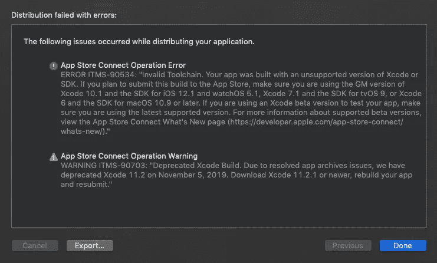

# 苹果自己禁止的 Xcode 11.2

> 原文：<https://betterprogramming.pub/xcode-11-2-banned-from-apple-itself-1ba0a62d63dc>

## 信不信由你，这个版本被认为是有缺陷的。11.2.1 GM 的更新是强制性的

本杰明·罗宾·叶斯柏森在 [Unsplash](https://unsplash.com?utm_source=medium&utm_medium=referral) 上的照片

Xcode 第 11 版已经发布，支持 iOS 13 开发。这里有很多新的特性，比如黑暗模式支持，新的助手分割视图编辑器，图像预览支持(最后)，甚至还有一个显示代码导航器的迷你侧菜单…

但是，有几个回落驱动开发人员完全疯了。

# 首要问题

我个人觉得 Xcode 11 稳定、好看，而且比以前的版本快一点。我真的很喜欢所有的新功能，包括 Xcode 本身的新黑暗 UI，但当我开始日常的 iOS 编码活动时，我开始注意到一些奇怪的事情。

在禁用了我的应用程序上的深色 UI(我希望它们是浅色的)并将所有东西迁移到新的 Swift 5.1 之后，我开始弄清楚自动布局实现上的奇怪行为。

我立即想到问题可能是由 SwiftUI 支持引起的，我是对的。我不得不编写一些`UICollectionFlowLayouts`代码来修复几个问题，甚至其他一些东西。

这基本上都是因为新的 SwiftUI，在几个小时内，我修复了一切。好的，然后我的一个客户来到我的办公室安装应用程序…

# 第二个问题:苹果…你这次真的搞砸了

我目前为之工作的客户有一部漂亮的 iPhone XS。我注意到他们没有安装最新版本的 iOS，当他们来到我的办公室时，我就很担心。

所以，我们把 iPhone 插到我的 iMac 上安装这个应用程序……完成了，一点问题都没有。一分钟后，我们进入帐户创建部分，他们聚焦第一个`UITextfield`，然后噗…应用程序崩溃了！

啊…是零参考崩溃吗？不…肯定是错的`@IBAction`或者`@IBOutlet`…不。到底怎么了？它没有任何好的理由就崩溃了。

谷歌了一下问题，找到了。这是由于`UITextfield`的 SwiftUI 实现导致的 Xcode bug:如果你的 iOS 版本不是最新的，这个问题可能会立即成为你最大的敌人。

# 最后一个问题:我甚至不能试飞这个应用，Xcode 11.2 被苹果自己禁止了

在与我的客户简短交谈后，我试图解释这个问题，我们对此无能为力，只能等待苹果解决这个问题。

与此同时，我们仍然可以通过在最新的 iOS 版本(我有)中测试来开发这个应用程序。然后，经过几天的开发，我在我们的 Git 上更新了我的应用程序，我决定在发布之前发布一个 [TestFlight](https://developer.apple.com/testflight/) 来测试这个版本。

我在我的档案上运行了*分发应用程序*,然后…

如果您尝试使用 Xcode 11.2 发布应用程序，这是 Xcode 显示的信息

很简单:由于这个已知的问题，这个 Xcode 版本被认为是 Apple 禁止的，所以你不能分发用这个设置编译的应用程序。

如消息所示，*苹果在开发者网站上发布了 11.2.1 GM 版本，该版本实际上能够在 App Store 和 TestFlight 上成功分发该应用。*

好了，我们开始吧，再下载 7.5GB，安装一个 XIP 文件，然后我就可以继续工作了。

# 结论

如果你有 Xcode 10，你可以考虑不要把它升级到当前的 11.2 版本，这个版本是关闭的，不允许你发布或者测试这个应用。

如果你需要 Xcode 进行学术活动，或者你需要它在 iPhone 11 模拟器上运行你的应用程序，这很好，一切仍然可以工作，但要考虑到，除非你更新到 Xcode 11.2.1 (build 11B53)，否则每个分发功能都是禁用的。

显然，我们现在正在等待一个稳定的新版本，因为 11.2.1 被认为是一个临时的通用版本。