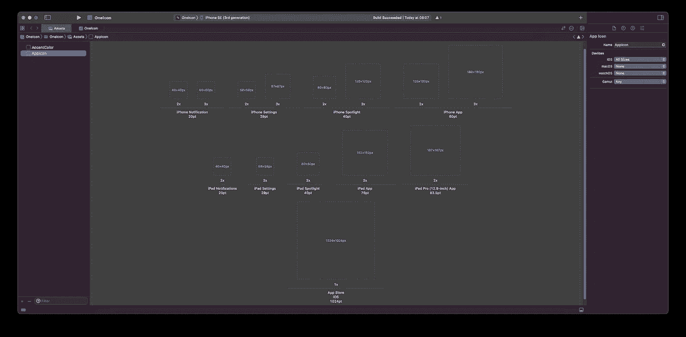
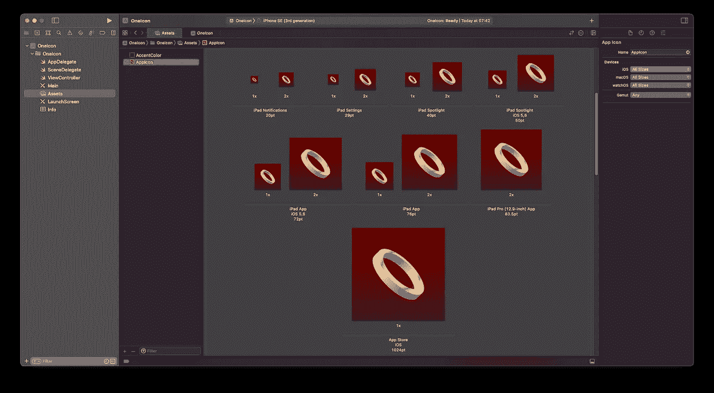
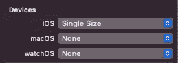
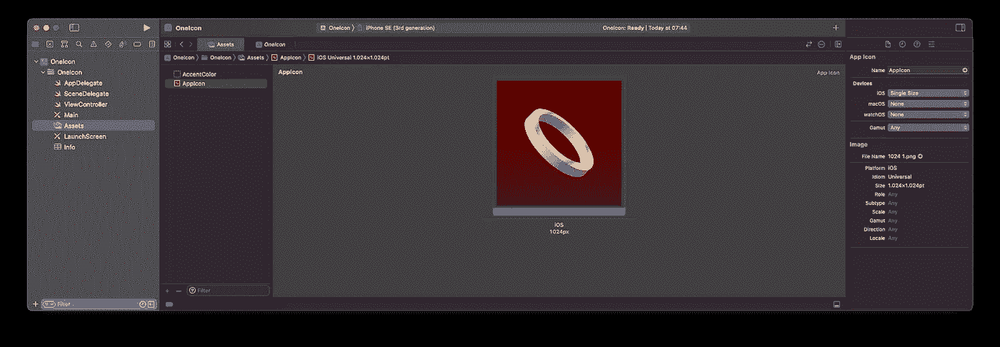

# Xcode 14:一个图标统治所有人！

> 原文：<https://betterprogramming.pub/xcode-14-one-icon-to-rule-them-all-e32ebd20b942>

## 我们的应用程序只需要一个图标

照片由 [Ergo Zakki](https://unsplash.com/es/@ergo_zakki?utm_source=unsplash&utm_medium=referral&utm_content=creditCopyText) 在 [Unsplash](https://unsplash.com/es/s/fotos/lord-of-the-rings?utm_source=unsplash&utm_medium=referral&utm_content=creditCopyText) 上拍摄

有多少次，我们发现自己准备了无数苹果应用程序所需的各种大小的图标:iPhone 和 iPad 的大小，以及不同应用程序的大小——聚光灯、通知、应用程序……

如果手动生成这么多不同大小的图标会很繁琐，如果使用图标生成器(通常是 1024x1024px 的图标，可以生成所有需要的大小)会更简单。

但是现在有了 Xcode 14，正如苹果在 WWDC 2022 上宣布的那样，只需要配置我们应用程序的资产目录，这样它就只使用 1024x1024px 图标了。Xcode 14 会根据需要调整这个图标的大小。

# 如何用单个图标配置应用程序

一旦我们用 Xcode 14 创建了项目，我们就进入资产目录。从一开始，我们将看到与以前相同的配置，即一个模板来填充不同大小的图标。

带有不同大小图标的模板。

因此，我们可以选择用不同的图标逐个填充它们。

用不同大小的图标填充的 AppIcon 资产。

但是，Xcode 14 引入了使用单个 1024x1024px 图标的选项。为此，我们只需转到右边的栏(转到**属性检查器**，在**设备**中，选择**单一尺寸**(例如，在 iOS 的情况下)。

这样，图标模板就简化为 1024x1024px 的单一大小写。

# 限制

Xcode 14 的这项新功能有一些限制:

*   它仅适用于 iOS、iPadOS 和 watchOS。对于 macOS，仍然需要不同大小的图标。
*   选择此选项时，它适用于所有图标大小。也就是说，如果我们想要一个特定大小的图标与众不同，我们必须一个接一个地配置它们。

# 结论

能够使用单个图标来显示我们的应用程序的结果，这不仅减少了专门用于生成图标的工作时间，而且通过使用单个图像，我们的应用程序的大小也减小了。